# Android控件

## 通用属性

| 属性                  | 作用                                                         | 值                                                           |
| --------------------- | ------------------------------------------------------------ | ------------------------------------------------------------ |
| android:id            | 给当前控件定义了一个唯一标识符                               | @+/xxid                                                      |
| android:layout_width  | 指定了控件的宽度                                             | 推荐[match_parent]("表示让当前控件的大小和父布局的大小一样") [fill_parent]("表示让当前控件的大小和父布局的大小一样") [wrap_content]("表示让当前控件的大小能够刚好包含住里面的内容") |
| android:layout_height | 指定了控件的高度                                             | 推荐[match_parent]("表示让当前控件的大小和父布局的大小一样") [fill_parent]("表示让当前控件的大小和父布局的大小一样") [wrap_content]("表示让当前控件的大小能够刚好包含住里面的内容") |
| android:textAllCaps   | 文本内容全部大写【默认true】                                 | true / false                                                 |
| android:gravity       | 指定文字对齐方式                                             | top、right、bottom、left、center等 可以用‘\|’指定多个值。    |
| android:textSize      | 指定文字的大小                                               | sp位单位                                                     |
| android:textColor     | 指定文字颜色                                                 | 支持十六位颜色代码                                           |
| android:background    | 指定背景色                                                   | 支持十六位颜色代码                                           |
| android:visibility    | 控件的可见性                                                 | visible【可见默认】 invisible【不可见会占位置】 gone【不可见也不占位置】 |
| android:onClick       | 给控件设置点击事件                                           | 一个方法名                                                   |
| android:padding       | 默认四方向设置内边距，也可以单独设置不同方向如android:paddingTop | 数值加单位                                                   |
| android:layout_margin | 默认四方向设置外边距，也可以单独设置不同方向android:layout_marginLeft | 数值加单位                                                   |

## 常用控件

### TextView【文本框】

**作用**

主要用于在界面上显示一段文本信息

**属性；**

| 属性                                                 | 作用                                   | 值                                     |
| ---------------------------------------------------- | -------------------------------------- | -------------------------------------- |
| android:text                                         | 指定TextView中显示的文本内容           | 要显式的文本内容或@string/引用字符name |
| adnroid:textStyle                                    | 设置字体风格                           | normal(无效果) bold(加粗) italic(斜体) |
| android:maxLines                                     | 指定最大行数，超过最大行数会出现滚动条 | 取值int类型                            |
| android:ellipsize                                    | 文字显式不下展示点点点                 | 常用end，结合maxLines单行使用          |
| android:drawable[Right]("其它方向Top、Left、Bottom") | 在文字的右边显式一个icoon              | @drawable/图片name                     |
| android:drawablePadding                              | 设置图片内边距，改变图片距文字的距离   | 数字如（-15dp，15dp，15.5dp)           |
| android:focusable                                    | 当前控件设置为焦点                     | true / false                           |
| android:focusableInTouchMode                         | 在触摸模式下获得焦点                   | true / false                           |
| android:singleLine                                   | 是否单行显式                           | true / false                           |
| android:marqueeRepeatLimit                           | 设置文字滚动次数                       | marquee_forever永久，或int类型次数。   |
| android:textIsSelectable                             | 让文字可以被选择                       | true / false                           |

#### 文字显式中划线【删除字】

~~文字显式中划线~~

- 核心代码

```java
textView.getPaint().setFlags(Paint. STRIKE_THRU_TEXT_FLAG);
textView.getPaint().setAntiAlias(true)
package top.miku.uiwidgettest;

import androidx.appcompat.app.AppCompatActivity;

import android.graphics.Paint;
import android.os.Bundle;
import android.widget.TextView;

public class MyTextView extends AppCompatActivity {

    @Override
    protected void onCreate(Bundle savedInstanceState) {
        super.onCreate(savedInstanceState);
        setContentView(R.layout.activity_my_text_view);
        TextView textView = (TextView) findViewById(R.id.del_word);
        textView.getPaint().setFlags(Paint. STRIKE_THRU_TEXT_FLAG);//设置中划线
        textView.getPaint().setAntiAlias(true);//消除锯齿

    }
}
```

#### 文字显式下划线

下划线文字

- 核心代码

  `textView1.getPaint().setFlags(Paint.UNDERLINE_TEXT_FLAG)`

  `textView1.getPaint().setAntiAlias(true)`

```java
//下划线
        TextView textView1 = (TextView) findViewById(R.id.underline);
        textView1.getPaint().setFlags(Paint.UNDERLINE_TEXT_FLAG);//设置下划线
        textView1.getPaint().setAntiAlias(true);//消除锯齿
```

#### 文字滚动【跑马灯】

- 必要属性和前提

  **显示的文字必须要超出给定的宽度或宽度**

  `android:singleLine`

  `android:ellipsize`

  `android:marqueeRepeatLimit`

  `android:focusable`

  `android:focusableInTouchMode`

  ```xml
   <TextView
              android:layout_width="match_parent"
              android:layout_height="wrap_content"
              android:textSize="20sp"
              android:text="@string/scrolling_text"
              android:singleLine="true"//单行显式
              android:ellipsize="marquee"//以跑马灯的方式显示(动画横向移动) 
              android:marqueeRepeatLimit="marquee_forever"//循环次数（永久）
              android:focusable="true"//控件获得焦点
              android:focusableInTouchMode="true"//触摸模式下获得焦点
              />
  ```

- 解决部分手机不支持

  - 新建一个MarqueTextView类继承AppCompatTextView类重写里面的方法

    ```java
    package top.miku.uiwidgettest;
    
    import android.content.Context;
    import android.util.AttributeSet;
    
    import androidx.appcompat.widget.AppCompatTextView;
    
    public class MarqueTextView extends AppCompatTextView {
        public MarqueTextView(Context context, AttributeSet attrs, int defStyle) {
            super(context, attrs, defStyle);
        }
    
        public MarqueTextView(Context context, AttributeSet attrs) {
            super(context, attrs);
        }
    
        public MarqueTextView(Context context) {
            super(context);
        }
    
        //覆盖重写获得焦点方法
        @Override
        public boolean isFocused() {
            return true;
        }
    }
    ```

  - 到布局xml中使用自定义的这个控件

    ```xml
     <top.miku.uiwidgettest.MarqueTextView //包名+自定义控件名
                android:layout_width="match_parent"
                android:layout_height="wrap_content"
                android:textSize="20sp"
                android:text="@string/scrolling_text"
                //以下是必要属性
                android:singleLine="true"
                android:ellipsize="marquee"
                android:marqueeRepeatLimit="marquee_forever"
                android:focusable="true"
                android:focusableInTouchMode="true"/>
    ```

### Button【按钮】

**作用**

button是最常用的交互控件。通常用来绑定一个事件来触发，继承自TextView

#### 自定义形状

- 在R/drawable文件夹下新建一个Drawable resource file文件

  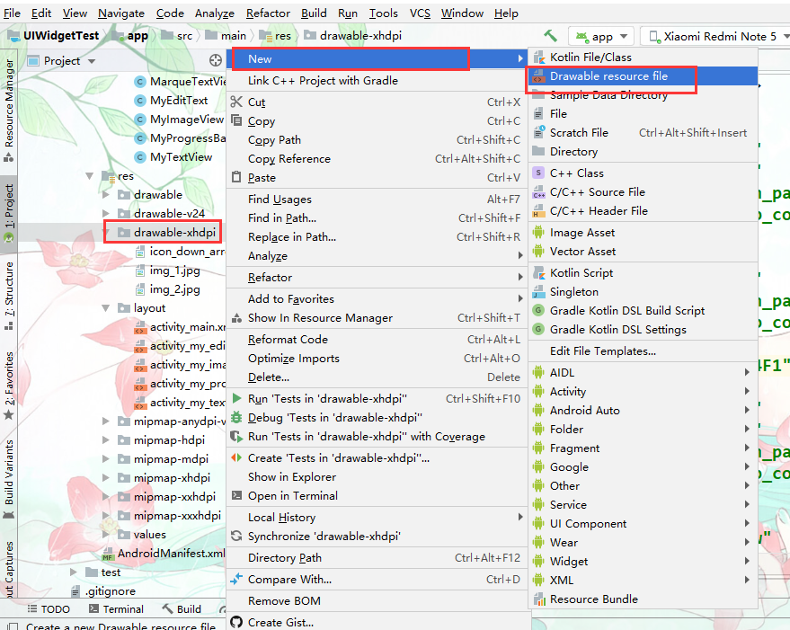

- 设置文件名和更元素为shape

  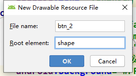

  

  - android:shape //设置要绘制的形状

    rectangle = 长方形

    line =线

    oval = 椭圆

    ring = 圆环

  - shape常用子属性

    | 元素       | 作用     | 属性                                                         | 值             |
    | ---------- | -------- | ------------------------------------------------------------ | -------------- |
    | <soleid/>  | 实线填充 | android:colro                                                | 十六位颜色代码 |
    | <corners/> | 设置圆角 | android:radius 【四个角】android:bottomLeftRadius【左下】android:bottomRightRadius【右下】android:topLeftRadius【在上】android:topRightRadius【右上】 | 数值加单位     |
    | <stroke/>  | 描边     | android:width【设置线宽】                                    | 数值加单位     |
    |            |          |                                                              |                |
    |            |          |                                                              |                |

- 绘制形状

  ```xml
  <?xml version="1.0" encoding="utf-8"?>
  <shape xmlns:android="http://schemas.android.com/apk/res/android"
          android:shape="rectangle">//指定绘制的图形
      <solid android:color="#B34EC5"/>//填充颜色
      <corners android:radius="10dp"/>//圆角大小
  </shape>
  ```

- 到button的background属性中引用这个xml

  ```xml
  <Button
              android:textAllCaps="false"
              android:layout_width="match_parent"
              android:layout_height="wrap_content"
              android:text="Button[按钮]"
              android:background="@drawable/btn_2"/> //引用自定义形状
  ```

#### 点击样式

- 在R/drawable文件夹下新建一个Drawable resource file文件根元素设置为selector

  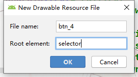

  - <item>样式</item>常用属性///当按钮发生指定事件后样式

    | 属性                    | 作用                                            | 值      |
    | ----------------------- | ----------------------------------------------- | ------- |
    | android:state_pressed   | 按下状态使用样式                                | Boolean |
    | android:state_focused   | 聚焦状态使用                                    | Boolean |
    | android:state_selected  | 表示选中状态使用                                | Boolean |
    | android:state_checkable | 表示可勾选状态时使用                            | Boolean |
    | android:state_checked   | 表示勾选状态使用                                | Boolean |
    | android:state_enabled   | 表示可用状态使用                                | Boolean |
    | android:window_focused  | 表示应用程序窗口有焦点时使用（应用程序 在前台） | Boolean |

- 绘制效果并引用

  

  ```xml
  <?xml version="1.0" encoding="utf-8"?>
  <selector xmlns:android="http://schemas.android.com/apk/res/android">
      <!-- 按压效果 -->
      <item android:state_pressed="true">
          <shape>
              <solid android:color="#2196F3"/>
              <corners android:radius="5dp"/>
          </shape>
      </item>
      <!-- 为按压效果 -->
      <item android:state_pressed="false">
          <shape android:shape="rectangle">
              <solid android:color="#8BC34A"/>
              <corners android:radius="5dp"/>
          </shape>
      </item>
  </selector>
  ```

### ImageButton【图片按钮】

**属性**

| 属性               | 作用       | 值                   |
| ------------------ | ---------- | -------------------- |
| android:src        | 指定图片   | @Res                 |
| android:background | 设置背景色 | #0000 表示背景为透明 |

### EditText【可编辑文本框】

**作用**

EditText是程序用于和用户进行交互的另一个重要控件，它允许用户在控件里输入和编辑内容，并可以在程序中对这些内容进行处理**。继承自TextView所以也可以使用TextView中的属性**

**属性**

| 属性              | 作用                                             | 值             |
| ----------------- | ------------------------------------------------ | -------------- |
| android:hint      | 指定一段提示性的文本                             | 提示的文本内容 |
| android:maxLines  | 指定EditText的最大行数，超过最大行数会出现滚动条 | 取值int类型    |
| android:inputType | 指定输入框类型                                   |                |

##### 获取用户输入的内容

- 注册事件，并添加处理逻辑

```java
package top.miku.uiwidgettest;

import androidx.appcompat.app.AppCompatActivity;

import android.os.Bundle;
import android.view.View;
import android.widget.Button;
import android.widget.EditText;
import android.widget.Toast;

public class MyEditText extends AppCompatActivity implements View.OnClickListener {
    private static final String TAG = "MyEditText";
    //生命一个EditText类型的成员变量
    private EditText editText;
    @Override
    protected void onCreate(Bundle savedInstanceState) {
        super.onCreate(savedInstanceState);
        setContentView(R.layout.activity_my_edit_text);
        //获取button和editText
        Button button = (Button) findViewById(R.id.button_1);
        editText = (EditText) findViewById(R.id.edit_text);
        //以接口方式实现onClick事件监听
        button.setOnClickListener(this);
    }

    @Override
    public void onClick(View view) {
        //把获取到的内容转换为字符串
        String inputText = editText.getText().toString();
        //通用Toast展示输入的内容。
//        Toast.makeText(MyEditText.this,inputText,Toast.LENGTH_SHORT).show();
        //解决小米手机再带应用名问题
        Toast toast = Toast.makeText(MyEditText.this, null, Toast.LENGTH_SHORT);
        toast.setText(inputText);
        toast.show();
    }
}
```

### RadioButton【单选按钮】

##### 

长用于性别的选择，要集合`<RadioGroup></RadioGroup>`打组使用

**属性**

| 属性                | 作用                         | 值                                 |
| ------------------- | ---------------------------- | ---------------------------------- |
| adnroid:checked     | 前提必须设置id默认是否被选中 | Boolean                            |
| android:orientation | 设置显式方向                 | vertical【垂直】horizontal【水平】 |

**事件监听**

```java
package top.miku.uiwidgettest;

import androidx.appcompat.app.AppCompatActivity;

import android.os.Bundle;
import android.widget.RadioButton;
import android.widget.RadioGroup;
import android.widget.Toast;

public class MyRadioButton extends AppCompatActivity {

    private RadioGroup radioGroup;
    @Override
    protected void onCreate(Bundle savedInstanceState) {
        super.onCreate(savedInstanceState);
        setContentView(R.layout.activity_my_radio_button);
        radioGroup = (RadioGroup) findViewById(R.id.radio_group);
        //注册被修改事件
        radioGroup.setOnCheckedChangeListener(new RadioGroup.OnCheckedChangeListener() {
            @Override
            public void onCheckedChanged(RadioGroup radioGroup, int i) {//int i当前被选中的radioButton的id
                Toast toast = Toast.makeText(MyRadioButton.this,null,Toast.LENGTH_SHORT);
                //通过radioGroup获得radioButton控件
                RadioButton radioButton = (RadioButton) radioGroup.findViewById(i);
                toast.setText(radioButton.getText());
                toast.show();
            }
        });
    }
}
```

### CheckBox【复选框】

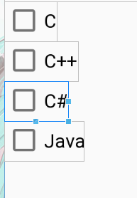

**作用**

主要用在多选项上，继承自button

#### 自定义样式

- 创建drawable，样式xml

  ```xml
  <?xml version="1.0" encoding="utf-8"?>
  <selector xmlns:android="http://schemas.android.com/apk/res/android">
    <item android:state_checked="false" android:drawable="@drawable/check_box_not_selected"/> //未选中
    <item android:state_checked="true" android:drawable="@drawable/check_box_selected"/>
  </selector>//选中
  ```

- 用一个容器包括修改xml

  ```xml
  <LinearLayout
              android:layout_width="wrap_content"
              android:layout_height="wrap_content"
              android:orientation="vertical">
          <TextView
                  android:layout_width="wrap_content"
                  android:layout_height="wrap_content"
                  android:text="自定义样式"
                  android:textSize="20sp"/>
          <CheckBox
                  android:layout_width="wrap_content"
                  android:layout_height="wrap_content"
                  android:text="1"
                  android:textSize="15sp"
                  android:button="@drawable/bg_check_bok"/>//引用drawable样式
          <CheckBox
                  android:layout_width="wrap_content"
                  android:layout_height="wrap_content"
                  android:text="2"
                  android:textSize="15sp"
                  android:button="@drawable/bg_check_bok"/>
          <CheckBox
                  android:layout_width="wrap_content"
                  android:layout_height="wrap_content"
                  android:text="3"
                  android:textSize="15sp"
                  android:button="@drawable/bg_check_bok"/>
      </LinearLayout>
  ```

**事件监听**

```java
package top.miku.uiwidgettest;

import androidx.appcompat.app.AppCompatActivity;

import android.os.Bundle;
import android.widget.CheckBox;
import android.widget.CompoundButton;
import android.widget.Toast;

public class MyCheckBook extends AppCompatActivity {
    private CheckBox c,c_plas,jaa;
    @Override
    protected void onCreate(Bundle savedInstanceState) {
        super.onCreate(savedInstanceState);
        setContentView(R.layout.activity_my_check_book);
        c = (CheckBox) findViewById(R.id.c);
        c_plas = (CheckBox) findViewById(R.id.c_plas);
        jaa = (CheckBox) findViewById(R.id.java);
        c.setOnCheckedChangeListener(new CompoundButton.OnCheckedChangeListener() {
            @Override
            public void onCheckedChanged(CompoundButton compoundButton, boolean b) {
                Toast toast = Toast.makeText(MyCheckBook.this,null,Toast.LENGTH_SHORT);
                toast.setText(c.getText());
                toast.show();
            }
        });
    }
}
```

### ImageView【图片控件】

**作用**

用于在界面上展示图片的一个控件

**属性**

| 属性                     | 作用                             | 值                                                           |
| ------------------------ | -------------------------------- | ------------------------------------------------------------ |
| android:src              | 指定图片的路径                   | @drawable/图片名                                             |
| android:scaleType        | 设置图片缩放                     | fitXY【撑满控件，宽高比可能发生改变】 fitCenter【保持宽高比缩放，直至能够完全显示】centerCrop【保持宽高比缩放，直至完全覆盖控件，裁剪显示】 |
| android:adjustViewBounds | 让imgView 支持设置最大宽度和高度 | Boolean                                                      |
| android:maxWidth         | 最大宽度                         | int 【必须设置android:adjustViewBounds属性为True】           |
| android:maxHeight        | 最大高度                         | int【必须设置android:adjustViewBounds属性为True】            |
| android:tint             | 给图形添加着色                   | 十六位颜色代码                                               |

**使用**

- 在res目录下新建一个drawable-xhdpi目录
- 放至图片

#### 动态切换图片

```java
package top.miku.uiwidgettest;

import androidx.appcompat.app.AppCompatActivity;

import android.os.Bundle;
import android.view.View;
import android.widget.Button;
import android.widget.ImageView;

public class MyImageView extends AppCompatActivity {
    @Override
    protected void onCreate(Bundle savedInstanceState) {
        super.onCreate(savedInstanceState);
        setContentView(R.layout.activity_my_image_view);
        final Button button = (Button) findViewById(R.id.button_1);
        final ImageView imageView = (ImageView) findViewById(R.id.image_view);
        button.setOnClickListener(new View.OnClickListener() {
            @Override
            public void onClick(View view) {
                //获取按钮内容
                String text = button.getText().toString();
                switch (text) {
                    case "下一张":
                        //修改图片的路径
                        imageView.setImageResource(R.drawable.img_2);
                        button.setText("上一张");
                        break;
                    case "上一张":
                        imageView.setImageResource(R.drawable.img_1);
                        button.setText("下一张");
                        break;

                    default:
                        break;
                }

            }
        });
    }
}
```


#### 加载网络图片

> 需要网络权限

- 声明网络权限

  - 打开AndroidManifest.xml添加一下代码

    ```xml
    <uses-permission android:name="android.permission.INTERNET"/>//获取网络权限
    ```

##### Glide【图片加载库】

官网；https://muyangmin.github.io/glide-docs-cn/

- 导入库

  - 直接下载jar包放入到项目的libs文件夹

  - 使用Gradle构造工具添加

    1. 打开以下路径的配置文件app\build.gradle，在指定的标签内添加如下代码

       ```groovy
       repositories {
         mavenCentral()
         google()
       }
       
       dependencies {
         implementation 'com.github.bumptech.glide:glide:4.9.0'
         annotationProcessor 'com.github.bumptech.glide:compiler:4.9.0'
       }
       ```

  - 同步一下Gradle，Gradle会自动下载依赖库

- 如何使用

  - 可以到此地址查看参考文档 [中文参考]([https://muyangmin.github.io/glide-docs-cn/doc/getting-started.html#基本用法](https://muyangmin.github.io/glide-docs-cn/doc/getting-started.html#基本用法))

  - 基本用法

    ```java
    Glide.with(fragment).load(myUrl).into(imageView);
    /*参数
        fragment；目标activity
        myUrl；图片地址String
        imageView；图片控件对象
    
    */ 
    ```


### ProgressBar【进度条】

**作用**

ProgressBar用于在界面上显示一个进度条

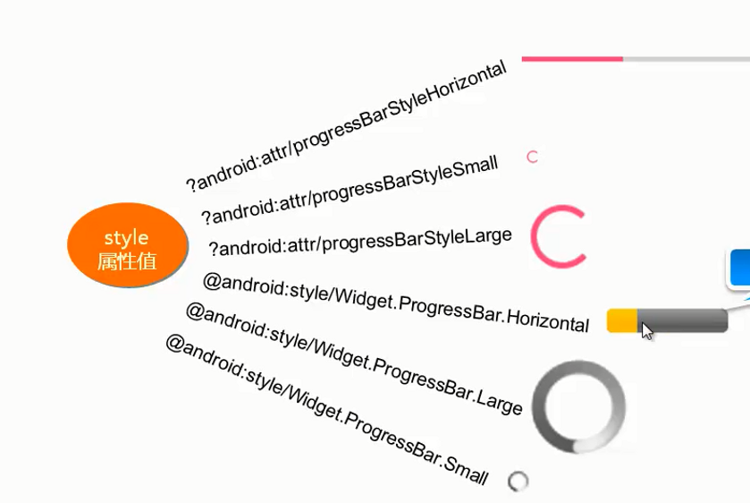

##### 属性

| 属性       | 作用             | 值                                                           |
| ---------- | ---------------- | ------------------------------------------------------------ |
| style      | 设置滚动条样式   | ?android:attr/progressBarStyleHorizontal【水平】更多见上图对照 |
| ndroid:max | 设置进度条最大值 | int类型                                                      |

#### 关闭进度条

- #### android:visibility属性控制

  ```java
  package top.miku.uiwidgettest;
  
  import androidx.appcompat.app.AppCompatActivity;
  
  import android.os.Bundle;
  import android.view.View;
  import android.widget.Button;
  import android.widget.ProgressBar;
  
  public class MyProgressBar extends AppCompatActivity {
  
      @Override
      protected void onCreate(Bundle savedInstanceState) {
          super.onCreate(savedInstanceState);
          setContentView(R.layout.activity_my_progress_bar);
          Button buton = (Button) findViewById(R.id.button_1);
          final ProgressBar progressBar = (ProgressBar) findViewById(R.id.progress_bar);
          buton.setOnClickListener(new View.OnClickListener() {
              @Override
              public void onClick(View view) {
                  //控制控件的可见性
                  //参数
                  //View.VISIBLE 、View.INVISIBLE 和View.GONE 这3种值。
                  progressBar.setVisibility(View.GONE);
              }
          });
  
      }
  }
  ```

#### 水平进度条

- 修改xml

  ```xml
  <ProgressBar
              android:id="@+id/progress_bar"
              android:layout_width="match_parent"
              android:layout_height="20dp"
              style="?android:attr/progressBarStyleHorizontal"
              android:max="100"/>
  ```

- 使用代码动态变更进度
  `setProgress`改变进度条数值

  ```java
  public class MyProgressBar extends AppCompatActivity {
      //记录进度
      private int t ;
      @Override
      protected void onCreate(Bundle savedInstanceState) {
          super.onCreate(savedInstanceState);
          setContentView(R.layout.activity_my_progress_bar);
          final ProgressBar progressBar = (ProgressBar) findViewById(R.id.progress_bar);
          //动态变更进度
          final Timer timer = new Timer();
          timer.schedule(new TimerTask() {
              @Override
              public void run() {
                  if (t != 100){
                      progressBar.setProgress(t+10);//更改进度条数值
                  }else {
                      t = 0;
                  }
              }
          },0,1000);
  ```

### DatePicker【日期选择器】

**事件监听**

```java
package top.miku.viewtime;

import androidx.appcompat.app.AppCompatActivity;

import android.os.Bundle;
import android.widget.DatePicker;
import android.widget.Toast;

import java.util.Calendar;

public class MainActivity extends AppCompatActivity {

    private int year,month,day; //定义存放年月日变量
    private DatePicker datePicker;//存放日期View
    @Override
    protected void onCreate(Bundle savedInstanceState) {
        super.onCreate(savedInstanceState);
        setContentView(R.layout.activity_main);
        datePicker = (DatePicker) findViewById(R.id.my_date_picker);
        /*获取当前系统的日期*/
        Calendar calendar = Calendar.getInstance();//获取一个java的日历对象。
        year = calendar.get(Calendar.YEAR);
        month = calendar.get(Calendar.MONTH);
        day = calendar.get(Calendar.DAY_OF_MONTH);

        /*通过当前日期初始化DatePicker对象*/
        /*参数
        * 1. Calendar类型的年
        * 2. Calendar类型的月
        * 3。Calendar类型的日
        * 4. 日期改变监听器
        * */

        datePicker.init(year, month, day, new DatePicker.OnDateChangedListener() {
            @Override
            public void onDateChanged(DatePicker datePicker, int i, int i1, int i2) {
                //把改变的日期赋值给定义存放日期的成员变量。
                MainActivity.this.year = i;
                MainActivity.this.month = i1;
                MainActivity.this.day = i2;

                show(year,month,day);//显式日期
            }
        });
    }
    ///显式选择的日期
    private void show(int year,int month,int day){
        String str = year+"年"+(month+1)+"月"+day+"日";
        Toast toast = Toast.makeText(MainActivity.this,null,Toast.LENGTH_SHORT);
        toast.setText(str);
        toast.show();


    };
}
```

### TimePicker【时间选择器】

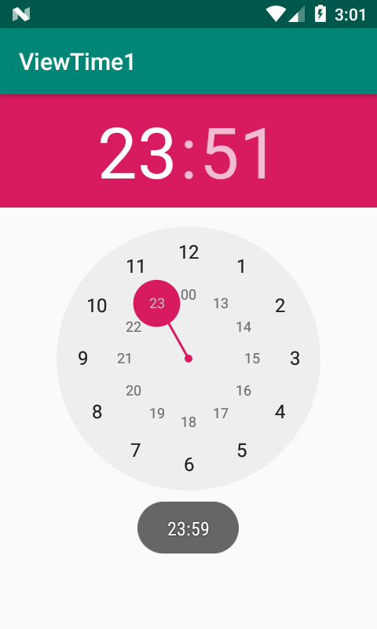

**事件**

```java
package top.miku.viewtime1;

import androidx.appcompat.app.AppCompatActivity;

import android.os.Bundle;
import android.widget.TimePicker;
import android.widget.Toast;

public class MainActivity extends AppCompatActivity {

    private TimePicker timePicker; //保存TimePicker对象
    @Override
    protected void onCreate(Bundle savedInstanceState) {
        super.onCreate(savedInstanceState);
        setContentView(R.layout.activity_main);

        timePicker = (TimePicker) findViewById(R.id.my_time_picker);
        timePicker.setIs24HourView(true);//设置为24小时格式。
        //监听改变后的值
        timePicker.setOnTimeChangedListener(new TimePicker.OnTimeChangedListener() {
            @Override
            public void onTimeChanged(TimePicker timePicker, int i, int i1) {
                Toast toast = Toast.makeText(MainActivity.this,null,Toast.LENGTH_SHORT);
                toast.setText(i+":"+i1); //按时分格式显式更改后的值。
                toast.show();
            }
        });
    }
}
```

### Chronometer【计时器】

**属性**

| 属性           | 作用           | 值                                                           |
| -------------- | -------------- | ------------------------------------------------------------ |
| android:format | 设置计时器格式 | %s已时分秒格式显式时间【可以加入其它内容保证有时间格式即可】 |

**方法**

- `getBase()`：返回时间。
- `setBase(long base)`：设置计时器的起始时间。
- `start()`：开始计时。
- `stop()：`停止计时。**假停止计时**只是不在刷新计时控件，实际一直在运行中。
- `setFormat(String format)：`设置显示时间的格式。

**事件**

- 开始 停止 重置 简单计时器

  ```java
  package top.miku.mytimer;
  
  import androidx.appcompat.app.AppCompatActivity;
  
  import android.os.Bundle;
  import android.os.SystemClock;
  import android.util.Log;
  import android.view.View;
  import android.widget.Button;
  import android.widget.Chronometer;
  
  public class MainActivity extends AppCompatActivity {
      private  Chronometer chronometer; //保存计时器控件
      private Button start,stop,reset; //保存按钮
      private long sumTime = 0; //记录总时间 也就是计时器走的时间。
      @Override
      protected void onCreate(Bundle savedInstanceState) {
          super.onCreate(savedInstanceState);
          setContentView(R.layout.activity_main);
          //获取控件资源
          chronometer = (Chronometer) findViewById(R.id.my_timer);
          start = (Button) findViewById(R.id.start);
          stop = (Button) findViewById(R.id.stop);
          reset = (Button) findViewById(R.id.reset);
  
          chronometer.setFormat("%s");//设置计时器格式。
  
          //开始
          start.setOnClickListener(new View.OnClickListener() {
              @Override
              public void onClick(View view) {
                  /*
                  * SystemClock.elapsedRealtime()//从设备开机到现在的时间，
                  * 单位毫秒，含系统深度睡眠时间
  
                   *
                  * */
                  //当前系统时间减去总时间【触发停止按钮记入的时间】得到上次暂停的时间
                  chronometer.setBase(SystemClock.elapsedRealtime() - sumTime);
                  chronometer.start();//开始计时
  
              }
          });
  
          //停止
          stop.setOnClickListener(new View.OnClickListener() {
              @Override
              public void onClick(View view) {
                  chronometer.stop();//停止计时，实际是停止刷新计时控件的数据，实际计时器一直工作中。
                  //就是这样写
                  sumTime = SystemClock.elapsedRealtime() - chronometer.getBase();
              }
          });
  
          //重置
          reset.setOnClickListener(new View.OnClickListener() {
              @Override
              public void onClick(View view) {
                  sumTime = 0; //重置总时间
                  chronometer.setBase(SystemClock.elapsedRealtime());//计时器归零
              }
          });
  ```

- 监听计时器改变

  ```java
  chronometer.setOnChronometerTickListener(new Chronometer.OnChronometerTickListener() {
              @Override
              public void onChronometerTick(Chronometer chronometer) {
  
                  if ((SystemClock.elapsedRealtime() - chronometer.getBase()) >= 20000){
                      Toast.makeText(MainActivity.this,"计时到大20秒了",Toast.LENGTH_SHORT).show();
                  }
              }
          });
  ```

### SeekBar【拖动条】

是进度条的子类。所以支持其父类的属性。

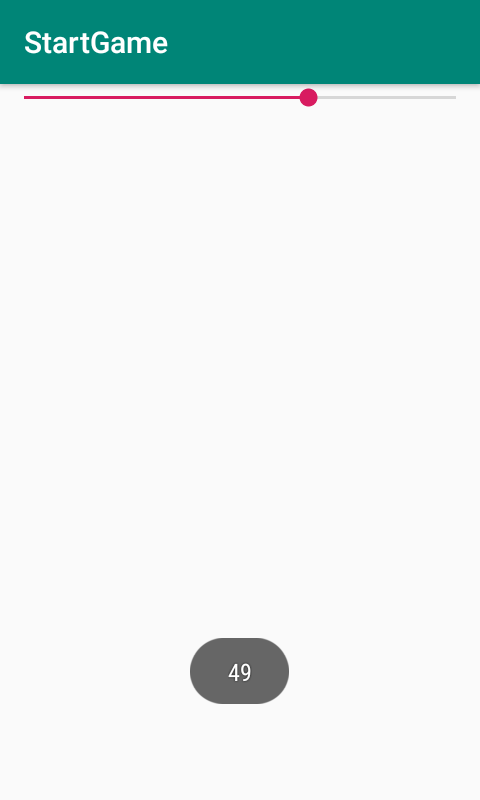

**属性；**

| 属性             | 作用                 | 值   |
| ---------------- | -------------------- | ---- |
| android:progress | 当前进度             | int  |
| android:max      | 最大进度             | int  |
| android:thumb    | 更改进度条中的小圆点 | @    |

**事件监听**

```java
package top.miku.startgame;

import androidx.appcompat.app.AppCompatActivity;

import android.os.Bundle;
import android.view.WindowManager;
import android.widget.SeekBar;
import android.widget.Toast;

public class MainActivity extends AppCompatActivity {

    @Override
    protected void onCreate(Bundle savedInstanceState) {
        super.onCreate(savedInstanceState);
        setContentView(R.layout.activity_main);
        getWindow().setFlags(WindowManager.LayoutParams.FLAG_FULLSCREEN,
                WindowManager.LayoutParams.FLAG_FULLSCREEN); //设置全屏显示

        SeekBar seekBar = (SeekBar) findViewById(R.id.seek_bar);
        seekBar.setOnSeekBarChangeListener(new SeekBar.OnSeekBarChangeListener() {
            //数值改变时执行
            @Override
            public void onProgressChanged(SeekBar seekBar, int i, boolean b) {
                Toast.makeText(MainActivity.this, "" + i, Toast.LENGTH_SHORT).show();
            }

            //开始触摸执行
            @Override
            public void onStartTrackingTouch(SeekBar seekBar) {

            }

            //停止触摸执行。
            @Override
            public void onStopTrackingTouch(SeekBar seekBar) {

            }
        });
    }
}
```

### RatingBar【星级评分条】

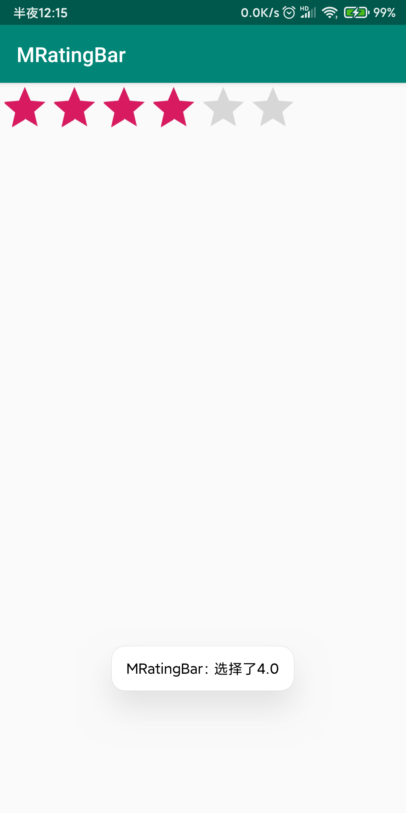

**属性**

| 属性                | 作用                               | 值      |
| ------------------- | ---------------------------------- | ------- |
| android:numStars    | 设置星星的个数                     | int     |
| android:rating      | 设置默认有多少星星被点亮           | int     |
| android:stepSize    | 选择时让整颗星星被点亮【默认半颗】 | int     |
| android:isIndicator | 星星不可以被用户改变               | Boolean |

**事件**

```java
package top.miku.mratingbar;

import androidx.appcompat.app.AppCompatActivity;

import android.os.Bundle;
import android.widget.RatingBar;
import android.widget.Toast;

public class MainActivity extends AppCompatActivity {

    RatingBar ratingBar;
    @Override
    protected void onCreate(Bundle savedInstanceState) {
        super.onCreate(savedInstanceState);
        setContentView(R.layout.activity_main);

        ratingBar = (RatingBar) findViewById(R.id.start_bar);
        ratingBar.setOnRatingBarChangeListener(new RatingBar.OnRatingBarChangeListener() {
            @Override
            public void onRatingChanged(RatingBar ratingBar, float v, boolean b) {
                Toast.makeText(MainActivity.this, "选择了"+v, Toast.LENGTH_SHORT).show();
            }
        });

    }
}
```

### ImageSwitcher【图片切换器】

图片切换有动画效果，继承自ImageView

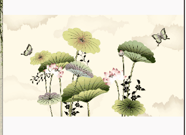


- 简单图片切换【方法摘要】
  - `setOutAnimation()` 淡出动画
  - `setInAnimation()` 淡入动画
  - `setFactory()` 图像工厂
  - `setImageResource()` 指定下一张要显式的图片资源

```java
package top.miku.imgswitched;

import androidx.appcompat.app.AppCompatActivity;

import android.os.Bundle;
import android.view.View;
import android.view.animation.AnimationUtils;
import android.widget.ImageSwitcher;
import android.widget.ImageView;
import android.widget.ViewSwitcher;

public class MainActivity extends AppCompatActivity {
    private ImageSwitcher imageSwitcher;

    @Override
    protected void onCreate(Bundle savedInstanceState) {
        super.onCreate(savedInstanceState);
        setContentView(R.layout.activity_main);
        //获取控件
        imageSwitcher = (ImageSwitcher) findViewById(R.id.image_switcher);
        /*
        * 设置图片淡出动画【setOutAnimation】方法指定淡出动画
        * 参数
        *   AnimationUtils 一个动画程序【这里加载Android自带的】
        *       参数
        *           - 一个上下文对象
        *           - 动画资源【android.R.anim.fade_out】使用Android自带的
        * */
        imageSwitcher.setOutAnimation(AnimationUtils.loadAnimation(MainActivity.this, android.R.anim.fade_out));
        /*
        * 设置图片淡入动画和淡出动画【setInAnimation】指定淡入动画
        * 参数基本一直
        * */
        imageSwitcher.setInAnimation(AnimationUtils.loadAnimation(MainActivity.this, android.R.anim.fade_in));
        /* 指定一个视图工厂。
        * 为图片切换器设置要显式的图片资源。
        * */
        imageSwitcher.setFactory(new ViewSwitcher.ViewFactory() {
            @Override
            public View makeView() {
                //实例化一个ImageView控件
                ImageView imageView = new ImageView(MainActivity.this);
                imageView.setImageResource(R.mipmap.i03);
                return imageView;//返回工厂这个对象。
            }
        });

        //监听点击事件【注册单击事件】
        imageSwitcher.setOnClickListener(new View.OnClickListener() {
            @Override
            public void onClick(View view) {
                //这里传递的view就是imageSwitcher对象，把view强制类型转换后，调用
                //setImageResource方法指定下一个要展示的图片。
                ((ImageSwitcher)view).setImageResource(R.mipmap.i04);
            }
        });
    }
}
```

- 滑动图片切换【方法摘要】
  - `motionEvent.getAction()` 获得触发的活动类型。
  - `MotionEvent.ACTION_DOWN` 开始触摸常量
  - `MotionEvent.ACTION_UP` 停止/手指抬起触摸常量

```java
package top.miku.pictureslideview;

import androidx.appcompat.app.AppCompatActivity;

import android.os.Bundle;
import android.util.Log;
import android.view.MotionEvent;
import android.view.View;
import android.view.WindowManager;
import android.view.animation.AnimationUtils;
import android.widget.ImageSwitcher;
import android.widget.ImageView;
import android.widget.ViewSwitcher;

public class MainActivity extends AppCompatActivity {
    //存放图片资源
    private int imageId[] = new int[]{
      R.mipmap.img01,R.mipmap.img02,R.mipmap.img03,
      R.mipmap.img04,R.mipmap.img05,R.mipmap.img06,
      R.mipmap.img07,R.mipmap.img08,R.mipmap.img09,
    };
    //存放ImageSwitcher对象
    private ImageSwitcher is ;
    //记录图片索引
    private int imageIndex;
    //记录手指左右滑动x触摸按下和抬起x坐标。
    private float touchDownX;
    private float touchUpX;
    @Override
    protected void onCreate(Bundle savedInstanceState) {
        super.onCreate(savedInstanceState);
        setContentView(R.layout.activity_main);
        getWindow().setFlags(WindowManager.LayoutParams.FLAG_FULLSCREEN,
                WindowManager.LayoutParams.FLAG_FULLSCREEN);//设置全屏显示

        is = (ImageSwitcher) findViewById(R.id.image_switcher);

        //为ImageSwicher设置Factory，用来为ImageSwicher制造ImageView
        is.setFactory(new ViewSwitcher.ViewFactory() {
            @Override
            public View makeView() {
                //实例化一个image对象，并返回
                ImageView imageView = new ImageView(MainActivity.this);
                imageView.setImageResource(imageId[imageIndex]);
                return imageView;
            }
        });
        //注册触摸事件
        is.setOnTouchListener(new View.OnTouchListener() {
            @Override
            public boolean onTouch(View view, MotionEvent motionEvent) {
                //用户触发的活动是触摸按下，条件成立。
                //motionEvent存放当前触发的活动，通过getAction()方法获得触发的活动类型。
                if (motionEvent.getAction() == MotionEvent.ACTION_DOWN){
                    //保存左右滑动时手指按下的X坐标
                    touchDownX = motionEvent.getX();
                    return true;
                } else if (motionEvent.getAction() == MotionEvent.ACTION_UP) {
                    //取得左右滑动时手指松开的X坐标
                    touchUpX = motionEvent.getX();

                    Log.d("开始触摸X坐标", ""+touchDownX);
                    Log.d("停止触摸X坐标", ""+touchUpX);
                    /*——————————————————图片切换处理——————————*/
                    //右~左滑动查看下一张【当touchDownX值大于touchUpX就可以证明是右~左滑动】
                    if (touchDownX - touchUpX > 100){
                        //限定索引防止数组越界异常
                        imageIndex = imageIndex == imageId.length - 1 ? imageIndex = 0 : imageIndex + 1;

                        //设置切换动画
                        //淡入
                        is.setInAnimation(AnimationUtils.loadAnimation(MainActivity.this, R.anim.slide_in_left));
                        //淡出
                        is.setOutAnimation(AnimationUtils.loadAnimation(MainActivity.this,R.anim.slide_out_left));

                        //设置当前要看的图片
                        is.setImageResource(imageId[imageIndex]);
                        Log.d("图片索引", ""+imageIndex);
                    } //左~右滑动查看上一张【当touchUpX的值大于touchDownX就可以证明是右~左滑动】
                    else if (touchUpX - touchDownX >100) {
                        //限定索引防止数组越界异常
                        imageIndex = imageIndex == 0 ? imageIndex = imageId.length -1 : imageIndex -1;
                        //切换动画
                        //淡入
                        is.setInAnimation(AnimationUtils.loadAnimation(MainActivity.this, R.anim.slide_in_right));
                        //淡出
                        is.setOutAnimation(AnimationUtils.loadAnimation(MainActivity.this,R.anim.slide_out_right));

                        //设置上一张查看的图片
                        is.setImageResource(imageId[imageIndex]);
                    }

                    return true;

                }

                return true;
            }
        });


    }
}
```

slide_in_left.xml

```xml
<?xml version="1.0" encoding="utf-8"?>
<set xmlns:android="http://schemas.android.com/apk/res/android">
<translate
    android:fromXDelta="-100%p"
    android:toXDelta="0"
    android:duration="1000"/>
</set>
```

slide_out_left.xml

```xml
<?xml version="1.0" encoding="utf-8"?>
<set xmlns:android="http://schemas.android.com/apk/res/android">
    <translate
        android:duration="1000"
        android:fromXDelta="0"
        android:toXDelta="-100%p"/>

</set>
```

slide_in_right.xml

```xml
<?xml version="1.0" encoding="utf-8"?>
<set xmlns:android="http://schemas.android.com/apk/res/android">
    <translate
        android:duration="1000"
        android:fromXDelta="100%p"
        android:toXDelta="0"/>

</set>
```

slide_out_right.xml

```xml
<?xml version="1.0" encoding="utf-8"?>
<set xmlns:android="http://schemas.android.com/apk/res/android">
    <translate
        android:duration="1000"
        android:fromXDelta="0"
        android:toXDelta="100%p"/>
</set>
```

### GridView【网格视图】

图片按行和列形式展示


#### 适配器概念

GridView不同于其它组件要显式图像必须通过一个适配器**Adapter**

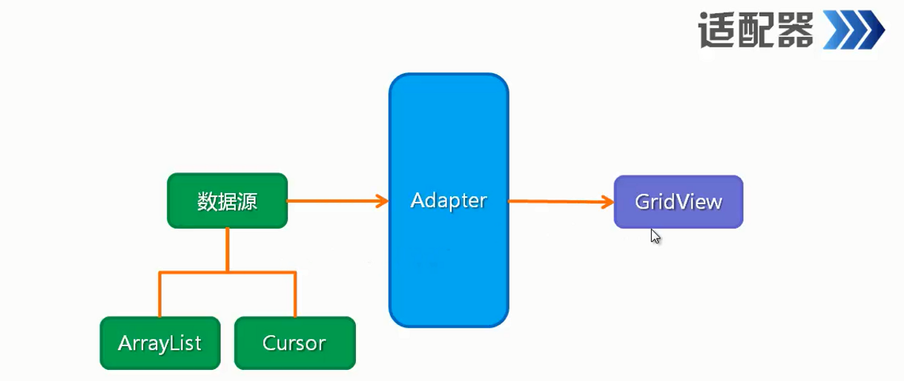

- 常用适配器实现类

  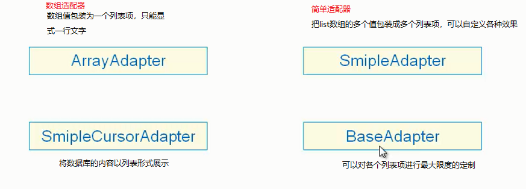

##### SimpleAdapter【简单适配器】使用

- 构造参数
  - 上下文对象
  - list对象
  - 一个布局文件【就是单元格样式xml文件】
  - 字符串数组【list中的Map中的key名】
  - 整形数组【单元格模板文件中所指定的组件id】
- [参考示例](#xml自定义项[SimpleAdapter适配器]])

**属性**

| 属性               | 作用       | 值                        |
| ------------------ | ---------- | ------------------------- |
| android:numColumns | 设置表格列 | int或auto_fit【自动排列】 |

**方法**

- `setAdapter();` 添加适配器

**xml自定义项【SimpleAdapter适配器】**

- 添加xml标记【activity_main.xml添加】

  ```xml
  <?xml version="1.0" encoding="utf-8"?>
  <androidx.constraintlayout.widget.ConstraintLayout xmlns:android="http://schemas.android.com/apk/res/android"
          xmlns:app="http://schemas.android.com/apk/res-auto"
          xmlns:tools="http://schemas.android.com/tools"
          android:layout_width="match_parent"
          android:layout_height="match_parent"
          tools:context=".MainActivity">
  <!-- GridView组件添加 -->
      <GridView
              android:id="@+id/grid_view"
              android:layout_width="match_parent"
              android:layout_height="match_parent"
              android:numColumns="3"/>
  
  </androidx.constraintlayout.widget.ConstraintLayout>
  ```

  

- 定义一个项模板【layout文件夹下创建】

  ```xml
  <?xml version="1.0" encoding="utf-8"?>
  <LinearLayout xmlns:android="http://schemas.android.com/apk/res/android"
          android:orientation="vertical" android:layout_width="match_parent"
          android:layout_height="match_parent">
      <ImageView
              android:id="@+id/image"
              android:layout_width="100dp"
              android:layout_height="75dp"
              />
  
  </LinearLayout>
  ```

  

- 编写java文件【Main.class编写】

  ```java
  package top.miku.testgridview;
  
  import androidx.appcompat.app.AppCompatActivity;
  
  import android.os.Bundle;
  import android.widget.GridView;
  import android.widget.ImageView;
  import android.widget.SimpleAdapter;
  
  import java.util.ArrayList;
  import java.util.HashMap;
  import java.util.List;
  import java.util.Map;
  
  public class MainActivity extends AppCompatActivity {
  
      //图片资源
      private int[] imgArr = new int[]{
              R.mipmap.img01,R.mipmap.img02,R.mipmap.img03,
              R.mipmap.img04,R.mipmap.img05,R.mipmap.img06,
              R.mipmap.img07,R.mipmap.img08,R.mipmap.img09
      };
  
      @Override
      protected void onCreate(Bundle savedInstanceState) {
          super.onCreate(savedInstanceState);
          setContentView(R.layout.activity_main);
          //获取组件
          GridView gridView = (GridView) findViewById(R.id.grid_view);
  
          //创建一个list集合,存放Map类型的元素，用来保存图片资源
          List<Map<String,Object>> listItem = new ArrayList<>();
          //给list添加Map资源
          for (int i = 0; i < imgArr.length; i++) {
              //实例化一个Map对象
              Map<String,Object> map = new HashMap<>();
              //key是image，值是image资源id
              map.put("image",imgArr[i]);
              //把map添加到list
              listItem.add(map);
          }
  
          //创建适配器对象
          SimpleAdapter simpleAdapter = new SimpleAdapter(
                  this,
                  listItem,
                  R.layout.call,
                  new String[]{"image"},
                  new int[]{R.id.image}
          );
  
          //为网格组件添加这个适配器
          gridView.setAdapter(simpleAdapter);
  
  
      }
  }
  
  ```

##### 不使用xml【BaseAdapter适配器】

- active_layout.xml【添加网格标记】

  ```xaml
  <?xml version="1.0" encoding="utf-8"?>
  <LinearLayout xmlns:android="http://schemas.android.com/apk/res/android"
          xmlns:app="http://schemas.android.com/apk/res-auto"
          xmlns:tools="http://schemas.android.com/tools"
          android:layout_width="match_parent"
          android:layout_height="match_parent"
          tools:context=".MainActivity"
          android:orientation="vertical">
      <TextView
              android:layout_width="wrap_content"
              android:layout_height="wrap_content"
              android:textSize="20sp"
              android:text="2019年11月18日"/>
      <!-- 添加标记 -->
      <GridView
              android:id="@+id/grid_view"
              android:layout_width="match_parent"
              android:layout_height="wrap_content"
              android:numColumns="auto_fit"
              />
  
  
  
  </LinearLayout>
  ```

- 编写java文件编写一个自定义适配器类

  ```java
  package top.miku.qqpictureslideview;
  
  import androidx.appcompat.app.AppCompatActivity;
  
  import android.content.Context;
  import android.os.Bundle;
  import android.view.View;
  import android.view.ViewGroup;
  import android.widget.BaseAdapter;
  import android.widget.GridView;
  import android.widget.ImageView;
  
  public class MainActivity extends AppCompatActivity {
      //图片资源
      private int[] imgArr = new int[]{
              R.mipmap.img01,R.mipmap.img02,R.mipmap.img03,
              R.mipmap.img04,R.mipmap.img05,R.mipmap.img06,
              R.mipmap.img07,R.mipmap.img08,R.mipmap.img09
      };
  
      @Override
      protected void onCreate(Bundle savedInstanceState) {
          super.onCreate(savedInstanceState);
          setContentView(R.layout.activity_main);
  
          //获取组件
          GridView gridView = (GridView) findViewById(R.id.grid_view);
          //指定适配器
          gridView.setAdapter(new ImageAdapter(this));
  
      }
  //内部类继承BaseAdapter类
      public class ImageAdapter extends BaseAdapter{
          private Context mContext; //存放调用者传递的上下文
  
          //创建一个构造函数
          public ImageAdapter(Context context){
              mContext = context; //把实例化传递的上下文保存下来。
          };
  
          //计数
          @Override
          public int getCount() {
              return imgArr.length;
          }
  
          @Override
          public Object getItem(int i) {
              return null;
          }
  
          @Override
          public long getItemId(int i) {
              return 0;
          }
  
          @Override
          public View getView(int i, View view, ViewGroup viewGroup) {
              ImageView imageView; //存放要显式的imageView组件。
              //判断传过来的值是否为空
              if(view==null){
                  //创建ImageView组件
                  imageView=new ImageView(mContext);
                  //为组件设置宽高
                  imageView.setLayoutParams(new GridView.LayoutParams(100, 90));
                  //选择图片铺设方式
                  imageView.setScaleType(ImageView.ScaleType.CENTER_CROP);
  
              }else{
                  imageView= (ImageView)view; //否则就等于传递过来的view
              }
              //将获取图片放到ImageView组件中
              //指定图片资源id，通过图片数组指定，这里的i就是当前项的index正好对应图片数组长度。
              imageView.setImageResource(imgArr[i]);
  
              return imageView; //返回这个imageView对象。
          }
      }
  
  }
  
  ```


### Spinner【下拉列表】

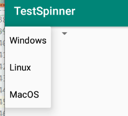

##### 属性

| 属性            | 作用   | 值                         |
| --------------- | ------ | -------------------------- |
| android:entries | 列表项 | 一个xml数组@values下的文件 |

##### xml数组形式添加列表项

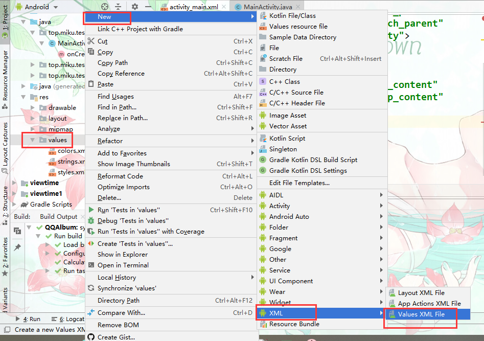

```xml
<?xml version="1.0" encoding="utf-8"?>
<resources>
    <string-array name="str">
        <item>Windows</item>
        <item>Linux</item>
        <item>MacOS</item>
    </string-array>
</resources>

```

到布局中使用android:entries属性指定上面的xml文件。

#### 通过适配器指定

- `ArrayAdapter<E>` 数组适配器
  - 构造参数
    1. 一个上下文对象
    2. 列表项的样式
    3. 一个数组资源

```java
package top.miku.testspinner;

import androidx.appcompat.app.AppCompatActivity;

import android.os.Bundle;
import android.widget.ArrayAdapter;
import android.widget.Spinner;

public class MainActivity extends AppCompatActivity {

    @Override
    protected void onCreate(Bundle savedInstanceState) {
        super.onCreate(savedInstanceState);
        setContentView(R.layout.activity_main);

        //一些数组资源
        String[] str = new String[] {
                "android","ios","flymeOS","miui"
        };

        //实例一个数组适配器
        ArrayAdapter<String> arrayAdapter = new ArrayAdapter<String>(
                this,
                android.R.layout.simple_dropdown_item_1line,
                str);

        //指定下拉列表的样式
        arrayAdapter.setDropDownViewResource(android.R.layout.simple_dropdown_item_1line);

        Spinner spinner = (Spinner) findViewById(R.id.spinner);
        //指定一个适配器
        spinner.setAdapter(arrayAdapter);


    }
}

```

**事件监听**

```java
spinner.setOnItemSelectedListener(new AdapterView.OnItemSelectedListener() {
            //选中项改变时执行
            @Override
            public void onItemSelected(AdapterView<?> adapterView, View view, int i, long l) {
                //获得当前选择的项，
                //adapterView中存放者适配器的资源数组
                //getItemAtPosition通过索引获取项
                //i是当前选中项的索引
                String str = adapterView.getItemAtPosition(i).toString();
                Toast.makeText(MainActivity.this, str, Toast.LENGTH_SHORT).show();

            }

            //当列表项没内容时执行
            @Override
            public void onNothingSelected(AdapterView<?> adapterView) {
            }
        });
```

### ScrollView【垂直滚动视图】

内容溢出后自动显式滚动条

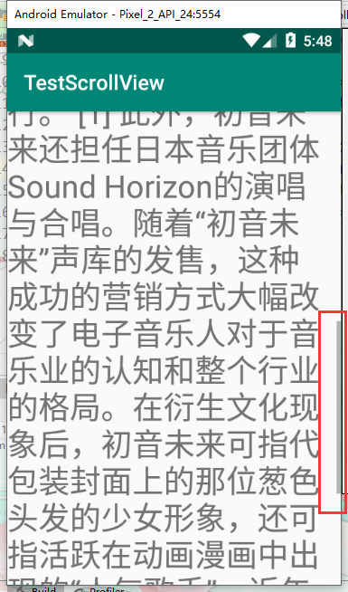

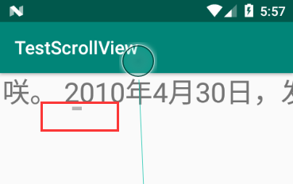

#### HorizontalScrollView【水平滚动视图】

通过HorizontalScrollView标记改为水平滚动视图

**注意事项**

一个滚动视图中只能放至一个组件。如果需要放至多个组件可以使用布局管理器包裹。

**xml文件添加滚动视图**

- 垂直滚动视图

```xml
<?xml version="1.0" encoding="utf-8"?>
<RelativeLayout xmlns:android="http://schemas.android.com/apk/res/android"
        xmlns:app="http://schemas.android.com/apk/res-auto"
        xmlns:tools="http://schemas.android.com/tools"
        android:layout_width="match_parent"
        android:layout_height="match_parent"
        tools:context=".MainActivity">

    <!-- 添加标记 -->
<ScrollView
        android:layout_width="match_parent"
        android:layout_height="match_parent">
    <TextView
            android:layout_width="match_parent"
            android:layout_height="match_parent"
            android:text="@string/str"
            android:textSize="30sp"/>
</ScrollView>
</RelativeLayout>
```

- 水平滚动视图

  ```xml
  <?xml version="1.0" encoding="utf-8"?>
  <RelativeLayout xmlns:android="http://schemas.android.com/apk/res/android"
          xmlns:app="http://schemas.android.com/apk/res-auto"
          xmlns:tools="http://schemas.android.com/tools"
          android:layout_width="match_parent"
          android:layout_height="match_parent"
          tools:context=".MainActivity">
  <!-- 添加标记 -->
  <HorizontalScrollView
          android:layout_width="wrap_content"
          android:layout_height="wrap_content">
      <TextView
              android:layout_width="match_parent"
              android:layout_height="match_parent"
              android:text="@string/str"
              android:textSize="30sp"/>
  </HorizontalScrollView>
  </RelativeLayout>
  ```

**java代码添加**

```java
package top.miku.testscrollview;

import androidx.appcompat.app.AppCompatActivity;

import android.os.Bundle;
import android.widget.LinearLayout;
import android.widget.ScrollView;
import android.widget.TextView;

public class MainActivity extends AppCompatActivity {

    @Override
    protected void onCreate(Bundle savedInstanceState) {
        super.onCreate(savedInstanceState);
        setContentView(R.layout.activity_main);

        //获得要添加滚动视图的组件
        LinearLayout linearLayout = (LinearLayout) findViewById(R.id.java_scroll_view);

        //创建滚动视图
        ScrollView scrollView = new ScrollView(MainActivity.this);
        //创建一个要往滚动视图下的组件
        TextView textView = new TextView(MainActivity.this);
        //为TextView设置一些属性
        textView.setText(R.string.str);
        textView.setTextSize(30);

        //把TextView添加到scrollView中
        scrollView.addView(textView);

        //把scrollView添加到RootView中

        linearLayout.addView(scrollView);

    }
}

```

### TabHost【选项卡】


创建流程图

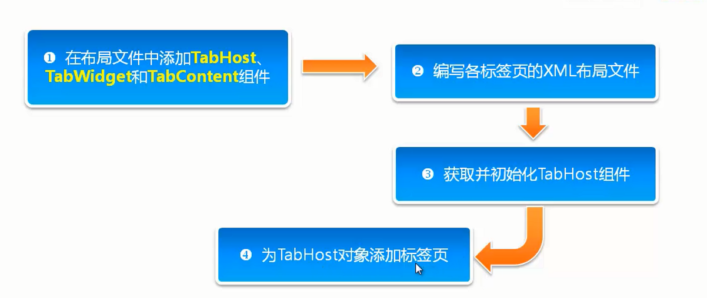

- activity_main.xml活动布局添加必要组件

  - 根节点使用TabHost标记设置id为Android内置id `@android:id/tabhost`
  - 使用一个布局容器包裹TabWidget标记和tabcontent标记【以LinearLayout为例】
  - TabWidget标记设置id为Android内置id`@android:id/tabs`
  - tabcontent没有对应的布局这里用其它布局代替【FrameLayout】将该标记的id设置为安卓内置id`@android:id/tabcontent`

  ```xml
  <?xml version="1.0" encoding="utf-8"?>
  <TabHost xmlns:android="http://schemas.android.com/apk/res/android"
          xmlns:app="http://schemas.android.com/apk/res-auto"
          xmlns:tools="http://schemas.android.com/tools"
          android:layout_width="match_parent"
          android:layout_height="match_parent"
          tools:context=".MainActivity"
          android:id="@android:id/tabhost">
  
      <LinearLayout
              android:layout_width="match_parent"
              android:layout_height="match_parent"
              android:orientation="vertical"
              >
          <TabWidget
                  android:id="@android:id/tabs"
                  android:layout_width="match_parent"
                  android:layout_height="wrap_content"/>
          <FrameLayout
                  android:id="@android:id/tabcontent"
                  android:layout_width="match_parent"
                  android:layout_height="match_parent"/>
      </LinearLayout>
  
  
  </TabHost>
  ```

- 编写各标签页的布局xml，需要几个标签就编写几个,并为布局的根组件设置一个id【放到R/layout文件夹下】

  - 示例tab1

    ```xml
    <?xml version="1.0" encoding="utf-8"?>
    <LinearLayout xmlns:android="http://schemas.android.com/apk/res/android"
            android:orientation="vertical" android:layout_width="match_parent"
            android:layout_height="match_parent"
            android:id="@+id/left">
    <ImageView
            android:layout_width="match_parent"
            android:layout_height="match_parent"
            android:src="@mipmap/biaoqing_left"/>
    </LinearLayout>
    ```

    

  - 示例tab2

    ```xml
    <?xml version="1.0" encoding="utf-8"?>
    <LinearLayout xmlns:android="http://schemas.android.com/apk/res/android"
            android:orientation="vertical" android:layout_width="match_parent"
            android:layout_height="match_parent"
            android:id="@+id/right">
    <ImageView
            android:layout_width="match_parent"
            android:layout_height="match_parent"
            android:src="@mipmap/biaoqing_right"/>
    </LinearLayout>
    ```

- 获取并初始化TabHost

- 为TabHost添加标签页

  - 综合java代码

```java
  package top.miku.wechattab;
  
  import androidx.appcompat.app.AppCompatActivity;
  
  import android.os.Bundle;
  import android.view.LayoutInflater;
  import android.widget.TabHost;
  
  public class MainActivity extends AppCompatActivity {
  
      @Override
      protected void onCreate(Bundle savedInstanceState) {
          super.onCreate(savedInstanceState);
          setContentView(R.layout.activity_main);
  /*——————————————————— 获取并初始化TabHost ——————————————————————————————*/
          //获得选项卡对象
          TabHost tabHost = findViewById(android.R.id.tabhost);
          //初始化
          tabHost.setup();
  
  
          //实例化一个LayoutInflater
          //通过LayoutInflater.from()方法获取改对象实例，参数为上下文对象。
          LayoutInflater inflater = LayoutInflater.from(this);
          //加载布局文件
          //通过inflate方法加载
          //参数1.选项卡下的内容布局文件。参数2.TabContentView对象。通过选项卡对象的getTabContentView方法获得
          inflater.inflate(R.layout.tab1,tabHost.getTabContentView());
          inflater.inflate(R.layout.tab2,tabHost.getTabContentView());
          
  /*———————————— 为TabHost添加标签页 ——————————————————————————————*/
          
          //往选项卡中添加标签页布局
          /*
          * newTabSpec()创建一个新的标签并添加一个标记【标记名随意】
          * setIndicator()给新标签添加标签名
          * setContent()给新标签添加内容【事先定义的标签页布局中的root标记的id】
          * */
          tabHost.addTab(tabHost.newTabSpec("tab1").setIndicator("精选表情").setContent(R.id.left));
          tabHost.addTab(tabHost.newTabSpec("tab2").setIndicator("投稿表情").setContent(R.id.right));
  
      }
  }
  
```


### ViewFlipper

用来控制多个组件之间以动画形式展示


## RecyclerView

一个更强大的列表试图控件。支持传统的ListView和GridView视图，也支持瀑布流效果。


### 实现ListView效果

#### 普通ListViewUI


**步骤零；**

布局文件添加`recyclerview`控件。并从java后台获取控件

```xml
<?xml version="1.0" encoding="utf-8"?>
<RelativeLayout xmlns:android="http://schemas.android.com/apk/res/android"
        xmlns:app="http://schemas.android.com/apk/res-auto"
        xmlns:tools="http://schemas.android.com/tools"
        android:layout_width="match_parent"
        android:layout_height="match_parent"
        tools:context=".MainActivity">

<!--   添加recyclerview -->
    <androidx.recyclerview.widget.RecyclerView
            android:id="@+id/recycler_view"
            android:layout_width="match_parent"
            android:layout_height="match_parent"
            />

</RelativeLayout>
```

- 获取控件. 

````java
findViewById(R.id.recycler_view);
````

**步骤一；**

准备模拟数据。

- 装备一个条目Bean类，

  ```java
  package com.xuelingmiao.recyclertest.bean;
  
  public class ItemBean {
      public int image;
      public String title;
  }
  
  ```

- 准备数据源，就是Bean类所需要的数据。这里使用数组来模拟。

  ```java
  package com.xuelingmiao.recyclertest.bean;
  
  import com.xuelingmiao.recyclertest.R;
  
  public class Datas {
      //图片数组
      public static int[] picArray = new int[]{
              R.mipmap.pic_1,
              R.mipmap.pic_2,
              R.mipmap.pic_3,
              R.mipmap.pic_4,
              R.mipmap.pic_5,
              R.mipmap.pic_6,
              R.mipmap.pic_7,
              R.mipmap.pic_8,
              R.mipmap.pic_9,
              R.mipmap.pic_10,
              R.mipmap.pic_11,
      };
  
      //tile 数组
      public static String[] titleArray = new String[]{
              "妲己",
              "孙尚香",
              "武则天",
              "安其拉",
              "王昭君",
              "不知火舞",
              "娜可露露",
              "大乔",
              "公孙离",
              "伽罗",
              "小乔",
      };
  }
  
  ```

- 装填数据,把数据添加到Bean类

  ```java
  /**
       * 准备模拟数据
       */
      private void initData (){
          /*----------装填数据-------------------*/
          beanList = new ArrayList<>();
          int length = Datas.picArray.length;
          for (int i = 0; i < length; i++) {
              ItemBean itemBean = new ItemBean();
              itemBean.image = Datas.picArray[i];
              itemBean.title = Datas.titleArray[i];
              beanList.add(itemBean);
          }
      }
  ```

  

**步骤二；**

创建适配器

1. 创建一个类继承`RecyclerView.Adapter`,泛型为`ListViewAdapter.InnerHolder`类型。的适配器类。

   ```java
   public class ListViewAdapter extends RecyclerView.Adapter<ListViewAdapter.InnerHolder> {
       
       ……
       
   }
   ```

   

2. 创建 `InnerHolder ` 内部类，继承子`RecyclerView.ViewHolder`,并创建`public InnerHolder(@NonNull View itemView)` 构造方法

   ```java
    public class InnerHolder extends RecyclerView.ViewHolder {
   
           public InnerHolder(@NonNull View itemView) {
               super(itemView);
           }
   }
   
   ```

   

3. 重写以下三个方法

   - `public InnerHolder onCreateViewHolder(@NonNull ViewGroup parent, int viewType)` 用于创建适配器类内部的holder类的。
   - `public void onBindViewHolder(@NonNull InnerHolder holder, int position)` 绑定适配器类内部的Holder类。一般用于设置数据的。
   - `public int getItemCount()` 返回总条目数

   ```java
       /**
        * 用于创建条目的View，实际就是返回内部类的InnerHolder类。
        * @param parent
        * @param viewType
        * @return
        */
       @NonNull
       @Override
       public InnerHolder onCreateViewHolder(@NonNull ViewGroup parent, int viewType) {
           return null;
       }
   
   /**
        * 绑定适配器类内部的Holder类。一般用于设置数据的。
        * @param holder
        * @param position
        */
       @Override
       public void onBindViewHolder(@NonNull InnerHolder holder, int position) {
   
       }
   
       /**
        * 返回条目个数
        * @return
        */
       @Override
       public int getItemCount() {
           return 0;
       }
   ```

   

4. 创建适配器类的构造方法。

   ```java
   public class ListViewAdapter extends RecyclerView.Adapter<ListViewAdapter.InnerHolder> {
      
       private final List<ItemBean> mData;
       //构造方法
   	public ListViewAdapter(List<ItemBean> data){
           this.mData = data;
       }
       
   } 
   
   ```

5. 处理适配器类的`getItemCount` 方法

   ```java
   /**
        * 返回总条目数
        * @return
        */
       @Override
       public int getItemCount() {
          	//返回条目数
           if (mData != null) {
               return mData.size();
           }
           return 0;
       }
   ```

6. 处理适配器类的`onCreateViewHolder`方法

   - 准备条目UI的l布局xml文件（item_list_veiw.xml）。

     

     ```xml
     <?xml version="1.0" encoding="utf-8"?>
     <RelativeLayout xmlns:android="http://schemas.android.com/apk/res/android"
             android:layout_width="match_parent"
             android:layout_height="60dp">
         <ImageView
                 android:id="@+id/itme_list_pic"
                 android:layout_width="60dp"
                 android:layout_height="60dp"
                 android:src="@mipmap/pic_1"
                 android:layout_marginLeft="5dp"/>
         <TextView
                 android:id="@+id/itme_list_title"
                 android:layout_width="wrap_content"
                 android:layout_height="wrap_content"
                 android:text="妲己"
                 android:textSize="20sp"
                 android:layout_toRightOf="@+id/itme_list_pic"
                 android:layout_centerVertical="true"
                 android:layout_marginLeft="10dp"
                 />
     
     </RelativeLayout>
     ```

   - 创建并返回内部的InnerHolder对象

     ```java
         /**
          * 用于创建条目的View，实际就是返回内部类的InnerHolder类。
          * @param parent
          * @param viewType
          * @return
          */
         @NonNull
         @Override
         public InnerHolder onCreateViewHolder(@NonNull ViewGroup parent, int viewType) {
             //构建itemView对象
             View view = View.inflate(parent.getContext(), R.layout.item_list_veiw,null);
             // 传入构建的View
             return new InnerHolder(
                 view);
         }
     ```

7. 处理适配器类中的`onBindViewHolder`方法

   - 从适配器内部类的构造方法中查找条目中要变更数据的控件。并设置为全局变量

     ```java
     public class InnerHolder extends RecyclerView.ViewHolder {
     		// 要变更数据的控件
             private ImageView pic;
             private TextView title;
     
             public InnerHolder(@NonNull View itemView) {
                 super(itemView);
                 //查找条目控件
                 pic = itemView.findViewById(R.id.itme_list_pic);
                 title = itemView.findViewById(R.id.itme_list_title);
             }
     
       
     
     	}
     ```

     

   - 从适配器内部类中创建`setData()` 方法，用来设置数据，形参类型为条目Bean类型，这里就是我们前边创建的ItemBean类。为查找到的控件设置数据。

     ```java
     /**
              * 设置数据方法
              *
              * @param itemBean 数据源Bean类对象
              */
             public void setData(ItemBean itemBean) {
                 //开始设置数据
                 mPic.setImageResource(itemBean.image);
                 mTitle.setText(itemBean.title);
             }
     ```

   - 到适配器类的`onBindViewHolder`方法去调用此设置方法。

     ```java
      /**
          * 绑定适配器类内部的Holder类。一般用于设置数据的。
          *
          * @param holder 
          * @param position
          */
         @Override
         public void onBindViewHolder(@NonNull InnerHolder holder, int position) {
             //设置数据
             holder.setData(mData.get(position));
     
         }
     ```

   适配器类完整代码参考；

   ```java
   package com.xuelingmiao.recyclertest.adapter;
   
   import android.view.View;
   import android.view.ViewGroup;
   import android.widget.ImageView;
   import android.widget.TextView;
   
   import androidx.annotation.NonNull;
   import androidx.recyclerview.widget.RecyclerView;
   
   import com.xuelingmiao.recyclertest.R;
   import com.xuelingmiao.recyclertest.bean.ItemBean;
   
   import java.util.List;
   
   public class ListViewAdapter extends RecyclerView.Adapter<ListViewAdapter.InnerHolder> {
   
       private final List<ItemBean> mData;
   
       public ListViewAdapter(List<ItemBean> data) {
           this.mData = data;
       }
   
       /**
        * 用于创建条目的View，实际就是返回内部类的InnerHolder类。
        *
        * @param parent
        * @param viewType
        * @return
        */
       @NonNull
       @Override
       public InnerHolder onCreateViewHolder(@NonNull ViewGroup parent, int viewType) {
           //构建itemView对象
           View view = View.inflate(parent.getContext(), R.layout.item_list_veiw, null);
           // 传入构建的View
           return new InnerHolder(view);
       }
   
       /**
        * 绑定适配器类内部的Holder类。一般用于设置数据的。
        *
        * @param holder
        * @param position
        */
       @Override
       public void onBindViewHolder(@NonNull InnerHolder holder, int position) {
           //设置数据
           holder.setData(mData.get(position));
   
       }
   
       /**
        * 返回总条目数
        *
        * @return
        */
       @Override
       public int getItemCount() {
           if (mData != null) {
               return mData.size();
           }
           return 0;
       }
   
       public class InnerHolder extends RecyclerView.ViewHolder {
   
           private ImageView mPic;
           private TextView mTitle;
   
           public InnerHolder(@NonNull View itemView) {
               super(itemView);
               //查找条目控件
               mPic = itemView.findViewById(R.id.itme_list_pic);
               mTitle = itemView.findViewById(R.id.itme_list_title);
           }
   
           /**
            * 设置数据方法
            *
            * @param itemBean 数据源Bean类对象
            */
           public void setData(ItemBean itemBean) {
               //开始设置数据
               mPic.setImageResource(itemBean.image);
               mTitle.setText(itemBean.title);
           }
   
       }
   }
   
   ```

**步骤三；**

为RecyclerView设置样式，有`RecyclerView.LayoutManager` 抽象类来管理，其实现类如下图，分别对应这ListView布局GridView布局和瀑布流布局。. 

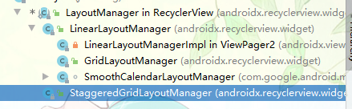

```java
 /**
     * 准备模拟数据
     */
    private void initData (){
        /*----------装填数据-------------------*/
			.....
        /*-----------设置布局管理器也就是RecyclerView样式---------------------------*/
        LinearLayoutManager linearLayoutManager = new LinearLayoutManager(MainActivity.this);
        //设置布局管理器
        mRecyclerView.setLayoutManager(linearLayoutManager);
    }
```

**步骤四；**

5. 使用适配器

   ```java
       /**
        * 准备模拟数据
        */
       private void initData (){
           /*----------装填数据-------------------*/
        		……
           /*-------------创建适配器-------------------------*/
           // 实例化适配器
           ListViewAdapter mListViewAdapter = new ListViewAdapter(beanList);
           
       }
   ```

6. 为RecyclerView设置适配器。

     ```java
         /**
          * 准备模拟数据
          */
         private void initData (){
             /*----------装填数据-------------------*/
            	......
             /*-------------创建适配器-------------------------*/
             // 实例化适配器
             .....
             //设置适配器
             mRecyclerView.setAdapter(mListViewAdapter);
         }
     ```

   - 在MainActivity的`onCreate` 方法内调用`initData()`方法。

     ```java
      @Override
         protected void onCreate(Bundle savedInstanceState) {
             super.onCreate(savedInstanceState);
             setContentView(R.layout.activity_main);
     
             //查找控件
             mRecyclerView = findViewById(R.id.recycler_view);
     		//调用初始数据方法。
             initData();
     
         }
     ```

#### 控制显示方式

通过LinearLayoutManager类的方法来改变。

- `setOrientation(@RecyclerView.Orientation int orientation)` 设置显示方向
  - 参数
  - `int orientation`  
    - `LinearLayoutManager.HORIZONTAL` 水平显示。
    - `LinearLayoutManager.VERTICAL` 垂直显示
- `setReverseLayout(boolean reverseLayout)` 是否反向显示
  - 参数
    - `boolean reverseLayout`
      - true 反向显示
      - false 不反向显示

**参考示例；**

```java
 /**
     * 以LIstView方式显示
     * @param isVertical 是否水平显示
     * @param isReverse 是否反向显示
     */
    private void showList(boolean isVertical,boolean isReverse) {
        /*-----------设置布局管理器也就是RecyclerView样式---------------------------*/
        LinearLayoutManager linearLayoutManager = new LinearLayoutManager(MainActivity.this);
        //设置显示方向
        linearLayoutManager.setOrientation(isVertical ? LinearLayoutManager.VERTICAL : LinearLayoutManager.HORIZONTAL);
        //是否反向显示
        linearLayoutManager.setReverseLayout(isReverse);
        //设置布局管理器
        mRecyclerView.setLayoutManager(linearLayoutManager);
        /*-------------创建适配器-------------------------*/
        // 实例化适配器
        ListViewAdapter mListViewAdapter = new ListViewAdapter(beanList);
        //设置适配器
        mRecyclerView.setAdapter(mListViewAdapter);
    }
```


#### 条目分割线

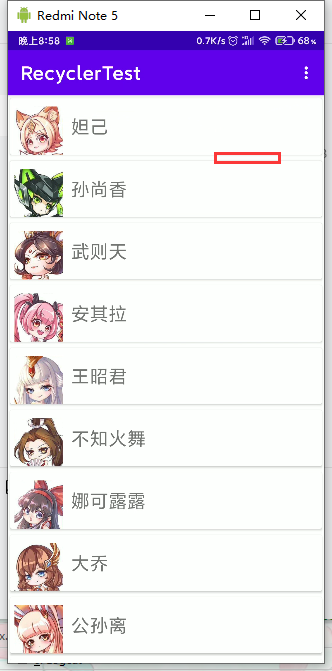

使用CardView控件来完成。

打开条目布局文件。使用CardView控件包裹之前的布局。

```xml
<?xml version="1.0" encoding="utf-8"?>
<RelativeLayout xmlns:android="http://schemas.android.com/apk/res/android"
        android:layout_width="match_parent"
        android:layout_height="wrap_content"
        xmlns:app="http://schemas.android.com/apk/res-auto">

    <!--   CardView -->
    <androidx.cardview.widget.CardView
            android:layout_width="match_parent"
            android:layout_height="wrap_content"
            app:cardUseCompatPadding="true"
            android:background="#cccccc">

        <RelativeLayout
                android:layout_width="match_parent"
                android:layout_height="70dp">

            <ImageView
                    android:id="@+id/itme_list_pic"
                    android:layout_width="60dp"
                    android:layout_height="60dp"
                    android:layout_marginLeft="5dp"
                    android:layout_marginTop="10dp"
                    android:src="@mipmap/pic_1" />

            <TextView
                    android:id="@+id/itme_list_title"
                    android:layout_width="wrap_content"
                    android:layout_height="wrap_content"
                    android:layout_centerVertical="true"
                    android:layout_marginLeft="10dp"
                    android:layout_toRightOf="@+id/itme_list_pic"
                    android:text="妲己"
                    android:textSize="20sp" />
        </RelativeLayout>
    </androidx.cardview.widget.CardView>

</RelativeLayout>
```

**属性；**

- `app:cardUseCompatPadding="true"` 是否使用兼容填充


### 实现GridView效果

在ListVIew 的基础上只需更改RecyclerView的LayoutManager的方式即可。

**GridLayoutManager构造方法**

- `public GridLayoutManager(Context context, int spanCount)`
  - 参数
    - `Context context` 上上下文
    - `int spanCount`  显示列数

```java
 /*-----------设置布局管理器也就是RecyclerView样式为GridVIew---------------------------*/
        GridLayoutManager gridLayoutManager = new GridLayoutManager(MainActivity.this,2);
        //设置布局管理器
        mRecyclerView.setLayoutManager(gridLayoutManager);
```

#### 控制显示方式

设置方式也是通过 GridLayoutManager的`setOrientation()`和`setReverseLayout()`方法来设置。

**参考示例；**

```java
 /**
     * 以GridView方式显示
     * @param isVertical 是否水平显示
     * @param isReverse 是否反向显示
     */
    private void showGrid(boolean isVertical,boolean isReverse){
        /*-----------设置布局管理器也就是RecyclerView样式为GridVIew---------------------------*/
        GridLayoutManager gridLayoutManager = new GridLayoutManager(MainActivity.this,2);
//        //设置显示方向
        gridLayoutManager.setOrientation(isVertical ? LinearLayoutManager.VERTICAL : LinearLayoutManager.HORIZONTAL);
//        //是否反向显示
        gridLayoutManager.setReverseLayout(isReverse);
        //设置布局管理器
        mRecyclerView.setLayoutManager(gridLayoutManager);
        /*-------------创建适配器-------------------------*/
        // 实例化适配器
        ListViewAdapter mListViewAdapter = new ListViewAdapter(beanList);
        //设置适配器
        mRecyclerView.setAdapter(mListViewAdapter);
    }
```


