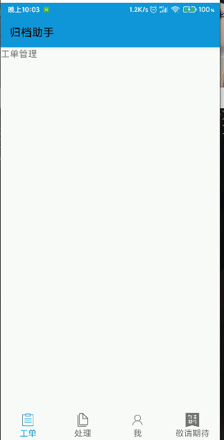
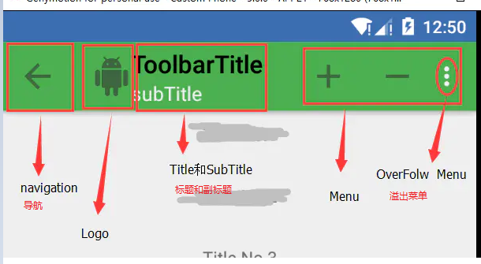

# TooBar使用

Action Bar是Android 3.0引入的导航栏功能，然而到5.0的时候，又推出了ToolBar，实际上这两个可以理解为同一个东西，ToolBar是对ActionBar的升级，使用起来也基本是一样的。只是因为ActionBar在实际使用过程中的各种问题，才推出了ToolBar来接替ActionBar。ActionBar通常翻译为操作栏，而到了ToolBar则翻译为工具栏，这里我们统称为工具栏。

## 向 Activity 添加工具栏


1. 确保 Activity 可以继承子 `AppCompatActivity`：

   ```java
    public class MyActivity extends AppCompatActivity {
         // ...
       }
   ```

   

2. 在应用清单中，将 `application`或`activity`元素设置为使用 appcompat 的其中一个 `NoActionBar` 主题背景。使用其中一个主题背景可以防止应用使用原生 `ActionBar` 类提供应用栏。例如;

   ```xml
       <application
           android:theme="@style/Theme.AppCompat.Light.NoActionBar"
           />
       
   ```

   现在Android Studio 创建的项目application元素使用的默认主题为一个继承子Android内置主题，themes.xml（res/values/theme.xml）文件中所定义的名为`Theme.[app名称]`的基本应用程序主题。如下面展示。如果要更换一个不带ActionBar的主题那么我们可以更改此主题的继承，让他继承一个不包含ActionBar的主题如；`Theme.AppCompat.Light.NoActionBar` 即可。

   ```xml
   <resources xmlns:tools="http://schemas.android.com/tools">
       <!-- Base application theme. -->
       <style name="Theme.ToolBarTest" parent="Theme.MaterialComponents.DayNight.DarkActionBa">
           <!-- Primary brand color. -->
           <item name="colorPrimary">@color/purple_500</item>
           <item name="colorPrimaryVariant">@color/purple_700</item>
           <item name="colorOnPrimary">@color/white</item>
           <!-- Secondary brand color. -->
           <item name="colorSecondary">@color/teal_200</item>
           <item name="colorSecondaryVariant">@color/teal_700</item>
           <item name="colorOnSecondary">@color/black</item>
           <!-- Status bar color. -->
           <item name="android:statusBarColor" tools:targetApi="l">?attr/colorPrimaryVariant</item>
           <!-- Customize your theme here. -->
       </style>
   </resources>
   ```

3. 向 Activity 的布局添加一个 `Toolbar`。例如，以下布局代码会添加一个 `Toolbar`，并赋予其浮动在 Activity 之上的外观：

   ```xml
       <androidx.appcompat.widget.Toolbar
               android:id="@+id/my_toolbar"
               android:layout_width="match_parent"
               android:layout_height="?attr/actionBarSize"
               android:background="@color/main_color"
               android:elevation="4dp"
               android:theme="@style/ThemeOverlay.AppCompat.ActionBar"
               app:popupTheme="@style/ThemeOverlay.AppCompat.Light"
   ```

5. 在 Activity 的 onCreate() 方法中，调用 Activity 的 setSupportActionBar() 方法，然后传递 Activity 的工具栏。此方法会将工具栏设为 Activity 的应用栏。例如：

   ```java
   // 是此包下的import androidx.appcompat.widget.Toolbar;    
   @Override
       protected void onCreate(Bundle savedInstanceState) {
           super.onCreate(savedInstanceState);
           setContentView(R.layout.activity_main);
          	//获取toobar
           Toolbar mToolbar = findViewById(R.id.my_toolbar);
           //把toobar设置为activity的应用栏。
           setSupportActionBar(mToolbar);
       }
   ```



## 管理工具栏

一个完整的工具栏主要组成部分如下：



### 各个部分设置方法

#### Navigation

这是工具栏的层级导航功能，类似于按下Back键，但是，与Back键不同，这里需要我们指定返回的Activity。在Manifest文件里设置：

- `android:parentActivityName` 属性按下导航键返回的目标

```xml
<activity
            android:name=".model.fragment.LandViewActivity"//包含ToolBar的当前Activity
            android:parentActivityName=".SplashActivity"//按下导航键返回的目标Activity
            >
        <!-- Android 4.0 奇前版本使用 -->
        <meta-data
            android:name="android.support.PARENT_ACTIVITY"
            android:value=".SplashActivity" />
        </activity>

```

这样，层级导航的功能设置就完成了。当然还需要设置Navigation，如果不想使用默认的导航图标，也可以自己在layout文件中指定，**如果不设置默认不显示Navigation按钮。**启用此功能只需要获取到actionBar对象调用其`setDisplayHomeAsUpEnabled(true)`方法。如果我们使用是ActionBar主题，Navigation功能默认是启用的，设置parentActivity就可以了

**注意；**Navigation返回的Activity并不是返回栈里存在的实例，而是重新创建的Activity，也就是说，之前Activity存在的状态，从Navigation返回之后，并不会保存下来

```xml
    <androidx.appcompat.widget.Toolbar
            android:id="@+id/my_toolbar"
            android:layout_width="match_parent"
            android:layout_height="?attr/actionBarSize"
            android:background="@color/main_color"
            android:elevation="4dp"
            app:navigationIcon="@color/def_font" //使用自定义导航图标
            />
```


#### Logo和Title

这两项的设置非常简单，可以在layout文件中设置，也可以在代码中对ActionBar对象进行设置，

```xml
    <androidx.appcompat.widget.Toolbar
            app:logo=""
            app:title=""
            />
```

```java
 ActionBar mActionBar = getSupportActionBar(); 
	mActionBar.setTitle("title");
```


#### Menu

在工具栏上可以设置多个按钮，Menu就是由这些按钮组成的。
要在工具栏上添加按键，需要先指定Menu文件，menu文件需要定义在res/menu文件夹下

1. 创建菜单文件

```xml
<?xml version="1.0" encoding="utf-8"?>
<menu xmlns:android="http://schemas.android.com/apk/res/android"
        xmlns:app="http://schemas.android.com/apk/res-auto">
<!--    定义菜单项-->
    <item
            android:id="@+id/add_item"
            android:icon="@drawable/ic_launcher_background"
            android:title="Add"
            app:showAsAction="ifRoom|withText"/>
    <item
            android:id="@+id/del_item"
            android:icon="@drawable/ic_launcher_foreground"
            android:title="Del"
            app:showAsAction="never"
        />
</menu>
```

**注意；**因为例子中使用是v7支持库，需要使用app命名空间。如果不使用支持库可以直接使用android。app:showAsAction指定了按键的显示方式。

- `android:titl` 菜单标题

- `app:showAsAction` 菜单显示方式
  - `always`菜单项始重显式在ActionBar上
  - `ifRoom`当ActionBar有可用空间时显式，无空间显式在溢出菜单上
  - `naver`菜单项永远不显示在actionBar上而显示在溢出菜单中。在溢出菜单中仅显示文本内容。
  - `withText` 菜单项显式在actionBar上并且显式文本。

2. Menu定义好之后，在Activity中添加并引用它：

   - 重写`public boolean onCreateOptionsMenu(Menu menu)`添加菜单

   ```java
   @Override
       public boolean onCreateOptionsMenu(Menu menu) {
           //获取inflater
           MenuInflater inflater = getMenuInflater();
           //从指定的XML资源中生成菜单结构
           /**
            * 参数；
            *  int 菜单文件
            *  Menu 要添加新菜单项的菜单。项目和子菜单将添加到此菜单。
            */
           inflater.inflate(R.menu.toolbar_menu,menu);
           return super.onCreateOptionsMenu(menu);
       }
   ```

   - 重写`public boolean onOptionsItemSelected(@NonNull MenuItem item)` 监听菜单点击事件。
   
   ```java
    @Override
       public boolean onOptionsItemSelected(@NonNull MenuItem item) {
           switch (item.getItemId()){
               case R.id.add_item:
                   Log.d(TAG, "onOptionsItemSelected: 点击了Add");
                   break;
               case R.id.del_itme:
                   Log.d(TAG, "onOptionsItemSelected: 点击了Del");
                   break;
               default:
                   break;
           }
   
           return super.onOptionsItemSelected(item);
       }
   ```
   
   这里是在Activity中直接加载menu，如果是Fragment中使用，会有所不同。Fragment中必须设置setHasOptionsMenu(true)，它用来通知FragmentManager，当前Fragment需要调用onCreateOptionsMenu方法。

#### OverFlow按钮显示图标

overflow中的按钮默认是不显示图标的，它由MenuBuilder这个类的`setOptionalIconsVisible`方法来决定，如果我们在overflow被展开的时候给这个方法传入true，那么里面的每一个Action按钮对应的图标就都会显示出来了。

- 重写`public boolean onMenuOpened(int featureId, Menu menu)`方法

```java
/**
     * 利用反射机制调用MenuBuilder的setOptionalIconsVisible方法设置mOptionalIconsVisible为true，
     * 给菜单设置图标时才可见 让菜单同时显示图标和文字
     */
    @Override
    public boolean onMenuOpened(int featureId, Menu menu) {
        if (menu != null) {
            if (menu.getClass().getSimpleName().equalsIgnoreCase("MenuBuilder")) {
                try {
                    Method method = menu.getClass().getDeclaredMethod("setOptionalIconsVisible", Boolean.TYPE);
                    method.setAccessible(true);
                    method.invoke(menu, true);
                } catch (Exception e) {
                    e.printStackTrace();
                }
            }
        }
        return super.onMenuOpened(featureId, menu);
    }

```


## Navigation和Menu的关系

实际上Navigation也属于menu，它的id是android.R.id.home，可以在onOptionsItemSelected中对它进行监听

```java
 @Override
    public boolean onOptionsItemSelected(@NonNull MenuItem item) {
        switch (item.getItemId()){
            case R.id.add_item:
                Log.d(TAG, "onOptionsItemSelected: 点击了Add");
                break;
            case R.id.del_itme:
                Log.d(TAG, "onOptionsItemSelected: 点击了Del");
                break;
            case android.R.id.home: //导航按钮
                Log.d(TAG, "onOptionsItemSelected: 点击了导航按钮");
                break;
            default:
                break;
        }

        return super.onOptionsItemSelected(item);
    }
```


## TooBar样式

**样式参考；**

```xml
<style name="AppTheme.ToolBar" parent="AppTheme">
        <!--ToolBar 字体颜色改为白色 -->
        <item name="titleTextColor">@android:color/white</item>
        <!-- 溢出菜单图标颜色 -->
        <item name="colorControlNormal">@android:color/white</item>
        <!-- 右侧溢出菜单图标自定义 -->
        <item name="actionOverflowButtonStyle">@style/ActionButton.Overflow</item>
        <!-- 是否覆盖锚点，默认为true，即盖住 Toolbar -->
        <item name="overlapAnchor">false</item>
        <!-- 弹出层背景颜色 -->
        <item name="android:colorBackground">@color/weixin_bg</item>
        <!-- 设置弹出菜单文字颜色 -->
        <item name="android:textColor">@android:color/white</item>
        <!-- 弹出层垂直方向上的偏移，即在竖直方向上距离Toolbar的距离，值为负则会盖住Toolbar -->
        <item name="android:dropDownVerticalOffset">0dp</item>
        <!-- 弹出层水平方向上的偏移，即距离屏幕左边的距离，负值会导致右边出现空隙 -->
        <item name="android:dropDownHorizontalOffset">0dp</item>
    </style>
    <!-- 右侧溢出菜单图标自定义 -->
    <style name="ActionButton.Overflow" parent="android:Widget.ActionButton.Overflow">
        <item name="android:src">@drawable/actionbar_add_icon</item>
    </style>

```


## TooBar属性

```xml
//标题文字大小
app:titleTextAppearance="@style/ToolbarTitleSize"
//toobar主题
android:theme="@style/ThemeOverlay.AppCompat.ActionBar"
//溢出菜单主题
app:popupTheme="@style/ThemeOverlay.AppCompat.Light"
// 视图的基本z轴深度。如同css中的z-index
android:elevation="4dp"
```


