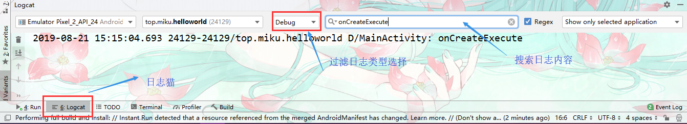
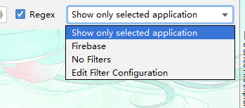
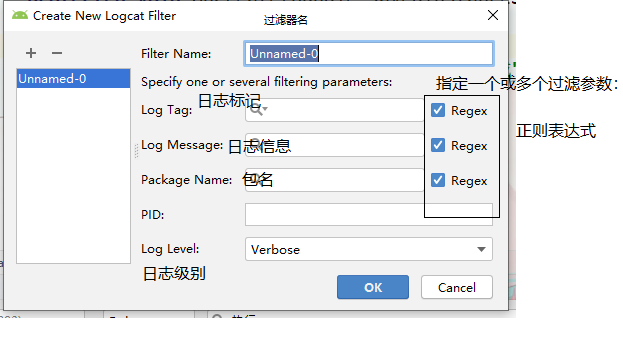
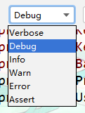
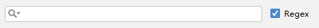

# Logcat【日志】

> **注意；**
>
> logcat输出内容有4kb限制，超出部分不会显示。

## 输出不同级别日志

Android中的日志工具类是**Log（android.util.Log）**这个类中提供了如下5个方来供我们打印日志。

1. `Log.v()` 用于打印那些最为琐碎的、意义最小的日志信息。对应级别verbose，是Android日志里面级别最低的一种。
2. `Log.d()`用于打印一些调试信息，这些信息对你调试程序和分析问题应该是有帮助的。对应级别debug，比verbose高一级。
3. `Log.i()` 用于打印一些比较重要的数据，这些数据应该是你非常想看到的、可以帮你分析用户行为数据。对应级别info，比debug高一级。
4. `Log.w()`用于打印一些警告信息，提示程序在这个地方可能会有潜在的风险，最好去修复一下这些出现警告的地方。对应级别warn，比info高一级。
5. `Log.e()` 用于打印程序中的错误信息，比如程序进入到了catch语句当中。当有错误信息打印出来的时候，一般都代表你的程序出现严重问题了，必须尽快修复。对应级别error，比warn高一级。

```java
public class MainActivity extends AppCompatActivity {
    //创建log中的rga常量
    private static final String TAG = "MainActivity";
    @Override
    protected void onCreate(Bundle savedInstanceState) {
        super.onCreate(savedInstanceState);
        setContentView(R.layout.activity_main);//引入布局XML
        //打印日志参数（tga【标记，一般写类名】,具体打印内容）
        Log.d(TAG,"onCreateExecute");
    }
}
```


## 日志级别顺序

verbose【详细】 < debug【调试】 < info【提示】 < warn【警告】 < error【错误】

## Logcat 面板




### 日志过滤器




- Show only selected application 【只显示当前选中程序的日志】

- Firebase【谷歌提供的一个分析工具】

- No Filters【不过滤】

- Edit Filter Configuration【自定义过滤器】

  

  

### 级别控制



- 我们将级别选中为debug，这时只有我们使用debug及大于debug级别方法打印的日志才会显示出来，其他级别以此类推。

### 关键词过滤




- 我们可以在输入框里输入关键字的内容，这样只有符合关键字条件的日志才会显示出来，从而能够快速定位到任何你想查看的日志。另外还有一点需要注意，关键字过滤是支持正则表达式的。

### Log而不使用System.out

**System.out的缺点；**

如日志打印不可控制、打印时间无法确定、不能添加过滤器、日志没有级别区分…

## 多学一点

- 输入log+日志类型缩写，如logi

```java
        Log.d(TAG, "onCreate: 主活动执行完成");
```

