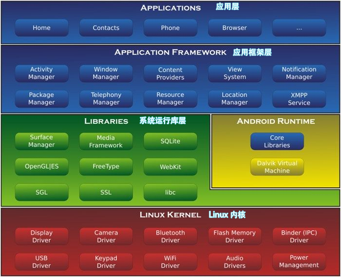

# Android介绍

## 系统架构

**主要架构解析；**

- Linux内核层

  Android系统是基于Linux内核的，这一层为Android设备的各种硬件提供了底层的驱动，如显示驱动、音频驱动、照相机驱动、蓝牙驱动、Wi-Fi驱动、电源管理等。

- 系统运行库层

  这一层通过一些C/C++库来为Android系统提供了主要的特性支持。如SQLite库提供了数据库的支持，OpenGL|ES库提供了3D绘图的支持，Webkit库提供了浏览器内核的支持等。
  同样在这一层还有Android运行时库，它主要提供了一些核心库，能够允许开发者使用Java语言来编写Android应用。另外，Android运行时库中还包含了Dalvik虚拟机（5.0系统之后改为ART运行环境），它使得每一个Android应用都能运行在独立的进程当中，并且拥有一个自己的Dalvik虚拟机实例。相较于Java虚拟机，Dalvik是专门为移动设备定制的，它针对手机内存、CPU性能有限等情况做了优化处理。

- 应用框架层

  这一层主要提供了构建应用程序时可能用到的各种API，Android自带的一些核心应用就是使用这些API完成的，开发者也可以通过使用这些API来构建自己的应用程序。

- 应用层

  所有安装在手机上的应用程序都是属于这一层的，比如系统自带的联系人、短信等程序，或者是你从Google Play上下载的小游戏，当然还包括你自己开发的程序