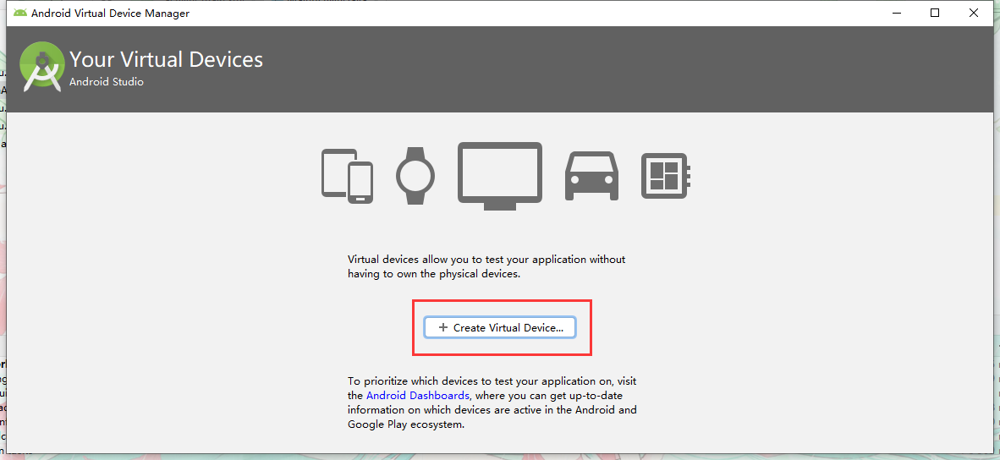
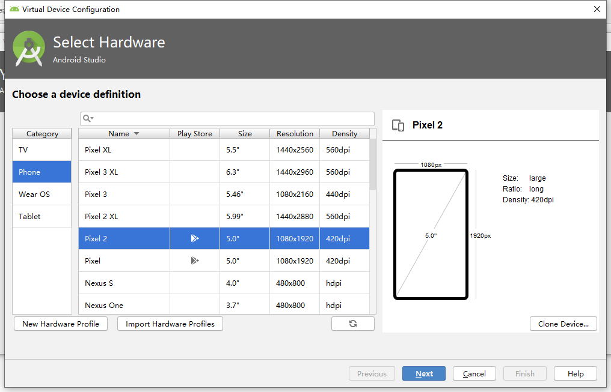
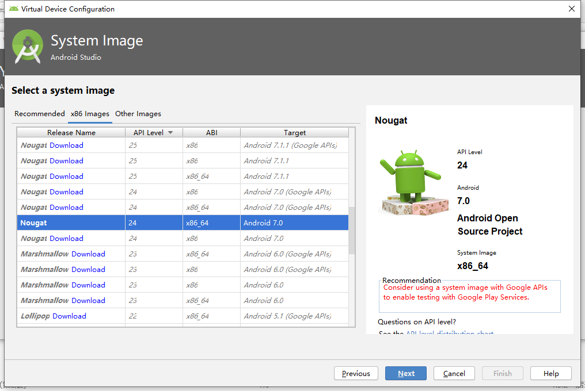
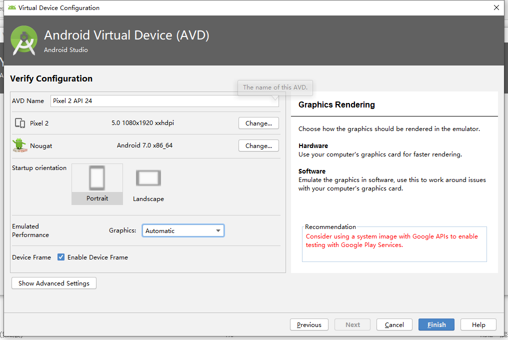
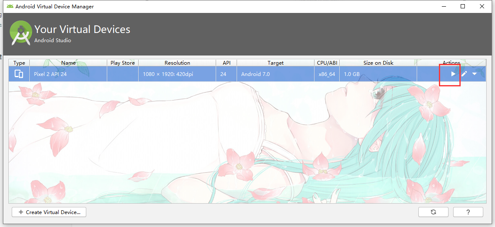
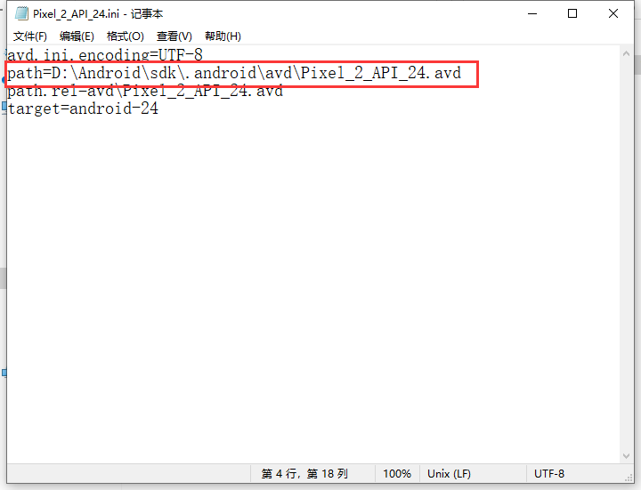
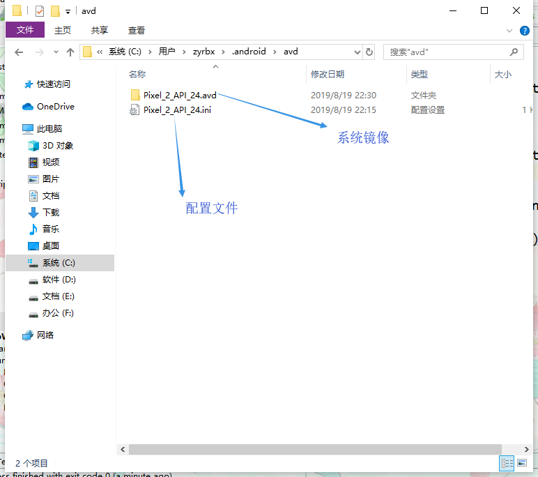

# 创建模拟器

- 点击右上角工具栏的图标启动AVD Manager

  

- 点击这里创建模拟器

  

- 选择要创建设备的类型

  

- 选择模拟器的版本不带Download的是下载好的

  

- 确认模拟器信息无误后点击finish

  

- 等待片刻模拟器就创建成功了，点击下图标注出就可以启动模拟器了。



## 多学一点

AS默认创建的模拟器会存放到以下路径`C:\Users\%USERNAME%\.android\avd`要更改路径可以把镜像文件移动到其它路径然后修改**配置文件**中的`Path`的值为镜像的路径即可.

```
avd.ini.encoding=UTF-8
path=D:\Android\avds\Pixel_2_API_25.avd
path.rel=avd\Pixel_2_API_25.avd
target=android-25
```

