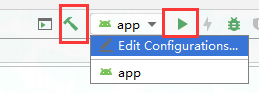
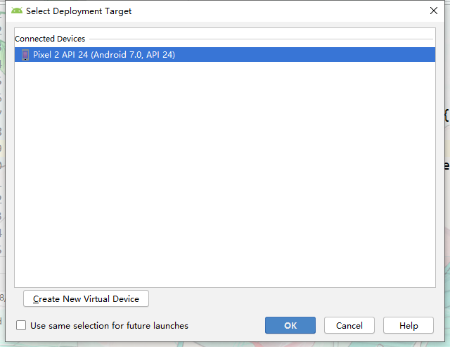
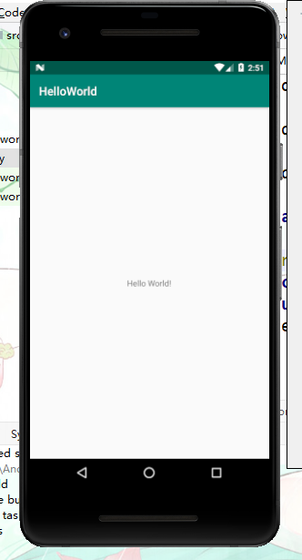

# 运行项目

运行项目有两种方式一种是实体Android设备只要将Android手机通过数据线连接电脑并开启USB调试功能，即可在运行设备列表中看到。以下示例以Android模拟器为例，

- 观察Android Studio顶部工具栏中的图标,其中左边的锤子按钮是用来编译项目的，中间的下拉列表是用来选择运行哪一个项目的，通常app就是当前的主项目，右边的三角形按钮是用来运行项目的。

  

- 选择要运行的设备点击OK

- 成功运行示例

> [!NOTE]
>
> 通过Android Studio直接运行项目生成的都是测试版安装文件。

