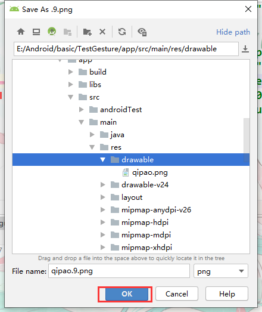

# drawable/【位图】

位图文件（`.png`、`.9.png`、`.jpg`、`.gif`）或编译为以下可绘制对象资源子类型的 XML 文件：位图文件九宫格（可调整大小的位图）状态列表形状动画可绘制对象其他可绘制对象请参阅 [Drawable 资源](https://developer.android.google.cn/guide/topics/resources/drawable-resource)。

通常使用会建立不同dpi的资源目录来存放资源。

不同分辨率对照资源目录


## 9.png图片

9.peng图片又戏称9妹图，支持自动拉伸部分区域的图片，长用于气泡图。

### 制作九妹图

在要绘制9图的图片上右键按下图示例




双击创建的.9图片打开编辑器


#### 绘制说明


主要操作区域就是四周多出来的1像素，从这一像素按住鼠标左键拖动来绘制【绘制区域会变为黑色】按住shrift从黑色区域再次绘制会取消绘制区域。

- 上边绘制代表 横向可拉伸区域
- 左边绘制代表 纵向可拉伸区域
- 右边绘制代表 纵向内容可显式区域
- 下边绘制代表 横向内容可显式区域


> **图片内容更正；**
>
> 预览区域分别是：纵向拉伸，横向拉伸，横纵都拉伸的预览


### 使用九妹图

删除原题，按正常图片资源使用即可。


## 状态列表

`StateListDrawable` 是在 XML 文件中定义的可绘制对象，它会根据对象状态，使用多个不同的图像来表示同一个图形。例如，`Button` 微件可以是多种不同状态（按下、聚焦或这两种状态都不是）中的其中一种，并且您可利用状态列表可绘制对象，为每种状态提供不同的背景图片。

### 创建StateListDrawable资源

在drawable目录右键——New——Drawable resource file 设置文件名root节点选择**selector**即可。

使用`<item>`标记设置每一项样式

```xml
<?xml version="1.0" encoding="utf-8"?>
<selector xmlns:android="http://schemas.android.com/apk/res/android">
    <!--属性格式； 事件类型 触发事件后的样式  android:state_focused焦点类型-->
    <item android:state_focused="true" android:color="#FFBF00"/> //获得焦点
    <item android:state_focused="false" android:drawable="@drawable/qipao"/> //失去焦点
</selector>
```

##### 使用状态列表资源

到组件的布局中，通过textColor引用属性值通过@drawable来指定。

> **提示；**
>
> 上面设置的状态样式仅适用部分控件。


