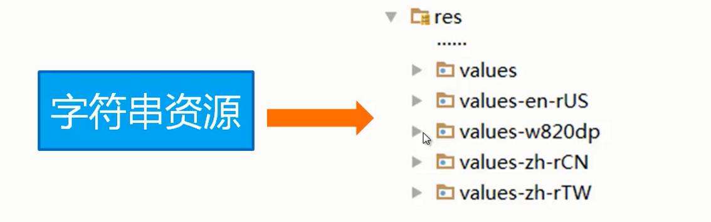
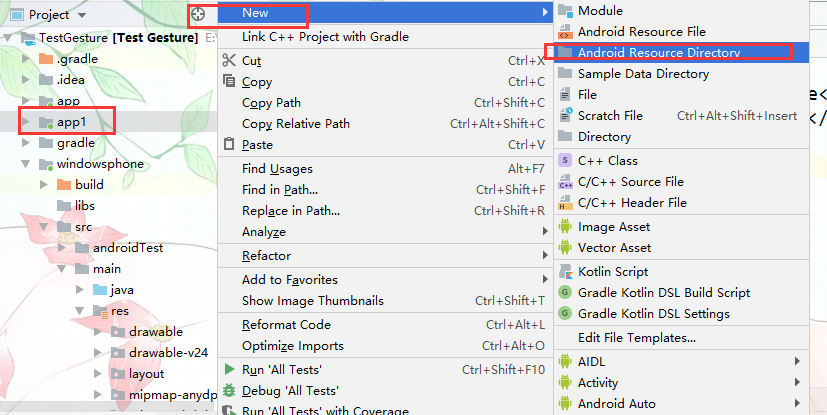
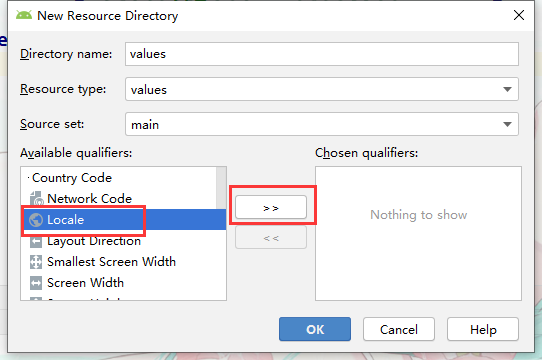

# 国际化

程序的国际化就是通过Android系统语言，程序进行多国语言适配

### 实现国际化

给values目录配置不同语言的字符串文件即可。

**示例**

1. 创建布局文件

   创建自己需要的布局文件即可

2. 创建国际化所用的文件夹

   > res——values目录依然存放默认的字符串资源即可

   在res下创建values-国家-r区域【大写】 如`values-zh-rCN `中国大陆简体 的目录。更多区域参考添加国际化目录方法。

   

   

   

3. 在国际化文件夹中添加对应的语言资源文件

   把已有的strings字符串资源复制到国际化目录修改里面的字符为对应语言的文字。