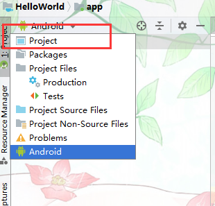
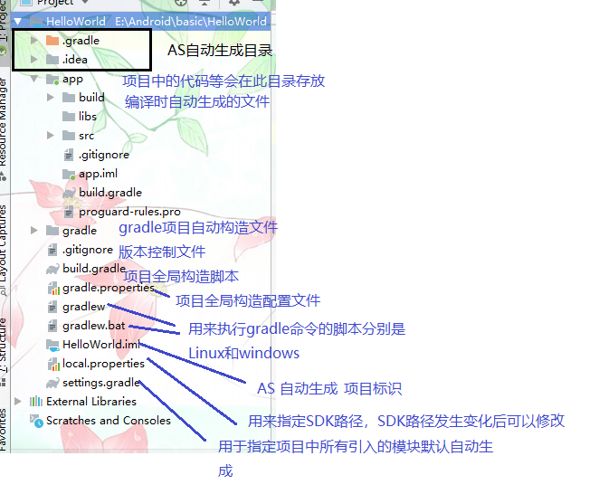
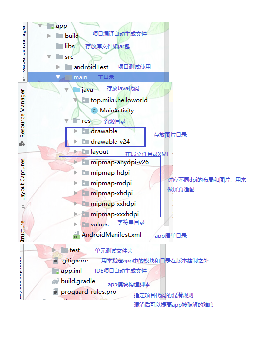
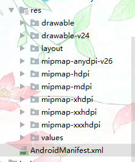

# 应用资源概览

默认目录结构不利于理解，我们可以更改为Project 模式



**目录总览；**



**app目录；**

app目录及当前开发的Module名称



**res目录；**


- 所有以drawable开头的文件夹都是用来放图片的
- 所有以mipmap开头的文件夹都是用来放应用图标的
- 所有以values开头的文件夹都是用来放字符串、样式、颜色等配置的
- layout文件夹是用来放布局文件的。

## 分组资源类型

您应将各类资源放入项目 `res/` 目录的特定子目录中。例如，以下是一个简单项目的文件层次结构：

```
MyProject/
    src/
        MyActivity.java
    res/
        drawable/
            graphic.png
        layout/
            main.xml
            info.xml
        mipmap/
            icon.png
        values/
            strings.xml
```


如此示例所示，res/ 目录包含所有资源（在子目录中）：一个图像资源、两个布局资源、app器图标的 mipmap/ 目录以及一个字符串资源文件。资源目录名称非常重要，具体说明请见下表。

**`res/` 目录中支持的资源目录。**

> 以下表格资源来源于Android官方开发文档

| 目录        | 资源类型                                                     |
| :---------- | :----------------------------------------------------------- |
| `animator/` | 用于定义[属性动画](https://developer.android.google.cn/guide/topics/graphics/prop-animation)的 XML 文件。 |
| `anim/`     | 用于定义[渐变动画](https://developer.android.google.cn/guide/topics/graphics/view-animation#tween-animation)的 XML 文件。（属性动画也可保存在此目录中，但为了区分这两种类型，属性动画首选 `animator/` 目录。） |
| `color/`    | 用于定义颜色状态列表的 XML 文件。请参阅[颜色状态列表资源](https://developer.android.google.cn/guide/topics/resources/color-list-resource) |
| `drawable/` | 位图文件（`.png`、`.9.png`、`.jpg`、`.gif`）或编译为以下可绘制对象资源子类型的 XML 文件：位图文件九宫格（可调整大小的位图）状态列表形状动画可绘制对象其他可绘制对象请参阅 [Drawable 资源](https://developer.android.google.cn/guide/topics/resources/drawable-resource)。 |
| `mipmap/`   | 适用于不同启动器图标密度的可绘制对象文件。如需了解有关使用 `mipmap/` 文件夹管理启动器图标的详细信息，请参阅[管理项目概览](https://developer.android.google.cn/tools/projects#mipmap)。 |
| `layout/`   | 用于定义用户界面布局的 XML 文件。请参阅[布局资源](https://developer.android.google.cn/guide/topics/resources/layout-resource)。 |
| `menu/`     | 用于定义应用菜单（如选项菜单、上下文菜单或子菜单）的 XML 文件。请参阅[菜单资源](https://developer.android.google.cn/guide/topics/resources/menu-resource)。 |
| `raw/`      | 需以原始形式保存的任意文件。如要使用原始 `InputStream` 打开这些资源，请使用资源 ID（即 `R.raw.*filename*`）调用 `Resources.openRawResource()`。但是，如需访问原始文件名和文件层次结构，则可以考虑将某些资源保存在 `assets/` 目录（而非 `res/raw/`）下。`assets/` 中的文件没有资源 ID，因此您只能使用 `AssetManager` 读取这些文件。 |
| `values/`   | 包含字符串、整型数和颜色等简单值的 XML 文件。其他 `res/` 子目录中的 XML 资源文件会根据 XML 文件名定义单个资源，而 `values/` 目录中的文件可描述多个资源。对于此目录中的文件，`<resources>` 元素的每个子元素均会定义一个资源。例如，`<string>` 元素会创建 `R.string` 资源，`<color>` 元素会创建 `R.color` 资源。由于每个资源均使用自己的 XML 元素进行定义，因此您可以随意命名文件，并在某个文件中放入不同的资源类型。但是，您可能需要将独特的资源类型放在不同的文件中，使其一目了然。例如，对于可在此目录中创建的资源，下面给出了相应的文件名约定：arrays.xml：资源数组（[类型数组](https://developer.android.google.cn/guide/topics/resources/more-resources#TypedArray)）。colors.xml：[颜色值](https://developer.android.google.cn/guide/topics/resources/more-resources#Color)。dimens.xml：[尺寸值](https://developer.android.google.cn/guide/topics/resources/more-resources#Dimension)。strings.xml：[字符串值](https://developer.android.google.cn/guide/topics/resources/string-resource)。styles.xml：[样式](https://developer.android.google.cn/guide/topics/resources/style-resource)。请参阅[字符串资源](https://developer.android.google.cn/guide/topics/resources/string-resource)、[样式资源](https://developer.android.google.cn/guide/topics/resources/style-resource)和[更多资源类型](https://developer.android.google.cn/guide/topics/resources/more-resources)。 |
| `xml/`      | 可在运行时通过调用 `Resources.getXML()` 读取的任意 XML 文件。各种 XML 配置文件（如[可搜索配置](https://developer.android.google.cn/guide/topics/search/searchable-config)）都必须保存在此处。 |
| `font/`     | 带有扩展名的字体文件（如 `.ttf`、`.otf` 或 `.ttc`），或包含 `<font-family>` 元素的 XML 文件。如需详细了解作为资源的字体，请参阅 [XML 中的字体](https://developer.android.google.cn/preview/features/fonts-in-xml)。 |

> [!DANGER]
>
> 切勿将资源文件直接保存在 `res/` 目录内，因为这样会造成编译错误。


## 访问应用资源

在应用中提供资源后，您可通过引用其资源 ID 来应用该资源。所有资源 ID 都在您项目的 `R` 类中进行定义，该类由 `aapt` 工具自动生成。

编译应用时，`aapt` 会生成 `R` 类，其中包含 `res/` 目录中所有资源的资源 ID。每个资源类型都有对应的 `R` 子类（例如，`R.drawable` 对应所有可绘制对象资源），而该类型的每个资源都有对应的静态整型数（例如，`R.drawable.icon`）。该整型数就是可用来检索资源的资源 ID。

尽管资源 ID 是在 `R` 类中指定的，但您完全不需要在该类中查找资源 ID。资源 ID 始终由以下部分组成：

- *资源类型*：每个资源都被分到一个“类型”组中，例如 `string`、`drawable` 和 `layout`。如需了解有关不同类型的详细信息，请参阅[资源类型](https://developer.android.google.cn/guide/topics/resources/available-resources)。
- *资源名称*，它是不包括扩展名的文件名；或是 XML `android:name` 属性中的值（如资源是字符串等简单值）。

**以以下资源为例**

```xml
<resources>
    <string name="app_name">HelloWorld</string>
</resources>
```


### 在代码中访问资源

```java
R.string.app_name; 
```

### 在XML中访问

```xml
@string/app_name
```


基本的语法就是上面这两种方式，其中`string`部分是可以替换的，如果是引用的图片资源就可以替`drawable`
如果是引用的应用图标就可以替换成`mipmap`如果是引用的布局文件就可以替换成`layout`以此类推。


### 访问平台资源

Android 包含许多标准资源，例如样式、主题背景和布局。如要访问这些资源，请通过 `android` 包名称限定您的资源引用。例如，您可以将 Android 提供的布局资源用于 `ListAdapter` 中的列表项：

```java
setListAdapter(new ArrayAdapter<String>(this, android.R.layout.simple_list_item_1, myarray));
```

在上例中，`simple_list_item_1` 是平台为 `ListView` 中的项目所定义的布局资源。您可以使用该资源，而不必自行创建列表项布局。


