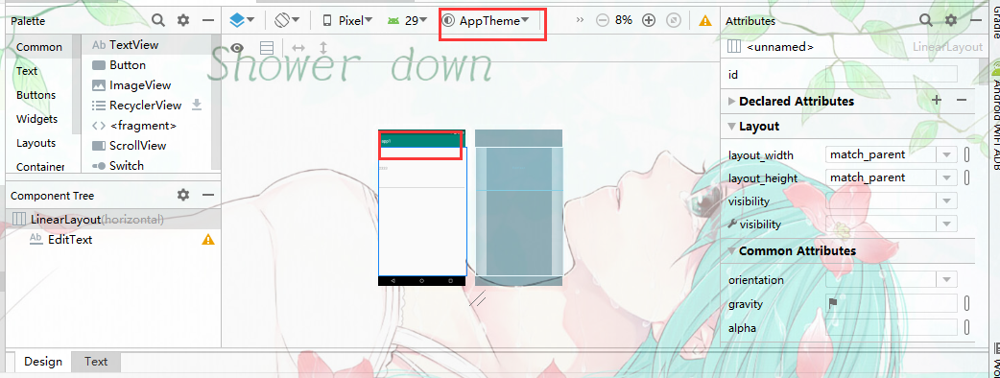

# values/【字符串资源】

包含字符串、整型数和颜色等简单值的 XML 文件。

其他 `res/` 子目录中的 XML 资源文件会根据 XML 文件名定义单个资源，而 `values/` 目录中的文件可描述多个资源。对于此目录中的文件，`<resources>` 元素的每个子元素均会定义一个资源。

例如，`<string>` 元素会创建 `R.string` 资源，`<color>` 元素会创建 `R.color` 资源。

由于每个资源均使用自己的 XML 元素进行定义，因此您可以随意命名文件，并在某个文件中放入不同的资源类型。但是，您可能需要将独特的资源类型放在不同的文件中，使其一目了然。

例如，对于可在此目录中创建的资源，下面给出了相应的文件名约定：arrays.xml：资源数组（[类型数组](https://developer.android.google.cn/guide/topics/resources/more-resources#TypedArray)）。colors.xml：[颜色值](https://developer.android.google.cn/guide/topics/resources/more-resources#Color)。dimens.xml：[尺寸值](https://developer.android.google.cn/guide/topics/resources/more-resources#Dimension)。strings.xml：[字符串值](https://developer.android.google.cn/guide/topics/resources/string-resource)。styles.xml：[样式](https://developer.android.google.cn/guide/topics/resources/style-resource)。请参阅[字符串资源](https://developer.android.google.cn/guide/topics/resources/string-resource)、[样式资源](https://developer.android.google.cn/guide/topics/resources/style-resource)和[更多资源类型](https://developer.android.google.cn/guide/topics/resources/more-resources)。


## dimens.xml【尺寸资源】

dimens.xml用于存放定义的尺寸资源也就是`R.dimens/`

新版AS已经不在自动生成dimens目录要手动创建

**手动创建资源目录**

使用`<dimen>`元素定义尺寸资源

```xml
<?xml version="1.0" encoding="utf-8"?>
<resources>
    <dimen name="font_size">20sp</dimen>
    <dimen name="padding_top">50dp</dimen>
</resources>
```

**调用；**

- xml

```xml
@dimen/尺寸资源名
```

- java

```java
getResoutces().getDimen(R.dimen.尺寸资源名)
```


## styles.xml【主题资源】

使用主题资源我们可以为一个组件/控件定义一系列样式。

通过设计视图可以快速修改主题【安卓自带的】




#### 自定义主题

##### 为`application`/`activity`

AS自动生成的主题资源在res——values——styles.xml文件

`<style>`标记进行设置 使用item设置每一项样式，使用`parent="@style/AppTheme"`属性可以继承已定义的样式,这里继承了AppTheme

```xml
<style name="My_Theme" parent="@style/AppTheme">
        <item name="actionBarSize">10dp</item>
        <item name="colorPrimaryDark">#1976D2</item>
    </style>
```

**使用；**

- xml

在安卓清单文件中在`application`标记下添加主题属性可以我所有的活动设置主题。 也可以通过主题属性为单独的`activity`设置主题。

```xml
 <application
              android:theme="@style/主题名"> 
</application> 
```

- java中使用

```java
setTheme(R.style.主题名);
setContentView(R.layout.activity_main); //在此方法之前设置主题
```

#### 为控件/组件

依然是在res——values——styles.xml文件下用`<style>`标记，使用`<item>`作为style的子标记添加样式。

```xml
<style name="title">
        <!--name属性的值都是使用的Android定义好的-->
        <!--设置字体大小-->
        <item name="android:textSize">20sp</item>
        <!--设置字体颜色-->
        <item name="android:textColor">#FFF000</item>
    </style>
```

**使用；**

- xml使用

```xml
style="@style/样式名" //通过style属性给组件指定样式。
```

