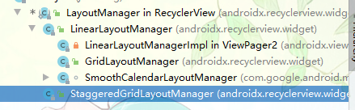
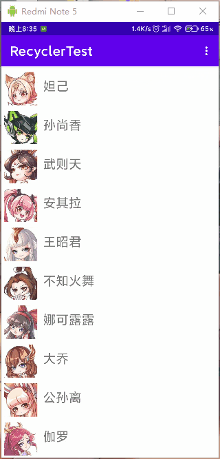
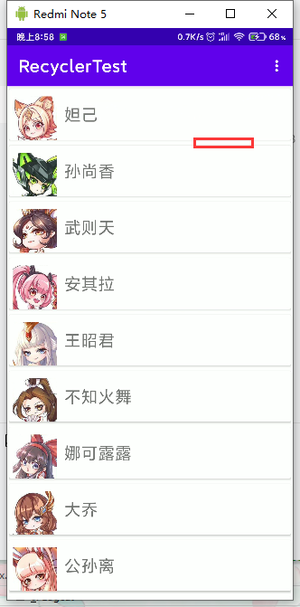
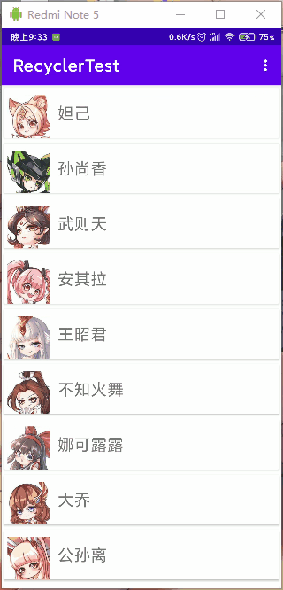
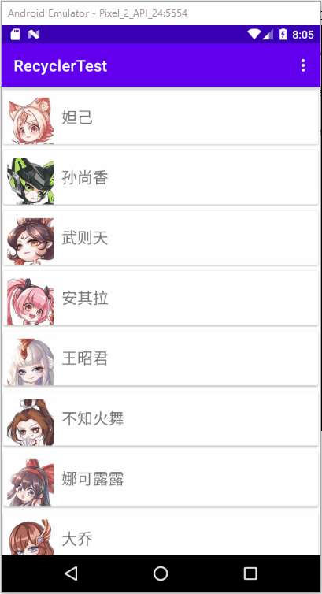

## RecyclerView

一个更强大的列表试图控件。支持传统的ListView和GridView视图，也支持瀑布流效果。

## 实现ListView效果

### 普通ListViewUI


**步骤零；**

布局文件添加`recyclerview`控件。并从java后台获取控件

```xml
<?xml version="1.0" encoding="utf-8"?>
<RelativeLayout xmlns:android="http://schemas.android.com/apk/res/android"
        xmlns:app="http://schemas.android.com/apk/res-auto"
        xmlns:tools="http://schemas.android.com/tools"
        android:layout_width="match_parent"
        android:layout_height="match_parent"
        tools:context=".MainActivity">

<!--   添加recyclerview -->
    <androidx.recyclerview.widget.RecyclerView
            android:id="@+id/recycler_view"
            android:layout_width="match_parent"
            android:layout_height="match_parent"
            />

</RelativeLayout>
```

- 获取控件. 

````java
findViewById(R.id.recycler_view);
````

**步骤一；**

准备模拟数据。

- 装备一个条目Bean类，

  ```java
  package com.xuelingmiao.recyclertest.bean;
  
  public class ItemBean {
      public int image;
      public String title;
  }
  
  ```

- 准备数据源，就是Bean类所需要的数据。这里使用数组来模拟。

  ```java
  package com.xuelingmiao.recyclertest.bean;
  
  import com.xuelingmiao.recyclertest.R;
  
  public class Datas {
      //图片数组
      public static int[] picArray = new int[]{
              R.mipmap.pic_1,
              R.mipmap.pic_2,
              R.mipmap.pic_3,
              R.mipmap.pic_4,
              R.mipmap.pic_5,
              R.mipmap.pic_6,
              R.mipmap.pic_7,
              R.mipmap.pic_8,
              R.mipmap.pic_9,
              R.mipmap.pic_10,
              R.mipmap.pic_11,
      };
  
      //tile 数组
      public static String[] titleArray = new String[]{
              "妲己",
              "孙尚香",
              "武则天",
              "安其拉",
              "王昭君",
              "不知火舞",
              "娜可露露",
              "大乔",
              "公孙离",
              "伽罗",
              "小乔",
      };
  }
  
  ```

- 装填数据,把数据添加到Bean类

  ```java
  /**
       * 准备模拟数据
       */
      private void initData (){
          /*----------装填数据-------------------*/
          beanList = new ArrayList<>();
          int length = Datas.picArray.length;
          for (int i = 0; i < length; i++) {
              ItemBean itemBean = new ItemBean();
              itemBean.image = Datas.picArray[i];
              itemBean.title = Datas.titleArray[i];
              beanList.add(itemBean);
          }
      }
  ```

  

**步骤二；**

创建适配器

1. 创建一个类继承`RecyclerView.Adapter`,泛型为`ListViewAdapter.InnerHolder`类型。的适配器类。

   ```java
   public class ListViewAdapter extends RecyclerView.Adapter<ListViewAdapter.InnerHolder> {
       
       ……
       
   }
   ```

   

2. 创建 `InnerHolder ` 内部类，继承子`RecyclerView.ViewHolder`,并创建`public InnerHolder(@NonNull View itemView)` 构造方法

   ```java
    public class InnerHolder extends RecyclerView.ViewHolder {
   
           public InnerHolder(@NonNull View itemView) {
               super(itemView);
           }
   }
   
   ```

   

3. 重写以下三个方法

   - `public InnerHolder onCreateViewHolder(@NonNull ViewGroup parent, int viewType)` 用于创建适配器类内部的holder类的。
   - `public void onBindViewHolder(@NonNull InnerHolder holder, int position)` 绑定适配器类内部的Holder类。一般用于设置数据的。
   - `public int getItemCount()` 返回总条目数

   ```java
       /**
        * 用于创建条目的View，实际就是返回内部类的InnerHolder类。
        * @param parent
        * @param viewType
        * @return
        */
       @NonNull
       @Override
       public InnerHolder onCreateViewHolder(@NonNull ViewGroup parent, int viewType) {
           return null;
       }
   
   /**
        * 绑定适配器类内部的Holder类。一般用于设置数据的。
        * @param holder
        * @param position
        */
       @Override
       public void onBindViewHolder(@NonNull InnerHolder holder, int position) {
   
       }
   
       /**
        * 返回条目个数
        * @return
        */
       @Override
       public int getItemCount() {
           return 0;
       }
   ```

   

4. 创建适配器类的构造方法。参数类型为ItemBean的List

   ```java
   public class ListViewAdapter extends RecyclerView.Adapter<ListViewAdapter.InnerHolder> {
      
       private final List<ItemBean> mData;
       //构造方法
   	public ListViewAdapter(List<ItemBean> data){
           this.mData = data;
       }
       
   } 
   
   ```

5. 处理适配器类的`getItemCount` 方法

   ```java
   /**
        * 返回总条目数
        * @return
        */
       @Override
       public int getItemCount() {
          	//返回条目数
           if (mData != null) {
               return mData.size();
           }
           return 0;
       }
   ```

6. 处理适配器类的`onCreateViewHolder`方法

   - 准备条目UI的l布局xml文件（item_list_veiw.xml）。

     

     ```xml
     <?xml version="1.0" encoding="utf-8"?>
     <RelativeLayout xmlns:android="http://schemas.android.com/apk/res/android"
             android:layout_width="match_parent"
             android:layout_height="60dp">
         <ImageView
                 android:id="@+id/itme_list_pic"
                 android:layout_width="60dp"
                 android:layout_height="60dp"
                 android:src="@mipmap/pic_1"
                 android:layout_marginLeft="5dp"/>
         <TextView
                 android:id="@+id/itme_list_title"
                 android:layout_width="wrap_content"
                 android:layout_height="wrap_content"
                 android:text="妲己"
                 android:textSize="20sp"
                 android:layout_toRightOf="@+id/itme_list_pic"
                 android:layout_centerVertical="true"
                 android:layout_marginLeft="10dp"
                 />
     
     </RelativeLayout>
     ```

   - 创建并返回内部的InnerHolder对象

     ```java
         /**
          * 用于创建条目的View，实际就是返回内部类的InnerHolder类。
          * @param parent
          * @param viewType
          * @return
          */
         @NonNull
         @Override
         public InnerHolder onCreateViewHolder(@NonNull ViewGroup parent, int viewType) {
             //构建itemView对象
             View view = View.inflate(parent.getContext(), R.layout.item_list_veiw,null);
             // 传入构建的View
             return new InnerHolder(
                 view);
         }
     ```

7. 处理适配器类中的`onBindViewHolder`方法

   - 从适配器内部类的构造方法中查找条目中要变更数据的控件。并设置为全局变量

     ```java
     public class InnerHolder extends RecyclerView.ViewHolder {
     		// 要变更数据的控件
             private ImageView pic;
             private TextView title;
     
             public InnerHolder(@NonNull View itemView) {
                 super(itemView);
                 //查找条目控件
                 pic = itemView.findViewById(R.id.itme_list_pic);
                 title = itemView.findViewById(R.id.itme_list_title);
             }
     
       
     
     	}
     ```

     

   - 从适配器内部类中创建`setData()` 方法，用来设置数据，形参类型为条目Bean类型，这里就是我们前边创建的ItemBean类。为查找到的控件设置数据。

     ```java
     /**
              * 设置数据方法
              *
              * @param itemBean 数据源Bean类对象
              */
             public void setData(ItemBean itemBean) {
                 //开始设置数据
                 mPic.setImageResource(itemBean.image);
                 mTitle.setText(itemBean.title);
             }
     ```

   - 到适配器类的`onBindViewHolder`方法去调用此设置方法。

     ```java
      /**
          * 绑定适配器类内部的Holder类。一般用于设置数据的。
          *
          * @param holder 
          * @param position
          */
         @Override
         public void onBindViewHolder(@NonNull InnerHolder holder, int position) {
             //设置数据
             holder.setData(mData.get(position));
     
         }
     ```

   适配器类完整代码参考；

   ```java
   package com.xuelingmiao.recyclertest.adapter;
   
   import android.view.View;
   import android.view.ViewGroup;
   import android.widget.ImageView;
   import android.widget.TextView;
   
   import androidx.annotation.NonNull;
   import androidx.recyclerview.widget.RecyclerView;
   
   import com.xuelingmiao.recyclertest.R;
   import com.xuelingmiao.recyclertest.bean.ItemBean;
   
   import java.util.List;
   
   public class ListViewAdapter extends RecyclerView.Adapter<ListViewAdapter.InnerHolder> {
   
       private final List<ItemBean> mData;
   
       public ListViewAdapter(List<ItemBean> data) {
           this.mData = data;
       }
   
       /**
        * 用于创建条目的View，实际就是返回内部类的InnerHolder类。
        *
        * @param parent
        * @param viewType
        * @return
        */
       @NonNull
       @Override
       public InnerHolder onCreateViewHolder(@NonNull ViewGroup parent, int viewType) {
           //构建itemView对象
           View view = View.inflate(parent.getContext(), R.layout.item_list_veiw, null);
           // 传入构建的View
           return new InnerHolder(view);
       }
   
       /**
        * 绑定适配器类内部的Holder类。一般用于设置数据的。
        *
        * @param holder
        * @param position
        */
       @Override
       public void onBindViewHolder(@NonNull InnerHolder holder, int position) {
           //设置数据
           holder.setData(mData.get(position));
   
       }
   
       /**
        * 返回总条目数
        *
        * @return
        */
       @Override
       public int getItemCount() {
           if (mData != null) {
               return mData.size();
           }
           return 0;
       }
   
       public class InnerHolder extends RecyclerView.ViewHolder {
   
           private ImageView mPic;
           private TextView mTitle;
   
           public InnerHolder(@NonNull View itemView) {
               super(itemView);
               //查找条目控件
               mPic = itemView.findViewById(R.id.itme_list_pic);
               mTitle = itemView.findViewById(R.id.itme_list_title);
           }
   
           /**
            * 设置数据方法
            *
            * @param itemBean 数据源Bean类对象
            */
           public void setData(ItemBean itemBean) {
               //开始设置数据
               mPic.setImageResource(itemBean.image);
               mTitle.setText(itemBean.title);
           }
   
       }
   }
   
   ```

**步骤三；**

为RecyclerView设置样式，有`RecyclerView.LayoutManager` 抽象类来管理，其实现类如下图，分别对应这ListView布局GridView布局和瀑布流布局。. 



```java
 /**
     * 准备模拟数据
     */
    private void initData (){
        /*----------装填数据-------------------*/
			.....
        /*-----------设置布局管理器也就是RecyclerView样式---------------------------*/
        LinearLayoutManager linearLayoutManager = new LinearLayoutManager(MainActivity.this);
        //设置布局管理器
        mRecyclerView.setLayoutManager(linearLayoutManager);
    }
```

**步骤四；**

5. 使用适配器

   ```java
       /**
        * 准备模拟数据
        */
       private void initData (){
           /*----------装填数据-------------------*/
        		……
           /*-------------创建适配器-------------------------*/
           // 实例化适配器
           ListViewAdapter mListViewAdapter = new ListViewAdapter(beanList);
           
       }
   ```

6. 为RecyclerView设置适配器。

     ```java
         /**
          * 准备模拟数据
          */
         private void initData (){
             /*----------装填数据-------------------*/
            	......
             /*-------------创建适配器-------------------------*/
             // 实例化适配器
             .....
             //设置适配器
             mRecyclerView.setAdapter(mListViewAdapter);
         }
     ```

   - 在MainActivity的`onCreate` 方法内调用`initData()`方法。

     ```java
      @Override
         protected void onCreate(Bundle savedInstanceState) {
             super.onCreate(savedInstanceState);
             setContentView(R.layout.activity_main);
     
             //查找控件
             mRecyclerView = findViewById(R.id.recycler_view);
     		//调用初始数据方法。
             initData();
     
         }
     ```

### 控制显示方式

通过LinearLayoutManager类的方法来改变。

- `setOrientation(@RecyclerView.Orientation int orientation)` 设置显示方向
  - 参数
  - `int orientation`  
    - `LinearLayoutManager.HORIZONTAL` 水平显示。
    - `LinearLayoutManager.VERTICAL` 垂直显示
- `setReverseLayout(boolean reverseLayout)` 是否反向显示
  - 参数
    - `boolean reverseLayout`
      - true 反向显示
      - false 不反向显示

**参考示例；**

```java
 /**
     * 以LIstView方式显示
     * @param isVertical 是否水平显示
     * @param isReverse 是否反向显示
     */
    private void showList(boolean isVertical,boolean isReverse) {
        /*-----------设置布局管理器也就是RecyclerView样式---------------------------*/
        LinearLayoutManager linearLayoutManager = new LinearLayoutManager(MainActivity.this);
        //设置显示方向
        linearLayoutManager.setOrientation(isVertical ? LinearLayoutManager.VERTICAL : LinearLayoutManager.HORIZONTAL);
        //是否反向显示
        linearLayoutManager.setReverseLayout(isReverse);
        //设置布局管理器
        mRecyclerView.setLayoutManager(linearLayoutManager);
        /*-------------创建适配器-------------------------*/
        // 实例化适配器
        ListViewAdapter mListViewAdapter = new ListViewAdapter(beanList);
        //设置适配器
        mRecyclerView.setAdapter(mListViewAdapter);
    }
```





### 条目分割线



使用CardView控件来完成。

打开条目布局文件。使用CardView控件包裹之前的布局。

```xml
<?xml version="1.0" encoding="utf-8"?>
<RelativeLayout xmlns:android="http://schemas.android.com/apk/res/android"
        android:layout_width="match_parent"
        android:layout_height="wrap_content"
        xmlns:app="http://schemas.android.com/apk/res-auto">

    <!--   CardView -->
    <androidx.cardview.widget.CardView
            android:layout_width="match_parent"
            android:layout_height="wrap_content"
            app:cardUseCompatPadding="true"
            android:background="#cccccc">

        <RelativeLayout
                android:layout_width="match_parent"
                android:layout_height="70dp">

            <ImageView
                    android:id="@+id/itme_list_pic"
                    android:layout_width="60dp"
                    android:layout_height="60dp"
                    android:layout_marginLeft="5dp"
                    android:layout_marginTop="10dp"
                    android:src="@mipmap/pic_1" />

            <TextView
                    android:id="@+id/itme_list_title"
                    android:layout_width="wrap_content"
                    android:layout_height="wrap_content"
                    android:layout_centerVertical="true"
                    android:layout_marginLeft="10dp"
                    android:layout_toRightOf="@+id/itme_list_pic"
                    android:text="妲己"
                    android:textSize="20sp" />
        </RelativeLayout>
    </androidx.cardview.widget.CardView>

</RelativeLayout>
```

**属性；**

- `app:cardUseCompatPadding="true"` 是否使用兼容填充


## 实现GridView效果

在ListVIew 的基础上只需更改RecyclerView的LayoutManager的方式即可。

**GridLayoutManager构造方法**

- `public GridLayoutManager(Context context, int spanCount)`
  - 参数
    - `Context context` 上上下文
    - `int spanCount`  显示列数

```java
 /*-----------设置布局管理器也就是RecyclerView样式为GridVIew---------------------------*/
        GridLayoutManager gridLayoutManager = new GridLayoutManager(MainActivity.this,2);
        //设置布局管理器
        mRecyclerView.setLayoutManager(gridLayoutManager);
```

### 控制显示方式

设置方式也是通过 GridLayoutManager的`setOrientation()`和`setReverseLayout()`方法来设置。

**参考示例；**

```java
 /**
     * 以GridView方式显示
     * @param isVertical 是否水平显示
     * @param isReverse 是否反向显示
     */
    private void showGrid(boolean isVertical,boolean isReverse){
        /*-----------设置布局管理器也就是RecyclerView样式为GridVIew---------------------------*/
        GridLayoutManager gridLayoutManager = new GridLayoutManager(MainActivity.this,2);
//        //设置显示方向
        gridLayoutManager.setOrientation(isVertical ? LinearLayoutManager.VERTICAL : LinearLayoutManager.HORIZONTAL);
//        //是否反向显示
        gridLayoutManager.setReverseLayout(isReverse);
        //设置布局管理器
        mRecyclerView.setLayoutManager(gridLayoutManager);
        /*-------------创建适配器-------------------------*/
        // 实例化适配器
        ListViewAdapter mListViewAdapter = new ListViewAdapter(beanList);
        //设置适配器
        mRecyclerView.setAdapter(mListViewAdapter);
    }
```





## 实现StaggeredGrid效果

只需要更改一下，布局方式即可。

**StaggeredGridLayoutManager**

- `public StaggeredGridLayoutManager(int spanCount, int orientation)` 构造方法。
  - 参数
    - int spanCount 显示列数
    - int orientation  显示方向

```java
/**
     * 以瀑布流形式显示
     * @param isVertical 是否垂直显示
     * @param isReverse  是否反向显示
     */
    private void showStaggered(boolean isVertical,boolean isReverse){
        //构建布局管理器
        StaggeredGridLayoutManager staggeredGridLayoutManager = new StaggeredGridLayoutManager(3,
                isVertical ? StaggeredGridLayoutManager.VERTICAL : StaggeredGridLayoutManager.HORIZONTAL);
        //是否反向显示
        staggeredGridLayoutManager.setReverseLayout(isReverse);
        //设置布局管理器
        mRecyclerView.setLayoutManager(staggeredGridLayoutManager);
        //创建适配器
        ListViewAdapter mListViewAdapter = new ListViewAdapter(beanList);
        //设置适配器
        mRecyclerView.setAdapter(mListViewAdapter);
    };

```





## 条目点击事件

### 编写回调

**创建事件回调接口；**

1. 到适配器类，定义接口。

   ```java
    public interface OnItemClickListener{
   
   }
   ```

   

2. 定义接口内部方法。要被调用者实现的方法。

   ```java
    public interface OnItemClickListener{
           void onItemClick(int position); //定义的方法
       }
   ```


**提供设置回调接口的方法；**

为外部提供一个设置事件回调接口的方法。

到适配器类，创建一个设置事件监听器的方法如`setOnItemClickListener()` 形参为上一步创建的事件回调接口，的接口类型。并把接受到的数据赋值给适配器类的成员变量。

```java
 /**
     * 设置事件回调监听器
     * @param listener 事件监听器
     */
    public void setOnItemClickListener(OnItemClickListener listener){
        this.mOnItemClicklistener = listener;
    }
```


**调用接口方法；**

在适配器类（public class InnerHolder），的内部类的设置数据方法中调用。

1. 为设置数据方法添加一个position的形参。并把其保存为成员变量，方便到查找控件方法中使用。并在此方法的调用出传递此参数。

   ```java
          /**
            * 设置数据
            *
            * @param itemBean
            */
           private void setData(ItemBean itemBean, int position) {
               this.mPosition = position;
           	// 数据绑定代码。
           }
   ```

   

2. 在内部类的构造方法中进行逻辑判断。也就是查找控件出。

   ```java
    public InnerHolder(@NonNull View itemView) {
               super(itemView);
               //查询要变更数据的控件
               .....
                //对RecyclerView的每一个itemView设置点击事件
               itemView.setOnClickListener(new View.OnClickListener() {
                   @Override
                   public void onClick(View v) {
                       //如果不等于空就设置事件回调方法
                       if (mOnItemClicklistener != null) {
                           mOnItemClicklistener.onItemClick(mPosition);
                       }
                   }
               });
   ```

   

**外部设置监听器；**

到适配器类的调用处设置设置事件监听器。

```java
 //创建适配器
        ListViewAdapter listViewAdapter = new ListViewAdapter(beanList);
        //设置适配器事件监听
        listViewAdapter.setOnItemClickListener(new ListViewAdapter.OnItemClickListener() {
            @Override
            public void onItemClick(int position) {
                //TODO 处理点击事件，后要做的事情
            }
        });
```


## 条目内子控件点击事件


## 下拉刷新


1. `SwipeRefreshLayout` 控件把`RecyclerView` 包裹起来。

   ```java
   <androidx.swiperefreshlayout.widget.SwipeRefreshLayout //下拉刷新
             android:layout_width="match_parent"
             android:layout_height="match_parent"
             android:id="@+id/refresh_layoutt">
   
       <androidx.recyclerview.widget.RecyclerView
               android:layout_width="match_parent"
               android:layout_height="match_parent"
               android:id="@+id/recycler_view"/>
     </androidx.swiperefreshlayout.widget.SwipeRefreshLayout>
   ```

   

2. java后台查找控件，设置`setOnRefreshListener()`事件监听器，去请求数据，一般使用子线程来请求数据。

   ```java
    mRefreshLayout.setOnRefreshListener(new SwipeRefreshLayout.OnRefreshListener() {
               @Override
               public void onRefresh() {
                   // 当从顶部下拉时触发此事件
                   // TODO 处理事件代码。
               }
           });
   ```

   

3. 一般事件处理逻辑代码，

   - 请求数据 （子线程完成）

   - 停止刷新
   - 更新UI

   ```java
       private void updatarefresh() {
           mRefreshLayout.setEnabled(true);    //启用下拉刷新
           mRefreshLayout.setOnRefreshListener(new SwipeRefreshLayout.OnRefreshListener() {
               @Override
               public void onRefresh() {
                   Log.i(TAG, "onRefresh: 下拉刷新");
                   /*------------准备模拟更新数据--------------------------*/
                   List<ItemBean> upDataList = new ArrayList<>();
                   for (int i = 0; i < 5; i++) {
                       ItemBean itemBean = new ItemBean();
                       itemBean.title = "新添加的数据";
                       itemBean.formNo = "SD-851-274063-3270-1198";
                       itemBean.flowTypeCnName = "业务融合开机流程";
                       itemBean.apponintTime = "2021-10-14 09:00:00";
                       itemBean.workItemId = "211856420";
                       itemBean.custom_name = "张三丰" + i;
                       upDataList.add(itemBean);
   
                   }
                   /*------------子线程更新UI--------------------------*/
   
                   ThreadManage.execute(new Runnable() {
                       @Override
                       public void run() {
                           //停止刷新
                           mRefreshLayout.setRefreshing(false);
                           mListViewAdapter.updateData(upDataList); //更新数据
                       }
                   });
   
   
   
               }
           });
       }
   ```

   

   

### SwipeRefreshLayout


**方法；**

- `setRefreshing()`  是否显示刷新进度。
- `setEnabled()` 设置控件是否可以使用。
- 


## 实现增删更

> 以下代码以LIstView章节代码的适配器类作为演示。

在适配器类，定义对应的方法来实现，对基本数据的操作，并通知RecyclerVIew的Adapter来更新UI。

```java
    /**
     * 更新数据方法
     * @param data 数据
     */
    public void updateData(List<ItemBean> data){
        this.mData = data;
        notifyDataSetChanged(); //通知数据已经更改。

    }


    /**
     * 添加新的Item
     * @param itemBean
     */
    public void addItem(ItemBean itemBean){
        //如果mData是空那么就创建一个list,不为空就添加新的项目。
        if (mData != null) {
            mData = new ArrayList<ItemBean>();
        }
        mData.add(0,itemBean);
        notifyItemInserted(0);  //通知新项目已插入
    }

    /**
     * 删除条目-
     * @param positon 要删除条目的索引
     */
    public void removeItem(int positon){
        if (mData != null || mData.isEmpty()) {
            return;
        }

        mData.remove(positon);
        notifyItemRemoved(positon); //通知条目已经删除。
    }
```


