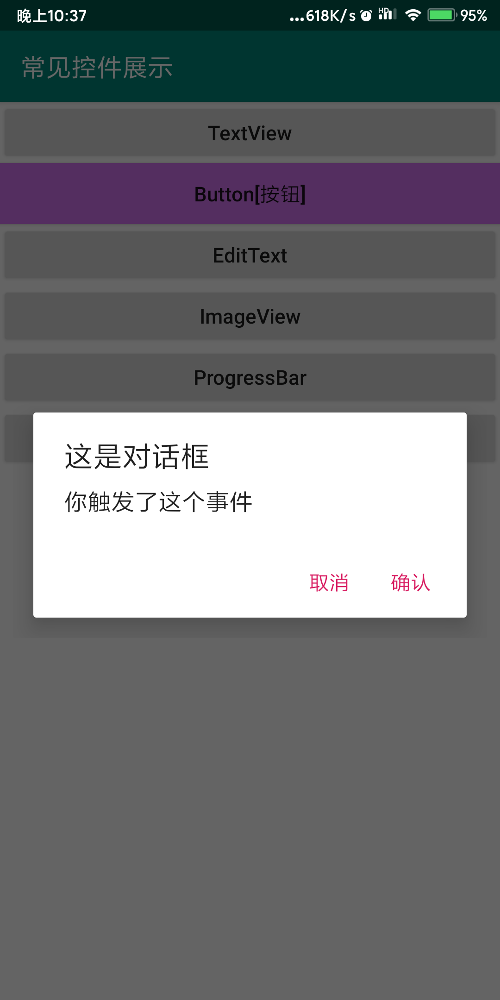
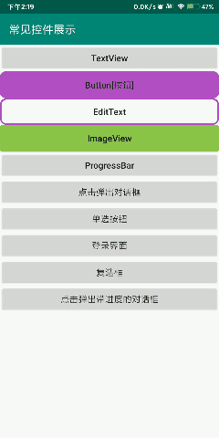

# AlertDialog【对话框】

可以在当前的界面弹出一个对话框，这个对话框是置顶于所有界面元素之上的，能够屏蔽掉其他控件的交互能力，因此AlertDialog一般都是用于提示一些非常重要的内容或者警告信息。

## 基础对话框

```java
//对话框
        Button button5 = (Button) findViewById(R.id.alert_dialog);
        button5.setOnClickListener(new View.OnClickListener() {
            @Override
            public void onClick(View view) {
                //通过AlertDialog.Builder创建一个AlertDialog的实例
                //AlertDialog.Builder参数上下问
                AlertDialog.Builder alertDialog = new AlertDialog.Builder(MainActivity.this);
                //设置dialog标题
                alertDialog.setTitle("这是对话框");
                //dialog信息
                alertDialog.setMessage("你触发了这个事件");
                //设置是否可以使用Back键取消对话框
                alertDialog.setCancelable(false);
                //调用setPositiveButton() 方法为对话框设置确定按钮的点击事件
                alertDialog.setPositiveButton("确认", new DialogInterface.OnClickListener() {
                    @Override
                    public void onClick(DialogInterface dialogInterface, int i) {
                        //执行逻辑
                    }
                });
                //调用setNegativeButton()
                //setNegativeButton()
                //按钮文字，
                alertDialog.setNegativeButton("取消", new DialogInterface.OnClickListener() {
                    @Override
                    public void onClick(DialogInterface dialogInterface, int i) {
                        //执行逻辑
                    }
                });
                //显式对话框
                alertDialog.show();

            }
        });
```



## ProgressDialog【带进度的对话框】

可以在界面上弹出一个对话框，都能够屏蔽掉其他控件的交互能力。不同的是，ProgressDialog会在对话框中显示一个进度条，一般用于表示当前操作比较耗时，让用户耐心地等待。

```java
 //带进度的对话框ProgressDialog
        Button button9 = (Button) findViewById(R.id.progress_dialog);
        button9.setOnClickListener(new View.OnClickListener() {
            @Override
            public void onClick(View view) {
                //创建一个ProgressDialog实例，传递一个上下文
                ProgressDialog progressDialog = new ProgressDialog(MainActivity.this);
                //对话框标题
                progressDialog.setTitle("进度对话框");
                //对话框内容
                progressDialog.setMessage("加载中……");
                //设置是否可以使用Back键取消对话框
                progressDialog.setCancelable(true);
                //显式这个对话框
                progressDialog.show();
                /*ProgressDialog.dismiss() //关闭对话框方法*/
            }
        });
```


