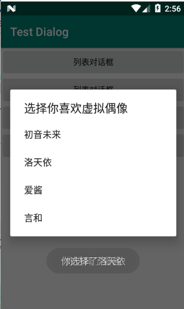
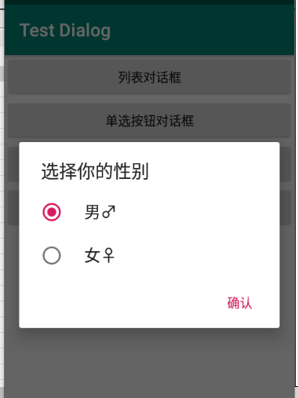
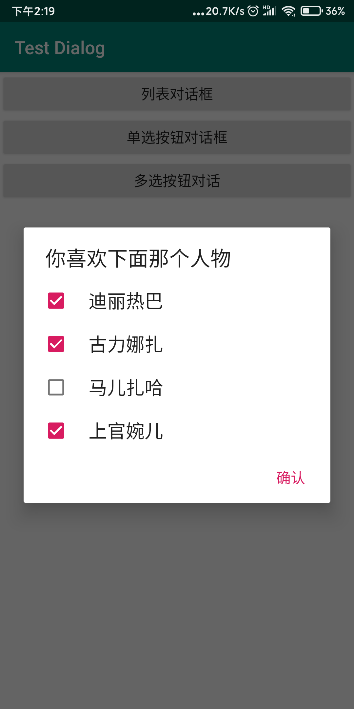

# AlertDialog【对话框】

可以在当前的界面弹出一个对话框，这个对话框是置顶于所有界面元素之上的，能够屏蔽掉其他控件的交互能力，因此AlertDialog一般都是用于提示一些非常重要的内容或者警告信息。

## 基础对话框

```java
//对话框
        Button button5 = (Button) findViewById(R.id.alert_dialog);
        button5.setOnClickListener(new View.OnClickListener() {
            @Override
            public void onClick(View view) {
                //通过AlertDialog.Builder创建一个AlertDialog的实例
                //AlertDialog.Builder参数上下问
                AlertDialog.Builder alertDialog = new AlertDialog.Builder(MainActivity.this);
                //设置dialog标题
                alertDialog.setTitle("这是对话框");
                //dialog信息
                alertDialog.setMessage("你触发了这个事件");
                //设置是否可以使用Back键取消对话框
                alertDialog.setCancelable(false);
                //调用setPositiveButton() 方法为对话框设置确定按钮的点击事件
                alertDialog.setPositiveButton("确认", new DialogInterface.OnClickListener() {
                    @Override
                    public void onClick(DialogInterface dialogInterface, int i) {
                        //执行逻辑
                    }
                });
                //调用setNegativeButton()
                //setNegativeButton()
                //按钮文字，
                alertDialog.setNegativeButton("取消", new DialogInterface.OnClickListener() {
                    @Override
                    public void onClick(DialogInterface dialogInterface, int i) {
                        //执行逻辑
                    }
                });
                //显式对话框
                alertDialog.show();

            }
        });
```


## ProgressDialog【带进度的对话框】

可以在界面上弹出一个对话框，都能够屏蔽掉其他控件的交互能力。不同的是，ProgressDialog会在对话框中显示一个进度条，一般用于表示当前操作比较耗时，让用户耐心地等待。

```java
 //带进度的对话框ProgressDialog
        Button button9 = (Button) findViewById(R.id.progress_dialog);
        button9.setOnClickListener(new View.OnClickListener() {
            @Override
            public void onClick(View view) {
                //创建一个ProgressDialog实例，传递一个上下文
                ProgressDialog progressDialog = new ProgressDialog(MainActivity.this);
                //对话框标题
                progressDialog.setTitle("进度对话框");
                //对话框内容
                progressDialog.setMessage("加载中……");
                //设置是否可以使用Back键取消对话框
                progressDialog.setCancelable(true);
                //显式这个对话框
                progressDialog.show();
                /*ProgressDialog.dismiss() //关闭对话框方法*/
            }
        });
```


## 列表对话框



```java
AlertDialog.Builder alertDialog = new AlertDialog.Builder(MainActivity.this); //实例对话框对象
                    final String[] items = new String[]{
                        "初音未来","洛天依","爱酱","言和"
                    };
                    //设置标题
                    alertDialog.setTitle("选择你喜欢虚拟偶像");
                    //设置列表项
                    //参数1 列表数据 参数2 单击事件监听器【当我们选择了某一项触发】
                    alertDialog.setItems(items, new DialogInterface.OnClickListener() {
                        @Override
                        public void onClick(DialogInterface dialog, int which) {
                            String str = items[which]; //获得选中的项，which表示当前选中项的索引。
                            Toast.makeText(MainActivity.this, "你选择了"+str, Toast.LENGTH_SHORT).show();
                        }
                    });
                   alertDialog.create().show();  //创建并显式对话框
```


## 单选按钮对话



```java
                    final String[] items1 = new String[]{
                        "男♂","女♀"
                    };

                    AlertDialog.Builder builder = new AlertDialog.Builder(MainActivity.this);
                    builder.setTitle("选择你的性别");
                    //设置单选列表
                    //参数1 列表项资源 参数2 默认被选中的项int 参数3 监听器
                    builder.setSingleChoiceItems(items1, 0, new DialogInterface.OnClickListener() {
                        //witch 表示当前选中项的索引
                        @Override
                        public void onClick(DialogInterface dialog, int which) {
                            Toast.makeText(MainActivity.this, "你选择了" + items1[which], Toast.LENGTH_SHORT).show();
                        }
                    });
                    //设置一个确认按钮
                    //参数1 按钮显式的文本 参数2 监听器
                builder.setPositiveButton("确认",null);
                builder.create().show();//创建并显式对话框。
```

## 多选按钮




```java
//列表资源
final String[] items2 = new String[]{
    "迪丽热巴","古力娜扎","马儿扎哈","上官婉儿"
};
//存放个列表项的选中状态。
final boolean[] isCheckeds = new boolean[]{
    true,true,false,false
};

AlertDialog.Builder builder1 = new AlertDialog.Builder(MainActivity.this);
builder1.setTitle("你喜欢下面那个人物");
//设置多选列表
//参数1 列表项数 参数2 那些列表项被选中[注意时boolean类数组不是Boolean对象数组] 参数3 监听器对象
builder1.setMultiChoiceItems(items2, isCheckeds, new DialogInterface.OnMultiChoiceClickListener() {
    @Override
    public void onClick(DialogInterface dialog, int which, boolean isChecked) {
        isCheckeds[which] = isChecked;  //改变选中项的状态。
        //which 当前选项的索引，isChecked对应索引的选项状态boolean 类型
    }
});

//添加确认按钮。

builder1.setPositiveButton("确认", new DialogInterface.OnClickListener() {
    @Override
    public void onClick(DialogInterface dialog, int which) {
        String str = ""; //记录当前选中项内容
        //检测那些列表项被选中。
        for (int i = 0; i < isCheckeds.length; i++) {
            if (isCheckeds[i]){
                str += " "+items2[i]; //如果是被选中就保存到str中。
            }
        }

        //展示结果
        Toast.makeText(MainActivity.this, "你选择了"+str, Toast.LENGTH_SHORT).show();
    }
});
builder1.create().show(); //创建并显式对话
```


## 自定义布局对话

```java
//创建一个对话框构造器
      AlertDialog.Builder alertDialog = new AlertDialog.Builder(this);
      alertDialog.setView(R.layout.alert_dialog); //指定布局文件。
      alertDialog.show(); //显式对话框
```


