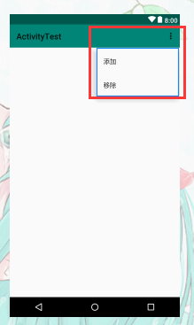
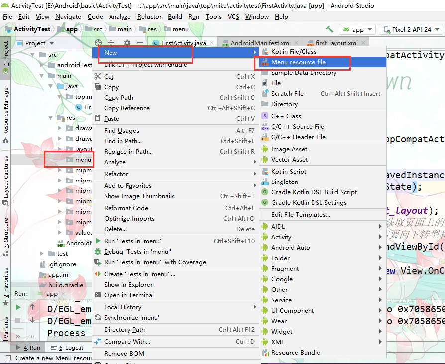

## Menu【菜单】



- `app\src\main\res`以下路径新建menu目录
- 从menu目录新建Menu resource file




- 编写menu的XML

  ```xml
  <?xml version="1.0" encoding="utf-8"?>
  <menu xmlns:android="http://schemas.android.com/apk/res/android">
      <!-- item菜单项 -->
      <item
          android:id="@+id/add_item"//选项的id
          android:title="添加"//项名
      />
      <item
          android:id="@+id/remove_item"
          android:title="移除"
      />
  </menu>
  ```

- 重写onCreateOptionsMenu方法添加菜单。

  ```java
  package top.miku.activitytest;
  
  import androidx.appcompat.app.AppCompatActivity;
  
  import android.os.Bundle;
  import android.view.Menu;
  import android.view.View;
  import android.widget.Button;
  import android.widget.Toast;
  
  public class FirstActivity extends AppCompatActivity {
      /*————————————绑定活动————————————————*/
      @Override
      protected void onCreate(Bundle savedInstanceState) {
          super.onCreate(savedInstanceState);
          //引入布局
          setContentView(R.layout.first_layout);
  
      }
      /*——————————创建Menu菜单——————————*/
      @Override
      public boolean onCreateOptionsMenu(Menu menu) {
          /*
          * 1.通过getMenuInflater() 方法能够得到MenuInflater 对象
          * 2.再调用它的inflate() 方法就可以给当前活动创建菜单了。
          * 3.inflate() 方法接收两个参数，
          *     - 第一个参数用于指定我们通过哪一个资源文件来创建菜单。
          *     - 第二个参数用于指定我们的菜单项将添加到哪一个Menu对象当中，
          *   这里直接使用onCreateOptionsMenu() 方法中传入的menu 参数。
          *     - 然后给这个方法返回true ，表示允许创建的菜单显示出来，如果返回了false ，创建的菜单将无法显示。
          * */
          getMenuInflater().inflate(R.menu.main,menu);
          return true;//菜单是否可见
      }
  
  }
  ```

- 给菜单选项注册事件监听器

  ```java
      /*——————————给菜单注册事件在绑定活动闭包外面书写————————————*/
  
      @Override
      //@NonNull注解用在指明一个参数，字段或者方法的返回值不可以为null
      public boolean onOptionsItemSelected(@NonNull MenuItem item) {
          //item.getItemId()获取触发事件的id名
          switch (item.getItemId()){
              case R.id.add_item:
                  Toast.makeText(this,"你点击的是添加菜单",Toast.LENGTH_SHORT).show();
                  break;
              case R.id.remove_item:
                  Toast.makeText(this, "你点击的是删除菜单", Toast.LENGTH_LONG).show();
                  break;
              default:
          }
          return true;
      }
  ```