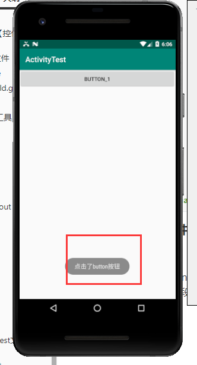

# Toast【气泡消息】

Toast是Android系统提供的一种非常好的提醒方式，在程序中可以使用它将一些短小的信息通知给用户，这些信息会在一段时间后自动消失，并且不会占用任何屏幕空间



**示例；**

```java
package top.miku.activitytest;

import androidx.appcompat.app.AppCompatActivity;

import android.os.Bundle;
import android.view.View;
import android.widget.Button;
import android.widget.Toast;

public class FirstActivity extends AppCompatActivity {

    @Override
    protected void onCreate(Bundle savedInstanceState) {
        super.onCreate(savedInstanceState);
        //引入布局
        setContentView(R.layout.first_layout);
        //获取元素 findViewById通过id获取页面上的元素
        //返回的是一个View 对象，我们需要向下转型将它转成Button 对象
        Button button1 = (Button) findViewById(R.id.button_1);
        //给元素注册点击事件
        button1.setOnClickListener(new View.OnClickListener() {
            @Override
            public void onClick(View view) {
                //使用Toast通知
                /* 使用Toast.makeTest静态方法创建一个Toast对象,调用其show()方法显示
                *  参数
                *   - context 上下文，由于活动本身就是一个Context 对象，因此这里直接传入FirstActivity.this
                *   - text 要显示的内容
                *   - Toast 显示的时长 默认两个可选值 Toast.LENGTH_SHORT = 长度短 | Toast.LENGTH_LONG = 长度长
                *
                * */
                Toast.makeText(FirstActivity.this, "点击了button按钮", Toast.LENGTH_SHORT).show();
            }
        });

    }

}
```

## 解决MIUI自带应用名问题

不使用链式编程

```java
Toast toast = Toast.makeText(MyEditText.this, null, Toast.LENGTH_SHORT);
        toast.setText("文本");
        toast.show();
```

