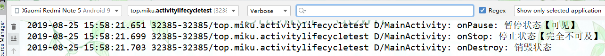

# Activity【活动】
## 介绍
活动（Activity）是最容易吸引用户的地方，它是一种可以包含用户界面的组件，主要用于和用户进行交互。一个应用程序中可以包含零个或多个活动，但不包含任何活动的应用程序很少见，谁也不想让自己的应用永远无法被用户看到吧？

## 使用AS手动创建一个活动

### 创建不包含活动的项目；

- 创建一个项目

  启动AS，在欢迎界面。选择启动新的AS项目。

  

  

- 不带活动

  

- 配置项目

  

  

- 在`app/src/main/java/top.miku.activitytest`创建一个活动命名规则；活动名称+Activity

  依次选择

  

- 这里暂时不创建布局文件


项目中的任何活动都应该重写Activity的`onCreate()`方法，而目前我们的FirstActivity中已经重写了这个方法，这是由Android Studio自动帮我们完成的，代码如下所示：

```java
package top.miku.activitytest;

import androidx.appcompat.app.AppCompatActivity;

import android.os.Bundle; //向下兼容

public class FirstActivity extends AppCompatActivity {

    @Override
    protected void onCreate(Bundle savedInstanceState) {
        super.onCreate(savedInstanceState);
    }
}
```

### 创建和加载布局xml

- 在`app/src/main/res`目录创建layout目录

  

  

- 接着在layout目录下创建first_layout.xml 命名规则activity_活动名称

  

  


- 编辑布局文件，添加一个button

  ```xml
  <?xml version="1.0" encoding="utf-8"?>
  <LinearLayout xmlns:android="http://schemas.android.com/apk/res/android"
      android:orientation="vertical" android:layout_width="match_parent"
      android:layout_height="match_parent">
      <!-- 定义一个button控件 -->
      <Button
          android:layout_width="match_parent" //宽度 match_parent继承子父级
          android:layout_height="wrap_content"//高度 wrap_content刚好包裹里面的内容
          android:id="@+id/button_1" //给按钮添加一个id属性
          android:text="Button_1"//按钮中显示的内容
          />
  </LinearLayout>
  ```

- 到`FirstActivity.java`文件中设置布局文件

  ```java
  package top.miku.activitytest;
  
  import androidx.appcompat.app.AppCompatActivity;
  
  import android.os.Bundle;
  
  public class FirstActivity extends AppCompatActivity {
  
      @Override
      protected void onCreate(Bundle savedInstanceState) {
          super.onCreate(savedInstanceState);
          setContentView(R.layout.first_layout);//引入布局
      }
  }
  ```

### 注册活动

在`AndroidManifest`文件中注册活动这种注册都叫静态注册。

- 打开`app/src/main/AndroidManifest.xml`中注册活动【一般IDE会自动注册】

  ```xml
  <?xml version="1.0" encoding="utf-8"?>
  <manifest xmlns:android="http://schemas.android.com/apk/res/android"
      package="top.miku.activitytest"> //package=指定包
  
      <application
          android:allowBackup="true"
          android:icon="@mipmap/ic_launcher"
          android:label="@string/app_name"
          android:roundIcon="@mipmap/ic_launcher_round"
          android:supportsRtl="true"
          android:theme="@style/AppTheme">
          <!-- 注册一个活动 -->
          //android:name指定要注册的活动因为外层已经声明了其所在包所以这里可以忽略直接写.FirstActivity
          //android:label 指定活动标题
          <activity android:name=".FirstActivity" android:label="@string/app_name">
              <!-- 把当前活动设置为主活动【程序启动的第一个活动】 -->
                <intent-filter>
                  <!-- 暂时固定写法两行声明 -->
                  <action android:name="android.intent.action.MAIN"></action>
                  <category android:name="android.intent.category.LAUNCHER" />
              </intent-filter>
          </activity>
      </application>
  
  </manifest>
  ```


## 以类的方式创建活动

1. 在包下创建一个class并继承AppCompatActivity

   
   
2. 在layout文件下新建布局文件。

   

3. 到class中去重写`protected void onCreate(Bundle bundle)`方法

   ```java
   package top.miku.uiwidgettest;
   
   import android.os.Bundle;
   
   import androidx.appcompat.app.AppCompatActivity;
   
   public class Test extends AppCompatActivity {
      @Override
      protected void onCreate(Bundle bundle) {
          super.onCreate(bundle);
          //绑定布局文件
          setContentView(R.layout.activity_test);
      }
   }
   ```

4. 到AndroidManifest.xml文件中注册这个活动

   ```xml
    <activity
                   android:name=".Test" //活动名
                   android:label="测试"/>
   ```


## 启动Activity


Activity有两种启动方式，一是作为app的主activity启动。二是被其他activity启动。

### 主启动activity

在AndroidManifest.xml注册活动时添加`intent-filter`标记

```xml
 <activity android:name=".MainActivity">
            <!-- 设置为主活动 -->
            <intent-filter>
                <!-- 指定响应的动作名 android.intent.action.MAIN意思是作为app的主启动活动-->
                <action android:name="android.intent.action.MAIN" />
                <!-- 在什么环境下动作才会被响应 -->
                <category android:name="android.intent.category.LAUNCHER" />
            </intent-filter>
        </activity>
```

### 启动其它活动

```java
package top.miku.testactivity;

import androidx.appcompat.app.AppCompatActivity;

import android.content.Intent;
import android.os.Bundle;
import android.view.View;
import android.widget.Button;

public class MainActivity extends AppCompatActivity {

    @Override
    protected void onCreate(Bundle savedInstanceState) {
        super.onCreate(savedInstanceState);
        setContentView(R.layout.activity_main);

        Button btn1 = (Button) findViewById(R.id.new_activity);

        btn1.setOnClickListener(new View.OnClickListener() {
            @Override
            public void onClick(View view) {
                //实例intent对象，
                //参数1 packageContext 【上下文对象】和MainActivity有继承关系所以可以直接使用子类。
                //参数2 要启动的活动【活动名+.class】
                Intent intent = new Intent(MainActivity.this, NewActivity.class);
                //使用startActivity方法启动这个活动参数为intent
                startActivity(intent);
            }
        });
    }
}
```

### 关闭活动

调用`finish();`方法关闭活动【销毁活动】

## Activity之间跳转

详情见[Intent【意图】](../intent/intent.md)

## Activity之间数据传递

> 也可以说是组件之间的数据传递，这里只是以Activity为例子

### 使用Bundle传值

> **参考；**
>
> Bundle类https://developer.android.google.cn/reference/android/os/Bundle?hl=en


**方法**

- `put[String](key,value)`存储要保存的数据 字符串类型。**其它类型更换[]括号中的其它类型即可**，如`putString("键名","值");`

#### 把数据传递给下一个Activity

> **注意；**
>
> 如果要想当用户按下Back键后也返回数据那么需要重写键盘回调事件。也要返回数据

从活动1传递数据到活动2

**保存数据【活动1】；**

1. `bundle.putString(key,value)`以键值对形式存放要传递的数据。
2. `intent.putExtras(bundle)`把bundle保存到intent中。当然putExtras()也可以直接传输数据

```java
  package top.miku.testbundle;

  import androidx.appcompat.app.AppCompatActivity;

  import android.content.Intent;
  import android.os.Bundle;
  import android.view.View;
  import android.widget.Button;
  import android.widget.TextView;

  public class MainActivity extends AppCompatActivity {

      @Override
      protected void onCreate(Bundle savedInstanceState) {
          super.onCreate(savedInstanceState);
          setContentView(R.layout.activity_main);

          Button send = (Button) findViewById(R.id.btn_send);


          send.setOnClickListener(new View.OnClickListener() {
              @Override
              public void onClick(View v) {
                  TextView txt = (TextView) findViewById(R.id.txt);

                  //创建Intent对象
                  Intent intent = new Intent(MainActivity.this,Main2Activity.class);

                  //实例化bundle对象
                  Bundle bundle = new Bundle();
                  //以键值对形式存放要传递的数据。
                  bundle.putString("txt",txt.getText().toString());

                  //把bundle保存到intent中。
                  intent.putExtras(bundle);
                  //启动另一个活动【活动2】
                  startActivity(intent);

              }
          });

      }
  }
```

**获取数据【活动2】；**

1. `getIntent()`获取上一个活动的Intent
2. `intent.getExtras()`获取传递来的bundle
3. `bundle.getString(key)`通过key获取存储的数据

```java
package top.miku.testbundle;

import androidx.appcompat.app.AppCompatActivity;

import android.content.Intent;
import android.os.Bundle;
import android.widget.TextView;

public class Main2Activity extends AppCompatActivity {

    @Override
    protected void onCreate(Bundle savedInstanceState) {
        super.onCreate(savedInstanceState);
        setContentView(R.layout.activity_main2);

        //获取上一个活动的Intent
        Intent intent = getIntent();

        //获取传递来的bundle
        Bundle bundle = intent.getExtras();

        //通过key获取存储的数据
        String str = bundle.getString("txt");

        //显式纯度的数据
        TextView textView = findViewById(R.id.txt2);
        textView.setTextSize(20);
        textView.setText(str+"从上个活动中获得的内容");

    }
}
```

#### 返回数据给上一个活动

调用另一个Activity并返回数据给调用者【上一个Activity】


**xml布局**

- MainActivity.xml布局

  ```xml
  <?xml version="1.0" encoding="utf-8"?>
  <LinearLayout xmlns:android="http://schemas.android.com/apk/res/android"
          xmlns:app="http://schemas.android.com/apk/res-auto"
          xmlns:tools="http://schemas.android.com/tools"
          android:layout_width="match_parent"
          android:layout_height="match_parent"
          tools:context=".MainActivity">
      <!-- 使用帧布局可以实现叠加效果 -->
      <FrameLayout 
              android:layout_width="200dp"
              android:layout_height="200dp">
  
          <ImageView
                  android:id="@+id/avatar"
                  android:layout_width="wrap_content"
                  android:layout_height="wrap_content"
                  android:src="@mipmap/myhero_36"/>
  
          <Button
                  android:id="@+id/set_avatar"
                  android:text="点击修改头像"
                  android:layout_width="match_parent"
                  android:layout_height="wrap_content"
                  android:layout_gravity="bottom"
                  android:background="#72666666"
                  android:textSize="20sp"/>
  
      </FrameLayout>
  </LinearLayout>
  ```

- 选择头像activity.xml布局

  ```xml
  <?xml version="1.0" encoding="utf-8"?>
  <LinearLayout xmlns:android="http://schemas.android.com/apk/res/android"
          xmlns:app="http://schemas.android.com/apk/res-auto"
          xmlns:tools="http://schemas.android.com/tools"
          android:layout_width="match_parent"
          android:layout_height="match_parent"
          tools:context=".ChooseAvatar">
      <!-- 稍后使用适配器添加内容 -->
      <GridView
              android:id="@+id/grid_view"
              android:layout_width="match_parent"
              android:layout_height="match_parent"
              android:numColumns="auto_fit"/>
  
  </LinearLayout>
  ```

**java代码；**

- Main.java

  - `startActivityForResult();`启动要返回数据的活动，
    - 参数1 要启动的Intent
    - 参数2 一个请求码一般是以0x开始。十六进制
  - `protected void onActivityResult(int requestCode, int resultCode, @Nullable Intent data)`  重写此方法接收返回的数据
    - 形参
      - requestCode 请求码标识是那个请求，当有多个不同的`startActivityForResult()`方法用来区分其职责从而在接收数据时对正处理。
      - resultCode 结果码 用来标识，执行后结果是否成功状态码

```java
package top.miku.testbundle2;

import androidx.annotation.Nullable;
import androidx.appcompat.app.AppCompatActivity;

import android.content.Intent;
import android.os.Bundle;
import android.view.View;
import android.widget.Button;
import android.widget.ImageView;

import java.util.Map;

public class MainActivity extends AppCompatActivity {

    @Override
    protected void onCreate(Bundle savedInstanceState) {
        super.onCreate(savedInstanceState);
        setContentView(R.layout.activity_main);

        Button button = findViewById(R.id.set_avatar);

        button.setOnClickListener(new View.OnClickListener() {
            @Override
            public void onClick(View v) {
                /*———————————————————启动要返回数据的Intent————————————————————-*/
                Intent intent = new Intent(MainActivity.this, ChooseAvatar.class);
                //使用startActivityForResult方法启动活动
                //参数1 要启动的Intent 参数2 一个请求码一般是以0x开始。
                startActivityForResult(intent,0x00);
            }
        });
    }
    /*——————————————接收返回的结果————————————————————————*/
    //重写onActivityResult方法

    @Override
    protected void onActivityResult(int requestCode, int resultCode, @Nullable Intent data) {
        super.onActivityResult(requestCode, resultCode, data);
        //判断请求码和返回码是否一致，一致后再获取数据
        if (requestCode == 0x00 && resultCode == 0x00){
            //获取返回的bundle对象
            Bundle bundle = data.getExtras();
            //通过bundle方法获取对应key的数据
            int imageId = bundle.getInt("imageId"); //获取图片资源id

            /*————————————————对获取的数据进行处理————————————————*/
            //把获取到的图片资源id设置给当前活动中ImageView控件
            ImageView imageView = findViewById(R.id.avatar);
            imageView.setImageResource(imageId);

        }
    }
}
```

选择头像.java

- 通过创建Bundle对象，把数据存入bundle中再存入Intent中

- setResult();  设置返回数据
  - 参数1 返回码一般设置和请求码一致。
  - 参数2 要返回带有数据的Intent对象

```java
  package top.miku.testbundle2;

  import androidx.appcompat.app.AppCompatActivity;

  import android.content.Context;
  import android.content.Intent;
  import android.os.Bundle;
  import android.view.View;
  import android.view.ViewGroup;
  import android.widget.AdapterView;
  import android.widget.BaseAdapter;
  import android.widget.GridLayout;
  import android.widget.GridView;
  import android.widget.ImageView;

  public class ChooseAvatar extends AppCompatActivity {

      private int[] imgs = new int[]{
              R.mipmap.myhero_36,R.mipmap.myhero_47,R.mipmap.myhero_70,
              R.mipmap.myhero_76,R.mipmap.myhero_81,R.mipmap.ic_launcher
      };
      @Override
      protected void onCreate(Bundle savedInstanceState) {
          super.onCreate(savedInstanceState);
          setContentView(R.layout.activity_choose_avatar);
          /*———————————————————展示头像——————————*/
          GridView gridView = findViewById(R.id.grid_view);
          gridView.setAdapter(new ImageAdapter(this));    //设置适配器


          /*——————————————返回数据给上一个活动——————————————————*/

          //监听选项点击事件
          gridView.setOnItemClickListener(new AdapterView.OnItemClickListener() {
              @Override
              public void onItemClick(AdapterView<?> parent, View view, int position, long id) {
                  //获取Intent对象，主要用来传递数据
                  Intent intent = getIntent();
                  //创建Bundle主要用来保存数据。
                  Bundle bundle = new Bundle();
                  //保存当前选中项的图片id
                  //position就是当前选中项的index通过这个索引就可以从图片数组中找到对应的图片资源id了
                  bundle.putInt("imageId",imgs[position]);

                  //保存到Intent
                  intent.putExtras(bundle);

                  //设置返回码,并返回intent对象
                  //参数1 返回码一般设置和请求码一致。 参数2 要返回带有数据的Intent对象
                  setResult(0x00,intent);

                  finish();   //关闭当前活动
              }
          });

      }
  //继承BaseAdapter编写自己的适配器
      public class ImageAdapter extends BaseAdapter{
          //存放实例化时构造函数中的上下文对象。
          private Context mContext;

          //带有上下文对象的构造函数
          public ImageAdapter(Context context){
              mContext = context; //保存上下文对象
          }

          //计数
          @Override
          public int getCount() {
              return imgs.length; //返回图片数组的长度
          }

          @Override
          public Object getItem(int position) {
              return null;
          }

          @Override
          public long getItemId(int position) {
              return 0;
          }

          @Override
          public View getView(int position, View convertView, ViewGroup parent) {
              ImageView imageView; //保存组件

              //进行判断
              if (convertView == null){
                  //等于空就自己创建一个image组件
                  imageView = new ImageView(mContext);    //上下文就是构造中传递的

                  //设置图片大小
                  imageView.setLayoutParams(new GridView.LayoutParams(200,200));

              }else {
                  //不等于空，就保存这个组件，强制类型转换为image组件
                  imageView = (ImageView) convertView;
              }
              //设置图片资源id
              //position 当前项的index
              imageView.setImageResource(imgs[position]);
              return imageView; //返回这个组件
          }
      }
  }
```


### 直接使用Intent传值

#### 向下一个活动传递数据

在启动活动时传递数据的思路很简单，Intent中提供了一系列`putExtra()` 方法的重载，可以把我们想要传递的数据暂存在Intent中，启动了另一个活动后，只需要把这些数据再从Intent中取出就可以了。

- `putExtra()`传递数据

  ```java
   /*—————————————————向下一个活动传递数据——————————————————*/
          Button button8 = (Button) findViewById(R.id.button_8);
          button8.setOnClickListener(new View.OnClickListener() {
              @Override
              public void onClick(View view) {
                  //定义一个string类型的变量
                  String data = "Hello SecondActivity";
                  //使用显式启动一个活动
                  Intent intent = new Intent(FirstActivity.this,SecondActivity.class);
                  //调用putExtra()方法给下一个活动传递数据
                  // 参数：是一个键值对
                  intent.putExtra("extra_data",data);
                  startActivity(intent);
              }
          });
  ```

- 到下一个活动接收数据

  ```java
  package top.miku.activitytest;
  
  import androidx.appcompat.app.AppCompatActivity;
  
  import android.content.Intent;
  import android.os.Bundle;
  import android.util.Log;
  
  public class SecondActivity extends AppCompatActivity {
      //定义一个本类的类名常量，方便下面使用
      private static final String TAG = "SecondActivity";
      @Override
      protected void onCreate(Bundle savedInstanceState) {
          super.onCreate(savedInstanceState);
          setContentView(R.layout.second_layout);
          //获取上一个活动的Intent对象
          Intent intent = getIntent();
          //通过对象获取其传递的数据getStringExtra()通过key获取value
          /*
          getStringExtra() 获取字符串类型值
          getIntExtra() 获取int类型值
          getBooleanExtra()获取布尔类型值
          ……以此类推。
          *
          * */
          String data = intent.getStringExtra("extra_data");
          //答应传递的数据
          Log.d(TAG, "onCreatEextra_data:"+data);
      }
  }
  ```

**结果；**


#### 返回数据给上一个活动

- 使用`startActivityForResult()`方法

  ```java
  /*——————————向上一个活动传递数据————————————————————————*/
          Button button9 = (Button) findViewById(R.id.button_9);
          button9.setOnClickListener(new View.OnClickListener() {
              @Override
              public void onClick(View view) {
                  Intent intent = new Intent(FirstActivity.this,SecondActivity.class);
                  //startActivityForResult()方法启动的活动，当被销毁时可以返回给当前活动数据
                  //参数；
                  // 一个intent意图对象，请假码，回调中用来判断数据来源。
                  startActivityForResult(intent,1);
              }
          });
  ```

- 到SecondActivity活动中返回数据给FirstActivity活动

  ```java
   /*——————————返回数据给上一个活动————————————————————*/
          Button button2 = (Button) findViewById(R.id.button_2);
          button2.setOnClickListener(new View.OnClickListener() {
              @Override
              public void onClick(View view) {
                  Intent intent1 = new Intent();
                  intent1.putExtra("data_return","Hello FirstActivity");
                  setResult(RESULT_OK,intent1);
                  finish();
              }
          });
  ```

- 到FirstActivity活动中重写`onActivityResult()`方法来接收数据

  ```java
   /*———————————————接收上一个活动返回的数据———————————————————————————*/
      /*
      * onActivityResult() 方法带有三个参数，
      * - 第一个参数requestCode ，即我们在启动活动时传入的请求码。
      * - 第二个参数resultCode ，即我们在返回数据时传入的处理结果。
      * - 第三个参数data ，即携带着返回数据的Intent。
      * */
      @Override
      protected void onActivityResult(int requestCode, int resultCode, @Nullable Intent data) {
          switch (requestCode) {
              // 请求代码是1
              case 1:
                  //结果 == RESULT_OK【-1】
                  if (resultCode ==  RESULT_OK){
                      //使用data接收到的Intent对象获取其值。
                      //getStringExtra根据key获取value
                      String returnData = data.getStringExtra("data_return");
                      //打印这个值。
                      Log.d("FirstActivity", returnData);
                  };
                  break;
              default:
          }
      }
  /*
  由于在一个活动中有可能调用startActivityForResult() 方法去启动很多不同的活动，每一个活动返回的数据都会回调到onActivityResult() 这个方法中，因此我们首先要做的就是通过检查requestCode 的值来判断数据来源。确定数据是从SecondActivity返回的之后，我们再通过resultCode 的值来判断处理结果是否成功。最后从data 中取值并打印出来，这样就完成了向上一个活动返回数据的工作。
  
  */
  ```

**结果；**


**问题**

- 解决用户不是通过点击按钮来结束活动无法接收返回数据问题到SecondActivity中重写`onBackPressed()`

  ```java
     /*解决用户不是通过点击按钮来结束活动无法接收返回数据问题*/
      @Override
      public void onBackPressed() {
          Intent intent1 = new Intent();
          //调用putExtra()方法把数据存储到Intent里
          //参数；
          //key和value
          intent1.putExtra("data_return","Hello FirstActivity");
          //setResult()
          // - 第一个参数用于向上一个活动返回处理结果，一般只使用RESULT_OK 或RESULT_CANCELED 这两个值，
          // - 第二个参数则把带有数据的Intent传递回去，
          setResult(RESULT_OK,intent1);
          //调用了finish() 方法来销毁当前活动。
          finish();
      }
  ```


### 传递对象类型数据

- 被传递对象要实现Android提供的可序列化接口`android.os.Parcelable;`
- 使用Intent的`public @NonNull Intent putExtra(String name, @Nullable Parcelable value)` 重载传递实现了`Parcelable`接口的对象。
- 接收数据处，获取intent通过intent的`getParcelableExtra()`方法获取传递过来的数据对象，数据接收变量类型直接使用被传递对象类型即可。然后正常使用这个对象来操作数据。

**user数据类；**

```java
package com.xuelingmiao.learnactivity;

import android.os.Parcel;
import android.os.Parcelable;

public class User implements Parcelable {
    private String name;
    private int age;
    private float height;

    protected User(Parcel in) {
        name = in.readString();
        age = in.readInt();
        height = in.readFloat();
    }

    public User() {
    }

    public static final Creator<User> CREATOR = new Creator<User>() {
        @Override
        public User createFromParcel(Parcel in) {
            return new User(in);
        }

        @Override
        public User[] newArray(int size) {
            return new User[size];
        }
    };

    public String getName() {
        return name;
    }

    public void setName(String name) {
        this.name = name;
    }

    public int getAge() {
        return age;
    }

    public void setAge(int age) {
        this.age = age;
    }

    public float getHeight() {
        return height;
    }

    public void setHeight(float height) {
        this.height = height;
    }

    @Override
    public int describeContents() {
        return 0;
    }

    @Override
    public void writeToParcel(Parcel dest, int flags) {
        dest.writeString(name);
        dest.writeInt(age);
        dest.writeFloat(height);
    }
}

```

**对象传递和接收；**

```java
/*----------传递对象【第一个界面】----------------------------*/
				Intent intent = new Intent();
               User user = new User();
                user.setName("张三");
                user.setAge(25);
                user.setHeight(167.0F);
                intent.setClass(this,ThirdActivity.class);
                intent.putExtra("user_data",user);	//存储数据
                startActivity(intent);
/*----------获取数据处理【第二个界面】----------------------------*/
  Intent intent = getIntent();
        User user_data = intent.getParcelableExtra("user_data");//获取传递的对象
        Log.d(TAG, "onCreate: name"+user_data.getName()+"age;"+user_data.getAge()+"height"+user_data.getHeight());

```


> **提示；**
>
> 如果要传递一个位图对象Bitmap那么也可以使用上面的方案，因为Bitmap实现了Parcelable接口。


### 第三方组件数据返回

调用系统相机拍照后数据返回。


1. 使用隐式Intent启动第三方组件
2. 对返回数据进行处理

```java
package com.xuelingmiao.learnactivity;

import androidx.annotation.Nullable;
import androidx.appcompat.app.AppCompatActivity;

import android.app.Activity;
import android.content.Intent;
import android.graphics.Bitmap;
import android.os.Bundle;
import android.os.Parcelable;
import android.util.Log;
import android.view.View;
import android.widget.Button;
import android.widget.ImageView;

public class PhotographActivity extends AppCompatActivity {

    private static final int REUQERY_CODE = 1;	//请求码
    private static final String TAG = "PhotographActivity";
    private Button photographBtn; //拍照按钮
    private ImageView preview; //预览组件

    @Override
    protected void onCreate(Bundle savedInstanceState) {
        super.onCreate(savedInstanceState);
        setContentView(R.layout.activity_photograph);
        initView();
    }

    private void initView() {
        photographBtn = findViewById(R.id.photograph);
        preview = findViewById(R.id.preview);

        photographBtn.setOnClickListener(new View.OnClickListener() {
            @Override
            public void onClick(View v) {
                //跳转到系统相机界面
                Intent intent = new Intent();
                /*
                	系统相机提供的intent-filter
                  <action android:name="android.media.action.IMAGE_CAPTURE" />
                   <category android:name="android.intent.category.DEFAULT" />
                 */
                //设置过滤器数据
                intent.setAction("android.media.action.IMAGE_CAPTURE");
                intent.addCategory(Intent.CATEGORY_DEFAULT);

                //启用带结果返回的启动方法
                startActivityForResult(intent, REUQERY_CODE);

            }
        });
    }

   /*
   	对返回数据进行处理
   */

    @Override
    protected void onActivityResult(int requestCode, int resultCode, @Nullable Intent data) {
        super.onActivityResult(requestCode, resultCode, data);
       	// 检测请求码是否为拍照任务请求
        if (requestCode == REUQERY_CODE) {
            // 检测结果码是否正常
            if (resultCode == Activity.RESULT_OK && data != null) {
                // 获取Intent中所包含的数据对象
                //Bitmap已经实现了序列化接口，所以我们这里可以直接获取这个对象
                Bitmap photoData = data.getParcelableExtra("data");
                preview.setImageBitmap(photoData);	//显示拍照内容
            } else if (resultCode == Activity.RESULT_CANCELED){
                Log.d(TAG, "onActivityResult: 取消或失败");
            }
        }
    }
}
```


## 活动生命周期

### 返回栈

Android中的活动是可以层叠的。我们每启动一个新的活动，就会覆盖在原活动之上，然后点击Back键会销毁最上面的活动，下面的一个活动就会重新显示出来。

其实Android是使用任务（Task）来管理活动的，一个任务就是一组存放在栈里的活动的集合，这个栈也被称作返回栈（Back Stack）。栈是一种**后进先出的数据结构**，在默认情况下，每当我们启动了一个新的活动，它会在返回栈中入栈，并处于栈顶的位置。而每当我们按下Back键或调用`finish()` 方法去销毁一个活动时，处于栈顶的活动会出栈，这时前一个入栈的活动就会重新处于栈顶的位置。系统总是会显示处于栈顶的活动给用户。


### 活动状态

每个活动在其生命周期中最多可能会有4种状态。

**运行状态；**

当一个活动位于**返回栈的栈顶时**，这时活动就处于运行状态。系统最不愿意回收的就是处于运行状态的活动，因为这会带来非常差的用户体验。

**暂停状态；**

当一个活动**不再处于栈顶位置，但仍然可见时**，这时活动就进入了暂停状态。你可能会觉得既然活动已经不在栈顶了，还怎么会可见呢？这是因为并不是每一个活动都会占满整个屏幕的，比如对话框形式的活动只会占用屏幕中间的部分区域，你很快就会在后面看到这种活动。处于暂停状态的活动仍然是完全存活着的，系统也不愿意去回收这种活动（因为它还是可见的，回收可见的东西都会在用户体验方面有不好的影响），只有在内存极低的情况下，系统才会去考虑回收这种活动。

**停止状态；**

当一个活动**不再处于栈顶位置，并且完全不可见的时候**，就进入了停止状态。系统仍然会为这种活动保存相应的状态和成员变量，但是这并不是完全可靠的，当其他地方需要内存时，处于停止状态的活动有可能会被系统回收。

**销毁状态；**

当一个活动**从返回栈中移除**后就变成了销毁状态。系统会最倾向于回收处于这种状态的活动，从而保证手机的内存充足。

### 活动的生存期

Activity类中定义了7个回调方法，覆盖了活动生命周期的每一个环节

- `onCreate()`这个方法你已经看到过很多次了，每个活动中我们都重写了这个方法，它会在活动第一次被创建的时候调用。你应该在这个方法中**完成活动的初始化操作**，比如说加载布局、绑定事件等。
- `onStart()`这个方法在活动**由不可见变为可见**的时候调用。
- `onResume()`这个方法在活动准备好**和用户进行交互同时获得了焦点**的时候调用。此时的活动一定位于**返回栈的栈顶**，并且处于**运行状态**。
- `onPause()`这个方法在**系统准备去启动或者恢复**另一个活动的时候调用。我们通常会在这个方法中将一些消耗CPU的资源释放掉，以及保存一些关键数据，但这个方法的执行速度一定要快，不然会影响到新的栈顶活动的使用。
- `onStop()`这个方法在活动**完全不可见**的时候调用。它和`onPause()`方法的主要区别在于，如果启动的新活动是一个对话框式的活动，那么`onPause()`方法会得到执行，而`onStop()`方法并不会执行。
- `onDestroy()`这个方法在活动被**销毁之前**调用，之后活动的状态将变为销毁状态。
- `onRestart()`这个方法在活动由**停止状态变为运行状态**之前调用，也就是活动被重新启动了。

#### 完整生存期

活动在`onCreate()`方法和`onDestroy()`方法之间所经历的，就是完整生存期。一般情况下，一个活动会在`onCreate()`方法中完成各种初始化操作，而在`onDestroy()`方法中完成释放内存的操作。

 onCreate()【创建状态】 => onDestroy()【销毁状态】

#### 可见生存期

活动在`onStart()`方法和`onStop()`方法之间所经历的，就是可见生存期。在可见生存期内，活动对于用户总是可见的，即便有可能无法和用户进行交互。我们可以通过这两个方法，合理地管理那些对用户可见的资源。比如在`onStart()`方法中对资源进行加载，而在`onStop()`方法中对资源进行释放，从而保证处于停止状态的活动不会占用过多内存。

 onStart()【开始状态可见】 => onStop()【停止完全不可见】

#### 前台生存期

活动在`onResume()`方法和`onPause()`方法之间所经历的就是前台生存期。在前台生存期内，活动总是处于运行状态的，此时的活动是可以和用户进行交互的，我们平时看到和接触最多的也就是这个状态下的活动。

 onResume()【运行状态】 => onPause()【暂停状态】

#### 生命周期流程图


**描述；**

- 启动活动
- `onCreate()`被调用
- `onStart()` 被调用同时活动进入可见但是不可以交互。
- `onResume()` 活动完全可见并且可以交互，获得焦点。
- 活动运行中
- `onPause()`  如果这时另一个正常活动进入前台，那么当前活动将处于停止状态会执行`onPause()`后接着执行`onStop()`，如果进入前台的不是一个活动而是一个对话框那么只会执行`onPause()`因为对话框没有完全遮挡住原活动。
  - 这时如果有一个优先级高于当前app的程序需要执行，恰好当前内存不足。应用进程被杀死。这时当用户又导航到该活动时活动在从`onCreate()` 执行。
  - 这时用户又退回到该活动，回到`onResume()`
- `onStop()` 活动不在可见
  - 这时一个优先级高于当前app的程序需要执行，恰好当前内存不足。应用进程被杀死。这时当用户又导航到该活动时活动在从`onCreate()` 执行。
  - 这时用户又导航到该活动`onRestart()`被执行接着`onStart()` 执行。
- `onDestroy()`  活动被销毁
- 活动关闭

#### 体验活动的生命周期

- 创建一个新的项目命名为ActivityLifeCycleTest【活动生命周期测试】

- 然后创建两个子活动分别命名为NormalActivity【正常活动】和DialogActivity【对话活动】

- 替换normal_layout.xml布局为以下

  ```xml
  <LinearLayout xmlns:android="http://schemas.android.com/apk/res/android"
      android:orientation="vertical"
      android:layout_width="match_parent"
      android:layout_height="match_parent">
  
      <TextView
          android:layout_width="match_parent"
          android:layout_height="wrap_content"
          android:text="This is a normal activity"
          />
  
  </LinearLayout>
  ```

- 在替换dialog_layout.xml里面的代码

  ```xml
  <LinearLayout xmlns:android="http://schemas.android.com/apk/res/android"
      android:orientation="vertical"
      android:layout_width="match_parent"
      android:layout_height="match_parent">
  
      <TextView
          android:layout_width="match_parent"
          android:layout_height="wrap_content"
          android:text="This is a dialog activity"
          />
  
  </LinearLayout>
  ```

- 修改AndroidManifest.xml中DialogActivity的属性

  ```xml
  <activity
                  android:name=".DialogActivity"
                    //为当前活动指定一个主题
                  android:theme="@style/Theme.AppCompat.Dialog">
  
          </activity>
  ```

- 替换activity_main.xml布局为以下代码

  ```xml
  <LinearLayout xmlns:android="http://schemas.android.com/apk/res/android"
      android:orientation="vertical"
      android:layout_width="match_parent"
      android:layout_height="match_parent">
  
      <Button
          android:id="@+id/start_normal_activity"
          android:layout_width="match_parent"
          android:layout_height="wrap_content"
          android:text="Start NormalActivity" />
  
      <Button
          android:id="@+id/start_dialog_activity"
          android:layout_width="match_parent"
          android:layout_height="wrap_content"
          android:text="Start DialogActivity" />
  </LinearLayout>
  ```

- 修改MainActivity.java中的代码

  ```java
  package top.miku.activitylifecycletest;
  
  import androidx.appcompat.app.AppCompatActivity;
  
  import android.content.Intent;
  import android.os.Bundle;
  import android.util.Log;
  import android.view.View;
  import android.widget.Button;
  
  public class MainActivity extends AppCompatActivity {
      //定义一个itag常量存放类名
      private static final String TAG = "MainActivity";
      @Override
      protected void onCreate(Bundle savedInstanceState) {
          super.onCreate(savedInstanceState);
          //初始状态标记
          Log.d(TAG, "onCreate: 初始");
          setContentView(R.layout.activity_main);
          //获取startNormalActivity按钮
          Button startNormalActivity = (Button) findViewById(R.id.start_normal_activity);
          //获取startDialogActivity按钮
          Button startDialogActivity = (Button) findViewById(R.id.start_dialog_activity);
          //为startNormalActivity注册事件
          startNormalActivity.setOnClickListener(new View.OnClickListener() {
              @Override
              public void onClick(View view) {
                  //创建一个intent对象,显式启动
                  Intent intent = new Intent(MainActivity.this,NormalActivity.class);
                  //启动这个活动
                  startActivity(intent);
              }
          });
          //startDialogActivity注册事件
          startDialogActivity.setOnClickListener(new View.OnClickListener() {
              @Override
              public void onClick(View view) {
                  //创建一个intent对象,显式启动
                  Intent intent = new Intent(MainActivity.this,DialogActivity.class);
                  //启动这个活动
                  startActivity(intent);
              }
          });
      }
      /*—————————————————重写活动生存期回调—————————————————————————————————*/
      //重写启动方法【可以见状态】
      @Override
      protected void onStart() {
          super.onStart();
          Log.d(TAG, "onStart: 启动【可以见状态】");
      }
      //运行状态
      @Override
      protected void onResume() {
          super.onResume();
          Log.d(TAG, "onResume: 恢复运行状态");
      }
      //暂停状态
      @Override
      protected void onPause() {
          super.onPause();
          Log.d(TAG, "onPause: 暂停状态【可见】");
      }
      //停止状态
      @Override
      protected void onStop() {
          super.onStop();
          Log.d(TAG, "onStop: 停止状态【完全不可及】");
      }
      //销毁
      @Override
      protected void onDestroy() {
          super.onDestroy();
          Log.d(TAG, "onDestroy: 销毁状态");
      }
      //重启状态
      @Override
      protected void onRestart() {
          super.onRestart();
          Log.d(TAG, "onRestart: 活动重启");
      }
  }
  ```
  
1. 当MainActivity第一次被创建时会依次执行`onCreate()`、`onStart()`和`onResume()`方法.
  
   
  
2. 点击第一个按钮，启动NormalActivity相当于活动正常运行时另一个活动进入了前台。或者我们看视频时突然来了电话。
  
   
  
3. 返回MainAc由于之前MainActivity已经进入了停止状态，所以`onRestart()`方法会得到执行，之后又会依次执行`onStart()`和`onResume()`方法。**注意**此时`onCreate()`方法不会执行，因为MainActivity并没有重新创建。
  
   

1. 再点击第二个按钮，启动DialogActivity可以看到，只有`onPause()`方法得到了执行，`onStop()`方法并没有执行，这是因为DialogActivity并没有完全遮挡住MainActivity，此时MainActivity只是进入了暂停状态，并没有进入停止状态。


1. 再次返回MainActivity的打印日志

   

2. 最后在MainActivity按下Back键退出程序，打印信息，依次会执行`onPause()`、`onStop()`和`onDestroy()`方法，最终销毁MainActivity。这就是一个完整的生命周期。

   

#### 被回收的活动数据恢复

当一个活动进入到了**停止状态**，是有可能被系统回收的。那么想象以下场景：应用中有一个活动A，用户在活动A的基础上启动了活动B，活动A就进入了停止状态，这个时候由于系统内存不足，将活动A回收掉了，然后用户按下Back键返回活动A，会出现什么情况呢？其实还是会正常显示活动A的，只不过这时并不会执行`onRestart()` 方法，而是会执行活动A的`onCreate()`方法，因为活动A在这种情况下会被重新创建一次。这样看上去好像一切正常，可是别忽略了一个重要问题，活动A中是可能存在临时数据和状态的。打个比方，MainActivity中有一个文本输入框，现在你输入了一段文字，然后启动NormalActivity，这时MainActivity由于系统内存不足被回收掉，过了一会你又点击了Back键回到MainActivity，你会发现刚刚输入的文字全部都没了，因为MainActivity被重新创建了。

解决Activity中还提供了一个`onSaveInstanceState()`回调方法，这个方法可以保证在活动被回收之前**一定会被调用**，因此我们可以通过这个方法来解决活动被回收时临时数据得不到保存的问题。

- `onSaveInstanceState()`方法会携带一个`Bundle`类型的参数，`Bundle`提供了一系列的方法用于保存数据，比如可以使用`putString()`方法保存字符串，使用`putInt()`方法保存整型数据，以此类推。每个保存方法需要传入**两个参数**，第一个参数是键，用于后面从`Bundle`中取值，第二个参数是真正要保存的内容。

- 到MainActivity.java中重写`onSaveInstanceState()`方法来保存临时数据

  ```java
  /*———————————当活动被销毁后回调执行，用来保存临时数据—————————————*/
  
      @Override
      public void onSaveInstanceState(@NonNull Bundle outState) {
          super.onSaveInstanceState(outState);
          String tempData = "用户输入的内容";
          //保存数据到Bundle,参数key和value
          outState.putString("data_key",tempData);
  
      }
  ```

- 获取数据我们一直使用的`onCreate()`方法其实也有一个`Bundle`类型的参数。这个参数在一般情况下都是`null`但是如果在活动被系统回收之前有通过`onSaveInstanceState()`方法来保存数据的话，这个参数就会带有之前所保存的全部数据，我们只需要再通过相应的取值方法将数据取出即可。使用`savedInstanceState.getString("key")`到onCreate()闭包中编写获取数据。

  ```java
  //获取活动被销毁保存的临时数据
          if (savedInstanceState != null){
              //接收保存的数据
              String tempData = savedInstanceState.getString("temp_data");
              //打印数据
              Log.d(TAG,""+tempData);
              //书写恢复数据的代码即可
              //……
          }
  ```


### 横竖屏切换生命周期

竖屏正常生命；


当进行屏幕旋转切换为横屏；

暂停，停止，销毁当前活动然后重新创建。


再切换回竖屏；

和上面一样，都是活动被销毁然后重新创建。


**总结；**

当进行横竖屏切换时Activity会被销毁重新创建。

**横竖屏切换场景；**

1. 游戏开发
2. 视频播放器
3. 其它场景

#### Activity横竖屏切换对开发影响

比如我们正在播放，视频然后进行了横竖屏切换，结果导致，播放进度重新开始，控件被重新创建，因为我们切换时Activity从新走了一遍生命周期。


每次切换后进度条也不在是同一个对象。


```java
package com.xuelingmiao.learnactivity;

import androidx.appcompat.app.AppCompatActivity;

import android.os.Bundle;
import android.util.Log;
import android.view.View;
import android.widget.SeekBar;

public class SwichActivity extends AppCompatActivity {

    private static final String TAG = "SwitchActivity";
    private SeekBar playProgress;

    @Override
    protected void onCreate(Bundle savedInstanceState) {
        super.onCreate(savedInstanceState);
        setContentView(R.layout.activity_swicht);
        initView();
        Log.d(TAG, "onCreate: ");
    }

    private void initView() {
        playProgress = findViewById(R.id.play_progress);
        Log.d(TAG, "initView: playProgress == "+playProgress.toString());
        /**
         * 在onCreate中设置值必须通过post()方法来完成。
         */
        playProgress.post(() -> {
          playProgress.setProgress(0);  //初始控件状态设置为0
        });

    }


}
```

**问题解决；**

1. 禁止旋转指定屏幕方向【适合游戏开发】

   在清单文件中为当前Activity设置屏幕方向属性`android:screenOrientation`

   landscape表示竖屏

2. 对配置不敏感【适合视频app开发】

   在清单文件中对当前Activity配置`android:configChanges`属性一般为其同时设置以下几个值

   `keyboardHidden|screenSize|orientation` 当以上值无论那个发生变化Activity不会变更

   - `keyboardHidden` 隐藏键盘

   - `screenSize` 屏幕尺寸，屏幕变化
   - `orientation` 方向


## 活动的启动模式

启动模式一共有4种，分别是standard（标准）、singleTop（单顶）、singleTask（单一任务）和singleInstance（单实例），可以在AndroidManifest.xml中通过给`<activity>`标签指定`android:launchMode`属性来选择启动模式。

#### standard【默认启动模式】

standard模式。每次启动活动重新创建一个活动实例，无论被创建的活动是否在栈顶都会重新创建一个实例。


- 修改FirstActivity.java中onCreate()方法代码

  ```java
  @Override
      protected void onCreate(Bundle savedInstanceState) {
          super.onCreate(savedInstanceState);
          //打印对象的toString
          Log.d("FirstActivity",this.toString());
          setContentView(R.layout.first_layout);
          Button button1 = (Button) findViewById(R.id.Button_1);
          button1.setOnClickListener(new View.OnClickListener() {
              @Override
              public void onClick(View view) {
                  //调用自身
                   Intent intent = new Intent(FirstActivity.this,FirstActivity.class);
                   startActivity(intent);
              }
          });
      }
  ```

- 点击按钮连续点击按钮触发事件打印日志如下

  

- 从打印信息中我们就可以看出，每点击一次按钮就会创建出一个新的FirstActivity实例。此时返回栈中也会存在3个FirstActivity的实例，因此你需要连按3次Back键才能退出程序。

#### singleTop【单顶】

当活动的启动模式指定为singleTop，在启动活动时如果发现返回栈的栈顶**已经是该活动**，则认为可以直接使用它，**不会再创建**新的活动实例。


- 修改AndroidManifest.xml中FirstActivity的启动模式

  ```xml
  <activity
                  android:name=".FirstActivity"
                  android:launchMode="singleTop"//指定启动模式
                  android:label="This is FirstActivity">
              <intent-filter>
                  <action android:name="android.intent.action.MAIN" />
  
                  <category android:name="android.intent.category.LAUNCHER" />
              </intent-filter>
          </activity>
  ```

- 日志分析

  

  

  查看logcat会看到已经创建了一个FirstActivity的实例。但是之后不管你点击多少次按钮都不会再有新的打印信息出现，因为目前FirstActivity已经处于返回栈的栈顶，每当想要再启动一个FirstActivity时都会直接使用栈顶的活动，因此FirstActivity也只会有一个实例，仅按一次Back键就可以退出程序。

- 不过当FirstActivity并未处于栈顶位置时，这时再启动FirstActivity，还是会创建新的实例的。代码实测

  1. 修改FirstActivity中`onCreate()`方法的代码。

     ```java
     Button button2 = (Button) findViewById(R.id.Button_2);
             button2.setOnClickListener(new View.OnClickListener() {
                 @Override
                 public void onClick(View view) {
                     //启动第二个活动
                     Intent intent = new Intent(FirstActivity.this,SecondActivity.class);
                     startActivity(intent);
                 }
             });
     ```

  2. 修改SecondActivity中`onCreate()`代码

     ```java
      @Override
         protected void onCreate(Bundle savedInstanceState) {
             super.onCreate(savedInstanceState);
             Log.d("SecondActivity", this.toString());
             setContentView(R.layout.second_layout);
             Button button1 = (Button) findViewById(R.id.Button_1);
             button1.setOnClickListener(new View.OnClickListener() {
                 @Override
                 public void onClick(View view) {
                     Intent intent = new Intent(SecondActivity.this,FirstActivity.class);
                     startActivity(intent);
                 }
             });
     ```

  3. 分析日志在FirstActivity界面点击按钮进入到SecondActivity，然后在SecondActivity界面点击按钮，又会重新进入到FirstActivity。

     

     可以看到系统创建了两个不同的FirstActivity实例，这是由于在SecondActivity中再次启动FirstActivity时，栈顶活动已经变成了SecondActivity，因此会创建一个新的FirstActivity实例。现在按下Back键会返回到SecondActivity，再次按下Back键又会回到FirstActivity，再按一次Back键才会退出程序。

#### singleTask

使用singleTop模式可以很好地解决重复创建栈顶活动的问题，但是正如你在上一节所看到的，如果该活动并没有处于栈顶的位置，还是可能会创建多个活动实例的。那么有没有什么办法可以让某个活动在整个应用程序的上下文中只存在一个实例呢？这就要借助singleTask模式来实现了。当活动的启动模式指定为singleTask，每次启动该活动时系统首先会在返回栈中检查是否存在该活动的实例，如果发现已经存在则直接使用该实例，并把在这个活动之上的所有活动统统出栈，如果没有发现就会创建一个新的活动实例。


- 修改AndroidManifest.xml中FirstActivity的启动模式

  ```xml
   <activity
                  android:name=".FirstActivity"
                  android:label="This is FirstActivity"
                  android:launchMode="singleTask">//修改启动模式
              <intent-filter>
                  <action android:name="android.intent.action.MAIN" />
  
                  <category android:name="android.intent.category.LAUNCHER" />
              </intent-filter>
          </activity>
  ```

- 在FirstActivity中添加`onRestart()`方法，并打印日志

  ```java
  @Override
      protected void onRestart() {
          super.onRestart();
          Log.d("FirstActivity", "onRestart: 重启状态");
      }
  ```

- 在SecondActivity中添加`onDestroy()`方法，并打印日志：

  ```java
   @Override
      protected void onDestroy() {
          super.onDestroy();
          Log.d("SecondActivity", "onDestroy: 销毁活动");
  
      }
  ```

- 在FirstActivity界面点击按钮进入到SecondActivity，然后在SecondActivity界面点击按钮，又会重新进入到FirstActivity。

  

  从打印信息中就可以明显看出了，在SecondActivity中启动FirstActivity时，会发现返回栈中已经存在一个FirstActivity的实例，并且是在SecondActivity的下面，于是SecondActivity会从返回栈中出栈，而FirstActivity重新成为了栈顶活动，因此FirstActivity的`onRestart()`方法和SecondActivity的`onDestroy()`方法会得到执行。现在返回栈中应该只剩下一个FirstActivity的实例了，按一下Back键就可以退出程序。

#### singleInstance

在这种模式下会有一个**单独**的返回栈来管理这个活动，不管是哪个应用程序来访问这个活动，都共用的同一个返回栈，就解决了共享活动实例的问题。


- 修改AndroidManifest.xml中SecondActivity的启动模式

  ```xml
  <activity
                  android:name=".SecondActivity"
                  android:label="第二个活动"
                    //修改启动模式
                  android:launchMode="singleInstance"></activity>
          <activity
  ```

- 修改FirstActivity中`onCreate()`方法的代码

  ```java
  Log.d("FirstActivity", "Task id is: "+getTaskId()); //getTaskId()获取返回栈的id 
          Button button4 = (Button) findViewById(R.id.Button_4);
          button4.setOnClickListener(new View.OnClickListener() {
              @Override
              public void onClick(View view) {
                  Intent intent = new Intent(FirstActivity.this,SecondActivity.class);
                  startActivity(intent);
              }
          })
  ```

- 修改SecondActivity中`onCreate()`方法的代码

  ```java
   //打印返回栈id
          Log.d("SecondActivity", "Task id is: "+getTaskId());
          Button button2 = (Button) findViewById(R.id.Button_2);
          button2.setOnClickListener(new View.OnClickListener() {
              @Override
              public void onClick(View view) {
                  Intent intent = new Intent(SecondActivity.this,ThirdActivity.class);
                  startActivity(intent);
              }
          });
  ```

- 修改ThirdActivity中`onCreate()`方法的代码

  ```java
      @Override
      protected void onCreate(Bundle savedInstanceState) {
          super.onCreate(savedInstanceState);
          //打印返回栈id
          Log.d("ThirdActivity", "Task id is: "+getTaskId());
          setContentView(R.layout.third_layout);
      }
  ```

- 在FirstActivity界面点击按钮进入到SecondActivity，然后在SecondActivity界面点击按钮进入到ThirdActivity

  

  

  可以看到，SecondActivity的`Task id`不同于FirstActivity和ThirdActivity，这说明SecondActivity确实是存放在一个单独的返回栈里的，而且这个栈中只有SecondActivity这一个活动。按下Back键进行返回，你会发现ThirdActivity竟然直接返回到了FirstActivity，再按下Back键又会返回到SecondActivity，再按下Back键才会退出程序这是为什么呢？其实原理很简单，由于FirstActivity和ThirdActivity是存放在同一个返回栈里的，当在ThirdActivity的界面按下Back键，ThirdActivity会从返回栈中出栈，那么FirstActivity就成为了栈顶活动显示在界面上，因此也就出现了从ThirdActivity直接返回到FirstActivity的情况。然后在FirstActivity界面再次按下Back键，这时当前的返回栈已经空了，于是就显示了另一个返回栈的栈顶活动，即SecondActivity。最后再次按下Back键，这时所有返回栈都已经空了，也就自然退出了程序。

#### 随时随地退出程序

如果我们的程序需要一个注销或者退出的功能该怎么办呢？只需要用一个专门的集合类对所有的活动进行管理就可以了。

- 新建一个`ActivityCollector`类作为活动管理器。

  ```java
  package top.miku.activitytesttwo;
  
  import android.app.Activity;
  
  import java.util.ArrayList;
  import java.util.List;
  
  public class ActivityCollector {
      //创建一个List集合
      public static List<Activity> activitylist = new ArrayList<>();
  
      //创建添加Activity方法
      public static void addActivity(Activity activity){
          activitylist.add(activity);
      }
  
      //创建一个删除Activity的方法
      public static void removeActivity(Activity activity){
          activitylist.remove(activity);
      }
  
      //创建一个删除所有Activity的方法
      public static void finishAll(){
          for (Activity activity : activitylist) {
              //activity.isFinishing()判断活动是否处于活跃状态falseu或是等待回收状态true
              if (!activity.isFinishing()) {
                  activity.finish();
              }
          }
          //移除List集合中的所有元素
          activitylist.clear();
      }
  }
  ```

- 修改`BaseActivity`中的代码

  ```java
  package top.miku.activitytesttwo;
  
  import android.os.Bundle;
  import android.util.Log;
  
  import androidx.annotation.Nullable;
  import androidx.appcompat.app.AppCompatActivity;
  
  public class BaseActivity extends AppCompatActivity {
      @Override
      protected void onCreate(@Nullable Bundle savedInstanceState) {
          super.onCreate(savedInstanceState);
          //获取了当前实例的类名，并通过Log打印了出来。
          Log.d("BaseActivity",getClass().getName());
          //把当前启动的活动，存放到活动管理中
          ActivityCollector.addActivity(this);
      }
  
      @Override
      protected void onDestroy() {
          super.onDestroy();
          //移除当前被销毁的活动
          ActivityCollector.removeActivity(this);
      }
  }
  ```

- 要向直接退出程序可以直接调用`ActivityCollector.finishAll()`方法即可

  > 以从ThirdActivity界面直接退出为例

  ```java
  package top.miku.activitytesttwo;
  
  import android.os.Bundle;
  import android.util.Log;
  import android.view.View;
  import android.widget.Button;
  
  public class ThirdActivity extends BaseActivity {
      @Override
      protected void onCreate(Bundle savedInstanceState) {
          super.onCreate(savedInstanceState);
         //打印返回栈id
          Log.d("ThirdActivity", "Task id is: "+getTaskId());
          setContentView(R.layout.third_layout);
          Button button4 = (Button) findViewById(R.id.button_4);
          button4.setOnClickListener(new View.OnClickListener() {
              @Override
              public void onClick(View view) {
                  //从集合中移除所有的Activity对象
                  ActivityCollector.finishAll();
                  //杀死当前进程
                  /*
                  * killProcess() 方法用于杀掉一个进程，
                  * 它接收一个进程id 参数，
                  * 我们可以通过myPid() 方法来获得当前程序的进程id 。
                  * 注意的是，killProcess() 方法只能用于杀掉当前程序的进程，我们不能使用这个方法去杀掉其他程序。
                  * */
                  android.os.Process.killProcess(android.os.Process.myPid());
              }
          });
      }
  }
  ```

