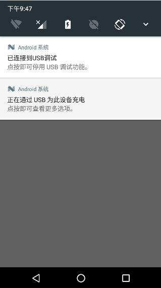
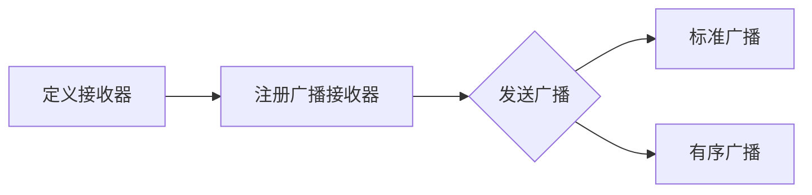
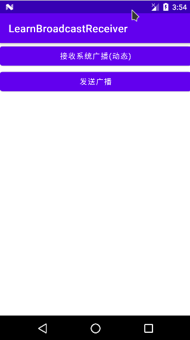
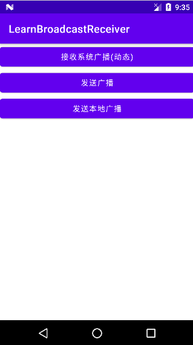

# BroadcastReceiver【广播接收者】

## BroadcastReceiver是什么鬼？

答：Broadcast直译广播，我们举个形象的例子来帮我理解下BroadcastReceiver，记得以前读书 的时候，每个班级都会有一个挂在墙上的大喇叭，用来广播一些通知，比如，开学要去搬书，广播： "每个班级找几个同学教务处拿书"，发出这个广播后，所有同学都会在同一时刻收到这条广播通知， 收到，但不是每个同学都会去搬书，一般去搬书的都是班里的"大力士"，这群"大力士"接到这条 广播后就会动身去把书搬回可是！
——好吧，上面这个就是一个广播传递的一个很形象的例子：
`大喇叭--> 发送广播 --> 所有学生都能收到广播 --> 大力士处理广播`
回到我们的概念，其实BroadcastReceiver就是应用程序间的全局大喇叭，即通信的一个手段， 系统自己在很多时候都会发送广播，比如电量低或者充足，刚启动完，插入耳机，输入法改变等， 发生这些时间，系统都会发送广播，这个叫系统广播，每个APP都会收到，如果你想让你的应用在接收到 这个广播的时候做一些操作，比如：系统开机后，偷偷后台跑服务~哈哈，这个时候你只需要为你的应用 注册一个用于监视开机的BroadcastReceiver，当接收到开机广播就做写偷偷摸摸的勾当~ 当然我们也可以自己发广播，比如：接到服务端推送信息，用户在别处登录，然后应该强制用户下线回到 登陆界面，并提示在别处登录~

## 广播类型

### 标准广播

完全**异步执行**的广播，发出广播后，**所有**广播接收器几乎会在同一时刻收到这条广播通知

### 有序广播

**同步执行**的一种广播，发出广播后，**同一时间只有一个**广播接受者能收到，当这个广播接收者的逻辑执行完后，才会传递到下一个接收者；当然，前面的接受者还可以**阶段**广播的继续传递，那么后续接受者就无法收到广播信息了


## 接收系统广播

### 注册广播接收器

要想接收系统广播，我们的APP注册广播接收器哦！

#### 动态注册

就是在Java代码中指定`IntentFilter`，然后添加不同的Action即可，想监听什么广播就写什么Action，另外动态注册的广播，一定要调用`unregisterReceiveri`让广播取消注册

#### 静态注册

动态注册需程序**启动**后才能接收广播，静态广播就弥补了这个短板，在`AndroidManifest`中制定`<IntentReceiver>`就可以让程序在未启动的情况下接收到广播了

### 监听网络状态变化(动态注册)



1. 创建一个类继承`android.content.BroadcastReceiver`并重写`public void onReceive(Context context, Intent intent)`

   ```java
   public class MyBRReceiver extends BroadcastReceiver {
       @Override
       public void onReceive(Context context, Intent intent) {
   
       }
   }
   ```

   

2. 在重写的`onReceive`方法内处理接收到广播后的逻辑。

   ```java
     	@Override
       public void onReceive(Context context, Intent intent) {
           // 当收到WiFi广播后会执行
           Toast.makeText(context, "WiFi状态发生了改变", Toast.LENGTH_SHORT).show();
       }
   ```

   

3. 在Activity中动态注册

   1. 创建接收器类实力
   2. 创建Intent过滤器，只保留我们需要的广播
   3. 使用`registerReceiver()` 方法注册广播

   ````java
     private  MyBRReceiver myBRReceiver;
       @Override
       public void onClick(View view) {
           int id = view.getId();
           if (id == R.id.receiver_system_dynamic) {
               myBRReceiver = new MyBRReceiver();
               IntentFilter intentFilter = new IntentFilter();
               // 过滤WiFi动作信息
               intentFilter.addAction("android.net.conn.CONNECTIVITY_CHANGE");
               registerReceiver(myBRReceiver, intentFilter);
           }
       }
   ````

   

4. 取消注册，一般是在Activity的`onDestroy()` 生命周期方法内调用`unregisterReceiver（）`方法取消注册。

   ```java
       @Override
       protected void onDestroy() {
           super.onDestroy();
           unregisterReceiver(myBRReceiver);
       }
   ```

   

### 接收开机广播(静态注册)


1. 和上面动态注册一样先要搞一个继承自`BroadcastReceiver` 接收器类。

   ````java
   import android.content.BroadcastReceiver;
   import android.content.Context;
   import android.content.Intent;
   import android.widget.Toast;
   
   public class BootCompleteReceiver extends BroadcastReceiver {
   
       @Override
       public void onReceive(Context context, Intent intent) {
           Toast.makeText(context, "开机完毕~", Toast.LENGTH_LONG).show();
       }
   }
   ````

   

2. 在`AndroidManifest.xml`中对我们的接收器`BroadcastReceiver`进行注册，注意是`application`节点内并配置`intent-filter`还需要``RECEIVE_BOOT_COMPLETED`权限

   ```xml
   <!-- 权限 -->
   <uses-permission android:name="android.permission.RECEIVE_BOOT_COMPLETED"/>
    <receiver
               android:name=".BootCompleteReceiver"
               android:enabled="true"
               android:exported="true">
               <intent-filter>
                   <action android:name="android.intent.action.BOOT_COMPLETED"/>
               </intent-filter>
   </receiver>
   ```

   属性；

   - `exported` 是否允许这个广播接收器接收本程序以外的广播
   - `enabled` 否启用这个广播接收器 


## 发送广播

**发送路程；**




- 标准广播：`sendBroadcast(intent)`
- 有序广播：`sendOrderedBroadcast(intent，null)`可以在清单文件中的`Intent-filter`通过：`android:priority="100"`设置优先级，值越大优先级越高，越先收到广播，而且还可以调用`abortBroadcast()`截断广播的继续传递优先级可选值：-1000~1000之间

### 发送标准广播

1. 发送广播前需要定义一个广播接收器.自定义一个`BroadcastReceiver`，重写`onReceive()`方法，

   ```java
   package com.xuelingmiao.learnbroadcastreceiver;
   
   import android.content.BroadcastReceiver;
   import android.content.Context;
   import android.content.Intent;
   import android.widget.Toast;
   
   public class MyBroadcastReceiver extends BroadcastReceiver {
   
       @Override
       public void onReceive(Context context, Intent intent) {
           Toast.makeText(context, "收到告白啦~",Toast.LENGTH_SHORT).show();
       }
   }
   ```

   

2. 在AndroidManifest.xml中注册，配置``Intent-filter` 为自己的广播指定一个action name,一般命名方式为 `[package].broadcasttest,广播名称`

   ````xml
     <receiver
               android:name=".MyBroadcastReceiver"
               android:enabled="true"
               android:exported="true">
               <intent-filter>
                   <action android:name="com.xuelingmiao.broadcasttest.MY_BROADCAS" />
               </intent-filter>
   </receiver>
   ````

3. 在Activity中发送广播。
	1. 创建`Intent`
	2. 设置`Action` 这里要和接收器中定义的Action名称一致。

	````java
	 public void onClick(View view) {
        int id = view.getId();
     if (id == R.id.send_broadcast) {
            Intent intent = new Intent();
            String ACTION_MY_BROADCAS = "com.xuelingmiao.broadcasttest.MY_BROADCAS";
            intent.setAction(ACTION_MY_BROADCAS);
            sendBroadcast(intent); // 发送广播
        }
	 }
	````





## 广播的注意事项

不要在广播里添加过多逻辑或者进行任何耗时操作,因为在广播中是不允许开辟线程的, 当onReceiver( )方法运行较长时间(超过10秒)还没有结束的话,那么程序会报错(ANR), 广播更多的时候扮演的是一个打开其他组件的角色,比如启动Service,Notification提示, Activity等！


## 本地广播

前面我们发送和接收的广播全部属于系统全局广播，即发出的广播可以被其他任何应用程序接收到，并且我们也可以接收来自于其他任何应用程序的广播。这样就很容易引起安全性的问题，比如说我们发送的一些携带关键性数据的广播有可能被其他的应用程序截获，或者其他的程序不停地向我们的广播接收器里发送各种垃圾广播。

为了能够简单地解决广播的安全性问题，Android引入了一套本地广播机制，使用这个机制发出的广播只能够在应用程序的内部进行传递，并且广播接收器也只能接收来自本应用程序发出的广播，这样所有的安全性问题就都不在
了。

**核心套路；**

使用`LocalBroadcastManager`对象来管理广播：

方法；

- `LocalBroadcastManager.getInstance()`获得实例

- `registerReceive()`注册广播

- `sendBroadcast()`发送广播

- `unregisterReceiver()`取消注册

### 本地广播注意事项

1. 本地广播无法通过静态注册来接收！相比起系统全局广播更加高效
2. 在广播中启动Activity的话，需要为`Intent`加入`FLAG_ACTIVITY_NEW_TASK`的标记，不然会报错，因为需要一个栈来存放新打开的Activity
3. 广播中弹出`AlertDialog`的话，需要设置对话框的类型为`TYPE_SYSTEM_ALERT`不然是无法弹出的

### 发送本地广播

1. 创建一个本地广播接收器不需要再`manifest` 文件中注册

   ```java
   package com.xuelingmiao.learnbroadcastreceiver;
   
   import android.content.BroadcastReceiver;
   import android.content.Context;
   import android.content.Intent;
   import android.widget.Toast;
   
   public class LocalBroadcastReceiver extends BroadcastReceiver {
   
       @Override
       public void onReceive(Context context, Intent intent) {
           Toast.makeText(context, "接收到本地广播", Toast.LENGTH_SHORT).show();
       }
   }
   ```

   

2. 在Activity中注册广播接收器

   1. 获取`LocalBroadcastManager`实力
   2. 创建自定义接收器
   3. 创建`intentFilter `
   4. 使用`LocalBroadcastManager.registerReceiver()` 注册广播

   ```java
     private String mAction = "com.xuelingmiao.broadcasttest.LOCAL_BROADCAST";
      private LocalBroadcastReceiver mLocalBroadcastReceiver;
   
       @Override
       protected void onCreate(Bundle savedInstanceState) {
           super.onCreate(savedInstanceState);
           setContentView(R.layout.activity_main);
   
           LocalBroadcastManager localBroadcastManager = LocalBroadcastManager.getInstance(this);
           IntentFilter intentFilter = new IntentFilter();
           intentFilter.addAction(mAction);
           mLocalBroadcastReceiver = new LocalBroadcastReceiver();
           // 注册广播接收器
           localBroadcastManager.registerReceiver(mLocalBroadcastReceiver, intentFilter);
       }
   ```

3. 使用`LocalBroadcastManager.sendBroadcast()`发送广播

   ```java
     @Override
       public void onClick(View view) {
           int id = view.getId();
   		if (id == R.id.send_local_broadcast) {
           	Intent intent = new Intent();
           	intent.setAction(mAction);
          	 	LocalBroadcastManager.getInstance(this).sendBroadcast(intent);
           }
       }
   ```

   

4. 还是不要忘记取消注册广播

   ```java
       @Override
       protected void onDestroy() {
           super.onDestroy();
    LocalBroadcastManager.getInstance(this).unregisterReceiver(mLocalBroadcastReceiver);
       }
   ```

   


## 常用的系统广播

以下Action Name存储在Intent类中可以通过`Intent.`方式获取

- `ACTION_AIRPLANE_MODE_CHANGED`  关闭或打开飞行模式时的广播

- `ACTION_BATTERY_CHANGED`充电状态，或者电池的电量发生变化
  电池的充电状态、电荷级别改变，不能通过组建声明接收这个广播，只有通过`Context.registerReceiver()`注册

- `ACTION_BATTERY_LOW`表示电池电量低

- `ACTION_BATTERY_OKAY`表示电池电量充足，即从电池电量低变化到饱满时会发出广播

- `ACTION_BOOT_COMPLETED`在系统启动完成后，这个动作被广播一次（只有一次）。

- `ACTION_CAMERA_BUTTON`按下照相时的拍照按键(硬件按键)时发出的广播

- `ACTION_CLOSE_SYSTEM_DIALOGS`当屏幕超时进行锁屏时,当用户按下电源按钮,长按或短按(不管有没跳出话框)，进行锁屏时,android系统都会广播此Action消息

- `ACTION_CONFIGURATION_CHANGED`设备当前设置被改变时发出的广播(包括的改变:界面语言，设备方向，等，请参考Configuration.java)

- `ACTION_DATE_CHANGED`设备日期发生改变时会发出此广播

- `ACTION_DEVICE_STORAGE_LOW`设备内存不足时发出的广播,此广播只能由系统使用，其它APP不可用？

- `ACTION_DEVICE_STORAGE_OK`设备内存从不足到充足时发出的广播,此广播只能由系统使用，其它APP不可用？

- `ACTION_DOCK_EVENT`发出此广播的地方`frameworks\base\services\java\com\android\server\DockObserver.java`

- `ACTION_EXTERNAL_APPLICATIONS_AVAILABLE`移动APP完成之后，发出的广播(移动是指:APP2SD)

- `ACTION_EXTERNAL_APPLICATIONS_UNAVAILABLE`正在移动APP时，发出的广播(移动是指:APP2SD)

- `ACTION_GTALK_SERVICE_CONNECTED`Gtalk已建立连接时发出的广播

- `ACTION_GTALK_SERVICE_DISCONNECTED`Gtalk已断开连接时发出的广播

- `ACTION_HEADSET_PLUG`在耳机口上插入耳机时发出的广播

- `ACTION_INPUT_METHOD_CHANGED`改变输入法时发出的广播

- `ACTION_LOCALE_CHANGED`设备当前区域设置已更改时发出的广播

- `ACTION_MANAGE_PACKAGE_STORAGE` 指示用户确认的低内存条件通知，并且应该启动包管理。这是由用户从

- `ACTION_MEDIA_BAD_REMOVAL`未正确移除SD卡(正确移除SD卡的方法:设置--SD卡和设备内存--卸载SD卡)，但已把SD卡取出来时发出的广播
  广播：扩展介质（扩展卡）已经从 SD 卡插槽拔出，但是挂载点 (mount point) 还没解除 (unmount)

- `ACTION_MEDIA_BUTTON`按下"Media Button" 按键时发出的广播,假如有"Media Button" 按键的话(硬件按键)

- `ACTION_MEDIA_CHECKING`插入外部储存装置，比如SD卡时，系统会检验SD卡，此时
- `ACTION_MEDIA_EJECT`已拔掉外部大容量储存设备发出的广播（比如SD卡，或移动硬盘）,不管有没有正确卸载都会发出此广播?
  广播：用户想要移除扩展介质（拔掉扩展卡）。
- `ACTION_MEDIA_MOUNTED`插入SD卡并且已正确安装（识别）时发出的广播
  广播：扩展介质被插入，而且已经被挂载。
- `ACTION_MEDIA_NOFS` 存在外部媒体，但使用不兼容的 fs（或为空白） 检查媒体的安装点路径包含在 Intent.mData 字段中。

- `ACTION_MEDIA_REMOVED`外部储存设备已被移除，不管有没正确卸载,都会发出此广播？
   广播：扩展介质被移除。

- `ACTION_MEDIA_SCANNER_FINISHED`广播：已经扫描完介质的一个目录

- `ACTION_MEDIA_SCANNER_SCAN_FILE`  请求媒体扫描器扫描文件并将其添加到媒体数据库。

  此常量在 API 级别 29 中已弃用。

- `ACTION_MEDIA_SCANNER_STARTED`广播：开始扫描介质的一个目录

- `ACTION_MEDIA_SHARED`广播：扩展介质的挂载被解除 (unmount)，因为它已经作为 USB 大容量存储被共享。
-  `ACTION_MEDIA_UNMOUNTABLE` 存在外部媒体但无法安装。可卸载媒体的安装点路径包含在 Intent.mData 字段中。

- `ACTION_MEDIA_UNMOUNTED`广播：扩展介质存在，但是还没有被挂载 (mount)

- `ACTION_NEW_OUTGOING_CALL` 即将拨出电话。

   此常量在 API 级别 29 中已弃用。

- `ACTION_PACKAGE_ADDED`成功的安装APK之后
  广播：设备上新安装了一个应用程序包。
  一个新应用包已经安装在设备上，数据包括包名（最新安装的包程序不能接收到这个广播）
-  `ACTION_PACKAGE_CHANGED`一个已存在的应用程序包已经改变，包括包名
- `ACTION_PACKAGE_DATA_CLEARED`清除一个应用程序的数据时发出的广播(在设置－－应用管理－－选中某个应用，之后点清除数据时?)
  用户已经清除一个包的数据，包括包名（清除包程序不能接收到这个广播）

- `ACTION_PACKAGE_INSTALL`触发一个下载并且完成安装时发出的广播，比如在电子市场里下载应用？

- `ACTION_PACKAGE_REMOVED`成功的删除某个APK之后发出的广播
  一个已存在的应用程序包已经从设备上移除，包括包名（正在被安装的包程序不能接收到这个广播）

- `ACTION_PACKAGE_REPLACED`替换一个现有的安装包时发出的广播（不管现在安装的APP比之前的新还是旧，都会发出此广播？）
- `ACTION_PACKAGE_RESTARTED`用户重新开始一个包，包的所有进程将被杀死，所有与其联系的运行时间状态应该被移除，包括包名（重新开始包程序不能接收到这个广播）
- `ACTION_POWER_CONNECTED`插上外部电源时发出的广播
- `ACTION_POWER_DISCONNECTED`已断开外部电源连接时发出的广播
- `ACTION_PROVIDER_CHANGED `一些内容提供者在其命名空间的一部分中发布用户可能特别感兴趣的新事件或项目。对于这些事情，当感兴趣的项目集发生变化时，他们可能会广播此动作。例如，当收件箱中的未读邮件集发生变化时，GmailProvider 会发送此通知。

- `ACTION_REBOOT`重启设备时的广播

- `ACTION_SCREEN_OFF`屏幕被关闭之后的广播

- `ACTION_SCREEN_ON`屏幕被打开之后的广播

- `ACTION_SHUTDOWN`关闭系统时发出的广播

- `ACTION_TIMEZONE_CHANGED`时区发生改变时发出的广播

- `ACTION_TIME_CHANGED`时间被设置时发出的广播

- `ACTION_TIME_TICK`广播：当前时间已经变化（正常的时间流逝）。
  当前时间改变，每分钟都发送，不能通过组件声明来接收，只有通过Context.registerReceiver()方法来注册

- `ACTION_UID_REMOVED`一个用户ID已经从系统中移除发出的广播

- `ACTION_UMS_CONNECTED`设备已进入USB大容量储存状态时发出的广播？

- `ACTION_UMS_DISCONNECTED`设备已从USB大容量储存状态转为正常状态时发出的广播？

- `ACTION_USER_PRESENT` 当设备唤醒后用户在场时发送（例如，当键盘保护消失时）

- `ACTION_WALLPAPER_CHANGED`设备墙纸已改变时发出的广播


