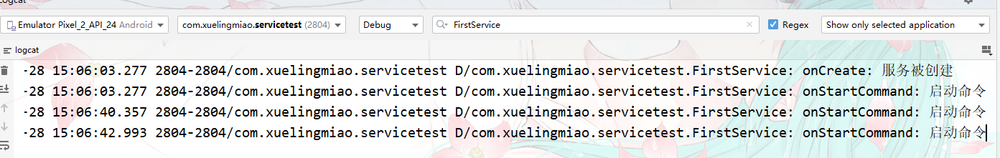
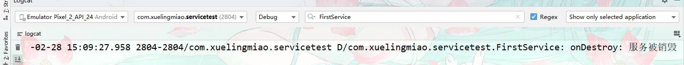

# service【服务】

## 介绍

用俗话话应该是长期于后台运行的程序，如果是官方一点，首先它是一个组件，用于执行长期运行的任务，并且与用户**没有交互。**服务继承子

每一个服务都需要在配置文件AndroidManifest.xml文件里进行生命，怎么生命呢？

使用标签，其实跟前面的activity，广播接收者receiver一样生命。

通过`Context.startService()`来开启服务，通过`Context.stop()`来停止服务。当然啦，还有一种启动形式就是通过`Context.bindService()`的方法。

### 进程

**分类；**

1. **前台进程：**可以理解为是最顶部的，直接跟用户交互的。比如说我们操作的Activity界面.

2. **可见进程：**可以见的，但是不操作的，比如说我们在一个Activity的顶部弹出一个Dialog，这个Dialog就是前台进程，但是这个Activity则是可见进程。

3. **服务进程：**服务可以理解为是忙碌的后台进程，虽然是在后台，但是它很忙碌。

4. **后台进程：**后台进程就是退隐到后台，不做事的进程。

5. **空进程：**空进程是不做事的，没有任何东西在上面跑着，仅作缓存作用。

**优先级；**

假设，内存不够用了，会先杀谁呢？

首先杀的是空进程，要是还不够就杀后台进程，要是还不够，那么就杀服务，但是服务被杀死以后，等内存够用了，服务又会跑起来了。

空进程 > 服务

### anr

首先ANR的意思是android no response,也就是无相应或者理解为操作超时。

服务的话，**前台服务为20秒超时**，**后台服务为200秒超时。**


## 服务示例

1. 创建一个类继承`android.app.Service`并实现其方法。

   ```java
   package com.xuelingmiao.servicetest;
   
   import android.app.Service;
   import android.content.Intent;
   import android.os.IBinder;
   
   import androidx.annotation.Nullable;
   
   public class FirstService extends Service {
       @Nullable
       @Override
       public IBinder onBind(Intent intent) {
           return null;
       }
       
   }
   ```

   

2. 复写部分生命回调方法

   ```java
   package com.xuelingmiao.servicetest;
   
   import android.app.Service;
   import android.content.Intent;
   import android.os.IBinder;
   import android.util.Log;
   
   import androidx.annotation.Nullable;
   
   public class FirstService extends Service {
       private static final String TAG = FirstService.class.getName();
   
       @Nullable
       @Override
       public IBinder onBind(Intent intent) {
           return null;
       }
   
       /**
        * 服务被创建回调
        */
       @Override
       public void onCreate() {
           Log.d(TAG, "onCreate: 服务被创建");
           super.onCreate();
       }
   
       /**
        * 启动命令时回调
        * @param intent 意图
        * @param flags 标记
        * @param startId 启动id
        * @return
        */
       @Override
       public int onStartCommand(Intent intent, int flags, int startId) {
           Log.d(TAG, "onStartCommand: 启动命令");
           return super.onStartCommand(intent, flags, startId);
       }
   
       /**
        * 服务被销毁回调
        */
       @Override
       public void onDestroy() {
           Log.d(TAG, "onDestroy: 服务被销毁");
           super.onDestroy();
       }
   }
   
   ```

   

3.  使用Activity来控制服务。

   >**提示；**
   >
   >​	因为这里Activity和Service类都间接继承子Context类，所以可以直接使用其方法。

   ```java
   package com.xuelingmiao.servicetest;
   
   import androidx.appcompat.app.AppCompatActivity;
   
   import android.content.Intent;
   import android.os.Bundle;
   import android.view.View;
   
   public class MainActivity extends AppCompatActivity {
   
       @Override
       protected void onCreate(Bundle savedInstanceState) {
           super.onCreate(savedInstanceState);
           setContentView(R.layout.activity_main);
       }
   
       /**
        * 启动服务
        * @param view
        */
       public void startService(View view) {
           Intent intent = new Intent();
           intent.setClass(this,FirstService.class);
           startService(intent);
       }
   
       /**
        * 停止服务
        * @param view
        */
       public void sotpService(View view) {
           stopService(new Intent(this,FirstService.class));
       }
   }
   ```

4. 到`AndroidManifest.xml` 注册服务。

   > **提示；**
   >
   > 以前我们在学习Activity的时候，就知道显示意图和隐式意图了。其实服务也是一样的，启动方式也有显式和隐式的。

   ```xml
   <application>
       <service android:name=".FirstService"></service>
   </application>
   ```

   

5. 启动服务注意观察log。

   - 多次执行启动服务；可以看到`onCreate()` 只会被执行一次。

     

   - 执行停止服务；如果多次执行停止服务方法，那么也不会再次输出日志了，及`onCreate()` 回调不执行那么在停止服务时`onDestroy()` 回调是不会执行的。

     


## 通过绑定启动服务

前面的开启服务方式，有一个弊端。就是没法进行通讯。所以我们接直来呢会学习另外一种启动服务的方式–通过绑定服务的形式来启动服务。对应的停止服务则是解绑服务。

1. 还是和之前一样创建一个类来继承Service类。并实现其方法。

   ```java
   package com.xuelingmiao.servicetest;
   
   import android.app.Service;
   import android.content.Intent;
   import android.os.IBinder;
   
   import androidx.annotation.Nullable;
   
   public class SecondService extends Service {
   
       @Nullable
       @Override
       public IBinder onBind(Intent intent) {
           return null;
       }
   }
   
   ```

   

2. 重写部分生命方法，对比`FirstService.class`这里我们又多重写了一个`onUnbind()`回调。

   ```java
   package com.xuelingmiao.servicetest;
   
   import android.app.Service;
   import android.content.Intent;
   import android.os.IBinder;
   import android.util.Log;
   
   import androidx.annotation.Nullable;
   
   public class SecondService extends Service {
   
       private static final String TAG = "SecondService";
   
       @Nullable
       @Override
       public IBinder onBind(Intent intent) {
           Log.d(TAG, "onBind: 绑定服务");
           return null;
       }
   
       @Override
       public boolean onUnbind(Intent intent) {
           Log.d(TAG, "onUnbind: 解绑服务");
           return super.onUnbind(intent);
       }
   
       @Override
       public void onCreate() {
           Log.d(TAG, "onCreate: 创建服务");
           super.onCreate();
       }
   
       @Override
       public int onStartCommand(Intent intent, int flags, int startId) {
           Log.d(TAG, "onStartCommand: 启动命令");
           return super.onStartCommand(intent, flags, startId);
       }
   
       @Override
       public void onDestroy() {
           Log.d(TAG, "onDestroy: 销毁服务");
           super.onDestroy();
       }
   }
   
   ```

3. 注册服务

   ```xml
   <application>
       <service android:name=".SecondService"></service>
   </application>
   ```

4. 编写一个用来测试`BindService`的界面。

   ```java
   
   ```

   

## 生命周期

