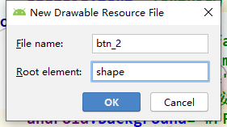

### Button【按钮】

## 自定义形状

1. 在R/drawable文件夹下新建一个Drawable resource file文件

   

2. 设置文件名和更元素为`shape`



3. 绘制形状

   ```xml
   <?xml version="1.0" encoding="utf-8"?>
   <shape xmlns:android="http://schemas.android.com/apk/res/android"
           android:shape="rectangle">//指定绘制的图形
       <solid android:color="#B34EC5"/>//填充颜色
       <corners android:radius="10dp"/>//圆角大小
   </shape>
   ```

   

4. 到button的background属性中引用这个xml

   ```xml
   <Button
               android:textAllCaps="false"
               android:layout_width="match_parent"
               android:layout_height="wrap_content"
               android:text="Button[按钮]"
               android:background="@drawable/btn_2"/> //引用自定义形状
   ```


### shape元素

属性；

- android:shape 设置要绘制的形状

  属性值；

  - `rectangle`  长方形

  - `line` 线

  - `oval`  椭圆

  - `ring`  圆环

#### 样式

##### solid【实现填充】

**属性；**

- `android:colro` 设置填充颜色

##### corners 【圆角】

**属性；**

- `android:radius`  同意设定四个角弧度。‘
  - `android:bottomLeftRadius` 设置左下角弧度。
  - `android:bottomRightRadius` 设置右下角弧度。
  - `android:topLeftRadius` 设置左上角弧度。
  - `android:topRightRadius` 设置右上角弧度。

##### stroke【描边】

**属性；**

- `android:colro` 设置描边颜色
- `android:width` 设置描边宽度。


### selector 

通过事件来触发样式

#### item

用来定义触发项

**事件；**

| 事件                    | 作用                                            | 值      |
| ----------------------- | ----------------------------------------------- | ------- |
| android:state_pressed   | 按下状态使用样式                                | Boolean |
| android:state_focused   | 聚焦状态使用                                    | Boolean |
| android:state_selected  | 表示选中状态使用                                | Boolean |
| android:state_checkable | 表示可勾选状态时使用                            | Boolean |
| android:state_checked   | 表示勾选状态使用                                | Boolean |
| android:state_enabled   | 表示可用状态使用                                | Boolean |
| android:window_focused  | 表示应用程序窗口有焦点时使用（应用程序 在前台） | Boolean |

```xml
 <?xml version="1.0" encoding="utf-8"?>
  <selector xmlns:android="http://schemas.android.com/apk/res/android">
      <!-- 按压效果 -->
      <item android:state_pressed="true">
          <shape>
              <solid android:color="#2196F3"/>
              <corners android:radius="5dp"/>
          </shape>
      </item>
      <!-- 未按压效果 -->
      <item android:state_pressed="false">
          <shape android:shape="rectangle">
              <solid android:color="#8BC34A"/>
              <corners android:radius="5dp"/>
          </shape>
      </item>
  </selector>
```


