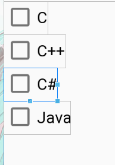

# CheckBox【复选框】



**作用**

主要用在多选项上，继承自button

#### 自定义样式

- 创建drawable，样式xml

  ```xml
  <?xml version="1.0" encoding="utf-8"?>
  <selector xmlns:android="http://schemas.android.com/apk/res/android">
    <item android:state_checked="false" android:drawable="@drawable/check_box_not_selected"/> //未选中
    <item android:state_checked="true" android:drawable="@drawable/check_box_selected"/>
  </selector> <!-- 选中 >
  ```

- 用一个容器包括修改xml

  ```xml
  <LinearLayout
              android:layout_width="wrap_content"
              android:layout_height="wrap_content"
              android:orientation="vertical">
          <TextView
                  android:layout_width="wrap_content"
                  android:layout_height="wrap_content"
                  android:text="自定义样式"
                  android:textSize="20sp"/>
          <CheckBox
                  android:layout_width="wrap_content"
                  android:layout_height="wrap_content"
                  android:text="1"
                  android:textSize="15sp"
                  android:button="@drawable/bg_check_bok"/>//引用drawable样式
          <CheckBox
                  android:layout_width="wrap_content"
                  android:layout_height="wrap_content"
                  android:text="2"
                  android:textSize="15sp"
                  android:button="@drawable/bg_check_bok"/>
          <CheckBox
                  android:layout_width="wrap_content"
                  android:layout_height="wrap_content"
                  android:text="3"
                  android:textSize="15sp"
                  android:button="@drawable/bg_check_bok"/>
      </LinearLayout>
  ```

**事件监听**

```java
package top.miku.uiwidgettest;

import androidx.appcompat.app.AppCompatActivity;

import android.os.Bundle;
import android.widget.CheckBox;
import android.widget.CompoundButton;
import android.widget.Toast;

public class MyCheckBook extends AppCompatActivity {
    private CheckBox c,c_plas,jaa;
    @Override
    protected void onCreate(Bundle savedInstanceState) {
        super.onCreate(savedInstanceState);
        setContentView(R.layout.activity_my_check_book);
        c = (CheckBox) findViewById(R.id.c);
        c_plas = (CheckBox) findViewById(R.id.c_plas);
        jaa = (CheckBox) findViewById(R.id.java);
        c.setOnCheckedChangeListener(new CompoundButton.OnCheckedChangeListener() {
            @Override
            public void onCheckedChanged(CompoundButton compoundButton, boolean b) {
                Toast toast = Toast.makeText(MyCheckBook.this,null,Toast.LENGTH_SHORT);
                toast.setText(c.getText());
                toast.show();
            }
        });
    }
}
```