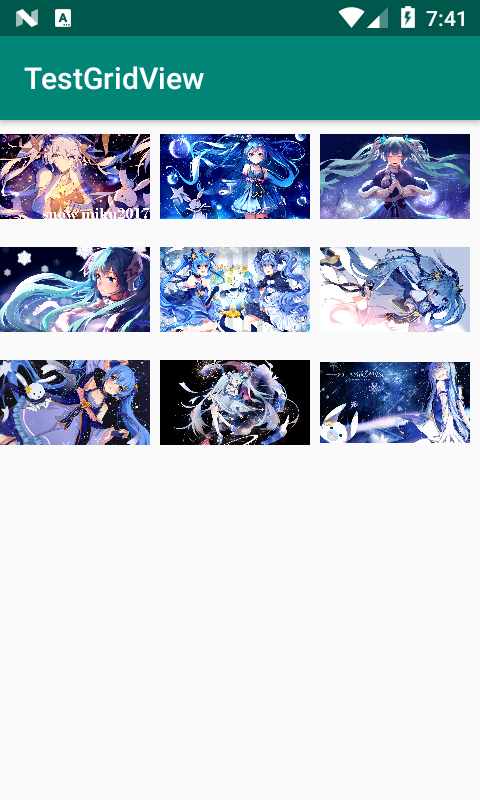
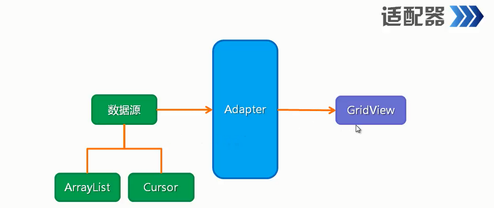
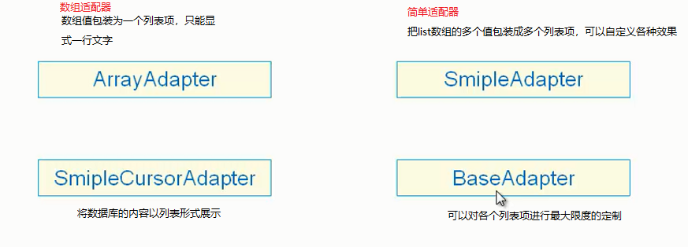

# GridView【网格视图】

图片按行和列形式展示



## 适配器概念

GridView不同于其它组件要显式图像必须通过一个适配器**Adapter**



- 常用适配器实现类

  

  

### SimpleAdapter【简单适配器】使用

- 构造参数
  - 上下文对象
  - list对象
  - 一个布局文件【就是单元格样式xml文件】
  - 字符串数组【list中的Map中的key名】
  - 整形数组【单元格模板文件中所指定的组件id】
- [参考示例](#xml自定义项[SimpleAdapter适配器]])

**属性**

| 属性               | 作用       | 值                        |
| ------------------ | ---------- | ------------------------- |
| android:numColumns | 设置表格列 | int或auto_fit【自动排列】 |

**方法**

- `setAdapter();` 添加适配器

**xml自定义项【SimpleAdapter适配器】**

- 添加xml标记【activity_main.xml添加】

```xml
<?xml version="1.0" encoding="utf-8"?>
<androidx.constraintlayout.widget.ConstraintLayout xmlns:android="http://schemas.android.com/apk/res/android"
        xmlns:app="http://schemas.android.com/apk/res-auto"
        xmlns:tools="http://schemas.android.com/tools"
        android:layout_width="match_parent"
        android:layout_height="match_parent"
        tools:context=".MainActivity">
<!-- GridView组件添加 -->
    <GridView
            android:id="@+id/grid_view"
            android:layout_width="match_parent"
            android:layout_height="match_parent"
            android:numColumns="3"/>

</androidx.constraintlayout.widget.ConstraintLayout>
```

- 定义一个项模板【layout文件夹下创建】

```xml
<?xml version="1.0" encoding="utf-8"?>
<LinearLayout xmlns:android="http://schemas.android.com/apk/res/android"
        android:orientation="vertical" android:layout_width="match_parent"
        android:layout_height="match_parent">
    <ImageView
            android:id="@+id/image"
            android:layout_width="100dp"
            android:layout_height="75dp"
            />

</LinearLayout>
```

- 编写java文件【Main.class编写】

```java
package top.miku.testgridview;

import androidx.appcompat.app.AppCompatActivity;

import android.os.Bundle;
import android.widget.GridView;
import android.widget.ImageView;
import android.widget.SimpleAdapter;

import java.util.ArrayList;
import java.util.HashMap;
import java.util.List;
import java.util.Map;

public class MainActivity extends AppCompatActivity {

    //图片资源
    private int[] imgArr = new int[]{
            R.mipmap.img01,R.mipmap.img02,R.mipmap.img03,
            R.mipmap.img04,R.mipmap.img05,R.mipmap.img06,
            R.mipmap.img07,R.mipmap.img08,R.mipmap.img09
    };

    @Override
    protected void onCreate(Bundle savedInstanceState) {
        super.onCreate(savedInstanceState);
        setContentView(R.layout.activity_main);
        //获取组件
        GridView gridView = (GridView) findViewById(R.id.grid_view);

        //创建一个list集合,存放Map类型的元素，用来保存图片资源
        List<Map<String,Object>> listItem = new ArrayList<>();
        //给list添加Map资源
        for (int i = 0; i < imgArr.length; i++) {
            //实例化一个Map对象
            Map<String,Object> map = new HashMap<>();
            //key是image，值是image资源id
            map.put("image",imgArr[i]);
            //把map添加到list
            listItem.add(map);
        }

        //创建适配器对象
        SimpleAdapter simpleAdapter = new SimpleAdapter(
                this,
                listItem,
                R.layout.call,
                new String[]{"image"},
                new int[]{R.id.image}
        );

        //为网格组件添加这个适配器
        gridView.setAdapter(simpleAdapter);


    }
}
```

##### 不使用xml【BaseAdapter适配器】

- active_layout.xml【添加网格标记】

  ```xaml
  <?xml version="1.0" encoding="utf-8"?>
  <LinearLayout xmlns:android="http://schemas.android.com/apk/res/android"
          xmlns:app="http://schemas.android.com/apk/res-auto"
          xmlns:tools="http://schemas.android.com/tools"
          android:layout_width="match_parent"
          android:layout_height="match_parent"
          tools:context=".MainActivity"
          android:orientation="vertical">
      <TextView
              android:layout_width="wrap_content"
              android:layout_height="wrap_content"
              android:textSize="20sp"
              android:text="2019年11月18日"/>
      <!-- 添加标记 -->
      <GridView
              android:id="@+id/grid_view"
              android:layout_width="match_parent"
              android:layout_height="wrap_content"
              android:numColumns="auto_fit"
              />
  ```

\```

- 编写java文件编写一个自定义适配器类

  ```java
  package top.miku.qqpictureslideview;
  
  import androidx.appcompat.app.AppCompatActivity;
  
  import android.content.Context;
  import android.os.Bundle;
  import android.view.View;
  import android.view.ViewGroup;
  import android.widget.BaseAdapter;
  import android.widget.GridView;
  import android.widget.ImageView;
  
  public class MainActivity extends AppCompatActivity {
      //图片资源
      private int[] imgArr = new int[]{
              R.mipmap.img01,R.mipmap.img02,R.mipmap.img03,
              R.mipmap.img04,R.mipmap.img05,R.mipmap.img06,
              R.mipmap.img07,R.mipmap.img08,R.mipmap.img09
      };
  
      @Override
      protected void onCreate(Bundle savedInstanceState) {
          super.onCreate(savedInstanceState);
          setContentView(R.layout.activity_main);
  
          //获取组件
          GridView gridView = (GridView) findViewById(R.id.grid_view);
          //指定适配器
          gridView.setAdapter(new ImageAdapter(this));
  
      }
  //内部类继承BaseAdapter类
      public class ImageAdapter extends BaseAdapter{
          private Context mContext; //存放调用者传递的上下文
  
          //创建一个构造函数
          public ImageAdapter(Context context){
              mContext = context; //把实例化传递的上下文保存下来。
          };
  
          //计数
          @Override
          public int getCount() {
              return imgArr.length;
          }
  
          @Override
          public Object getItem(int i) {
              return null;
          }
  
          @Override
          public long getItemId(int i) {
              return 0;
          }
  
          @Override
          public View getView(int i, View view, ViewGroup viewGroup) {
              ImageView imageView; //存放要显式的imageView组件。
              //判断传过来的值是否为空
              if(view==null){
                  //创建ImageView组件
                  imageView=new ImageView(mContext);
                  //为组件设置宽高
                  imageView.setLayoutParams(new GridView.LayoutParams(100, 90));
                  //选择图片铺设方式
                  imageView.setScaleType(ImageView.ScaleType.CENTER_CROP);
  
              }else{
                  imageView= (ImageView)view; //否则就等于传递过来的view
              }
              //将获取图片放到ImageView组件中
              //指定图片资源id，通过图片数组指定，这里的i就是当前项的index正好对应图片数组长度。
              imageView.setImageResource(imgArr[i]);
  
              return imageView; //返回这个imageView对象。
          }
      }
  
  }
  ```