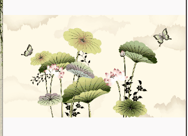

# ImageSwitcher【图片切换器】

图片切换有动画效果，继承自ImageView




- 简单图片切换【方法摘要】
  - `setOutAnimation()` 淡出动画
  - `setInAnimation()` 淡入动画
  - `setFactory()` 图像工厂
  - `setImageResource()` 指定下一张要显式的图片资源

```java
package top.miku.imgswitched;

import androidx.appcompat.app.AppCompatActivity;

import android.os.Bundle;
import android.view.View;
import android.view.animation.AnimationUtils;
import android.widget.ImageSwitcher;
import android.widget.ImageView;
import android.widget.ViewSwitcher;

public class MainActivity extends AppCompatActivity {
    private ImageSwitcher imageSwitcher;

    @Override
    protected void onCreate(Bundle savedInstanceState) {
        super.onCreate(savedInstanceState);
        setContentView(R.layout.activity_main);
        //获取控件
        imageSwitcher = (ImageSwitcher) findViewById(R.id.image_switcher);
        /*
        * 设置图片淡出动画【setOutAnimation】方法指定淡出动画
        * 参数
        *   AnimationUtils 一个动画程序【这里加载Android自带的】
        *       参数
        *           - 一个上下文对象
        *           - 动画资源【android.R.anim.fade_out】使用Android自带的
        * */
        imageSwitcher.setOutAnimation(AnimationUtils.loadAnimation(MainActivity.this, android.R.anim.fade_out));
        /*
        * 设置图片淡入动画和淡出动画【setInAnimation】指定淡入动画
        * 参数基本一直
        * */
        imageSwitcher.setInAnimation(AnimationUtils.loadAnimation(MainActivity.this, android.R.anim.fade_in));
        /* 指定一个视图工厂。
        * 为图片切换器设置要显式的图片资源。
        * */
        imageSwitcher.setFactory(new ViewSwitcher.ViewFactory() {
            @Override
            public View makeView() {
                //实例化一个ImageView控件
                ImageView imageView = new ImageView(MainActivity.this);
                imageView.setImageResource(R.mipmap.i03);
                return imageView;//返回工厂这个对象。
            }
        });

        //监听点击事件【注册单击事件】
        imageSwitcher.setOnClickListener(new View.OnClickListener() {
            @Override
            public void onClick(View view) {
                //这里传递的view就是imageSwitcher对象，把view强制类型转换后，调用
                //setImageResource方法指定下一个要展示的图片。
                ((ImageSwitcher)view).setImageResource(R.mipmap.i04);
            }
        });
    }
}
```

- 滑动图片切换【方法摘要】
  - `motionEvent.getAction()` 获得触发的活动类型。
  - `MotionEvent.ACTION_DOWN` 开始触摸常量
  - `MotionEvent.ACTION_UP` 停止/手指抬起触摸常量

```java
package top.miku.pictureslideview;

import androidx.appcompat.app.AppCompatActivity;

import android.os.Bundle;
import android.util.Log;
import android.view.MotionEvent;
import android.view.View;
import android.view.WindowManager;
import android.view.animation.AnimationUtils;
import android.widget.ImageSwitcher;
import android.widget.ImageView;
import android.widget.ViewSwitcher;

public class MainActivity extends AppCompatActivity {
    //存放图片资源
    private int imageId[] = new int[]{
      R.mipmap.img01,R.mipmap.img02,R.mipmap.img03,
      R.mipmap.img04,R.mipmap.img05,R.mipmap.img06,
      R.mipmap.img07,R.mipmap.img08,R.mipmap.img09,
    };
    //存放ImageSwitcher对象
    private ImageSwitcher is ;
    //记录图片索引
    private int imageIndex;
    //记录手指左右滑动x触摸按下和抬起x坐标。
    private float touchDownX;
    private float touchUpX;
    @Override
    protected void onCreate(Bundle savedInstanceState) {
        super.onCreate(savedInstanceState);
        setContentView(R.layout.activity_main);
        getWindow().setFlags(WindowManager.LayoutParams.FLAG_FULLSCREEN,
                WindowManager.LayoutParams.FLAG_FULLSCREEN);//设置全屏显示

        is = (ImageSwitcher) findViewById(R.id.image_switcher);

        //为ImageSwicher设置Factory，用来为ImageSwicher制造ImageView
        is.setFactory(new ViewSwitcher.ViewFactory() {
            @Override
            public View makeView() {
                //实例化一个image对象，并返回
                ImageView imageView = new ImageView(MainActivity.this);
                imageView.setImageResource(imageId[imageIndex]);
                return imageView;
            }
        });
        //注册触摸事件
        is.setOnTouchListener(new View.OnTouchListener() {
            @Override
            public boolean onTouch(View view, MotionEvent motionEvent) {
                //用户触发的活动是触摸按下，条件成立。
                //motionEvent存放当前触发的活动，通过getAction()方法获得触发的活动类型。
                if (motionEvent.getAction() == MotionEvent.ACTION_DOWN){
                    //保存左右滑动时手指按下的X坐标
                    touchDownX = motionEvent.getX();
                    return true;
                } else if (motionEvent.getAction() == MotionEvent.ACTION_UP) {
                    //取得左右滑动时手指松开的X坐标
                    touchUpX = motionEvent.getX();

                    Log.d("开始触摸X坐标", ""+touchDownX);
                    Log.d("停止触摸X坐标", ""+touchUpX);
                    /*——————————————————图片切换处理——————————*/
                    //右~左滑动查看下一张【当touchDownX值大于touchUpX就可以证明是右~左滑动】
                    if (touchDownX - touchUpX > 100){
                        //限定索引防止数组越界异常
                        imageIndex = imageIndex == imageId.length - 1 ? imageIndex = 0 : imageIndex + 1;

                        //设置切换动画
                        //淡入
                        is.setInAnimation(AnimationUtils.loadAnimation(MainActivity.this, R.anim.slide_in_left));
                        //淡出
                        is.setOutAnimation(AnimationUtils.loadAnimation(MainActivity.this,R.anim.slide_out_left));

                        //设置当前要看的图片
                        is.setImageResource(imageId[imageIndex]);
                        Log.d("图片索引", ""+imageIndex);
                    } //左~右滑动查看上一张【当touchUpX的值大于touchDownX就可以证明是右~左滑动】
                    else if (touchUpX - touchDownX >100) {
                        //限定索引防止数组越界异常
                        imageIndex = imageIndex == 0 ? imageIndex = imageId.length -1 : imageIndex -1;
                        //切换动画
                        //淡入
                        is.setInAnimation(AnimationUtils.loadAnimation(MainActivity.this, R.anim.slide_in_right));
                        //淡出
                        is.setOutAnimation(AnimationUtils.loadAnimation(MainActivity.this,R.anim.slide_out_right));

                        //设置上一张查看的图片
                        is.setImageResource(imageId[imageIndex]);
                    }

                    return true;

                }

                return true;
            }
        });


    }
}
```

slide_in_left.xml

```xml
<?xml version="1.0" encoding="utf-8"?>
<set xmlns:android="http://schemas.android.com/apk/res/android">
<translate
    android:fromXDelta="-100%p"
    android:toXDelta="0"
    android:duration="1000"/>
</set>
```

slide_out_left.xml

```xml
<?xml version="1.0" encoding="utf-8"?>
<set xmlns:android="http://schemas.android.com/apk/res/android">
    <translate
        android:duration="1000"
        android:fromXDelta="0"
        android:toXDelta="-100%p"/>

</set>
```

slide_in_right.xml

```xml
<?xml version="1.0" encoding="utf-8"?>
<set xmlns:android="http://schemas.android.com/apk/res/android">
    <translate
        android:duration="1000"
        android:fromXDelta="100%p"
        android:toXDelta="0"/>

</set>
```

slide_out_right.xml

```xml
<?xml version="1.0" encoding="utf-8"?>
<set xmlns:android="http://schemas.android.com/apk/res/android">
    <translate
        android:duration="1000"
        android:fromXDelta="0"
        android:toXDelta="100%p"/>
</set>
```