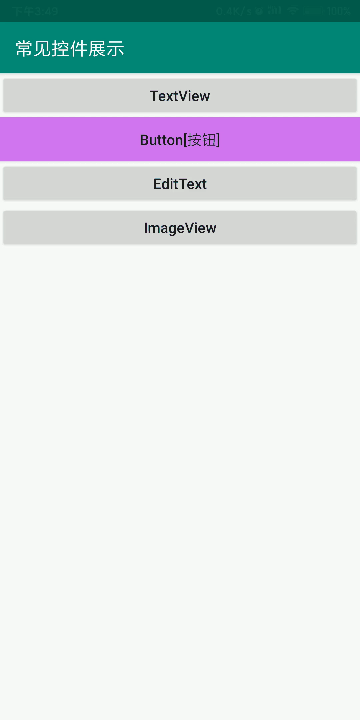

# ImageView【图片控件】

**作用**

用于在界面上展示图片的一个控件

**属性**

| 属性                     | 作用                             | 值                                                           |
| ------------------------ | -------------------------------- | ------------------------------------------------------------ |
| android:src              | 指定图片的路径                   | @drawable/图片名                                             |
| android:scaleType        | 设置图片缩放                     | fitXY【撑满控件，宽高比可能发生改变】 fitCenter【保持宽高比缩放，直至能够完全显示】centerCrop【保持宽高比缩放，直至完全覆盖控件，裁剪显示】 |
| android:adjustViewBounds | 让imgView 支持设置最大宽度和高度 | Boolean                                                      |
| android:maxWidth         | 最大宽度                         | int 【必须设置android:adjustViewBounds属性为True】           |
| android:maxHeight        | 最大高度                         | int【必须设置android:adjustViewBounds属性为True】            |
| android:tint             | 给图形添加着色                   | 十六位颜色代码                                               |

**使用**

- 在res目录下新建一个drawable-xhdpi目录
- 放至图片

#### 动态切换图片

```java
package top.miku.uiwidgettest;

import androidx.appcompat.app.AppCompatActivity;

import android.os.Bundle;
import android.view.View;
import android.widget.Button;
import android.widget.ImageView;

public class MyImageView extends AppCompatActivity {
    @Override
    protected void onCreate(Bundle savedInstanceState) {
        super.onCreate(savedInstanceState);
        setContentView(R.layout.activity_my_image_view);
        final Button button = (Button) findViewById(R.id.button_1);
        final ImageView imageView = (ImageView) findViewById(R.id.image_view);
        button.setOnClickListener(new View.OnClickListener() {
            @Override
            public void onClick(View view) {
                //获取按钮内容
                String text = button.getText().toString();
                switch (text) {
                    case "下一张":
                        //修改图片的路径
                        imageView.setImageResource(R.drawable.img_2);
                        button.setText("上一张");
                        break;
                    case "上一张":
                        imageView.setImageResource(R.drawable.img_1);
                        button.setText("下一张");
                        break;

                    default:
                        break;
                }

            }
        });
    }
}
```



#### 加载网络图片

> **注意；**
>
> 需要网络权限

- 声明网络权限

  - 打开AndroidManifest.xml添加一下代码

    ```xml
    <uses-permission android:name="android.permission.INTERNET"/>//获取网络权限
    ```

##### Glide【图片加载库】

官网；https://muyangmin.github.io/glide-docs-cn/

- 导入库

  - 直接下载jar包放入到项目的libs文件夹

  - 使用Gradle构造工具添加

    1. 打开以下路径的配置文件app\build.gradle，在指定的标签内添加如下代码

       ```groovy
       repositories {
         mavenCentral()
         google()
       }
       
       dependencies {
         implementation 'com.github.bumptech.glide:glide:4.9.0'
         annotationProcessor 'com.github.bumptech.glide:compiler:4.9.0'
       }
       ```

  - 同步一下Gradle，Gradle会自动下载依赖库

- 如何使用

  - 可以到此地址查看参考文档 [中文参考]([https://muyangmin.github.io/glide-docs-cn/doc/getting-started.html#基本用法](https://muyangmin.github.io/glide-docs-cn/doc/getting-started.html#基本用法))

  - 基本用法

    ```java
    Glide.with(fragment).load(myUrl).into(imageView);
    /*参数
        fragment；目标activity
        myUrl；图片地址String
        imageView；图片控件对象
    
    */ 
    ```