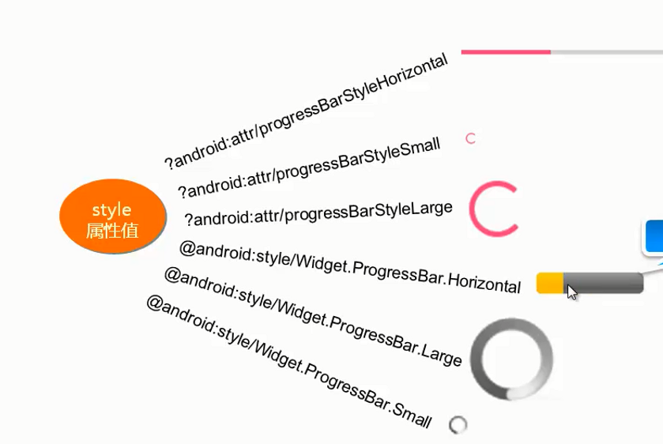

# ProgressBar【进度条】

**作用**

ProgressBar用于在界面上显示一个进度条



##### 属性

| 属性       | 作用             | 值                                                           |
| ---------- | ---------------- | ------------------------------------------------------------ |
| style      | 设置滚动条样式   | ?android:attr/progressBarStyleHorizontal【水平】更多见上图对照 |
| ndroid:max | 设置进度条最大值 | int类型                                                      |

## 关闭进度条

- #### android:visibility属性控制

  ```java
  package top.miku.uiwidgettest;
  
  import androidx.appcompat.app.AppCompatActivity;
  
  import android.os.Bundle;
  import android.view.View;
  import android.widget.Button;
  import android.widget.ProgressBar;
  
  public class MyProgressBar extends AppCompatActivity {
  
      @Override
      protected void onCreate(Bundle savedInstanceState) {
          super.onCreate(savedInstanceState);
          setContentView(R.layout.activity_my_progress_bar);
          Button buton = (Button) findViewById(R.id.button_1);
          final ProgressBar progressBar = (ProgressBar) findViewById(R.id.progress_bar);
          buton.setOnClickListener(new View.OnClickListener() {
              @Override
              public void onClick(View view) {
                  //控制控件的可见性
                  //参数
                  //View.VISIBLE 、View.INVISIBLE 和View.GONE 这3种值。
                  progressBar.setVisibility(View.GONE);
              }
          });
  
      }
  }
  ```

## 水平进度条

- 修改xml

  ```xml
  <ProgressBar
              android:id="@+id/progress_bar"
              android:layout_width="match_parent"
              android:layout_height="20dp"
              style="?android:attr/progressBarStyleHorizontal"
              android:max="100"/>
  ```

- 使用代码动态变更进度
  `setProgress`改变进度条数值

  ```java
  public class MyProgressBar extends AppCompatActivity {
      //记录进度
      private int t ;
      @Override
      protected void onCreate(Bundle savedInstanceState) {
          super.onCreate(savedInstanceState);
          setContentView(R.layout.activity_my_progress_bar);
          final ProgressBar progressBar = (ProgressBar) findViewById(R.id.progress_bar);
          //动态变更进度
          final Timer timer = new Timer();
          timer.schedule(new TimerTask() {
              @Override
              public void run() {
                  if (t != 100){
                      progressBar.setProgress(t+10);//更改进度条数值
                  }else {
                      t = 0;
                  }
              }
          },0,1000);
  ```