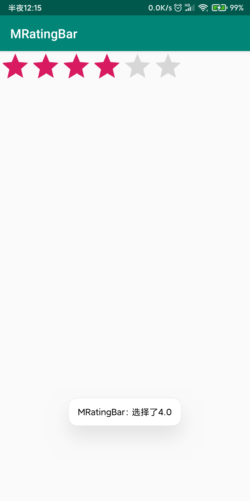

# RatingBar【星级评分条】



**属性**

| 属性                | 作用                               | 值      |
| ------------------- | ---------------------------------- | ------- |
| android:numStars    | 设置星星的个数                     | int     |
| android:rating      | 设置默认有多少星星被点亮           | int     |
| android:stepSize    | 选择时让整颗星星被点亮【默认半颗】 | int     |
| android:isIndicator | 星星不可以被用户改变               | Boolean |

**事件**

```java
package top.miku.mratingbar;

import androidx.appcompat.app.AppCompatActivity;

import android.os.Bundle;
import android.widget.RatingBar;
import android.widget.Toast;

public class MainActivity extends AppCompatActivity {

    RatingBar ratingBar;
    @Override
    protected void onCreate(Bundle savedInstanceState) {
        super.onCreate(savedInstanceState);
        setContentView(R.layout.activity_main);

        ratingBar = (RatingBar) findViewById(R.id.start_bar);
        ratingBar.setOnRatingBarChangeListener(new RatingBar.OnRatingBarChangeListener() {
            @Override
            public void onRatingChanged(RatingBar ratingBar, float v, boolean b) {
                Toast.makeText(MainActivity.this, "选择了"+v, Toast.LENGTH_SHORT).show();
            }
        });

    }
}
```