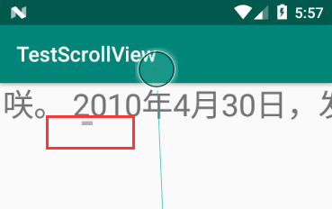

### ScrollView【滚动视图】

内容溢出后自动显式滚动条




#### HorizontalScrollView【水平滚动视图】

通过HorizontalScrollView标记改为水平滚动视图

> **注意;**
>
> 一个滚动视图中只能放至一个组件。如果需要放至多个组件可以使用布局管理器包裹。

**xml文件添加滚动视图**

- 垂直滚动视图

```xml
<?xml version="1.0" encoding="utf-8"?>
<RelativeLayout xmlns:android="http://schemas.android.com/apk/res/android"
        xmlns:app="http://schemas.android.com/apk/res-auto"
        xmlns:tools="http://schemas.android.com/tools"
        android:layout_width="match_parent"
        android:layout_height="match_parent"
        tools:context=".MainActivity">

    <!-- 添加标记 -->
<ScrollView
        android:layout_width="match_parent"
        android:layout_height="match_parent">
    <TextView
            android:layout_width="match_parent"
            android:layout_height="match_parent"
            android:text="@string/str"
            android:textSize="30sp"/>
</ScrollView>
</RelativeLayout>
```

- 水平滚动视图

  ```xml
  <?xml version="1.0" encoding="utf-8"?>
  <RelativeLayout xmlns:android="http://schemas.android.com/apk/res/android"
          xmlns:app="http://schemas.android.com/apk/res-auto"
          xmlns:tools="http://schemas.android.com/tools"
          android:layout_width="match_parent"
          android:layout_height="match_parent"
          tools:context=".MainActivity">
  <!-- 添加标记 -->
  <HorizontalScrollView
          android:layout_width="wrap_content"
          android:layout_height="wrap_content">
      <TextView
              android:layout_width="match_parent"
              android:layout_height="match_parent"
              android:text="@string/str"
              android:textSize="30sp"/>
  </HorizontalScrollView>
  </RelativeLayout>
  ```

**java代码添加**

```java
package top.miku.testscrollview;

import androidx.appcompat.app.AppCompatActivity;

import android.os.Bundle;
import android.widget.LinearLayout;
import android.widget.ScrollView;
import android.widget.TextView;

public class MainActivity extends AppCompatActivity {

    @Override
    protected void onCreate(Bundle savedInstanceState) {
        super.onCreate(savedInstanceState);
        setContentView(R.layout.activity_main);

        //获得要添加滚动视图的组件
        LinearLayout linearLayout = (LinearLayout) findViewById(R.id.java_scroll_view);

        //创建滚动视图
        ScrollView scrollView = new ScrollView(MainActivity.this);
        //创建一个要往滚动视图下的组件
        TextView textView = new TextView(MainActivity.this);
        //为TextView设置一些属性
        textView.setText(R.string.str);
        textView.setTextSize(30);

        //把TextView添加到scrollView中
        scrollView.addView(textView);

        //把scrollView添加到RootView中

        linearLayout.addView(scrollView);

    }
}
```