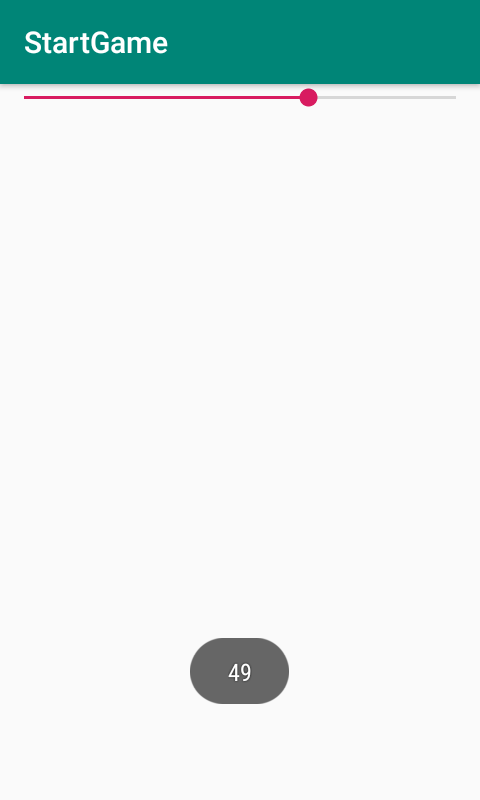

# SeekBar【拖动条】

是进度条的子类。所以支持其父类的属性。



**属性；**

| 属性             | 作用                 | 值   |
| ---------------- | -------------------- | ---- |
| android:progress | 当前进度             | int  |
| android:max      | 最大进度             | int  |
| android:thumb    | 更改进度条中的小圆点 | @    |

**事件监听**

```java
package top.miku.startgame;

import androidx.appcompat.app.AppCompatActivity;

import android.os.Bundle;
import android.view.WindowManager;
import android.widget.SeekBar;
import android.widget.Toast;

public class MainActivity extends AppCompatActivity {

    @Override
    protected void onCreate(Bundle savedInstanceState) {
        super.onCreate(savedInstanceState);
        setContentView(R.layout.activity_main);
        getWindow().setFlags(WindowManager.LayoutParams.FLAG_FULLSCREEN,
                WindowManager.LayoutParams.FLAG_FULLSCREEN); //设置全屏显示

        SeekBar seekBar = (SeekBar) findViewById(R.id.seek_bar);
        seekBar.setOnSeekBarChangeListener(new SeekBar.OnSeekBarChangeListener() {
            //数值改变时执行
            @Override
            public void onProgressChanged(SeekBar seekBar, int i, boolean b) {
                Toast.makeText(MainActivity.this, "" + i, Toast.LENGTH_SHORT).show();
            }

            //开始触摸执行
            @Override
            public void onStartTrackingTouch(SeekBar seekBar) {

            }

            //停止触摸执行。
            @Override
            public void onStopTrackingTouch(SeekBar seekBar) {

            }
        });
    }
}
```