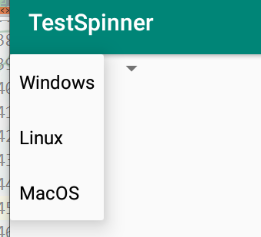
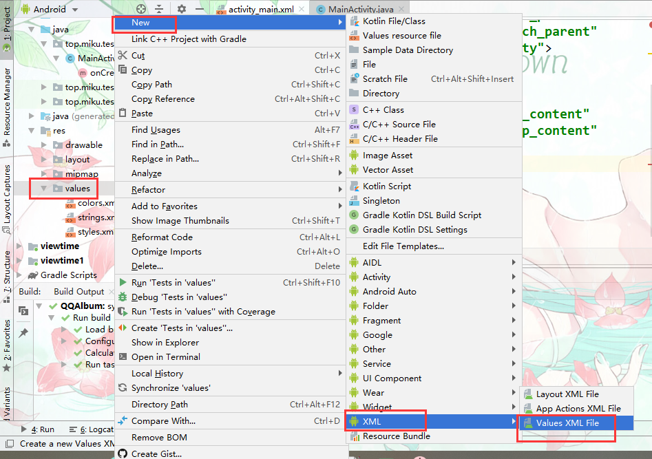

# Spinner【下拉列表】



##### 属性

| 属性            | 作用   | 值                         |
| --------------- | ------ | -------------------------- |
| android:entries | 列表项 | 一个xml数组@values下的文件 |

## xml数组形式添加列表项



```xml
=<?xml version="1.0" encoding="utf-8"?>
<resources>
    <string-array name="str">
        <item>Windows</item>
        <item>Linux</item>
        <item>MacOS</item>
    </string-array>
</resources>
```

到布局中使用android:entries属性指定上面的xml文件。

#### 通过适配器指定

- ArrayAdapter<E>   数组适配器
	-  构造参数
    1. 一个上下文对象
    2. 列表项的样式
    3. 一个数组资源

```java
package top.miku.testspinner;

import androidx.appcompat.app.AppCompatActivity;

import android.os.Bundle;
import android.widget.ArrayAdapter;
import android.widget.Spinner;

public class MainActivity extends AppCompatActivity {

    @Override
    protected void onCreate(Bundle savedInstanceState) {
        super.onCreate(savedInstanceState);
        setContentView(R.layout.activity_main);

        //一些数组资源
        String[] str = new String[] {
                "android","ios","flymeOS","miui"
        };

        //实例一个数组适配器
        ArrayAdapter<String> arrayAdapter = new ArrayAdapter<String>(
                this,
                android.R.layout.simple_dropdown_item_1line,
                str);

        //指定下拉列表的样式
        arrayAdapter.setDropDownViewResource(android.R.layout.simple_dropdown_item_1line);

        Spinner spinner = (Spinner) findViewById(R.id.spinner);
        //指定一个适配器
        spinner.setAdapter(arrayAdapter);


    }
}
```

**事件监听**

```java
spinner.setOnItemSelectedListener(new AdapterView.OnItemSelectedListener() {
            //选中项改变时执行
            @Override
            public void onItemSelected(AdapterView<?> adapterView, View view, int i, long l) {
                //获得当前选择的项，
                //adapterView中存放者适配器的资源数组
                //getItemAtPosition通过索引获取项
                //i是当前选中项的索引
                String str = adapterView.getItemAtPosition(i).toString();
                Toast.makeText(MainActivity.this, str, Toast.LENGTH_SHORT).show();

            }

            //当列表项没内容时执行
            @Override
            public void onNothingSelected(AdapterView<?> adapterView) {
            }
        });
```