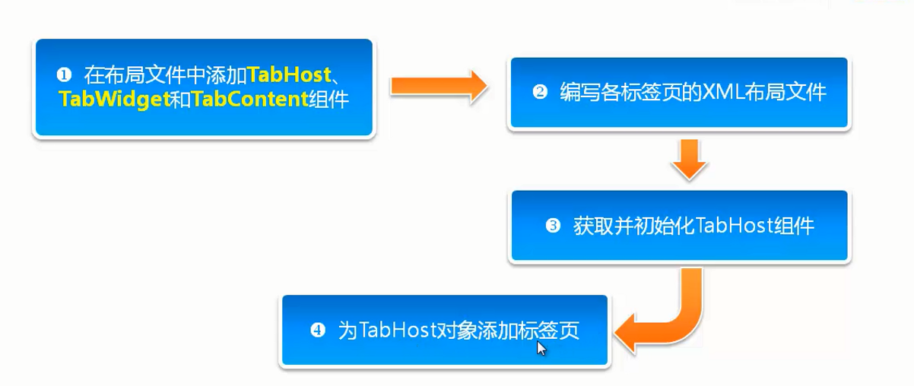

# TabHost【选项卡】


创建流程图



- activity_main.xml活动布局添加必要组件

  - 根节点使用TabHost标记设置id为Android内置id `@android:id/tabhost`
  - 使用一个布局容器包裹TabWidget标记和tabcontent标记【以LinearLayout为例】
  - TabWidget标记设置id为Android内置id`@android:id/tabs`
  - tabcontent没有对应的布局这里用其它布局代替【FrameLayout】将该标记的id设置为安卓内置id`@android:id/tabcontent`

  ```xml
  <?xml version="1.0" encoding="utf-8"?>
  <TabHost xmlns:android="http://schemas.android.com/apk/res/android"
          xmlns:app="http://schemas.android.com/apk/res-auto"
          xmlns:tools="http://schemas.android.com/tools"
          android:layout_width="match_parent"
          android:layout_height="match_parent"
          tools:context=".MainActivity"
          android:id="@android:id/tabhost">
  
      <LinearLayout
              android:layout_width="match_parent"
              android:layout_height="match_parent"
              android:orientation="vertical"
              >
          <TabWidget
                  android:id="@android:id/tabs"
                  android:layout_width="match_parent"
                  android:layout_height="wrap_content"/>
          <FrameLayout
                  android:id="@android:id/tabcontent"
                  android:layout_width="match_parent"
                  android:layout_height="match_parent"/>
      </LinearLayout>
  ```


- 编写各标签页的布局xml，需要几个标签就编写几个,并为布局的根组件设置一个id【放到R/layout文件夹下】

  - 示例tab1

    ```xml
    <?xml version="1.0" encoding="utf-8"?>
    <LinearLayout xmlns:android="http://schemas.android.com/apk/res/android"
            android:orientation="vertical" android:layout_width="match_parent"
            android:layout_height="match_parent"
            android:id="@+id/left">
    <ImageView
            android:layout_width="match_parent"
            android:layout_height="match_parent"
            android:src="@mipmap/biaoqing_left"/>
    </LinearLayout>
    ```

- 示例tab2

  ```xml
  <?xml version="1.0" encoding="utf-8"?>
  <LinearLayout xmlns:android="http://schemas.android.com/apk/res/android"
          android:orientation="vertical" android:layout_width="match_parent"
          android:layout_height="match_parent"
          android:id="@+id/right">
  <ImageView
          android:layout_width="match_parent"
          android:layout_height="match_parent"
          android:src="@mipmap/biaoqing_right"/>
  </LinearLayout>
  ```

- 获取并初始化TabHost

- 为TabHost添加标签页

  - 综合java代码

```java
  package top.miku.wechattab;

  import androidx.appcompat.app.AppCompatActivity;

  import android.os.Bundle;
  import android.view.LayoutInflater;
  import android.widget.TabHost;

  public class MainActivity extends AppCompatActivity {

      @Override
      protected void onCreate(Bundle savedInstanceState) {
          super.onCreate(savedInstanceState);
          setContentView(R.layout.activity_main);
  /*——————————————————— 获取并初始化TabHost ——————————————————————————————*/
          //获得选项卡对象
          TabHost tabHost = findViewById(android.R.id.tabhost);
          //初始化
          tabHost.setup();


          //实例化一个LayoutInflater
          //通过LayoutInflater.from()方法获取改对象实例，参数为上下文对象。
          LayoutInflater inflater = LayoutInflater.from(this);
          //加载布局文件
          //通过inflate方法加载
          //参数1.选项卡下的内容布局文件。参数2.TabContentView对象。通过选项卡对象的getTabContentView方法获得
          inflater.inflate(R.layout.tab1,tabHost.getTabContentView());
          inflater.inflate(R.layout.tab2,tabHost.getTabContentView());

  /*———————————— 为TabHost添加标签页 ——————————————————————————————*/

          //往选项卡中添加标签页布局
          /*
          * newTabSpec()创建一个新的标签并添加一个标记【标记名随意】
          * setIndicator()给新标签添加标签名
          * setContent()给新标签添加内容【事先定义的标签页布局中的root标记的id】
          * */
          tabHost.addTab(tabHost.newTabSpec("tab1").setIndicator("精选表情").setContent(R.id.left));
          tabHost.addTab(tabHost.newTabSpec("tab2").setIndicator("投稿表情").setContent(R.id.right));

      }
  }
```