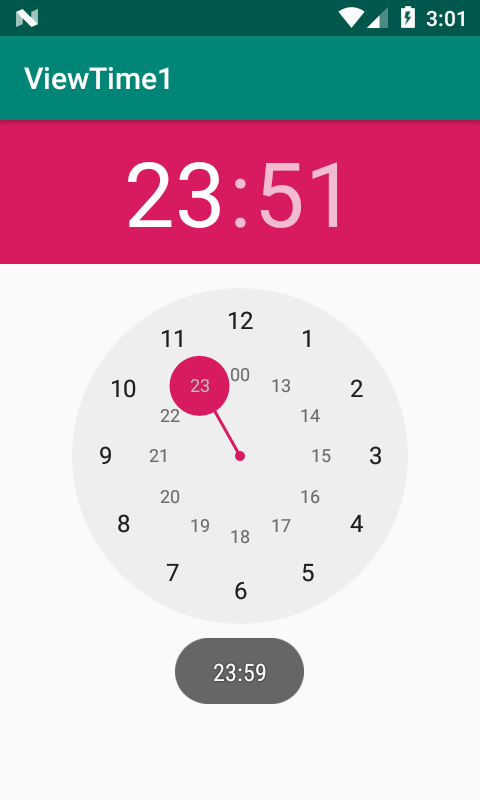

# TimePicker【时间选择器】



**事件**

```java
package top.miku.viewtime1;

import androidx.appcompat.app.AppCompatActivity;

import android.os.Bundle;
import android.widget.TimePicker;
import android.widget.Toast;

public class MainActivity extends AppCompatActivity {

    private TimePicker timePicker; //保存TimePicker对象
    @Override
    protected void onCreate(Bundle savedInstanceState) {
        super.onCreate(savedInstanceState);
        setContentView(R.layout.activity_main);

        timePicker = (TimePicker) findViewById(R.id.my_time_picker);
        timePicker.setIs24HourView(true);//设置为24小时格式。
        //监听改变后的值
        timePicker.setOnTimeChangedListener(new TimePicker.OnTimeChangedListener() {
            @Override
            public void onTimeChanged(TimePicker timePicker, int i, int i1) {
                Toast toast = Toast.makeText(MainActivity.this,null,Toast.LENGTH_SHORT);
                toast.setText(i+":"+i1); //按时分格式显式更改后的值。
                toast.show();
            }
        });
    }
}
```