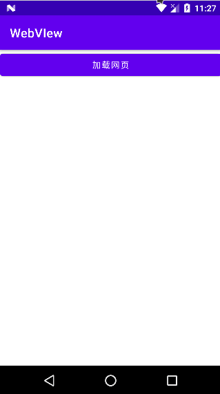

# 基本用法

## 加载网页



0. 添加权限

   ```xml
     <!--    允许访问网络-->
    <uses-permission android:name="android.permission.INTERNET" />
   ```

   

1. 准备一个承载WebView的宿主如Activity或其它

2. 创建WebVIew控件这里使用java代码创建当然也可以使用xml方式。

3. 为webView对象设置`WebViewClient`如果不指定系统会调用默认浏览器打开URL。

4. 获取WebSettings对象对WebView进行设置。

5. 加载要打开网页url

6. 这里我们将网页的回退和Back按钮事件进行关联如果网页可以回退就回退否则就关闭web页面

````java
package com.xuelingmiao.webview;

import androidx.appcompat.app.AppCompatActivity;

import android.os.Bundle;
import android.webkit.WebResourceRequest;
import android.webkit.WebView;
import android.webkit.WebViewClient;
import android.widget.Toast;

public class LoadURLActivity extends AppCompatActivity {

    private WebView mWebView;

    @Override
    protected void onCreate(Bundle savedInstanceState) {
        super.onCreate(savedInstanceState);
        setContentView(R.layout.activity_load_urlactivity);
        mWebView = new WebView(this);
        WebViewClient webViewClient = new WebViewClient();
        mWebView.setWebViewClient(webViewClient);
        //设置WebView属性,运行执行js脚本
        mWebView.getSettings().setJavaScriptEnabled(true);
        //调用loadUrl方法为WebView加入链接
        mWebView.loadUrl("http://www.baidu.com/");
        //调用Activity提供的setContentView将webView显示出来
        setContentView(mWebView);
    }

    //我们需要重写回退按钮的时间,当用户点击回退按钮：
    //1.webView.canGoBack()判断网页是否能后退,可以则goback()
    //2.如果无返回就关闭当前Activity
    @Override
    public void onBackPressed() {
        if (mWebView.canGoBack()) {
            mWebView.goBack();
        } else {
            finish();
        }
    }
}
````


