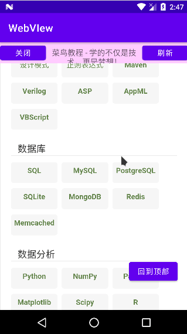
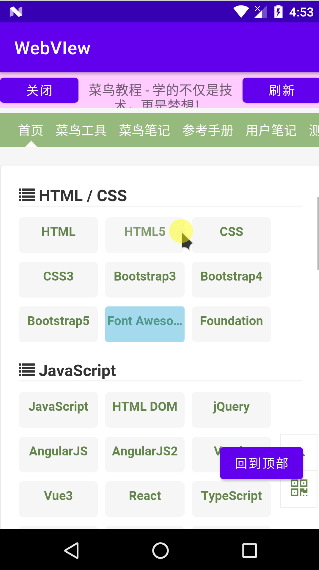
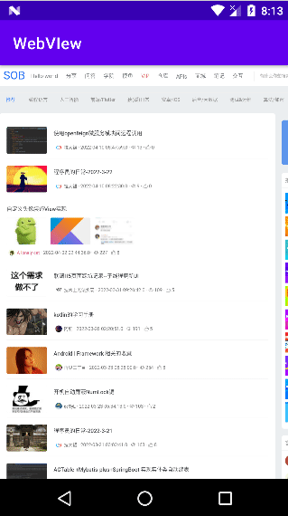
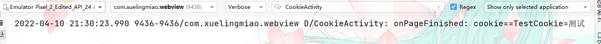

# 基本用法

## 加载网页


0. 添加权限

   ```xml
     <!--    允许访问网络-->
    <uses-permission android:name="android.permission.INTERNET" />
   ```

   

1. 准备一个承载WebView的宿主如Activity或其它

2. 创建WebVIew控件这里使用java代码创建当然也可以使用xml方式。

3. 为webView对象设置`WebViewClient`如果不指定系统会调用默认浏览器打开URL。

4. 获取WebSettings对象对WebView进行设置。

5. 加载要打开网页url

6. 这里我们将网页的回退和Back按钮事件进行关联如果网页可以回退就回退否则就关闭web页面

````java
package com.xuelingmiao.webview;

import androidx.appcompat.app.AppCompatActivity;

import android.os.Bundle;
import android.webkit.WebResourceRequest;
import android.webkit.WebView;
import android.webkit.WebViewClient;
import android.widget.Toast;

public class LoadURLActivity extends AppCompatActivity {

    private WebView mWebView;

    @Override
    protected void onCreate(Bundle savedInstanceState) {
        super.onCreate(savedInstanceState);
        setContentView(R.layout.activity_load_urlactivity);
        mWebView = new WebView(this);
        WebViewClient webViewClient = new WebViewClient();
        mWebView.setWebViewClient(webViewClient);
        //设置WebView属性,运行执行js脚本
        mWebView.getSettings().setJavaScriptEnabled(true);
        //调用loadUrl方法为WebView加入链接
        mWebView.loadUrl("http://www.baidu.com/");
        //调用Activity提供的setContentView将webView显示出来
        setContentView(mWebView);
    }

    //我们需要重写回退按钮的时间,当用户点击回退按钮：
    //1.webView.canGoBack()判断网页是否能后退,可以则goback()
    //2.如果无返回就关闭当前Activity
    @Override
    public void onBackPressed() {
        if (mWebView.canGoBack()) {
            mWebView.goBack();
        } else {
            finish();
        }
    }
}
````


## 常见布局方式实现

支持关闭、显示网页title.刷新回到顶部。



这次我们使用xml方式来加载webView控件

1. 在xml布局

   ```xml
   <?xml version="1.0" encoding="utf-8"?>
   <LinearLayout xmlns:android="http://schemas.android.com/apk/res/android"
       xmlns:app="http://schemas.android.com/apk/res-auto"
       xmlns:tools="http://schemas.android.com/tools"
       android:layout_width="match_parent"
       android:layout_height="match_parent"
       android:orientation="vertical"
       tools:context=".CommonLayoutWebActivity">
       <LinearLayout
           android:layout_width="match_parent"
           android:layout_height="40dp"
           android:background="#ffccff"
           android:orientation="horizontal">
           <Button
               android:id="@+id/web_close"
               android:layout_width="wrap_content"
               android:layout_height="wrap_content"
               android:text="关闭" />
   
           <TextView
               android:id="@+id/web_title"
               android:layout_width="0dp"
               android:layout_height="wrap_content"
               android:layout_weight="1"
               android:gravity="center"
               android:text="标题"
               android:textSize="15sp" />
   
           <Button
               android:id="@+id/web_refresh"
               android:layout_width="wrap_content"
               android:layout_height="wrap_content"
               android:text="刷新" />
       </LinearLayout>
   
       <FrameLayout
           android:layout_width="match_parent"
           android:layout_height="match_parent">
   
           <WebView
               android:id="@+id/web_view"
               android:layout_width="match_parent"
               android:layout_height="match_parent" />
   
           <Button
               android:id="@+id/web_back_top"
               android:layout_width="wrap_content"
               android:layout_height="wrap_content"
               android:text="回到顶部"
               android:layout_gravity="bottom|end"
               android:layout_marginBottom="50dp"
               android:layout_marginEnd="20dp"
               />
       </FrameLayout>
   </LinearLayout>
   ```

   

2. 为控件绑定事件

3. webVIew加载所需url

4. 为WebVIew设置`WebChromeClient` 对象并重写它的``public void onReceivedTitle(WebView view, String title)` 方法获取web页面的title赋值给我们的titl控件。

5. 处理刷新等按钮事件调用

````java
package com.xuelingmiao.webview;

import androidx.appcompat.app.AppCompatActivity;

import android.os.Bundle;
import android.view.View;
import android.webkit.WebChromeClient;
import android.webkit.WebView;
import android.webkit.WebViewClient;
import android.widget.TextView;

public class CommonLayoutWebActivity extends AppCompatActivity implements View.OnClickListener {

    private WebView mWebView;
    private TextView mTitle;

    @Override
    protected void onCreate(Bundle savedInstanceState) {
        super.onCreate(savedInstanceState);
        setContentView(R.layout.activity_common_layout_web);
        initView();
    }

    private void initView() {
        mWebView = findViewById(R.id.web_view);
        mTitle = findViewById(R.id.web_title);
        findViewById(R.id.web_close).setOnClickListener(this);
        findViewById(R.id.web_refresh).setOnClickListener(this);
        findViewById(R.id.web_back_top).setOnClickListener(this);

        mWebView.loadUrl("https://www.runoob.com/");
        mWebView.setWebChromeClient(new WebChromeClient() {
            @Override
            public void onReceivedTitle(WebView view, String title) {
                mTitle.setText(title);
            }
        });
        mWebView.setWebViewClient(new WebViewClient());
    }


    @Override
    public void onClick(View view) {
        int id = view.getId();
        if (id == R.id.web_close) {
            finish();
        } else if (id == R.id.web_refresh) {
            mWebView.reload();  // 重新载入页面
        } else if (id == R.id.web_back_top) {
            mWebView.setScrollY(0); // 回到顶部
        }
    }

    //对back按键处理如果页面可返回就返回否则就关闭web页面
    @Override
    public void onBackPressed() {
        if (mWebView.canGoBack()) {
            mWebView.goBack();
        } else {
            finish();
        }
    }
}
````


### 监听WebView滚动事件

webView没有给我们提供想`setOnScrollChangedListener`这样的设置滚动事件方法。

但是我们可以通过重写WebVIew的 `protected void onScrollChanged(final int l, final int t, final int oldl,final int oldt){}` 然后再对外提供一个接口。

````java
package com.xuelingmiao.webview;

import android.content.Context;
import android.util.AttributeSet;
import android.webkit.WebView;

import androidx.annotation.NonNull;

/**
 * @ProjectName: WebVIew
 * @Package: com.xuelingmiao.webview
 * @ClassName: MyWebView
 * @Description: 作用描述
 * @Author: Bury我们past
 * @CreateDate: 2022/4/10 16:04
 * @UpdateUser: 更新者：
 * @UpdateDate: 2022/4/10 16:04
 * @UpdateRemark: 更新说明：
 * @Version: 1.0
 */
public class MyWebView extends WebView {

    private OnScrollChangedCallback mOnScrollChangedCallback;

    /*--------------提供必要构造器------------------------*/
    public MyWebView(Context context) {
        super(context);
    }

    public MyWebView(Context context, AttributeSet attrs) {
        super(context, attrs);
    }

    public MyWebView(Context context, AttributeSet attrs, int defStyleAttr) {
        super(context, attrs, defStyleAttr);
    }

    // 滚动条更改时回调
    @Override
    protected void onScrollChanged(int l, int t, int oldl, int oldt) {
        super.onScrollChanged(l, t, oldl, oldt);
        if (mOnScrollChangedCallback != null) {
            mOnScrollChangedCallback.onScroll(l - oldl, t - oldt);
        }
    }

    public OnScrollChangedCallback getOnScrollChangedCallback() {
        return mOnScrollChangedCallback;
    }

    /**
     * 设置滚动事件监听器
     * @param onScrollChangedCallback 监听器
     */
    public void setOnScrollChangedCallback(final OnScrollChangedCallback onScrollChangedCallback) {
        mOnScrollChangedCallback = onScrollChangedCallback;
    }
    /*-----------对外接口--------------------------*/
    public static interface OnScrollChangedCallback {
        //这里的dx和dy代表的是x轴和y轴上的偏移量，你也可以自己把l, t, oldl, oldt四个参数暴露出来
        /**
         * 滚动条滚动
         * @param dx x轴偏移
         * @param dy y轴偏移
         */
         void onScroll(int dx, int dy);
    }
}

````


我们对上面的常见布局中代码示例，回到顶部按钮就行优化，当滚动条往上移动后在显示，否则就隐藏。

1. 我们把WebVIew控件替换为我们自己的

   ````xml
    <com.xuelingmiao.webview.MyWebView
               android:id="@+id/web_view"
               android:layout_width="match_parent"
               android:layout_height="match_parent" />
   ````

   

2. 监听滚动条事件，动态显示回到顶部按钮。

   ````java
           /**
            * 当Y轴偏移大于0时显示回到顶部按钮
            */
           mWebView.setOnScrollChangedCallback(new MyWebView.OnScrollChangedCallback() {
               @Override
               public void onScroll(int dx, int dy) {
                   if (dy > 0) {
                       findViewById(R.id.web_back_top).setVisibility(View.VISIBLE);
                   } else {
                       findViewById(R.id.web_back_top).setVisibility(View.GONE);
                   }
               }
           });
   ````

   




## 手势缩放以及自适应屏幕




````java
package com.xuelingmiao.webview;

import androidx.appcompat.app.AppCompatActivity;

import android.os.Bundle;
import android.webkit.WebSettings;
import android.webkit.WebView;
import android.webkit.WebViewClient;

public class ZoomActivity extends AppCompatActivity {

    private WebView mWebView;

    @Override
    protected void onCreate(Bundle savedInstanceState) {
        super.onCreate(savedInstanceState);
        setContentView(R.layout.activity_zoom);
        mWebView = new WebView(this);
        mWebView.setWebViewClient(new WebViewClient());
        WebSettings settings = mWebView.getSettings();
        settings.setUseWideViewPort(true);//设定支持viewport
        settings.setLoadWithOverviewMode(true);   //自适应屏幕
        settings.setBuiltInZoomControls(true); //启用内置缩放机制
        settings.setDisplayZoomControls(false); // 不显示缩放控件
        settings.setSupportZoom(true);//设定支持缩放
        mWebView.loadUrl("https://www.sunofbeach.net/");
        setContentView(mWebView);
    }
}
````

更多缩放内容可以查看概览中的api

## WebView的Cookie数据

### 设置Cookie

1. 获取CookieManager实例
2. 设置接收cookie
3. 设置cookie
4. 写入cookie

```java
 public void setCookie(){
        CookieManager cookieManager = CookieManager.getInstance();
        // 设置接收cookie
        cookieManager.setAcceptCookie(true);
        // 为给定的 URL 设置单个 cookie（键值对）。
        cookieManager.setCookie(url,cookieKey+"=测试");
        cookieManager.flush();
    }
```


上述代码需要写在loadUrl()之前，而且如果设置了Cookie了，尽量别再进行其他的设置 不然可能会无效，建议设置cookie的**写在webView相关设置的最后面,loadUrl()之前!**

### 获取Cookie

1. 获取CookieManager实例

2. 调用getCookie();方法获取对应url下的cookie

   ````java
     mWebView.setWebViewClient(new WebViewClient(){
               @Override
               public void onPageFinished(WebView view, String url) {
                   // 在页面加载完成
                   CookieManager cookieManager = CookieManager.getInstance();
                   String cookie = cookieManager.getCookie(url);
                   Log.d(TAG, "onPageFinished: cookie=="+cookie);
               }
           });
   ````

   



**完整示例；**

````java
package com.xuelingmiao.webview;

import androidx.appcompat.app.AppCompatActivity;

import android.os.Bundle;
import android.util.Log;
import android.webkit.CookieManager;
import android.webkit.CookieSyncManager;
import android.webkit.WebView;
import android.webkit.WebViewClient;

public class CookieActivity extends AppCompatActivity {

    private static final String TAG = "CookieActivity";
    private WebView mWebView;
    private String url = "https://www.sunofbeach.net/";
    private String cookieKey = "TestCookie";

    @Override
    protected void onCreate(Bundle savedInstanceState) {
        super.onCreate(savedInstanceState);
        setContentView(R.layout.activity_cookie);

        mWebView = new WebView(this);
        setCookie();// 设置cookie
        mWebView.setWebViewClient(new WebViewClient(){
            @Override
            public void onPageFinished(WebView view, String url) {
                // 在页面加载完成
                CookieManager cookieManager = CookieManager.getInstance();
                String cookie = cookieManager.getCookie(url);
                Log.d(TAG, "onPageFinished: cookie=="+cookie);
            }
        });
        mWebView.loadUrl(url);
        setContentView(mWebView);

    }

    public void setCookie(){
        CookieManager cookieManager = CookieManager.getInstance();
        // 设置接收cookie
        cookieManager.setAcceptCookie(true);
        // 为给定的 URL 设置单个 cookie（键值对）。
        cookieManager.setCookie(url,cookieKey+"=测试");
        cookieManager.flush();
    }


}
````


### Cookie组成格式

```
name=value;expires=Thu,18 Dec 2043 12:00:00 GMT; path=/
```

每个属性值之间用分号分隔.

| 属性项     | 属性项介绍                                                   |
| :--------- | :----------------------------------------------------------- |
| NAME=VALUE | 键值对，可以设置要保存的 Key/Value，注意这里的 NAME 不能和其他属性项的名字一样 |
| Expires    | 过期时间，在设置的某个时间点后该 Cookie 就会失效             |
| Domain     | 生成该 Cookie 的域名，如 `domain="www.baidu.com"`              |
| Path       | 该 Cookie 是在当前的哪个路径下生成的，如 path=/wp-admin/     |
| Secure     | 如果设置了这个属性，那么只会在 SSH 连接时才会回传该 Cookie   |


