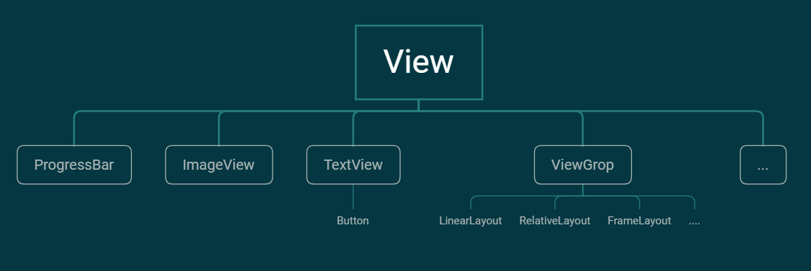

# 概览

## View继承体系

### View和ViewGrop的区别

- ViewGrop用于管理/摆放子View 是一个控件组，内部可以包含其他View和ViewGrop
- View只代表单个View不可以包含其他View

## 自定义控件分类

- 自定义组合控件

  把先用的控件组合为一个新的控件

- 自定义View

- 自定义ViewGroup 定义如何摆放子控件

## 自定义控件的步骤

