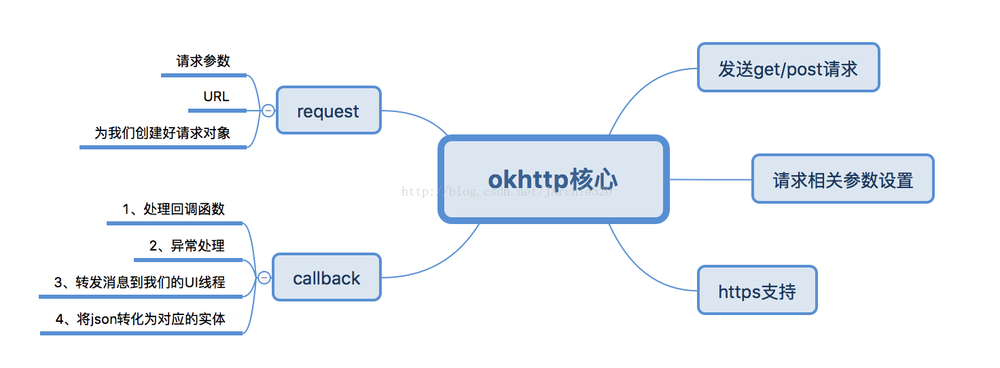

# 简易网络框架



1. 首先是封装我们的Request，创建一个类来接收请求参数和URL，然后返回给我们一个创建好的请求对象；
2. 然后是封装我们的okhttp核心部分，这部分首先要能完成请求的发送（主要是get和post请求，然后是配置我们的okhttp相关的参数，并且我们还添加了https请求的支持，这里是对所有https类型站点的信任
3. 最后封装callback部分，我们为这部分封装了对成功和失败的回调处理以及相关的异常处理，还有就是okhttp在回调完成后此时还是处于子线程中的，这点是它框架的机制导致的，所以这时候我们还不能进行UI操作，我们需要把消息转发到主线程中去，最后为了方便应用层的处理，我们在框架层就提前将服务器返回的json数据解析成对应的实体对象，然后我们在应用层中就可以直接操作我们Bean类中的属性了。

**类图；**

## 框架封装

### 请求封装

#### 请求参数

封装我们的请求参数到一个HashMap中，这个类并不是我写的，是参考了之前使用的一个网络框架AsyncHttpClient中的代码，创建了两个线程安全的HashMap，将请求参数以键值对的形式放到我们的HashMap中

````java
package com.example.netlibrary.xueling.netlibrary.request;

import java.io.FileNotFoundException;
import java.util.HashMap;
import java.util.Map;
import java.util.concurrent.ConcurrentHashMap;

/*创建请求参数类*/

@SuppressWarnings({"unused", "RedundantIfStatement"})
public class RequestParams {
    //线程安全的HashMap
    public ConcurrentHashMap<String, String> urlParams = new ConcurrentHashMap<>();
    public ConcurrentHashMap<String, Object> fileParams = new ConcurrentHashMap<>();

    /**
     * 构造一个新的空 {@code RequestParams} 实例.
     */
    public RequestParams() {
        //调用本类的有参构造
        this((Map<String, String>) null);
    }

    /**
     * 通过Map键值对构造一个RequestParams 实例
     *
     *
     * @param source 要添加的源键值字符串映射。
     */
    public RequestParams(Map<String, String> source) {
        if (source != null) {
            for (Map.Entry<String, String> entry : source.entrySet()) {
                put(entry.getKey(), entry.getValue());
            }
        }
    }

    /**
     * 使用单个初始键值字符串参数填充它。构造一个新的 RequestParams 实例并
     *
     * @param key   初始参数的键名。
     * @param value 初始参数的值字符串。
     */
    public RequestParams(final String key, final String value) {
        //调用本类的有参构造
        this(new HashMap<String, String>() {
            {
                put(key, value);
            }
        });
    }
/*-------------构造器 end -------------------------*/
    /**
     * 向请求添加键值字符串对。
     *
     * @param key   键名.
     * @param value 键值
     */
    public void put(String key, String value) {
        if (key != null && value != null) {
            urlParams.put(key, value);
        }
    }

    public void put(String key, Object object) throws FileNotFoundException {
        if (key != null) {
            fileParams.put(key, object);
        }
    }

    /**
     * 是否有参数
     * @return
     */
    public boolean hasParams() {
        if (urlParams.size() > 0 || fileParams.size() > 0) {
            return true;
        }
        return false;
    }

}


````

#### 请求对象生成

这个类会根据我们的请求参数生成一个Request对象，这里因为内容较少所有**没有采用构建者的模式，**

这个类中我们创建了两个方法用于生成get和post类型的Request，都是通过循环遍历Map中的请求参数来完成的，不同的是，get请求的key-value是通过“&”拼接的，所以这里使用了StringBuilder来完成字符串的拼接，效率更高，post请求是通过okhttp中的FormBody对象的建造者来完成的

````java
package com.example.netlibrary.xueling.netlibrary.request;

import java.util.Map;

import okhttp3.FormBody;
import okhttp3.Request;

/*负责生成请求对象*/
public class CommonRequest {
    /**
     * 创建Get请求的Request
     *
     * @param url
     * @param params
     * @return 通过传入的参数返回一个Get类型的请求
     */
    public static Request createGetRequest(String url, RequestParams params) {
        StringBuilder urlBuilder = new StringBuilder(url).append("?");

        if (params != null) {
            for (Map.Entry<String, String> entry : params.urlParams.entrySet()) {
                urlBuilder
                        .append(entry.getKey())
                        .append("=")
                        .append(entry.getValue())
                        .append("&");
            }
        }

        return new Request.Builder().url(urlBuilder.substring(0, urlBuilder.length() - 1))
                .get().build();
    }

    /**
     * 创建Post请求的Request
     *
     * @param url
     * @param params
     * @return 返回一个创建好的Request对象
     */
    public static Request createPostRequest(String url, RequestParams params) {
        FormBody.Builder mFromBodyBuilder = new FormBody.Builder();

        if (params != null) {
            for (Map.Entry<String, String> entry : params.urlParams.entrySet()) {
                //将请求参数逐一遍历添加到我们的请求构建类中
                mFromBodyBuilder.add(entry.getKey(), entry.getValue());
            }
        }

        //通过请求构建类的build方法获取到真正的请求体对象
        FormBody mFormBody = mFromBodyBuilder.build();
        return new Request.Builder().url(url).post(mFormBody).build();
    }
}

````


### 封装OkHttp核心部分

这部分主要完成的功能是：

1. 请求的发送；
2. 请求参数的配置（这里配置了连接超时和读写超时时间，允许重定向）；
3. 添加https的支持，在hostnameVerifier的回调中我们返回的是true，表明对所有类型的https证书的支持，无论是自己生成的还是购买的，对于sslSocketFactory的设置，我这里是参考网上的相关代码做了一个封装，https就是在TCP和HTTP协议之间加了一层SSL协议，是介于传输层和应用层之间的协议，需要注意的是加密算法的类型要与服务端的保持一致，一般为TSL/SSL，关于https,.这里推荐给大家一篇鸿洋的文章，Android Https相关完全解析http://blog.csdn.net/lmj623565791/article/details/48129405。关于配置的一系列操作都是放**在静态语句块中执行的**，主要是通过OkHttpClient对象的Builder对象来设置的，
4. 最后我们创建了get()和post()两个方法，用于发送具体的请求，参数传入我们的Request和CallBack回调.

```java
package com.example.netlibrary.xueling.netlibrary;


import com.example.netlibrary.xueling.netlibrary.listener.listener.DisposeDataHandle;
import com.example.netlibrary.xueling.netlibrary.netutils.HttpsUtils;
import com.example.netlibrary.xueling.netlibrary.response.CommonJsonCallback;

import java.util.concurrent.TimeUnit;

import javax.net.ssl.HostnameVerifier;
import javax.net.ssl.SSLSession;

import okhttp3.Call;
import okhttp3.OkHttpClient;
import okhttp3.Request;

/*okhttp核心请求类*/
public class CommonOkHttpClient {
    private static final int TIME_OUT = 30; //超时参数
    private static OkHttpClient mOkHttpClient;

    //为我们的Client配置参数，使用静态语句块来配置
    static {
        //创建我们Client对象的构建者
        OkHttpClient.Builder okHttpBuilder = new OkHttpClient.Builder();
        okHttpBuilder
                //为构建者填充超时时间
                .connectTimeout(TIME_OUT, TimeUnit.SECONDS)
                .readTimeout(TIME_OUT, TimeUnit.SECONDS)
                .writeTimeout(TIME_OUT, TimeUnit.SECONDS)
                //允许重定向
                .followRedirects(true)
                //添加https支持
                .hostnameVerifier(new HostnameVerifier() {
                    @Override
                    public boolean verify(String s, SSLSession sslSession) {
                        return true;
                    }
                })
                .sslSocketFactory(HttpsUtils.initSSLSocketFactory(), HttpsUtils.initTrustManager());
        mOkHttpClient = okHttpBuilder.build();
    }

    //发送具体的HTTP以及Https请求
    public static Call sendRequest(Request request, CommonJsonCallback commonCallback) {
        Call call = mOkHttpClient.newCall(request);
        call.enqueue(commonCallback);
        return call;
    }

    //GET请求
    public static Call get(Request request, DisposeDataHandle handle) {
        Call call = mOkHttpClient.newCall(request);
        call.enqueue(new CommonJsonCallback(handle));
        return call;
    }

    //POST请求
    public static Call post(Request request, DisposeDataHandle handle) {
        Call call = mOkHttpClient.newCall(request);
        call.enqueue(new CommonJsonCallback(handle));
        return call;
    }

}

```

**HttpsUtils**

````java
package com.example.netlibrary.xueling.netlibrary.netutils;

import java.io.IOException;
import java.io.InputStream;
import java.security.KeyManagementException;
import java.security.KeyStore;
import java.security.KeyStoreException;
import java.security.NoSuchAlgorithmException;
import java.security.SecureRandom;
import java.security.UnrecoverableKeyException;
import java.security.cert.CertificateException;
import java.security.cert.CertificateFactory;
import java.security.cert.X509Certificate;

import javax.net.ssl.KeyManager;
import javax.net.ssl.KeyManagerFactory;
import javax.net.ssl.SSLContext;
import javax.net.ssl.SSLSocketFactory;
import javax.net.ssl.TrustManager;
import javax.net.ssl.TrustManagerFactory;
import javax.net.ssl.X509TrustManager;

/**
 * 项目名:   NetTest2
 * 包名:     com.archie.netlibrary.okhttp.https
 * 文件名:   HttpsUtils
 * 创建者:   Jarchie
 * 创建时间: 17/12/13 上午10:53
 * 描述:     ssl支持
 */

@SuppressWarnings({"TryWithIdenticalCatches", "UnnecessaryLocalVariable", "ConstantConditions", "unused"})
public class HttpsUtils {
    //对指定证书的信任
    public static SSLSocketFactory getSslSocketFactory(InputStream[] certificates, InputStream bksFile, String password) {
        try {
            TrustManager[] trustManagers = prepareTrustManager(certificates);
            KeyManager[] keyManagers = prepareKeyManager(bksFile, password);
            SSLContext sslContext = SSLContext.getInstance("SSL");

            sslContext.init(keyManagers, new TrustManager[]
                    {new MyTrustManager(chooseTrustManager(trustManagers))}, new SecureRandom());
            return sslContext.getSocketFactory();
        } catch (NoSuchAlgorithmException e) {
            throw new AssertionError(e);
        } catch (KeyManagementException e) {
            throw new AssertionError(e);
        } catch (KeyStoreException e) {
            throw new AssertionError(e);
        }
    }

    private static TrustManager[] prepareTrustManager(InputStream... certificates) {
        if (certificates == null || certificates.length <= 0)
            return null;
        try {

            CertificateFactory certificateFactory = CertificateFactory.getInstance("X.509");
            KeyStore keyStore = KeyStore.getInstance(KeyStore.getDefaultType());
            keyStore.load(null);
            int index = 0;
            for (InputStream certificate : certificates) {
                String certificateAlias = Integer.toString(index++);
                keyStore.setCertificateEntry(certificateAlias, certificateFactory.generateCertificate(certificate));
                try {
                    if (certificate != null)
                        certificate.close();
                } catch (IOException e) {
                }
            }
            TrustManagerFactory trustManagerFactory;

            trustManagerFactory = TrustManagerFactory.getInstance(TrustManagerFactory.getDefaultAlgorithm());
            trustManagerFactory.init(keyStore);

            TrustManager[] trustManagers = trustManagerFactory.getTrustManagers();

            return trustManagers;
        } catch (NoSuchAlgorithmException e) {
            e.printStackTrace();
        } catch (CertificateException e) {
            e.printStackTrace();
        } catch (KeyStoreException e) {
            e.printStackTrace();
        } catch (Exception e) {
            e.printStackTrace();
        }
        return null;

    }

    private static KeyManager[] prepareKeyManager(InputStream bksFile, String password) {
        try {
            if (bksFile == null || password == null)
                return null;

            KeyStore clientKeyStore = KeyStore.getInstance("BKS");
            clientKeyStore.load(bksFile, password.toCharArray());
            KeyManagerFactory keyManagerFactory = KeyManagerFactory
                    .getInstance(KeyManagerFactory.getDefaultAlgorithm());
            keyManagerFactory.init(clientKeyStore, password.toCharArray());
            return keyManagerFactory.getKeyManagers();

        } catch (KeyStoreException e) {
            e.printStackTrace();
        } catch (NoSuchAlgorithmException e) {
            e.printStackTrace();
        } catch (UnrecoverableKeyException e) {
            e.printStackTrace();
        } catch (CertificateException e) {
            e.printStackTrace();
        } catch (IOException e) {
            e.printStackTrace();
        } catch (Exception e) {
            e.printStackTrace();
        }
        return null;
    }

    private static X509TrustManager chooseTrustManager(TrustManager[] trustManagers) {
        for (TrustManager trustManager : trustManagers) {
            if (trustManager instanceof X509TrustManager) {
                return (X509TrustManager) trustManager;
            }
        }
        return null;
    }

    @SuppressWarnings("WeakerAccess")
    private static class MyTrustManager implements X509TrustManager {
        private X509TrustManager defaultTrustManager;
        private X509TrustManager localTrustManager;

        public MyTrustManager(X509TrustManager localTrustManager) throws NoSuchAlgorithmException, KeyStoreException {
            TrustManagerFactory var4 = TrustManagerFactory.getInstance(TrustManagerFactory.getDefaultAlgorithm());
            var4.init((KeyStore) null);
            defaultTrustManager = chooseTrustManager(var4.getTrustManagers());
            this.localTrustManager = localTrustManager;
        }

        @Override
        public void checkClientTrusted(X509Certificate[] chain, String authType) throws CertificateException {

        }

        @Override
        public void checkServerTrusted(X509Certificate[] chain, String authType) throws CertificateException {
            try {
                defaultTrustManager.checkServerTrusted(chain, authType);
            } catch (CertificateException ce) {
                localTrustManager.checkServerTrusted(chain, authType);
            }
        }

        @Override
        public X509Certificate[] getAcceptedIssuers() {
            return new X509Certificate[0];
        }
    }

    /**
     * 对所有站点的信任
     *
     * @return SSLSocketFactory工厂对象
     */
    public static SSLSocketFactory initSSLSocketFactory() {
        //创建加密上下文
        SSLContext sslContext = null;
        try {
            //这里要与服务器的算法类型保持一致TSL/SSL
            sslContext = SSLContext.getInstance("SSL");
            X509TrustManager[] xTrustArray = new X509TrustManager[]
                    {initTrustManager()};
            sslContext.init(null,
                    xTrustArray, new SecureRandom());
        } catch (Exception e) {
            e.printStackTrace();
        }
        return sslContext.getSocketFactory();
    }

    /**
     * 生成TrustManager信任管理器类
     *
     * @return X509TrustManager
     */
    public static X509TrustManager initTrustManager() {
        X509TrustManager mTrustManager = new X509TrustManager() {
            @Override
            public X509Certificate[] getAcceptedIssuers() {
                return new X509Certificate[]{};
            }

            @Override
            public void checkServerTrusted(X509Certificate[] chain, String authType) throws CertificateException {
            }

            @Override
            public void checkClientTrusted(X509Certificate[] chain, String authType) throws CertificateException {
            }
        };
        return mTrustManager;
    }
}

````

### 封装Callback

#### 事件处理回调接口

自定义事件监听的回调，用于处理成功和失败的请求，参数中使用的是Object类型，这样能够更灵活的处理数据：

````java
package com.example.netlibrary.xueling.netlibrary.listener.listener;

/**
 * 描述:     自定义事件监听回调，处理请求成功和失败时的回调函数
 */

public interface DisposeDataListener {

    //请求成功回调事件处理
    void onSuccess(Object responseObj);

    //请求失败回调事件处理
    void onFailure(Object responseObj);

}

````

接着新建一个类，将我们的事件回调接口和用于处理Json转换**Bean包**实体对象的字节码对象做一个封装，给出单参和双参的构造方法：

```java
package com.example.netlibrary.xueling.netlibrary.listener.listener;

/**
 * 描述: 封装回调接口和要转换的实体对象
 */

@SuppressWarnings("WeakerAccess")
public class DisposeDataHandle {

    public DisposeDataListener mListener = null;
    public Class<?> mClass = null;  // 存储json字符串映射对象

    public DisposeDataHandle(DisposeDataListener listener) {
        this.mListener = listener;
    }

    public DisposeDataHandle(DisposeDataListener listener, Class<?> clazz) {
        this.mListener = listener;
        this.mClass = clazz;
    }

}
```

接着我们再自定义一个异常类，返回错误码和错误信息到业务层：

````java
package com.example.netlibrary.xueling.netlibrary.exception;

/**
 * 描述: 自定义异常类，返回ecode,emsg到业务层
 */

public class OkHttpException extends Exception {
    private static final long serialVersionUID = 1L;

    private int ecode; //错误码
    private Object emsg; //错误消息

    public OkHttpException(int ecode, Object emsg) {
        this.ecode = ecode;
        this.emsg = emsg;
    }

    public int getEcode() {
        return ecode;
    }

    public Object getEmsg() {
        return emsg;
    }

}

````

**处理Json数据的响应**

创建一个类用于专门处理Json数据的响应，命名为CommonJsonCallback

- 实现OKHTTP3中的Callback接口，重写onFailure和onResponse这两个失败和成功的回调函数，
- 在这个类中我们定义了一些基本的常量，首先定义了与服务器字段的对应关系的常量，其次自定义了一些异常类型，这些字段需要和自己公司的后台开发人员进行商定，这里我只是简单的举个栗子
- 我们定义了一个Handler对象用于进行消息的转发，
- 自定义回调监听用于对响应数据的回调处理，
- 字节码文件用于对实体对象的转化
- **将成功或失败数据转发到主线成处理**

````java
package com.example.netlibrary.xueling.netlibrary.response;


import android.os.Handler;
import android.os.Looper;

import androidx.annotation.NonNull;

import com.example.netlibrary.xueling.netlibrary.exception.OkHttpException;
import com.example.netlibrary.xueling.netlibrary.listener.listener.DisposeDataHandle;
import com.example.netlibrary.xueling.netlibrary.listener.listener.DisposeDataListener;
import com.google.gson.Gson;

import org.json.JSONObject;

import java.io.IOException;

import okhttp3.Call;
import okhttp3.Callback;
import okhttp3.Response;

/**
 * 描述:     专门处理JSON数据的回调响应
 */

@SuppressWarnings("UnnecessaryReturnStatement")
public class CommonJsonCallback implements Callback {   //实现okhttp 回调接口

    //与服务器的字段的一个对应关系
    protected final String RESULT_CODE = "code"; //返回值结果码键名
    protected final int RESULT_CODE_VALUE = 0;  // 结果码成功默认值
    protected final String ERROR_MSG = "message";  // 结果信息
    protected final String EMPTY_MSG = ""; // 成功请求结果信息默认值

    //自定义异常类型
    protected final int NETWORK_ERROR = -1; //网络错误
    protected final int JSON_ERROR = -2; // json错误
    protected final int OTHER_ERROR = -3; //其它原因错误

    private Handler mDeliveryHandler; //进行消息的转发
    private DisposeDataListener mListener; //事件接口对象
    private Class<?> mClass; // json字符映射对象

    /**
     * 通过DisposeDataHandle对象构建一个实例
     * @param handle
     */
    public CommonJsonCallback(DisposeDataHandle handle) {
        this.mListener = handle.mListener;
        this.mClass = handle.mClass;
        this.mDeliveryHandler = new Handler(Looper.getMainLooper()); //通过住线程的looper创建一个事件处理对象
    }
/*------------重写okhttp的callback回调--------------------------*/
    //请求失败的处理
    @Override
    public void onFailure(@NonNull Call call, @NonNull final IOException e) {
        mDeliveryHandler.post(new Runnable() {
            @Override
            public void run() {
                //抛出网络错误异常
                mListener.onFailure(new OkHttpException(NETWORK_ERROR, e));
            }
        });
    }

    //请求成功的处理
    @Override
    public void onResponse(@NonNull Call call, @NonNull Response response) throws IOException {
        final String result = response.body().string();
        //把数据处理数转发到阿主线程处理
        mDeliveryHandler.post(new Runnable() {
            @Override
            public void run() {
                handleResponse(result);
            }
        });
    }

    /**
     * 处理成功的响应
     * @param responseObj
     */
    private void handleResponse(Object responseObj) {
        //为了保证代码的健壮性
        if (responseObj == null && responseObj.toString().trim().equals("")) {
            mListener.onFailure(new OkHttpException(NETWORK_ERROR, EMPTY_MSG));
            return;
        }
        try {
            JSONObject result = new JSONObject(responseObj.toString());
            // 如果此对象具有此名称的映射，则返回 true。映射可能为 NULL
            if (result.has(RESULT_CODE)) {
                //从JSON对象中取出我们的响应码，如果为0，则是正确的响应
                if (result.getInt(RESULT_CODE) == RESULT_CODE_VALUE) {
                    if (mClass == null) {
                        //无json映射对象返回原始json对象
                        mListener.onSuccess(responseObj);
                    } else { //需要转化为实体对象
                        Object obj = new Gson().fromJson((String) responseObj, mClass);
                        if (obj != null) { //表明正确的转为了实体对象
                            mListener.onSuccess(obj);
                        } else {
                            mListener.onFailure(new OkHttpException(JSON_ERROR, EMPTY_MSG));
                        }
                    }
                } else { //将服务端返回的异常回调到应用层去处理
                    mListener.onFailure(new OkHttpException(OTHER_ERROR, result.get(RESULT_CODE)));
                }
            }
        } catch (Exception e) {
            e.printStackTrace();
            // 其它错误
            mListener.onFailure(new OkHttpException(OTHER_ERROR, e.getMessage()));
        }
    }

}

````

## 测试框架

1. 准备服务器数据

2. 根据对应的json数据，这里创建一个TestModel实体类

3. 定义接口管理类，统一管理接口地址（实际项目中都要这么做）

   ````java
   package com.example.netlibrary.constant
   
   public class HttpConstant {
       private static final String URL = "http://127.0.0.1:8024/";
   
       public static String HOME_RECOMMAND = URL + "test.json";
   }
   
   ````

   

4. 为了调用简单，我们在应用层中再做一层封装，定义一个RequestCenter类，在其中通过方法的重载，对外只暴露一个我们自定义的回调监听，其它几个参数都在这个类中传入即可，

   ```java
   package com.example.netlibrary.request;
   
   import com.example.netlibrary.bean.AppConfig;
   import com.example.netlibrary.constant.HttpConstant;
   import com.example.netlibrary.xueling.netlibrary.CommonOkHttpClient;
   import com.example.netlibrary.xueling.netlibrary.listener.listener.DisposeDataHandle;
   import com.example.netlibrary.xueling.netlibrary.listener.listener.DisposeDataListener;
   import com.example.netlibrary.xueling.netlibrary.request.CommonRequest;
   import com.example.netlibrary.xueling.netlibrary.request.RequestParams;
   // 方便调用再次对接口封装
   public class RequestCenter {
       //根据参数发送所有的get请求
       private static void getRequest(String url, RequestParams params,
                                      DisposeDataListener listener,
                                      Class<?> clazz){
           CommonOkHttpClient.get(CommonRequest.createGetRequest(url, params),
                   new DisposeDataHandle(listener,clazz));
       }
   	// 获取推荐消息数据可以单独封装到其它类
       public static void requestRecommandData(DisposeDataListener listener){
           RequestCenter.getRequest(HttpConstant.HOME_RECOMMAND,null,listener, AppConfig.class);
       }
   }
   
   ```

5. 调用这个接口从页面

   ````java
    public void getData(View view) {
           Toast.makeText(this, "发送成功", Toast.LENGTH_SHORT).show();
           TextView textLog = findViewById(R.id.log);
           RequestCenter.requestRecommandData(new DisposeDataListener() {
               @Override
               public void onSuccess(Object responseObj) {
                   if (responseObj != null) {
                       AppConfig appConfig =  (AppConfig) responseObj;
                       textLog.setText(appConfig.getMessage());
                   }
               }
   
               @Override
               public void onFailure(Object responseObj) {
                   OkHttpException responseObj1 = (OkHttpException) responseObj;
                   Log.d(TAG, "onFailure: 错误"+responseObj1.getEcode() + responseObj1.getMessage());
               }
           });
   ````

   


