# Bugly

腾讯Bugly，为移动开发者提供专业的异常上报和运营统计，帮助开发者快速发现并解决异常，同时掌握产品运营动态，及时跟进用户反馈。

官网；https://bugly.qq.com/v2/

## 异常上报

### 集成步骤

**网络安全配置**

> 自Android9.0开始不允许直接访问非HTTTPS协议内容。

1. 在 res 目录下添加 xml 目录，同时在该目录下新增文件 network_security_config.xml

   ```xml
   <?xml version="1.0" encoding="utf-8"?>
   <network-security-config>
       <domain-config cleartextTrafficPermitted="true">
           <domain includeSubdomains="true">android.bugly.qq.com</domain>
       </domain-config>
   </network-security-config>
   ```

1. 在 AndroidManifest.xml 文件的 application 增加属性

   ```xml
   android:networkSecurityConfig="@xml/network_security_config"
   ```

   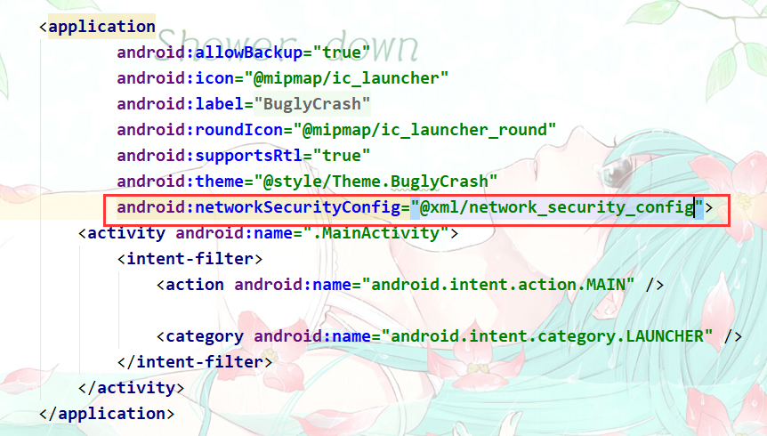

**同时集成SDK和NDK;**

在Module的build.gradle文件中添加依赖和属性配置：

```groovy
android {
    defaultConfig {
        ndk {
            // 设置支持的SO库架构
            abiFilters 'armeabi' , 'x86' //, 'armeabi-v7a', 'x86_64', 'arm64-v8a'
        }
    }
}

dependencies {
    implementation 'com.tencent.bugly:crashreport:latest.release' //其中latest.release指代最新Bugly SDK版本号，也可以指定明确的版本号，例如2.1.9
    implementation 'com.tencent.bugly:nativecrashreport:latest.release' //其中latest.release指代最新Bugly NDK版本号，也可以指定明确的版本号，例如3.0
}
```

**参数配置;**

1. 在AndroidManifest.xml中添加权限：

   ```xml
       <uses-permission android:name="android.permission.READ_PHONE_STATE" />
       <uses-permission android:name="android.permission.INTERNET" />
       <uses-permission android:name="android.permission.ACCESS_NETWORK_STATE" />
       <uses-permission android:name="android.permission.ACCESS_WIFI_STATE" />
   ```

2. 请避免混淆Bugly，在proguard-rules.pro混淆文件中增加以下配置：建议把项目切换成project模式。

   ```
   -dontwarn com.tencent.bugly.**
   -keep public class com.tencent.bugly.**{*;}
   ```

   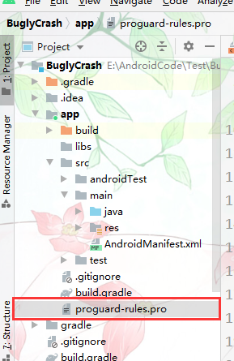

### 基本使用

**简单初始化**

> 为在AndroidManifest.xml的“Application”中增加“meta-data”配置项，初始化。

- 将以下代码复制到项目Application类`onCreate()`中，Bugly会为自动检测环境并完成配置：

  **为了保证运营数据的准确性，建议不要在异步线程初始化Bugly。**

  > 第三个参数为SDK调试模式开关，调试模式的行为特性如下：
  >
  > - 输出详细的Bugly SDK的Log；
  > - 每一条Crash都会被立即上报；
  > - 自定义日志将会在Logcat中输出。
  >
  > 建议在测试阶段建议设置成true，发布时设置为false。

```java
/* Bugly SDK初始化
        * 参数1：上下文对象
        * 参数2：APPID，平台注册时得到,注意替换成你的appId 如876a9ea437
        * 参数3：是否开启调试模式，调试模式下会输出'CrashReport'tag的日志
*/
CrashReport.initCrashReport(getApplicationContext(), "注册时申请的APPID", false); 
```

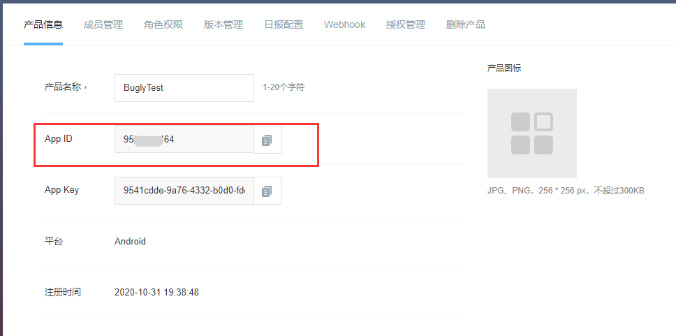

**配置APP信息;**

Bugly2.0及以上版本还支持通过`AndroidManifest.xml`来配置APP信息。如果同时又通过代码中配置了APP信息，**则最终以代码配置的信息为准.**

在“AndroidManifest.xml”的“Application”中增加“meta-data”配置项：

```xml
<application
    <!-- 配置APP ID -->
    <meta-data
            android:name="BUGLY_APPID"
            android:value="<APP_ID>" />
    <!-- 配置APP版本号 -->
    <meta-data
            android:name="BUGLY_APP_VERSION"
            android:value="<APP_Version>" />
    <!-- 配置APP渠道号 -->
    <meta-data
            android:name="BUGLY_APP_CHANNEL"
            android:value="<APP_Channel>" />
    <!-- 配置Bugly调试模式（true或者false）-->
    <meta-data
            android:name="BUGLY_ENABLE_DEBUG"
            android:value="<isDebug>" />
</application>
```

- 什么是，app渠道号；

  渠道包指的是在各大应用市场，发布的apk包的清单文件中，某个meta-data标签下，配置的value不一样，这个标签的作用就是用来区分是哪个市场的，比如你发布到360.这个值就是你就可以配置成360，豌豆荚就可以配置成wandoujia，那么这么配置的作用是干嘛的？很简单，就是用来做统计的，比如我们项目中用的是友盟统计，它可以统计用户从哪个平台下载了你们的app，从而更好的掌握用户的操作习惯。所以，如果app没有统计功能的需求，你只需要打一个同样的包，直接发布到各个平台即可，根本不用关心什么渠道。

- 不同于“android:versionName”，“BUGLY_APP_VERSION”配置的是Bugly平台的APP版本号。

- 通过“AndroidManifest.xml”配置后的初始化方法如下：

  ```java
  CrashReport.initCrashReport(getApplicationContext());
  ```


**测试;**

现在您可以制造一个Crash（建议通过“按键”来触发），来体验Bugly的能力了。在初始化Bugly的之后，调用Bugly测Java Crash方法。

- java层

  ```java
  CrashReport.testJavaCrash();
  ```

- ndk层

  ```java
  CrashReport.testNativeCrash();
  ```

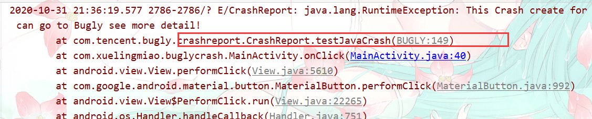

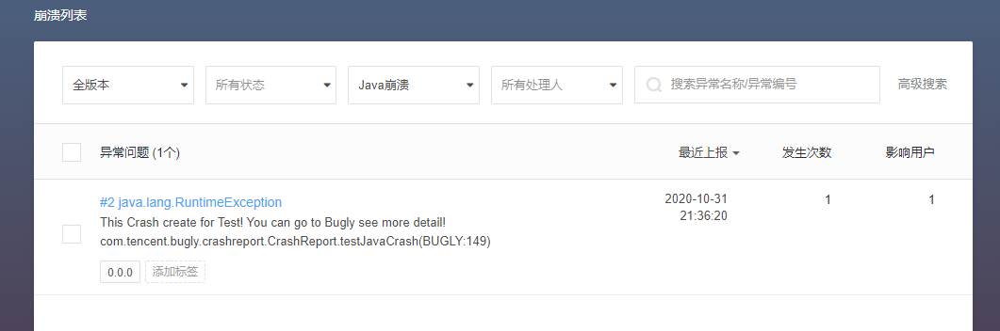

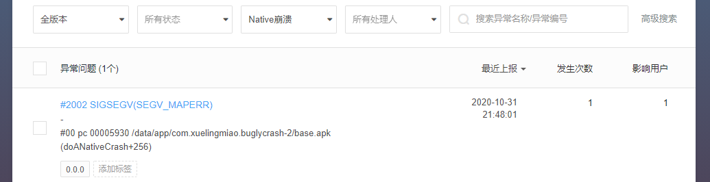

### 增加上报进程控制【正确使用姿势】

如果App使用了多进程且各个进程都会初始化Bugly（例如在Application类onCreate()中初始化Bugly），那么每个进程下的Bugly都会进行数据上报，造成不必要的资源浪费。

因此，为了节省流量、内存等资源，建议初始化的时候对上报进程进行控制，只在主进程下上报数据：判断是否是主进程（通过进程名是否为包名来判断），并在初始化Bugly时增加一个上报进程的策略配置。

```java
Context context = getApplicationContext();
// 获取当前包名
String packageName = context.getPackageName();
// 通过调用getProcessName方法获取当前进程名
String processName = getProcessName(android.os.Process.myPid());
// 设置是否为上报进程
CrashReport.UserStrategy strategy = new CrashReport.UserStrategy(context);
strategy.setUploadProcess(processName == null || processName.equals(packageName));
// 初始化Bugly并指定上报策略
CrashReport.initCrashReport(context, "注册时申请的APPID", isDebug, strategy);
// 如果通过“AndroidManifest.xml”来配置APP信息，初始化方法如下
// CrashReport.initCrashReport(context, strategy);
```

- 其中获取进程名的方法“getProcessName”有多种实现方法，推荐方法如下：

```java
/**
 * 获取进程号对应的进程名
 * 
 * @param pid 进程号
 * @return 进程名
 */
private static String getProcessName(int pid) {
    BufferedReader reader = null;
    try {
        reader = new BufferedReader(new FileReader("/proc/" + pid + "/cmdline"));
        String processName = reader.readLine();
        //不等于空
        // trim() 返回字符串的副本，忽略前导空白和尾部空白。
        if (!TextUtils.isEmpty(processName)) {
            processName = processName.trim();
        }
        return processName;
    } catch (Throwable throwable) {
        throwable.printStackTrace();
    } finally {
        try {
            if (reader != null) {
                reader.close();
            }
        } catch (IOException exception) {
            exception.printStackTrace();
        }
    }
    return null;
}
```

## 应用升级

由于 Google Play 政策限制，请不要使用升级功能，否则可能被检测到违规而导致警告、下架甚至封禁账号等后果。

### 集成

同样也需要对网络安全进行配置详细见上面的，异常上报中的**网络安全配置**。

#### 自动集成【推荐】

**gradle配置;**

配置示例（路径app/build.gradle）

**注意：** 升级SDK已经集成crash(崩溃日志)上报功能，已经集成Bugly的用户需要注释掉原来Bugly的jcenter库； 已经配置过符号表的Bugly用户保留原有符号表配置； Bugly SDK（2.1.5及以上版本）已经将Java Crash和Native Crash捕获功能分开，如果想使用NDK库，需要配置： `implementation 'com.tencent.bugly:nativecrashreport:latest.release'`

```groovy
  android {
        defaultConfig {
          ndk {
            //设置支持的SO库架构
            abiFilters 'armeabi' , 'x86' //, 'armeabi-v7a', 'x86_64', 'arm64-v8a'
          }
        }
      }
      dependencies {
          //注释掉原有bugly的仓库
          //implementation 'com.tencent.bugly:crashreport:latest.release'//其中latest.release指代最新版本号，也可以指定明确的版本号，例如2.3.2
          implementation 'com.tencent.bugly:crashreport_upgrade:latest.release'//其中latest.release指代最新版本号，也可以指定明确的版本号，例如1.2.0
          implementation 'com.tencent.bugly:nativecrashreport:latest.release' //其中latest.release指代最新版本号，也可以指定明确的版本号，例如2.2.0
      }
```

#### 参数设置

**在AndroidMainfest.xml中进行以下配置：**

1. 权限配置

   ```xml
   <uses-permission android:name="android.permission.READ_PHONE_STATE" />
       <uses-permission android:name="android.permission.INTERNET" />
       <uses-permission android:name="android.permission.ACCESS_NETWORK_STATE" />
       <uses-permission android:name="android.permission.ACCESS_WIFI_STATE" />
       <uses-permission android:name="android.permission.WRITE_EXTERNAL_STORAGE" />
       <uses-permission android:name="android.permission.REQUEST_INSTALL_PACKAGES" />
   ```

2. Activity配置

   ```xml
   <application>
   
       <activity
                   android:name="com.tencent.bugly.beta.ui.BetaActivity"
                   android:configChanges="keyboardHidden|orientation|screenSize|locale"
                   android:theme="@android:style/Theme.Translucent" />
   </application>    
   ```

1. 配置FileProvider

   **注意：**如果您想兼容Android N(Android 7.0)或者以上的设备，必须要在AndroidManifest.xml文件中配置FileProvider来访问共享路径的文件。

   ```xml
   <application>
       <provider
                   android:name="androidx.core.content.FileProvider"
                   android:authorities="${applicationId}.fileProvider"
                   android:exported="false"
                   android:grantUriPermissions="true">
               <meta-data
                       android:name="android.support.FILE_PROVIDER_PATHS"
                       android:resource="@xml/provider_paths"/>
          </provider>
   </application>
   ```

1. 混淆配置

   为了避免混淆SDK，在Proguard混淆文件中增加以下配置

   ```
   -dontwarn com.tencent.bugly.**
   -keep public class com.tencent.bugly.**{*;}
   -keep class android.support.**{*;}
   ```

### 测试验证

**SDK初始化**

注意：如果您之前使用过Bugly SDK，请将以下这句注释掉。

```java
 CrashReport.initCrashReport(getApplicationContext(), "注册时申请的APPID", false); 
```

统一初始化方法：

```java
 /**
         * 统一初始化方法
         * context 上下文
         * appid 注册时appid
         * Boolean 是否启用调式模式
         */
Bugly.init(getApplicationContext(), "注册时申请的APPID", false);
```

**提示：**已经接入Bugly用户改用上面的初始化方法,不影响原有的crash上报功能.

init方法会自动检测更新，不需要再手动调用`Beta.checkUpgrade(),` 如需增加自动检查时机可以使用Beta.checkUpgrade(false,false);

- `Beta.checkUpgrade(false,false);`
  - 参数
    - isManual 用户手动点击检查，非用户点击操作请传false
    - isSilence 是否显示弹窗等交互，[true:没有弹窗和toast] [false:有弹窗或toast]

**发布新版本;**

进入应用升级页面，点击发布新版本，上传要升级的APP的版本（**上传APP的versioncode必须不低于外发版本的versiocode，否则用户检测不到更新**）


## 热更新

> 有部分问题没有解决，放弃集成

热更新能力是Bugly为解决开发者紧急修复线上bug，而无需重新发版让用户无感知就能把问题修复的一项能力。Bugly目前采用**[微信Tinker](https://github.com/Tencent/tinker)**的开源方案，开发者只需要集成我们提供的SDK就可以实现自动下载补丁包、合成、并应用补丁的功能，我们也提供了热更新管理后台让开发者对每个版本补丁进行管理。

**更新原理；**

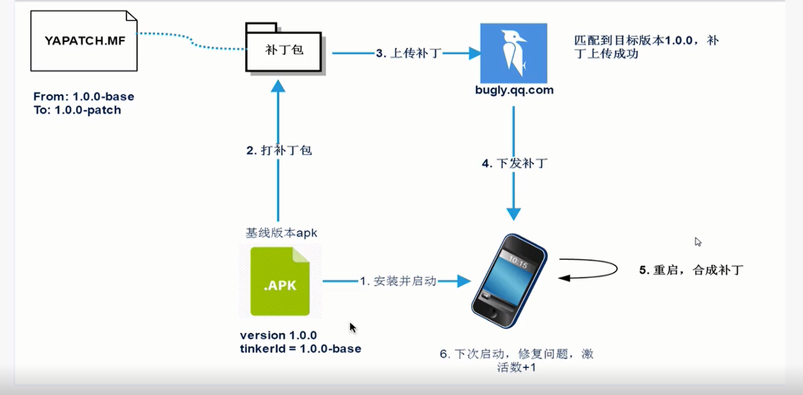

- 基线版本；就是线上出问题的版本需要修复bug的版本。
- YAPATCH.MF
  - From:；基线版本的Tinker ID
  - To；补丁包Tinker ID

### 集成SDK

> 注意tinker目前不支持Android Gradle Plugin 7.0+上版本2022年5月5日

**gradle配置**

1. 工程根目录下“build.gradle”文件中添加：

   ```groovy
   buildscript {
       repositories {
           jcenter()
              // 阿里巴巴maven仓库镜像，国内建议使用
           maven { url 'https://maven.aliyun.com/repository/public/' }
       }
       dependencies {
           classpath "com.tencent.bugly:tinker-support:1.2.3"
       }
   }
   ```

   > **注意；**
   >
   > tinker-support和tinker 是一一对应的不要写错

   版本对应关系:

   tinker-support 1.1.3 对应 tinker 1.9.8

   tinker-support 1.1.2 对应 tinker 1.9.6

   tinker-support 1.1.1 对应 tinker 1.9.1

   tinker-support 1.0.9 对应 tinker 1.9.0

   tinker-support 1.0.8 对应 tinker 1.7.11

   tinker-support 1.0.7 对应 tinker 1.7.9

   tinker-support 1.0.4 对应 tinker 1.7.7

   tinker-support 1.0.3 对应 tinker 1.7.6

   >  更多查看更新日志
   >
   > https://bugly.qq.com/docs/release-notes/release-tinker-support-plugin/?v=1.0.0

2. 在app module的“build.gradle”文件中添加

```groovy
  android {
        defaultConfig {
          ndk {
            //设置支持的SO库架构
            abiFilters 'armeabi' //, 'x86', 'armeabi-v7a', 'x86_64', 'arm64-v8a'
          }
        }
      }
      dependencies {
          // 如果你的apk需要则配置
         implementation 'androidx.multidex:multidex:2.0.1' // 多dex配置
 		implementation 'com.tencent.bugly:crashreport_upgrade:1.5.23' //应用更新支持
          // 指定tinker依赖版本（注：应用升级1.3.5版本起，不再内置tinker）
          implementation 'com.tencent.tinker:tinker-android-lib:1.9.14.16'
         //其中latest.release指代最新版本号，也可以指定明确的版本号，例如2.2.0
          implementation 'com.tencent.bugly:nativecrashreport:latest.release' 
      }
```


后续更新升级SDK时，只需变更配置脚本中的版本号即可。

> **注意：** 
>
> 升级SDK已经集成crash上报功能，已经集成Bugly的用户需要注释掉原来Bugly的jcenter库； 已经配置过符号表的Bugly用户保留原有符号表配置； 
>
> Bugly SDK（2.1.5及以上版本）已经将Java Crash和Native Crash捕获功能分开，如果想使用NDK库，需要配置： `implementation'com.tencent.bugly:nativecrashreport:latest.release'`

3. 新建tinker-support.gradle，注意在app model下创建

2. 在app module的“build.gradle”文件中添加：

```groovy
// 依赖插件脚本 ，在plugins闭包之后添加
apply from: 'tinker-support.gradle'
```


#### tinker-support.gradle配置

````groovy

apply plugin: 'com.tencent.bugly.tinker-support'

def bakPath = file("${buildDir}/bakApk/")

/**
 * 此处填写每次构建生成的基准包目录
 */
def baseApkDir = "app-0208-15-10-00"

/**
 * 对于插件各参数的详细解析请参考
 */
tinkerSupport {

    // 开启tinker-support插件，默认值true
    enable = true

    // 指定归档目录，默认值当前module的子目录tinker
    autoBackupApkDir = "${bakPath}"

    // 是否启用覆盖tinkerPatch配置功能，默认值false
    // 开启后tinkerPatch配置不生效，即无需添加tinkerPatch
    overrideTinkerPatchConfiguration = true

    // 编译补丁包时，必需指定基线版本的apk，默认值为空
    // 如果为空，则表示不是进行补丁包的编译
    // @{link tinkerPatch.oldApk }
    baseApk = "${bakPath}/${baseApkDir}/app-release.apk"

    // 对应tinker插件applyMapping
    baseApkProguardMapping = "${bakPath}/${baseApkDir}/app-release-mapping.txt"

    // 对应tinker插件applyResourceMapping
    baseApkResourceMapping = "${bakPath}/${baseApkDir}/app-release-R.txt"

    // 构建基准包和补丁包都要指定不同的tinkerId，并且必须保证唯一性
    tinkerId = "base-1.0.1"

    // 构建多渠道补丁时使用
    // buildAllFlavorsDir = "${bakPath}/${baseApkDir}"

    // 是否启用加固模式，默认为false.(tinker-spport 1.0.7起支持）
    // isProtectedApp = true

    // 是否开启反射Application模式
    enableProxyApplication = false

    // 是否支持新增非export的Activity（注意：设置为true才能修改AndroidManifest文件）
    supportHotplugComponent = true

}
/**
 * overrideTinkerPatchConfiguration = true
 * 设置了true说明使用bugly提供的tinkerPatch所以下面的可以不配置
 */
/**
 * 一般来说,我们无需对下面的参数做任何的修改
 * 对于各参数的详细介绍请参考:
 * https://github.com/Tencent/tinker/wiki/Tinker-%E6%8E%A5%E5%85%A5%E6%8C%87%E5%8D%97
 */
tinkerPatch {
    //oldApk ="${bakPath}/${appName}/app-release.apk"
    ignoreWarning = false
    useSign = true
    dex {
        dexMode = "jar"
        pattern = ["classes*.dex"]
        loader = []
    }
    lib {
        pattern = ["lib/*/*.so"]
    }

    res {
        pattern = ["res/*", "r/*", "assets/*", "resources.arsc", "AndroidManifest.xml"]
        ignoreChange = []
        largeModSize = 100
    }

    packageConfig {
    }
    sevenZip {
        zipArtifact = "com.tencent.mm:SevenZip:1.1.10"
//        path = "/usr/local/bin/7za"
    }
    buildConfig {
        keepDexApply = false
        //tinkerId = "1.0.1-base"
        //applyMapping = "${bakPath}/${appName}/app-release-mapping.txt" //  可选，设置mapping文件，建议保持旧apk的proguard混淆方式
        //applyResourceMapping = "${bakPath}/${appName}/app-release-R.txt" // 可选，设置R.txt文件，通过旧apk文件保持ResId的分配
    }
}
````

更详细的配置项参考[tinker-support配置说明](https://bugly.qq.com/docs/utility-tools/plugin-gradle-hotfix/)

### 初始化SDK

#### enableProxyApplication = false 的情况

这是Tinker推荐的接入方式，一定程度上会增加接入成本，但具有更好的兼容性。

**改造Application；**

1. 我们自定义的Application类不在继承Application而是继承**TinkerApplication**

2. 提供一个无参构造，调用基类的实现

   `protected TinkerApplication(int tinkerFlags, String delegateClassName, String loaderClassName, boolean tinkerLoadVerifyFlag)`

   **参数；**

   - `int tinkerFlags`  表示开启Tinker那些能力如 dex only、library only or all suuport，default: TINKER_ENABLE_ALL，表示所有能力
   - `String delegateClassName`  Application代理类 这里填写你自定义的ApplicationLike
   - `String loaderClassName` Tinker的加载器，使用默认即可
   - `boolean tinkerLoadVerifyFlag` 加载dex或者lib是否验证md5，默认为false

   ````java
   
   /**
    * @ClassName: TinkerApp
    * @Description: 作用描述
    * @Author: Bury我们past
    * @CreateDate: 2022/5/4 21:53
    * @UpdateUser: 更新者：
    * @UpdateDate: 2022/5/4 21:53
    * @UpdateRemark: 更新说明：
    * @Version: 1.0
    */
   public class TinkerApp extends TinkerApplication {
       public TinkerApp() {
           super(ShareConstants.TINKER_ENABLE_ALL, "xxx.xxx.SampleApplicationLike",
                   "com.tencent.tinker.loader.TinkerLoader", false);
       }
   }
   ````

   > **注意；**
   >
   > 不能在TinkerApp类中实现原有的Application中的逻辑。

3. 创建delegateClassName参数所需要的，ApplicationLike类,将我们之前在Application中做的初始等操作迁移到此实现类

   1. 继承`DefaultApplicationLike`并提供以下参数构造器

   ```java
   public DefaultApplicationLike(
       Application application, int tinkerFlags, boolean tinkerLoadVerifyFlag,
       long applicationStartElapsedTime, long applicationStartMillisTime, 
       Intent tinkerResultIntent)
   ```

   2. 复写`public void onCreate()`和 `public void onBaseContextAttached(Context base)`

      实现之前我们在Application中的逻辑。

      ````java
      /**
       * @ProjectName: Participating Assistant
       * @Package: com.xuelingmiao.participatingassistant
       * @ClassName: AppLike
       * @Description: 作用描述
       * @Author: Bury我们past
       * @CreateDate: 2022/5/5 15:16
       * @UpdateUser: 更新者：
       * @UpdateDate: 2022/5/5 15:16
       * @UpdateRemark: 更新说明：
       * @Version: 1.0
       */
      public class AppLike extends DefaultApplicationLike {
          public AppLike(Application application, int tinkerFlags,
                         boolean tinkerLoadVerifyFlag, long applicationStartElapsedTime,
                         long applicationStartMillisTime, Intent tinkerResultIntent) {
              super(application, tinkerFlags, tinkerLoadVerifyFlag, applicationStartElapsedTime, applicationStartMillisTime, tinkerResultIntent);
          }
      
      
          @Override
          public void onCreate() {
              super.onCreate();
              // 这里实现SDK初始化，appId替换成你的在Bugly平台申请的appId
              // 调试时，将第三个参数改为true
              Bugly.init(getApplication(), "900029763", false);
          }
      
      
          @TargetApi(Build.VERSION_CODES.ICE_CREAM_SANDWICH)
          @Override
          public void onBaseContextAttached(Context base) {
              super.onBaseContextAttached(base);
              // you must install multiDex whatever tinker is installed!
              MultiDex.install(base);
              // 安装tinker
              // TinkerManager.installTinker(this); 替换成下面Bugly提供的方法
              Beta.installTinker(this);
          }
      
          @TargetApi(Build.VERSION_CODES.ICE_CREAM_SANDWICH)
          public void registerActivityLifecycleCallback(Application.ActivityLifecycleCallbacks callbacks) {
              getApplication().registerActivityLifecycleCallbacks(callbacks);
          }
      }
      ````

   3. 将delegateClassName参数值修改为，我们实现的ApplicationLike。

      ```java
      你所实现的ApplicationLike类包.类名如下面；
      com.xuelingmiao.participatingassistant.AppLike
      ```

      

4. 修改`manifest` 中`application`元素`android:name` 属性修改为已继承**TinkerApplication**类

   ```xml
   <application
           android:name=".TinkerApp">
   </application>
   ```


#### enableProxyApplication = true 的情况

无须你改造Application，主要是为了降低接入成本，我们插件会动态替换AndroidMinifest文件中的Application为我们定义好用于反射真实Application的类（需要您接入**SDK 1.2.2版本** 和 **插件版本 1.0.3**以上）。

````java

public class MyApplication extends Application {

    @Override
    public void onCreate() {
        super.onCreate();
        // 这里实现SDK初始化，appId替换成你的在Bugly平台申请的appId
        // 调试时，将第三个参数改为true
        Bugly.init(this, "900029763", false);
    }

    @Override
    protected void attachBaseContext(Context base) {
        super.attachBaseContext(base);
        // 无论安装什么修补程序，您都必须安装 multiDex！
        // 分dex
        MultiDex.install(base);
        // 安装tinker
        Beta.installTinker();
    }

}
````

### AndroidManifest.xml配置

**在AndroidMainfest.xml中进行以下配置：**

1. 权限配置

```xml
<uses-permission android:name="android.permission.READ_PHONE_STATE" />
<uses-permission android:name="android.permission.INTERNET" />
<uses-permission android:name="android.permission.ACCESS_NETWORK_STATE" />
<uses-permission android:name="android.permission.ACCESS_WIFI_STATE" />
<uses-permission android:name="android.permission.READ_LOGS" />
<uses-permission android:name="android.permission.WRITE_EXTERNAL_STORAGE" />
```

2. Activity配置

```xml
<activity
    android:name="com.tencent.bugly.beta.ui.BetaActivity"
    android:configChanges="keyboardHidden|orientation|screenSize|locale"
    android:theme="@android:style/Theme.Translucent" />
```

3. 配置FileProvider

注意：如果您想兼容Android N或者以上的设备，必须要在AndroidManifest.xml文件中配置FileProvider来访问共享路径的文件。

```xml
 <provider
    android:name="android.support.v4.content.FileProvider"
    android:authorities="${applicationId}.fileProvider"
    android:exported="false"
    android:grantUriPermissions="true">
    <meta-data
        android:name="android.support.FILE_PROVIDER_PATHS"
        android:resource="@xml/provider_paths"/>
</provider>
```

如果你使用的第三方库也配置了同样的FileProvider, 可以通过继承FileProvider类来解决合并冲突的问题，示例如下：

```xml
<provider
    android:name=".utils.BuglyFileProvider"
    android:authorities="${applicationId}.fileProvider"
    android:exported="false"
    android:grantUriPermissions="true"
    tools:replace="name,authorities,exported,grantUriPermissions">
    <meta-data
        android:name="android.support.FILE_PROVIDER_PATHS"
        android:resource="@xml/provider_paths"
        tools:replace="name,resource"/>
</provider>
```

这里要注意一下，FileProvider类是在support-v4包中的，检查你的工程是否引入该类库。

在res目录新建xml文件夹，创建provider_paths.xml文件如下：

```xml
<?xml version="1.0" encoding="utf-8"?>
<paths xmlns:android="http://schemas.android.com/apk/res/android">
    <!-- /storage/emulated/0/Download/${applicationId}/.beta/apk-->
    <external-path name="beta_external_path" path="Download/"/>
    <!--/storage/emulated/0/Android/data/${applicationId}/files/apk/-->
    <external-path name="beta_external_files_path" path="Android/data/"/>
</paths>
```

这里配置的两个外部存储路径是升级SDK下载的文件可能存在的路径，一定要按照上面格式配置，不然可能会出现错误。

**注：1.3.1及以上版本，可以不用进行以上配置，aar已经在AndroidManifest配置了，并且包含了对应的资源文件。**

### 混淆配置

为了避免混淆SDK，在Proguard混淆文件中增加以下配置：

```xml
-dontwarn com.tencent.bugly.**
-keep public class com.tencent.bugly.**{*;}
# tinker混淆规则
-dontwarn com.tencent.tinker.**
-keep class com.tencent.tinker.** { *; }
```

如果你使用了support-v4包，你还需要配置以下混淆规则：

```xml

-keep class android.support.**{*;}
```

### 普通打包

#### 编译基准包

在`tinker-support.gradle`中**配置基准包的tinkerId**

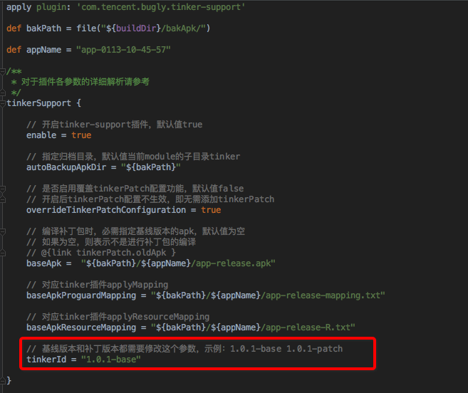

tinkerId最好是一个唯一标识，例如git版本号、versionName等等。

 如果你要测试热更新，需要对基线版本进行联网上报。

基线版本配置一个唯一的tinkerId，而这个基线版本能够应用补丁的前提是**集成过热更新SDK**，**并启动上报过联网**，这样我们后台会将这个tinkerId对应到一个目标版本，例如tinkerId = "bugly_1.0.0" 对应了一个目标版本是1.0.0，基于这个版本打的补丁包就能匹配到目标版本。

按正常方式打包release，apk

**启动apk，上报联网数据**

我们每次冷启动都会请求补丁策略，会上报当前版本号和tinkerId，这样我们后台就能将这个唯一的tinkerId对应到一个版本，大家测试的时候可以打开logcat查看我们的日志，如下图所示：

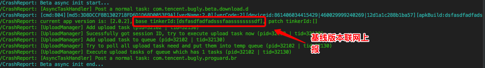

如果看不到log，您需要将bugly初始化的第三个参数设置为true才能看到

#### 对基线版本的bug修复

更简自己代码问题修复线上版本

#### 根据基线版本生成补丁包

修改待修复基线版本apk路径、mapping文件路径、resId文件路径

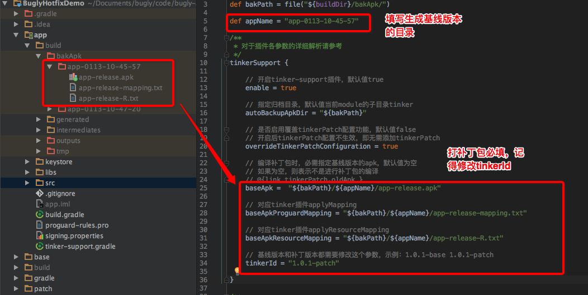

**执行构建补丁包的task**

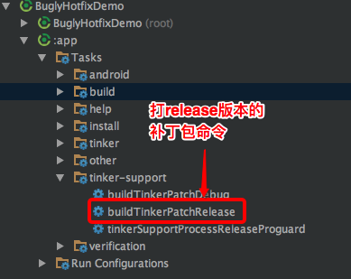

如果你要生成不同编译环境的补丁包，只需要执行TinkerSupport插件生成的task，比如buildTinkerPatchRelease就能生成release编译环境的补丁包。 注：TinkerSupport插件版本低于1.0.4的，需要使用tinkerPatchRelease来生成补丁包 。

生成的补丁包在`build/outputs/patch`目录下：

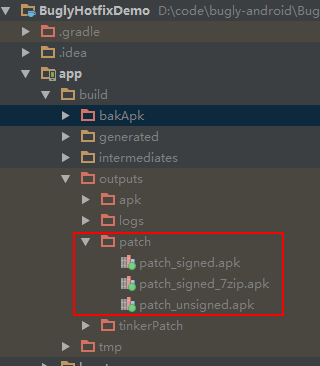

#### 上传补丁包到平台

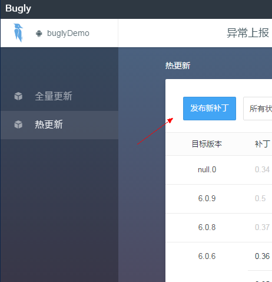

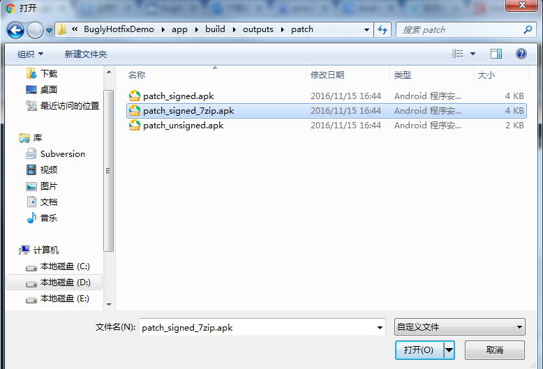

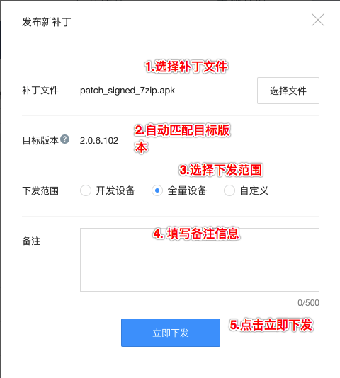

### 测试补丁应用效果

重启基础包apk即可看到效果
