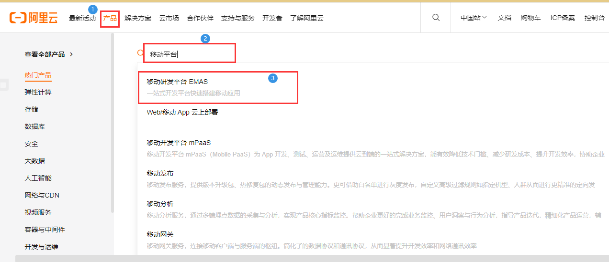
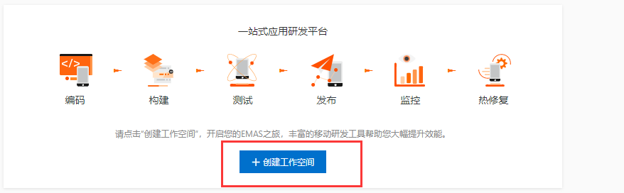
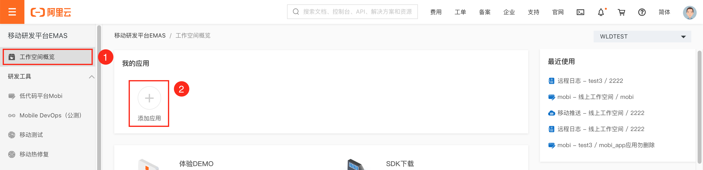
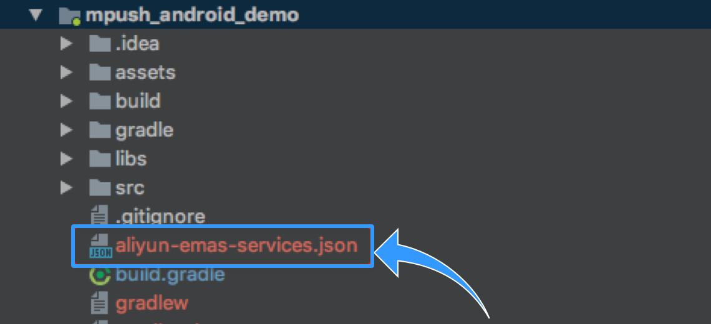
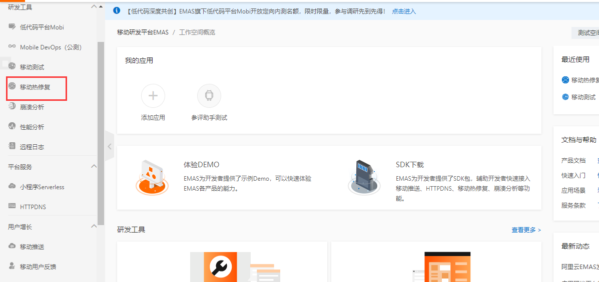
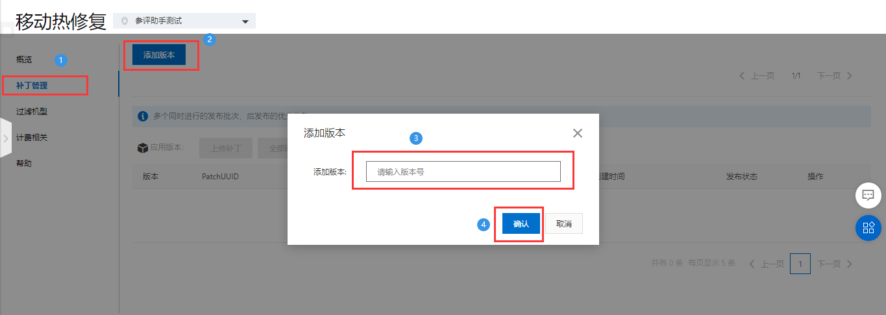
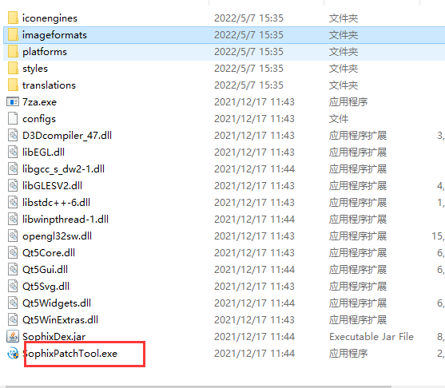
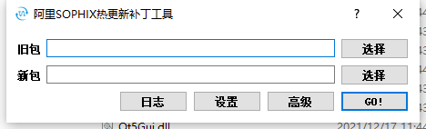
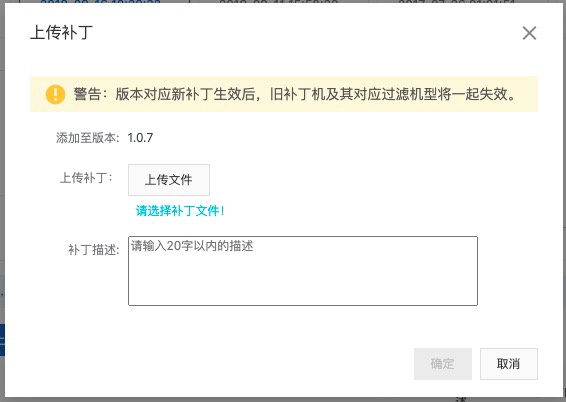
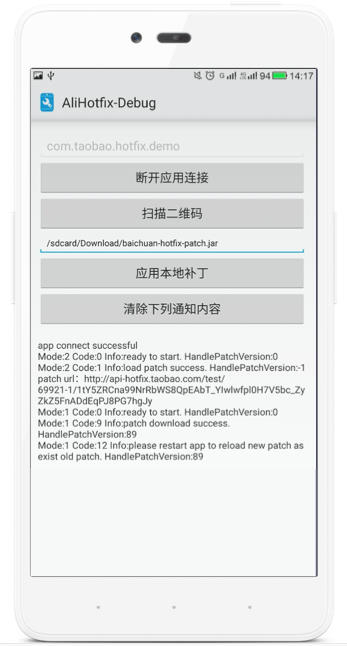

# 阿里热修复（sophix ）

> https://help.aliyun.com/product/51340.html

## 价格

- 月去重活跃设备数：对于每个账号，每月使用移动热修复的应用月活设备数总和小于50000台的情况免费。

https://help.aliyun.com/document_detail/57064.html

## 开通服务

0. 创建阿里云帐号并登录

   https://help.aliyun.com/document_detail/37195.htm?spm=a2c4g.11186623.0.0.2be73e0630XjBL

1. 打开https://www.aliyun.com/?spm=a2c4g.11186623.0.0.2be73e0630XjBL

   

2. 在产品介绍页中单击立即开通。

## 创建工作空间和应用

1. 产品开通后即可进入移动研发平台的[管理控制台](https://emas.console.aliyun.com/?spm=a2c4g.11186623.0.0.2be73e0630XjBL#/productList)，默认打开**我的工作空间**页面。

2. 在**我的工作空间**页面，单击**创建工作空间**标签，打开**创作工作空间**右侧栏。

   

3. 在**创作工作空间**右侧栏，填写**工作空间名称**。

   配置说明如下：

   | 选项             | 说明                                                         |
   | :--------------- | :----------------------------------------------------------- |
   | **工作空间名称** | 用于设置工作空间的名称。【取值范围】1～30字符【字符类型】中文/英文大小写/数字/下划线 |

4. 单击**创建并进入**按钮，保存工作空间，并打开**工作空间概览**页面。

5. 在**工作空间概览**页面，单击**添加应用**按钮，打开**应用配置**右侧栏。

   

6. 在**应用配置**右侧栏 > **填写应用信息**步骤，输入应用信息。

7. > **提示；**
   >
   > 如果不需要统一初始化EMAS能力可以不下载配置文件

   在**应用配置**右侧栏 > **下载配置文件**步骤，按照界面指导下载应用配置文件，并将应用配置文件放置到工程根路径。

   - Android配置文件名称：`aliyun-emas-services.json`

   

## 集成SDK

### 稳健接入

1. Android Studio集成方式

​	gradle远程仓库依赖, 打开项目找到App的build.gradle文件，添加如下配置：

添加Maven仓库地址：

```javascript
repositories {
   maven {
       url "https://maven.aliyun.com/nexus/content/repositories/releases"
   }
}
```

添加gradle坐标版本依赖：

```javascript
android {
    ......
    defaultConfig {
        applicationId "com.xxx.xxx" //包名
        ......
        ndk {
            //选择要添加的对应cpu类型的.so库。
            //热修复支持五种
            abiFilters 'arm64-v8a', 'armeabi', 'armeabi-v7a', 'x86', 'x86_64'
        }
        ......
    }
    ......
}
dependencies {
    ......
    	// gradle7.x，在`settings.gradle` 配置
        implementation 'com.aliyun.ams:alicloud-android-hotfix:3.3.5'
    ......
}
```
如果你集成了友盟的SDK可能会出现依赖冲突问题解决

> https://blog.csdn.net/haha223545/article/details/76570140

```groovy
// HotFix3.0以前：
implementation ('com.taobao.android:alisdk-hotfix:2.0.9') {
     exclude(module:'utdid4all')
}

// HotFix3.0以后
implementation ('com.aliyun.ams:alicloud-android-hotfix:3.0.8'）{
     exclude(module:'alicloud-android-utdid')
}
```


>**注意；**
>
>- 使用gradle plugin版本高于4.2时，可能会自动开启资源优化。开启资源优化后，资源名称被混淆，会导致补丁工具在生成补丁时一直卡在"开始构建补丁....."，无法正常解析apk包。解决方案：在gradle.properties 中新增`android.enableResourceOptimizations=false`，重新生成基线包和修复包，然后再生成补丁。

2. 添加应用权限

Sophix SDK使用到以下权限，**使用Maven依赖或者aar依赖可以不用配置**。具体配置在AndroidManifest.xml中。

```xml
<uses-permission android:name="android.permission.INTERNET" />
<uses-permission android:name="android.permission.ACCESS_NETWORK_STATE" />
<uses-permission android:name="android.permission.ACCESS_WIFI_STATE" />
<uses-permission android:name="android.permission.READ_EXTERNAL_STORAGE"/>
```

| SDK权限               | 是否必须 | 说明                                                         |
| :-------------------- | :------- | :----------------------------------------------------------- |
| INTERNET              | 是       | 允许网络请求，下载补丁时使用。                               |
| ACCESS_NETWORK_STATE  | 是       | 获取运营商和网络类型信息，用于统计不同网络下的补丁加载状态统计。 |
| ACCESS_WIFI_STATE     | 是       | 获取运营商和网络类型信息，用于统计不同网络下的补丁加载状态统计。 |
| READ_EXTERNAL_STORAGE | 否       | 外部存储读权限，调试工具从SD卡加载本地补丁需要。             |

> **注意；**
>
> `READ_EXTERNAL_STORAGE`权限属于Dangerous Permissions，仅调试工具获取外部补丁需要，不影响线上发布的补丁加载，调试时请自行做好Android 6.0以上的运行时权限获取。

3. 配置AndroidManifest文件

在`AndroidManifest.xml`中间的`application`节点下添加如下配置：

```xml
<meta-data
android:name="com.taobao.android.hotfix.IDSECRET"
android:value="App ID" />
<meta-data
android:name="com.taobao.android.hotfix.APPSECRET"
android:value="App Secret" />
<meta-data
android:name="com.taobao.android.hotfix.RSASECRET"
android:value="RSA密钥" />
```

以上配置内容可以在下载的配置json配置文件中找到分别对应字段为。

```
App ID： hotfix.idSecret
App Secret：emas.appSecret
RSA密钥： hotfix.rsaSecre
```


出于安全考虑，建议使用`setSecretMetaData`这个方法进行设置,，用此方法设置后就不需要再AndroidManifest中声明了，如果对应的值设为null，默认会在使用AndroidManifest里面的。

````java
/**
setSecretMetaData(
idSecret,  App ID
appSecret,  App Secret
rsaSecret RSA密钥
)
**/
final SophixManager instance = SophixManager.getInstance();
        instance.setContext(this)
                .setSecretMetaData(null, null, null)
````

> **注意；**
>
> - 另外，热修复暂不支持EMAS统一插件的JSON文件读取。
> - `IDSECRET、APPSECRET、RSASECRET`将被用于计量计费，请妥善保管注意安全。
> - 为避免在日志中泄漏`IDSECRET、APPSECRET、RSASECRET`参数或APP运行过程中产生的数据，建议线上版本关闭SDK调试日志。
> - 由于所有用户使用统一提供的SDK接入，在接入过程中需要在代码中设置`IDSECRET、APPSECRET、RSASECRET`参数，为防止恶意反编译获取参数造成信息泄漏，建议开启混淆，并进行APP加固后再发布上线。

4. 混淆配置

   ```
   #基线包使用，生成mapping.txt
   -printmapping mapping.txt
   #生成的mapping.txt在app/build/outputs/mapping/release路径下，移动到/app路径下
   #修复后的项目使用，保证混淆结果一致
   #-applymapping mapping.txt
   #hotfix
   -keep class com.taobao.sophix.**{*;}
   -keep class com.ta.utdid2.device.**{*;}
   #防止inline
   -dontoptimize
   ```

   > **注意；**
   >
   > 开启混淆时，生成修复包要使用旧包的mapping文件以保证混淆结果一致。

## 初始化

初始化的调用应该尽可能的早，必须在`Application.attachBaseContext()`的最开始（在`super.attachBaseContext`之后，如果有Multidex，也需要在Multidex.install之后）进行SDK初始化操作，初始化之前不能用到其他自定义类，否则极有可能导致崩溃。而查询服务器是否有可用补丁的操作可以在后面的任意地方。

不建议在`Application.onCreate()`中初始化，因为如果带有ContentProvider，就会使得Sophix初始化时机太迟从而引发问题。

Sophix最新版本引入了新的初始化方式。

原来的初始化方式仍然可以使用。只是新方式可以提供更全面的功能修复支持，将会带来以下优点：

- 初始化与应用原先业务代码完全隔离，使得原先真正的Application可以修复，并且减少了补丁预加载时间等等。
- 新方式能够更完美地兼容Android 8.0以后版本。

具体而言，是需要用户自行加入以下这个类：

```java
package com.my.pkg;
import android.app.Application;
import android.content.Context;
import android.support.annotation.Keep;
import android.util.Log;
import com.taobao.sophix.PatchStatus;
import com.taobao.sophix.SophixApplication;
import com.taobao.sophix.SophixEntry;
import com.taobao.sophix.SophixManager;
import com.taobao.sophix.listener.PatchLoadStatusListener;
import com.my.pkg.MyRealApplication;
/**
 * Sophix入口类，专门用于初始化Sophix，不应包含任何业务逻辑。
 * 此类必须继承自SophixApplication，onCreate方法不需要实现。
 * 此类不应与项目中的其他类有任何互相调用的逻辑，必须完全做到隔离。
 * AndroidManifest中设置application为此类，而SophixEntry中设为原先Application类。
 * 注意原先Application里不需要再重复初始化Sophix，并且需要避免混淆原先Application类。
 * 如有其它自定义改造，请咨询官方后妥善处理。
 */
public class SophixStubApplication extends SophixApplication {
    private final String TAG = "SophixStubApplication";
    // 此处SophixEntry应指定真正的Application，并且保证RealApplicationStub类名不被混淆。
    @Keep
    @SophixEntry(MyRealApplication.class)
    static class RealApplicationStub {}
    @Override
    protected void attachBaseContext(Context base) {
        super.attachBaseContext(base);
//         如果需要使用MultiDex，需要在此处调用。
//         MultiDex.install(this);
        initSophix();
    }
    private void initSophix() {
        String appVersion = "0.0.0";
        try {
            appVersion = this.getPackageManager()
                             .getPackageInfo(this.getPackageName(), 0)
                             .versionName;
        } catch (Exception e) {
        }
        final SophixManager instance = SophixManager.getInstance();
        instance.setContext(this)
                .setAppVersion(appVersion)
                .setSecretMetaData(null, null, null)
                .setEnableDebug(true)
                .setEnableFullLog()
                .setPatchLoadStatusStub(new PatchLoadStatusListener() {
                    @Override
                    public void onLoad(final int mode, final int code, final String info, final int handlePatchVersion) {
                        if (code == PatchStatus.CODE_LOAD_SUCCESS) {
                            Log.i(TAG, "sophix load patch success!");
                        } else if (code == PatchStatus.CODE_LOAD_RELAUNCH) {
                            // 如果需要在后台重启，建议此处用SharePreference保存状态。
                            Log.i(TAG, "sophix preload patch success. restart app to make effect.");
                        } else {
                            Log.i(TAG, "onLoad: 其它错误" + "code==" + code + "info==" + info);
                        }
                    }
                }).initialize();
    }
}
```

关键点

`SophixEntry`应指定项目中原先真正的Application（原项目里application的android::name指定的），这里用MyRealApplication指代。并且保证RealApplicationStub类名不被混淆。而SophixStubApplication的类名和包名可以自行取名。

这里的Keep是android.support包中的类，目的是为了防止这个内部静态类的类名被混淆，因为sophix内部会反射获取这个类的SophixEntry。如果项目中**没有依赖android.support的话**，就需要在progurad里面手动指定RealApplicationStub不被混淆，详见下文。

然后，在proguard文件里面需要加上下面内容：

````java
-keepclassmembers class com.my.pkg.MyRealApplication {
    public <init>();
}
-keep class com.my.pkg.SophixStubApplication$RealApplicationStub
````


目的是防止真正Application的构造方法被proguard混淆。

最后，需要把AndroidManifest里面的application改为这个新增的SophixStubApplication类：

```xml
    <application
        android:name="com.my.pkg.SophixStubApplication"
        ... ...>
        ... ...
```

这样便完成了新方式的初始化接入改造。

**最后，别忘了在MyRealApplication 中的 onCreate() 方法中加入：**

```java
// queryAndLoadNewPatch不可放在attachBaseContext 中，否则无网络权限，建议放在后面任意时刻，如onCreate中
SophixManager.getInstance().queryAndLoadNewPatch();
```

## 创建版本

在移动热修复上传补丁前需创建应用版本，**该版本和基线包初始化时所传的版本号对应。**

1. 登录移动热修复控制台。

   

2. 在左侧导航栏选择**补丁管理**。

3. 在补丁管理页面单击**添加版本**，输入应用版本号后单击**确认**。,版本名称一般为`versionName` 值，不要包含特殊字符。




- 版本号和基线包初始化时setAppVersion所传的版本号对应，版本号最长支持36个字符。
- 版本添加成功后不支持修改、删除。

## 生成补丁

### 补丁版本说明

1. 补丁是针对客户端具体某个版本的，补丁和具体版本绑定。

   示例：应用当前版本号是1.1.0，那么只能在后台查询到1.1.0版本对应发布的补丁，而查询不到之前1.0.0旧版本发布的补丁。

2. 针对某个具体版本发布的新补丁，必须包含所有的bugfix，而不能依赖补丁递增修复的方式，因为应用仅可能加载一个补丁。

   示例：针对1.0.0版本在后台发布了一个补丁版本号为1的补丁修复了bug1，然后发现此时针对这个版本补丁1修复的不完全，代码还有bug2，在后台重新发布一个补丁版本号为2的补丁，那么此时补丁2就必须同时包含bug1和bug2的修复；如果只包含bug2的修复，bug1的修复就会失效。

### 打包工具下载

补丁包生成需要使用打补丁工具SophixPatchTool，

- [Windows版本打包工具下载](http://ams-hotfix-repo.oss-cn-shanghai.aliyuncs.com/SophixPatchTool_windows.zip?spm=a2c4g.11186623.0.0.5fb02c35W1589V&file=SophixPatchTool_windows.zip)

需要安装Java环境且在JDK7或以上才能正常使用。

### 使用打包工具打包

0. 解压缩

1. 双击打开打包工具，进入打包工具主对话框。






| 参数 | 说明                                                         |
| :--- | :----------------------------------------------------------- |
| 旧包 | 必填，选择基线包路径（有问题的APK）。                        |
| 新包 | 必填，选择新包路径（修复过该问题APK）。                      |
| 日志 | 打开日志输出窗口。                                           |
| 设置 | • 补丁输出路径：必填，指定生成补丁之后补丁的存放位置，必须是已存在的目录。<br>• Key Store Path：选填，本地的签名文件的路径，不输入则不做签名。目前只支持jks的签名文件。<br>• Key Store Password：选填，证书文件的密码。<br>• Key Alias：选填，Key的别名。<br>• Key Passwrod：选填，Key的密码。<br>• AES Key：选填，自定义aes密钥，必须是16位数字或字母的组合。必须与setAesKey中设置的密钥一致。<br>• Filter Class File：选填，本地的白名单类列表文件的路径，放进去的类不会再计算patch，文件格式：一行一个类名。 |
| 高级 | • 强制冷启动：勾选的话强制生成补丁包为需要冷启动才能修复的格式。默认不选的话，工具会根据代码变更情况自动选择即时热替换或者冷启动修复。<br>• 不比较资源：打补丁时不比较资源的变化。<br>• 不比较SO库：打补丁时不比较SO库的变化。<br>• 检查初始化：检查初始化写法是否正确。<br>• 快速打包：加快补丁生成速度。<br>• 优化资源补丁：压缩补丁资源的大小。 |
| GO！ | 开始生成补丁。                                               |

2. 上传新旧包，进行设置后单击**GO**。

### 使用命令行方式打包

> **说明** 
>
> 打包工具SophixPatchTool 3.1.6版本之后支持命令行的方式生成补丁包。

采用命令行方式前，需要准备以下JSON格式的配置文件：

```javascript
{
    "AesKey": "",
    "ClassFilterFilePath": "",
    "KeyAlias": "",
    "KeyPassword": "",
    "KeyStorePassword": "",
    "KeyStorePath": "",
    "NewApkPath": "/path/to/new.apk",
    "OldApkPath": "/path/to/old.apk",
    "OutputDirPath": "/path/to/output/dir/",
    "isForceColdFix": false,
    "isIgnoreRes": false,
    "isIgnoreSo": false
}
```

其中，必填的项目是NewApkPath、OldApkPath、OutputDirPath。其他的配置与图形界面所对应项一致。然后把它存为profiles.json文件即可。

接下来，可以用下面的命令进行打包：

`SophixPatchTool`在windows平台下为`SophixPatchTool.exe`，mac平台下为`SophixPatchTool.app/Contents/macOS/SophixPatchTool`。

```sql
SophixPatchTool --profiles profiles.json
```

执行完毕后就可以在OutputDirPath下输出补丁文件了。

### 注意事项

- 支持多渠道包仅选用某个渠道包的补丁，只需要保证变化相同即可，不过对于不同的基线包最好进行全面的测试。
- 发布前请严格按照补丁发布推荐流程进行，以保证补丁包能够正常在所有Android版本的机型上生效。
- mac下的补丁工具若出现一打开就崩溃的情况，请将补丁工具移到“应用程序”目录下即可。

## 上传补丁

1. 登录移动热修复控制台。

2. 左侧导航栏选择**补丁管理**。

3. 选择版本，单击**上传补丁**，选则补丁文件、填写补丁描述后单击**确定**。

   


> **说明** 
>
> 上传到控制台的补丁文件名必须为：sophix-patch.jar

补丁状态说明：

| 状态   | 说明                                                         |
| :----- | :----------------------------------------------------------- |
| 已就绪 | 补丁上传成功，等待操作。                                     |
| 灰度中 | 补丁正在进行部分设备灰度发布中。                             |
| 已发布 | 补丁已全量发布至所有设备。                                   |
| 已停止 | 补丁发布行为已暂停，服务端停止下发补丁，客户端已经下载的补丁继续生效。 |
| 已清除 | 补丁进行**全部回滚**操作后状态即为已清除。                   |

## 调试补丁

### 概述

调试工具用于补丁正式发布前的调试环节，目前有以下两种测试方式：

- 扫码二维码方式，将刚刚上传到后台的补丁通过扫描二维码下载到本地，尝试加载补丁。
- 应用本地补丁方式，传入本地补丁的绝对路径，尝试加载补丁。此方式必须确保Sophix初始化时setEnableDebug为true。出于安全考虑，我们禁止在setEnableDebug为false的包上加载本地补丁，因此setEnableDebug为false的包需要以二维码方式进行验证。

## 调试方法

一个补丁的加载一般分为三个阶段：查询、预加载、加载，各个阶段的常见状态码如下：

1. **调试工具下载**

   单击[Android调试工具下载地址](http://ams-hotfix-repo.oss-cn-shanghai.aliyuncs.com/hotfix_debug_tool-release.apk)，将下载的调试工具安装到您的Android手机上。

2. **连接测试的应用**

   打开手机调试工具，在顶部的编辑框内输入要进行测试的应用包名，确认输入无误后单击**连接应用**。

   > **说明** 
   >
   > 工具与测试的应用建立连接，连接成功后输出应用的信息；aidl方式连接原应用，所以在部分机型上可能导致失败，比如MIUI最新系统上，默认禁用了跨应用aidl，MIUI上可以设置取消这个限制，其它系统类似处理。

3. **应用补丁**

   - **扫描二维码方式**
     1. 登录移动热修复控制台。
     2. 左侧导航栏选择**补丁管理**，并选择**版本**。
     3. 单击版本下待调试补丁右侧的**发布**，进入补丁发布页面。
     4. 单击扫码验证补丁右侧的二维码，在手机调试工具中点击**扫描二维码**按钮扫码，向应用发出拉去补丁的请求。
     5. 补丁拉取和加载状态在调试应用界面输出，当显示下载和加载成功，打开应用进行检查。
   - **应用本地补丁方式**
     1. 将生成的补丁包存储到以安装调试供的手机本地存储任何一个目录下。
     2. 打开调试工具，在应用本地补丁按钮上面的输入框中输入补丁在手机存储中的绝对路径，并点击**应用本地补丁**。
     3. 补丁加载状态在调试应用界面输出，当显示下载和加载成功，打开应用进行检查。

4. **断开连接的应用**

   调试完成后，在手机调试工具中单击**断开应用连接**。


#### 调试示例

1. 使用[Android端demo工程](https://github.com/aliyun/alicloud-android-demo/tree/master/hotfix_android_demo)集成应用，并安装到手机。

2. 安装Android调试工具，并打开。

   

3. 在调试应用页面上方输入demo应用的包名，单击**连接应用**，提示**连接成功**则表示完成。

4. 应用本地补丁示例

   - 将补丁工具生成的补丁包sophix-patch.jar推送到本地的/sdcard/Download目录, 然后在调试应用中输入该补丁包的绝对路径，单击**应用本地补丁。**
   - Mode:2 表示应用本地补丁模式，Code:1 表示加载成功，HandlePatchVersion:-1 表示本地补丁。

5. 扫描二维码示例

   - 将补丁工具生成的补丁包sophix-patch.jar上传到hotfix控制台。
   - 单击**扫描二维码**扫后台补丁二维码。

日志说明；
Mode:1 表示扫码模式，Code:12 表示应用当前已经有一个补丁，所以新补丁不会立刻加载需要等下一次重启加载，HandlePatchVersion:89 表示后台拉取下来的补丁版本为89。

更多状态码

https://help.aliyun.com/document_detail/180966.html?spm=a2c4g.11186623.0.0.2c0e46e2zzILck

## 过滤机型

发布补丁时，您可以对加载补丁的目标机型进行过滤设置，使补丁对过滤的机型不生效。

https://help.aliyun.com/document_detail/93816.htm?spm=a2c4g.11186623.0.0.78062c8ftsSYPF

## 补丁发布推荐流程

https://help.aliyun.com/document_detail/130163.htm?spm=a2c4g.11186623.0.0.78062c8ftsSYPF


## 常见问题

问题：移动热修复是否支持添加新的Activity？

回答：不能直接支持，但是可以插桩实现。在AndroidManifest里面预留好，后面可以通过代码进行添加。
