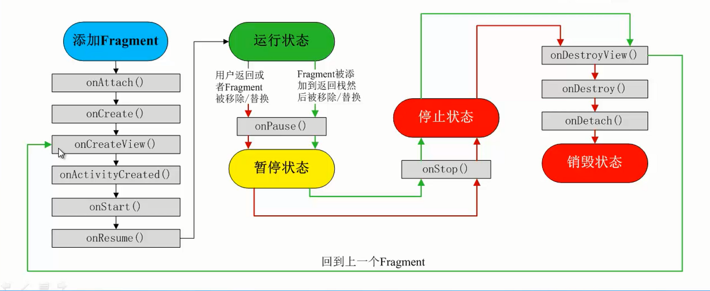
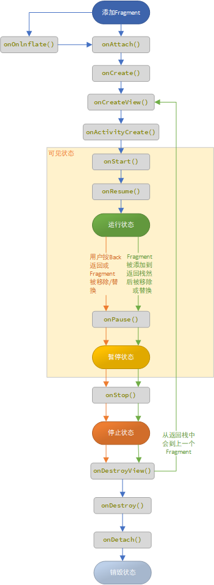
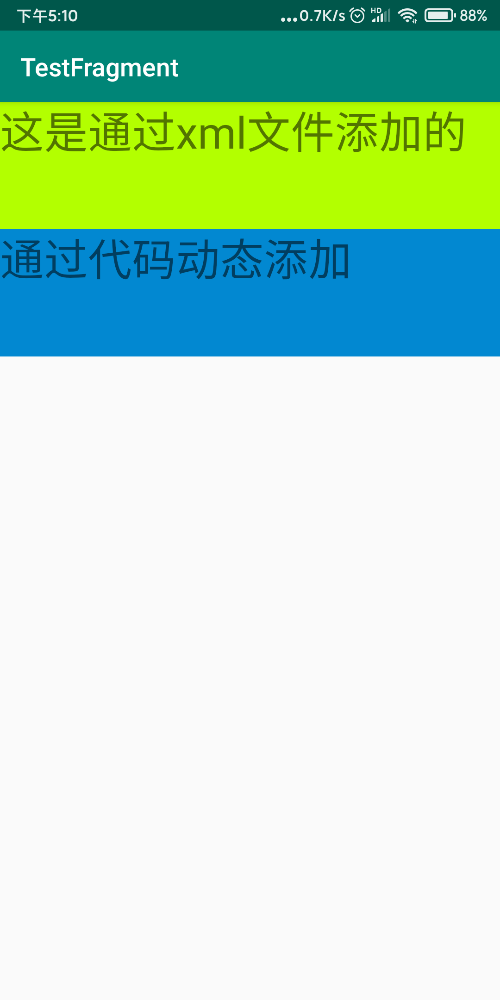
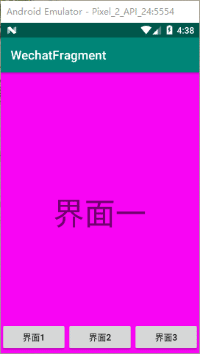

# Fragment

可以在activity中嵌套部分页面为Fragment页面同样也支持同一个Fragment重用。类似于HTML中的iframe标签

### Fragment的几个子类：

ps:很多时候我们都是直接重写Fragment,inflate加载布局完成相应业务了,子类用的不多,等需要的 时候在深入研究!

- 对话框:**DialogFragment**
- 列表:**ListFragment**
- 选项设置:**PreferenceFragment**
- WebView界面:**WebViewFragment**

## 生命周期

一个Fragment必须被嵌入到activity中。它的生命和其所在的activity紧密关联，当activity被销毁那么同样fragment也会被销毁。







只少要重写onCreateView也是可以的、

- `onOnlnflate()` 该方法只在我们直接用**标签在布局文件**中定义的时候才会被调用

- `onAttach() `当该Fragment被添加到Activity中会回调，只会被调用一次
- `onCreate()` 创建Fragment 回i，**只会被调用一次**
- `onCreateView()` 每次创建，绘制该Fragment的View组件时回调，会将显示的View返回
- `onActivityCreate()` 当Fragment所在的Activity启动完成后回调
- `onStart()` 启动Fragment时被回调
- `onResume()`恢复Fragment时被回调，`onStart()`方法后一定回调`onResume()`方法`onStart`可见，`onResume`后**才能交互**
- `onPause()`  暂停Fragment时调用
- `onStop() ` 停止暂停Fragment时调用
- `onDestroyView()`销毁该Fragment所包含的View组件时使用
- `onDestroy()`销毁Fragment时被回调
- `onDetach()` 将该Fragment从Activity被删除/替换完成后回调该方法；`onDestroy0`方法后一定会回调该方法该方法**只调用一次**


## 在Activity中使用

### 静态添加

**创建**

1. 创建一个javaClass并继承自**Fragment**类
2. 创建一个布局文件xml【书写自己要展示的布局内容】
3. 在继承的了Fragment的class中重写`onCreateView`方法，绑定布局文件。

- `inflater.inflate()`
  - 参数1 布局文件id
  - 参数2 ViewGroup对象直接使用方法中的形参container即可
  - 参数3 指定为false

```java
package top.miku.testfragment;

import android.os.Bundle;
import android.view.LayoutInflater;
import android.view.View;
import android.view.ViewGroup;

import androidx.annotation.NonNull;
import androidx.annotation.Nullable;
import androidx.fragment.app.Fragment;

public class Fragment1 extends Fragment {
    @Nullable
    @Override
    public View onCreateView(@NonNull LayoutInflater inflater, @Nullable ViewGroup container, @Nullable Bundle savedInstanceState) {
        //加载布局文件
        //inflate方法参数
        //参数1 布局文件id 参数2 ViewGroup对象直接使用方法中的形参container即可 参数3 指定为false
        View view = inflater.inflate(R.layout.fragment_fragment1, container,false);


        return view; //返回这个view。
    }
}
```

**Activity中添加Fragment**



- 活动xml布局中引用

1. 在获得布局中添加fragment标记。

2. 通过android:name属性指定Fragment类所在的路径包含包名全路径。

3. **注意** 标记中必须为其设置一个id否则会报错无法启动

   ```xml
   <fragment
           android:layout_width="match_parent"
           android:layout_height="wrap_content"
           android:name="top.miku.testfragment.Fragment1" //指定类
           android:id="@+id/fragment1" //必须指定id
           />
   ```

### 代码动态添加

- `getSupportFragmentManager()`获取FragmentManager管理对象
- `fragmentManager.beginTransaction()`获取片段交易对象
- `transaction.add()` 添加要提交的fragment对象
  - 参数1 要添加到那个容器上容器id
  - 参数2 fragment对象
  - 参数3可选 一个tag标记
- `transaction.commit();` 提交交易

```java
package top.miku.testfragment;

import androidx.appcompat.app.AppCompatActivity;

import androidx.fragment.app.FragmentManager;
import androidx.fragment.app.FragmentTransaction;

import android.os.Bundle;

public class MainActivity extends AppCompatActivity {

    @Override
    protected void onCreate(Bundle savedInstanceState) {
        super.onCreate(savedInstanceState);
        setContentView(R.layout.activity_main);
        //实例化一个要敲入活动中的Fragment对象
        Fragment2 fragment2 = new Fragment2();

        //获取FragmentManager管理对象
        FragmentManager fragmentManager = getSupportFragmentManager();
        //开启片段交易
        FragmentTransaction transaction = fragmentManager.beginTransaction();
        //添加要提交的fragment对象
        //参数1 要添加到那个容器上容器id 参数2 fragment对象 参数3可选 一个tag标记。
        transaction.add(R.id.layout,fragment2);
        //提交交易
        transaction.commit();

    }
}
```


## 仿写微信的选项卡效果



**xml布局**

- main.ml

  ```xml
  <?xml version="1.0" encoding="utf-8"?>
  <RelativeLayout xmlns:android="http://schemas.android.com/apk/res/android"
          xmlns:app="http://schemas.android.com/apk/res-auto"
          xmlns:tools="http://schemas.android.com/tools"
          android:layout_width="match_parent"
          android:layout_height="match_parent"
          tools:context=".MainActivity"
          android:orientation="vertical">
      <fragment
              android:id="@+id/fragment"
              android:layout_width="match_parent"
              android:layout_height="match_parent"
              android:name="top.miku.wechatfragment.Fragment1"/>
      <LinearLayout
              android:layout_width="match_parent"
              android:layout_height="50dp"
              android:layout_alignParentBottom="true"
              android:orientation="horizontal">
  
          <Button
                  android:id="@+id/btn1"
                  android:layout_width="0dp"
                  android:layout_height="wrap_content"
                  android:text="界面1"
                  android:layout_weight="1"/>
  
          <Button
                  android:id="@+id/btn2"
                  android:layout_width="0dp"
                  android:layout_height="wrap_content"
                  android:text="界面2"
                  android:layout_weight="1"/>
  
          <Button
                  android:id="@+id/btn3"
                  android:layout_width="0dp"
                  android:layout_height="wrap_content"
                  android:text="界面3"
                  android:layout_weight="1"/>
      </LinearLayout>
  
  </RelativeLayout>
  ```

- Fragment.xml其它三个代码相似。

  ```xml
  <?xml version="1.0" encoding="utf-8"?>
  <RelativeLayout xmlns:android="http://schemas.android.com/apk/res/android"
          android:layout_width="match_parent" android:layout_height="match_parent"
          android:background="#F805F4">
  
      <TextView
              android:layout_width="wrap_content"
              android:layout_height="wrap_content"
              android:layout_centerInParent="true"
              android:text="界面一"
              android:textSize="50sp"/>
  
  </RelativeLayout>
  ```

**java**

- fragment其它几个代码一致只是布局文件指定不一样。

  ```java
  package top.miku.wechatfragment;
  
  import android.os.Bundle;
  import android.view.LayoutInflater;
  import android.view.View;
  import android.view.ViewGroup;
  
  import androidx.annotation.NonNull;
  import androidx.annotation.Nullable;
  import androidx.fragment.app.Fragment;
  
  public class Fragment1 extends Fragment {
      @Nullable
      @Override
      public View onCreateView(@NonNull LayoutInflater inflater, @Nullable ViewGroup container, @Nullable Bundle savedInstanceState) {
          View view = inflater.inflate(R.layout.fragment1,container,false);
          return view;
      }
  }
  ```

- main

  - `transaction.replace()` 替换fragment
    - 参数1 要嵌入到页面上那个容器的id
    - 参数2 fragment实例对象。

  ```java
  package top.miku.wechatfragment;
  
  import androidx.appcompat.app.AppCompatActivity;
  import androidx.fragment.app.Fragment;
  import androidx.fragment.app.FragmentManager;
  import androidx.fragment.app.FragmentTransaction;
  
  import android.os.Bundle;
  import android.view.View;
  import android.widget.Button;
  
  public class MainActivity extends AppCompatActivity {
      Button btn1, btn2, btn3;
  
      @Override
      protected void onCreate(Bundle savedInstanceState) {
          super.onCreate(savedInstanceState);
          setContentView(R.layout.activity_main);
  
          btn1 = findViewById(R.id.btn1);
          btn2 = findViewById(R.id.btn2);
          btn3 = findViewById(R.id.btn3);
  
          /*设置监听事件 事件处理函数设置为定义的v*/
          btn1.setOnClickListener(v);
          btn2.setOnClickListener(v);
          btn3.setOnClickListener(v);
  
      }
  
      //创建单击事件监处理方法。
      View.OnClickListener v = new View.OnClickListener() {
          @Override
          public void onClick(View v) {
              //获取Fragment
              FragmentManager fragmentManager = getSupportFragmentManager();
              //开启一个事务
              FragmentTransaction transaction = fragmentManager.beginTransaction();
              Fragment fragment = null; //存放实例化的Fragment
              switch (v.getId()) {
                  case R.id.btn1:
                      fragment = new Fragment1();
                      break;
                  case R.id.btn2:
                      fragment = new Fragment2();
                      break;
                  case R.id.btn3:
                      fragment = new Fragment3();
                      break;
                  default:
                      break;
              }
  
              //替换Fragment
              transaction.replace(R.id.fragment,fragment);
              transaction.commit(); //提交
          }
      };
  }
  ```


## 管理和事务

### 管理

Activity管理Fragment主要依靠FragmentManager可以调
用。

- `findFragmentByld()` 获取指定的fragment
- `popBackStack()`方法弹出后台Fragment
- `addToBackStack(null)`加入栈
- `addOnBackStackChangeListener` 监听后台栈的变化：

### 事务

如果是增删替换Fragment的话，则需要借助FragmentTransaction对象：同时添加Fragment的操作.记得操作完后再使用`commit()`方法提交事务哦！

## 与Activity的交互

### 组件获取

**Fragment获得Activity中的组件:** 

`getActivity().findViewById(R.id.list)；`
**Activity获得Fragment中的组件(根据id和tag都可以)：**

`getFragmentManager.findFragmentByid(R.id.fragment1);`

**Fragment中获取Fragment中组件**

```java
View inflate = inflater.inflate(R.layout.fragment_test, container, false);
inflate.findViewById(R.id.fragment_get_data);
```

### 数据传递

**Activit传递数据给Fragment:**

1. 在Activity中创建Bundle数据包,
2. 调用Fragment实例的`setArguments(bundle)` 从而将Bundle数据包传给Fragment,
3. 然后Fragment中调用`getArguments`获得 Bundle对象,然后进行解析就可以了

```java
        Bundle bundle = new Bundle();
        bundle.putString("data","这里是activity");
        mTestFragment.setArguments(bundle);
/*-------------Fragment-------------------------*/
             Bundle arguments = getArguments();
                String data = arguments.getString("data");
                Log.d(TAG, "onClick: data ==>> "+data);
```


**Fragment传递数据给Activity**

1. 在Fragment中定义一个内部回调接口,
2. 再让包含该Fragment的Activity实现该回调接口, 
3. Fragment就可以通过回调接口传数据了,回调,相信很多人都知道是什么玩意,

:定义一个回调接口:(Fragment中)

```java
    public interface Callback{
       public void getResult(String data);
    }

```

接口回调（Fragment中）

````java
    public void getData(Callback callback){
        callback.getResult("Fragment收到");
    }
````

使用接口回调方法读数据(Activity中)

````java
 mTestFragment.getData(new TestFragment.Callback() {
            @Override
            public void getResult(String data) {
                Log.d(TAG, "getResult: data-->>"+data);
            }
        });
````


**Fragment与Fragment之间的数据互传**

找到要接受数据的fragment对象,直接调用setArguments传数据进去就可以了 通常的话是`replace`时,即fragment跳转的时候传数据的,那么只需要在初始化要跳转的Fragment 后调用他的setArguments方法传入数据即可!
如果是两个Fragment需要即时传数据,而非跳转的话,就需要先在Activity获得f1传过来的数据, 再传到f2了,就是以Activity为媒介

```java
FragmentManager fManager = getSupportFragmentManager( );
FragmentTransaction fTransaction = fManager.beginTransaction();
Fragmentthree t1 = new Fragmentthree();
Fragmenttwo t2 = new Fragmenttwo();
Bundle bundle = new Bundle();
bundle.putString("key",id);
t2.setArguments(bundle); 
fTransaction.add(R.id.fragmentRoot, t2, "~~~");  
fTransaction.addToBackStack(t1);  
fTransaction.commit(); 
```


