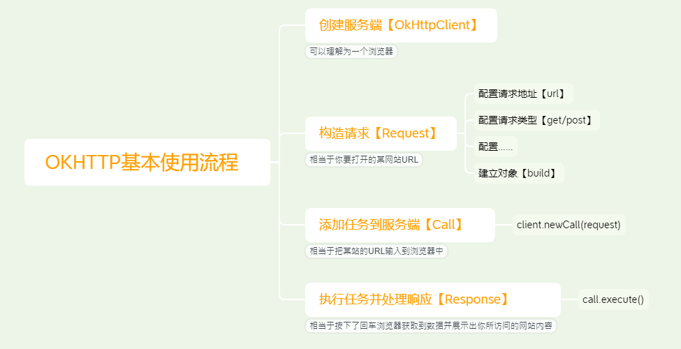
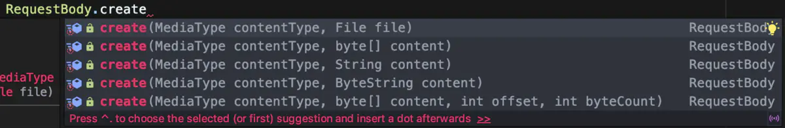

# OKHttp

> **参考；**
>
> 《服务器后台》https://gitee.com/sunofbeaches/SOBAndroidMiniWeb

GitHub；https://github.com/square/okhttp

okhttp 是一个第三方网络请求框架其扮演者一个浏览器的角色。

> **注意；**
>
> 1. OkHttp的4.0.x版本已经全部由`java`替换到了`Kotlin`，API的一些使用也会有些不同，具体的参考[Upgrading to OkHttp 4](https://links.jianshu.com/go?to=https%3A%2F%2Fsquare.github.io%2Fokhttp%2Fupgrading_to_okhttp_4%2F)
> 2. okhttp依赖于okio
> 3. 无论是同步请求还是异步请求处理结果都要从子线程操作，要操作UI需要主进程去完成。


## 基本使用流程



1. 创建OkHttpClient
2. 创建请求内容
3. 浏览器根据请求内容创建请求任务
4. 执行请求任务

## 添加OKHTTP依赖

`3.14.2`，是3.14.x的最后一个版本也是Java语音编写的版本

OkHttp在`3.13.x`以上的版本需要在Android 5.0+ (API level 21+)和Java 1.8的环境开发。

同时还需要再添加Okio的依赖库，而Okio在`1.x`版本是基于Java实现的，`2.x`则是Kotlin实现的。

### 使用Gradle集成

```groovy
implementation 'com.squareup.okhttp3:okhttp:3.14.9"
implementation 'com.squareup.okio:okio:1.17.5"
```

### 使用AS工具集成 

搜索包名为`com.squareup.okhttp3:okhttp`查找后安装即可。


### 问题

- 编译出现；Static interface methods are only supported starting with Android N (--min-api 24): void butterknife

  - 原因；没有指定jdk 1.8编译环境

  - 解决；app build:gradle 中的android 下添加 指定jdk版本的代码,如下:

    ```groovy
    android {
        ......
        //指定jdk版本
        compileOptions {
            sourceCompatibility JavaVersion.VERSION_1_8
            targetCompatibility JavaVersion.VERSION_1_8
        }
    }
    ```


## API

### OkHttpClient【客户端】

**构造方法：**

- OkHttpClient() 无参构造

**方法；**

- `newBuilder()` Builder 开启Builder建造器
- `newCall(Request)` 建立新的请求
  - 参数
    - Request 请求对象
  - 返回
    - Call 对象

### Request 【请求】

一个http请求类生成器。

**属性；**

- `body` 获取配置的请求体RequestBody对象
- `Headers` 获取配置的请求头Headers对象
- `url` 获取配置的url内容

**方法；**

- `get()` 使用get方式请求 默认
- `post(RequestBody )` 使用post请求
  - 参数；
    - RequestBody 请求体，一个RequestBody 抽象类的实现类。
- `headers(Headers headers)` 移除原有，所有header信息，将参数headers的header信息添加到请求中。
- `header(String name, String value)` 重新设置已有name的header信息。
- `addHeader(String name, String value)` 添加请求头信息
- `removeHeader(String name)` 删除请求头信息

### Call 【会话】

**方法；**

- `execute()` 同步执行会话任务
- `enqueue()` 异步执行会任务

### Response【响应】

**方法；**

- `code` 返回HTTP响应状态码 int类型

- `headers` 返回 HTTP响应头 headers类型

- `isSuccessful` 是否成功响应了

- `body()` 获取响应体

- `body().string()` 以字符串形式获取响应体，

  > **警告；**
  >
  > 此方法只可以调用一次，第二次调用会抛出流关闭异常。

  

### RequestBody 【请求体抽象类】

**方法；**

- create() 创造一个RequestBody对象。
  - 重载



以下是其实现类。

#### FormBody

用于传输表单类型的参数.

#### MultipartBody

支持多类型的参数传递

### MediaType

适合描述 HTTP请求体或响应正文的内容类型。

**静态方法；**

- `get();`
- `parse(String string)`把一个请求头格式类型的字符串解析为MediaType类。
  - 返回
    - MediaType 类。


## 发起GET请求

### 同步GET请求

同步的请求，需要自己处理线程的问题，不可以在UI线程去执行任务。

```java
      btnSendGetSync.setOnClickListener(new View.OnClickListener() {
            @Override
            public void onClick(View view) {
                Log.i(TAG, "onClick: GET发送按钮");
                String url = "http://192.168.0.233:9102/get/text";
                //创建OkHttpClient客户端
                OkHttpClient client = new OkHttpClient();
                //构建请求request
                Request request = new Request.Builder()
                        .url(url)
                        .get()
                        .build();
                //新建任务
                Call call = client.newCall(request);
                Toast.makeText(OkActivity.this, "发送成功", Toast.LENGTH_SHORT).show();
                // 在子线程，开启任务。
                new Thread(new Runnable() {
                    @Override
                    public void run() {
                        try {
                            //执行任务，并处理结果。
                            Response response = call.execute();
                            //判断是否成功
                            if (response.isSuccessful()){
                                //处理请求成功
                                Log.d(TAG, "run: 请求成功"+response.body().string());
                            }else{
                                //处理请求失败
                            }
                        } catch (IOException e) {
                            e.printStackTrace();
                            //请求出现异常
                            Log.d(TAG, "run: 请求失败"+e.toString());
                        }
                    }
                }).start();
```

### 异步GET请求

```java
        btnSendGetAsync.setOnClickListener(new View.OnClickListener() {
            @Override
            public void onClick(View view) {
                String url = "http://192.168.0.233:9102/get/text";
                //1. OkHttpClient客户端
                OkHttpClient client = new OkHttpClient();
                //2. 创建请求内容
                Request request = new Request.Builder()
                        .get()
                        .url(url)
                        .build();
                //3. 浏览器根据请求内容创建请求任务
                Call call = client.newCall(request);
                //4. 执行异步请求任务
                call.enqueue(new Callback() {
                    @Override
                    public void onFailure(Call call, IOException e) {
                        //任务执行出现异常回调
                        Log.d(TAG, "onFailure: 任务异常" + e.toString());
                    }

                    @Override
                    public void onResponse(Call call, Response response) throws IOException {

                        //请求成功回调
                        if (response.isSuccessful()) {

                            Log.d(TAG, "onResponse: " + response.body().string());
                        } else {
                            Log.d(TAG, "onResponse: 请求失败");
                        }
                    }
                });
            }
        });
```


## 发起POST请求

基本和GET请求类似。

### 同步POST请求

同步的请求，需要自己处理线程的问题，不可以在UI线程去执行任务。

```java
 btnSendPostSync.setOnClickListener(new View.OnClickListener() {
            @Override
            public void onClick(View view) {
                Toast.makeText(OkActivity.this, "发送成功", Toast.LENGTH_SHORT).show();
                Log.i(TAG, "onClick: POST发送按钮");
                String url = "http://192.168.0.233:9102/post/comment";
                String jsonBodyStr = "{ \"articleId\":\"234123\", \"commentContent\":\"这是评论内容\"}";  //请求体内容
                //创建客户端
                OkHttpClient client = new OkHttpClient();
                //创建请求体
                //MediaType 适合描述HTTP请求或响应正文的内容类型content-type
                RequestBody requestBody = RequestBody.create(MediaType.get("application/json"), jsonBodyStr);
                //构建请求
                Request request = new Request.Builder()
                        .post(requestBody) //请求方式并指定请求体
                        .url(url)
                        .build();
                //创建任务
                Call call = client.newCall(request);
                //同步执行任务
                new Thread(new Runnable() {
                    @Override
                    public void run() {
                        try {
                            //发送请求并处理响应
                            Response response = call.execute();
                            if (response.isSuccessful()) {
                                //成功请求执行
                                Log.d(TAG, "请求成功: " + response.body().string());
                            } else {
                                //请求失败执行
                            }
                        } catch (IOException e) {
                            e.printStackTrace();
                            Log.d(TAG, "发送出现异常==> " + e.toString());
                        }
                    }
                }).start();
```

### 异步POST请求

只是在执行任务时使用`enqueue()`方法

```java
  btnSendPostAsync.setOnClickListener(new View.OnClickListener() {
            @Override
            public void onClick(View view) {
                Toast.makeText(OkActivity.this, "发送成功", Toast.LENGTH_SHORT).show();
                Log.i(TAG, "onClick: POST发送按钮");
                String url = "http://192.168.0.233:9102/post/comment";
                String jsonBodyStr = "{ \"articleId\":\"234123\", \"commentContent\":\"Okhttp异步提交\"}";  //请求体内容
                OkHttpClient client = new OkHttpClient();
                RequestBody requestBody = RequestBody.create(MediaType.get("application/json"),jsonBodyStr);
                Request request = new Request.Builder()
                        .url(url)
                        .post(requestBody)
                        .build();

                Call call = client.newCall(request);
                call.enqueue(new Callback() {
                    @Override
                    public void onFailure(Call call, IOException e) {
                        //任务失败执行
                        Log.d(TAG, "onFailure: 执行失败");

                    }

                    @Override
                    public void onResponse(Call call, Response response) throws IOException {
                        if (response.isSuccessful()){
                             Log.d(TAG, "onResponse: 请求成功"+response.body().string());;
                        }else {
                            Log.i(TAG, "onResponse: 请求失败");
                        }
                    }
                });
            }
        });
```


## 文件上传

> **提示；**
>
> 在不知道文件类型时，Content-Type 请求头可以设置为`application/octet-stream`

### 单文件上传

**步骤；**

1. 准备要上传的文件并获取其路径，file。
2. 创建`OkHttpClient`客户端。
3. 根据要提交文件类型，生成HTTP Content-type字段信息
4. 生成文件请求体对象。【把文件转换为二进制】
5. 生成一个大的请求体对象。并添加表单数据
6. 建立请求对象Request
7. 新建会话任务Call
8. 执行会话并处理回调call.enqueue

```java
btnPostFile.setOnClickListener(new View.OnClickListener() {
    @Override
    public void onClick(View view) {
       Toast.makeText(OkActivity.this, "上传中", Toast.LENGTH_SHORT).show();
       Log.d(TAG, "onClick: 单文件上传");
       //0. 获取文件路径
       File bastPath = OkActivity.this.getFilesDir();
       File imgPath = new File(bastPath,"myhero_01.gif");

       String url = "http://192.168.0.233:9102/file/upload";
       //1. 创建客户端
       OkHttpClient client = new OkHttpClient();
       //2. 生成HTTP Content-type头信息，表示被提交文件类型。
       MediaType mediaType = MediaType.parse("image/gif");
       //3 生成文件体对象，参数，1文件类型，2文件路径file
       RequestBody fileBody = RequestBody.create(mediaType,imgPath);
       //4.生成一个请求体对象，使用多位请求体对象构造。MultipartBody
       RequestBody requestBody = new MultipartBody.Builder()
               /**
                * 添加表单数据部分。服务端通过表单字段获取数据。
                * 参数；
                *  参数1；参数名称
                *  参数2；文件名称
                *  参数3； 文件主体（RequestBody）
                */
               .addFormDataPart("file",imgPath.getName(),fileBody)
               .build();
       //5.构建请求对象
       Request request = new Request.Builder()
               .post(requestBody)
               .url(url)
               .build();
       //6.新建会话任务
       Call call = client.newCall(request);
       //7.执行会话任务，并处理回调。
       call.enqueue(new Callback() {
           @Override
           public void onFailure(Call call, IOException e) {
               Log.d(TAG, "onFailure: 本地出现错误"+e.toString());
           }

           @Override
           public void onResponse(Call call, Response response) throws IOException {
                       if (response.isSuccessful()){
                           Log.d(TAG, "onResponse: 成功上传"+response.body().string());
                       }else {
                           Log.d(TAG, "onResponse: 上传失败"+response.body().string());
                       }
                    }
                });
            }
});
```

### 多文件上传

多文件上传和单文件上传，差别不大只是多文件上传在生成文件请求体对象和生成大请求体并配置表单时要多配置几次，也就是为每一个要上传的文件都要配置。

```java
 btnPostFiles.setOnClickListener(new View.OnClickListener() {
     @Override
     public void onClick(View view) {
         Toast.makeText(OkActivity.this, "上传中", Toast.LENGTH_SHORT).show();
         Log.d(TAG, "onClick: 多文件上传");
         String url = "http://192.168.0.233:9102/files/upload";
         //创建客户端
         OkHttpClient client = new OkHttpClient();
         //生成HTTP Content-type头信息，表示被提交文件类型。
         MediaType mediaType = MediaType.parse("image/gif");
         //准备一些文件
         File bastPath = OkActivity.this.getFilesDir();
         File img1 = new File(bastPath, "myhero_02.gif");
         File img2 = new File(bastPath, "myhero_03.gif");
         File img3 = new File(bastPath, "myhero_01.gif");
         //分别为要上传的文件生成文件体
         RequestBody fileBody1 = RequestBody.create(mediaType, img1);
         RequestBody fileBody2 = RequestBody.create(mediaType, img2);
         RequestBody fileBody3 = RequestBody.create(mediaType, img3);
         //使用多请求体对象构造请求。把每个文件组装到请求体上
         RequestBody requestBody = new MultipartBody.Builder()
                 .addFormDataPart("files", img1.getName(), fileBody1)
                 .addFormDataPart("files", img2.getName(), fileBody2)
                 .addFormDataPart("files", img3.getName(), fileBody3)
                 .build();
         //创建请求
         Request request = new Request.Builder()
                 .url(url)
                 .post(requestBody)
                 .build();
         //创建新会话
         Call call = client.newCall(request);
         //执行会话，并处理回调。
         call.enqueue(new Callback() {
             @Override
             public void onFailure(Call call, IOException e) {
                 Log.d(TAG, "onFailure: 本地出现错误"+e.toString());
             }
             @Override
             public void onResponse(Call call, Response response) throws IOException {
                 if (response.isSuccessful()){
                     Log.d(TAG, "onResponse: 上传成功"+response.body().string());;
                 }else {
                     Log.d(TAG, "onResponse: 上传失败"+response.body().string());
                 }
             }
         });
     }
 });
```


## 设置请求头

详细api参考上面的[API](#API)部分，部分头部字段有方法来设置。

```java
Request request = new Request.Builder()
        .header("Accept","image/webp")
        .addHeader("Charset","UTF-8")
        .url(url)
        .build();
```


## 其它配置

### 设置超时时间

OkHttp可以设置调用、连接和读写的超时时间，都是通过`OkHttpClient.Builder`设置的。如果不主动设置，OkHttp将使用默认的超时设置。

```java
//配置超时时间的客户端。
OkHttpClient mClient = new OkHttpClient.Builder()
          /*
              以下几个方法参数
              参数；
                  参数1；long 类型 超时时间数
                  参数2；时间单位
          */
        .callTimeout(6000, TimeUnit.MILLISECONDS) //会话超时
        .connectTimeout(6000, TimeUnit.MILLISECONDS) //连接超时
        .readTimeout(20000, TimeUnit.MILLISECONDS) //读取超时
        .writeTimeout(20000, TimeUnit.MILLISECONDS) //连接超时
        .build();
```


## 二次封装

```java
package com.xuelingmiao.archivingassistant.util.manage;

import android.content.Intent;

import java.io.IOException;
import java.util.concurrent.TimeUnit;

import okhttp3.Callback;
import okhttp3.OkHttp;
import okhttp3.OkHttpClient;
import okhttp3.Request;
import okhttp3.Response;

public class IntentMange {
    private static OkHttpClient mClient;

    private IntentMange() {
    }


    /**
     * 获取OkHttpClient客户端
     *
     * @return
     */

    public static OkHttpClient getOkHttpClient() {

        if (mClient != null) {
            return mClient;
        } else {
            mClient = new OkHttpClient.Builder()
                    .callTimeout(6000, TimeUnit.MILLISECONDS) //会话超时
                    .connectTimeout(6000, TimeUnit.MILLISECONDS) //连接超时
                    .readTimeout(20000, TimeUnit.MILLISECONDS) //读取超时
                    .writeTimeout(20000, TimeUnit.MILLISECONDS) //连接超时
                    .build();
            return mClient;
        }

    }

    /**
     * 异步发送GET请求
     * @param url url地址
     * @param callback 回调接口
     */
    public static void sendAsyncGetRequest(String url, Callback callback) {
        OkHttpClient mClient = getOkHttpClient();
        Request request = new Request.Builder().get().url(url).build();
        mClient.newCall(request).enqueue(callback);

    }

    /**
     * 同步发送GET请求
     * @param url 请求地址
     * @return 返回请求结果
     * @throws IOException
     */
    public static String sendSyncGetRequest(String url) throws IOException {
        OkHttpClient mClient = getOkHttpClient();
        Request request = new Request.Builder().get().url(url).build();
        Response response = mClient.newCall(request).execute();
        String message = response.body().string();
        return message ;
    }

}
```

## 附录

**HTTP Content-type对照表；**

https://tool.oschina.net/commons

