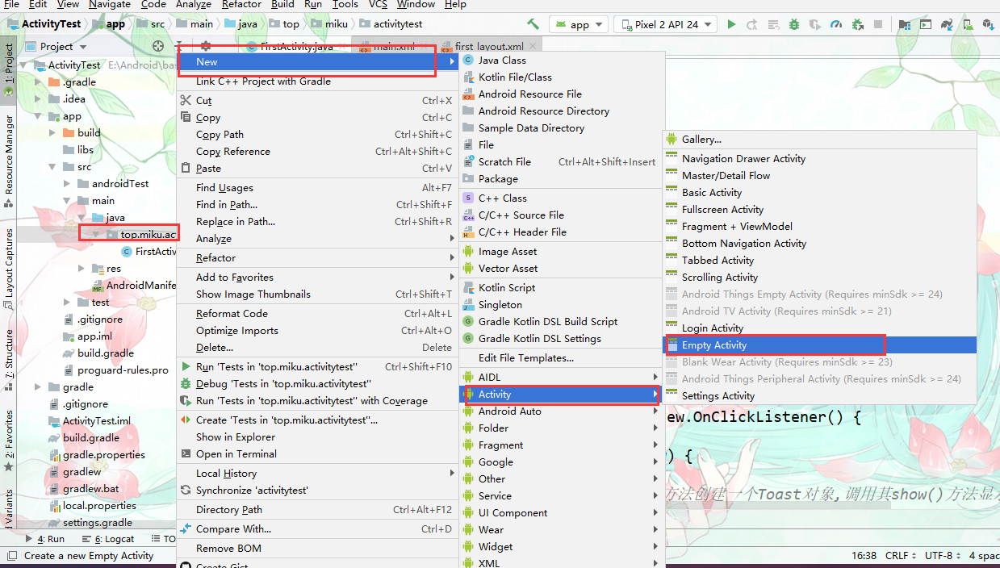
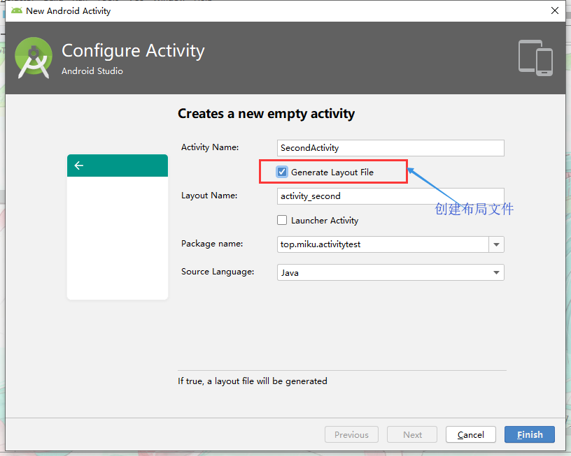
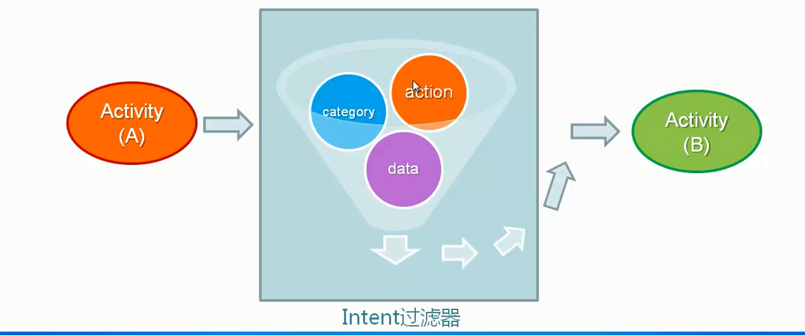
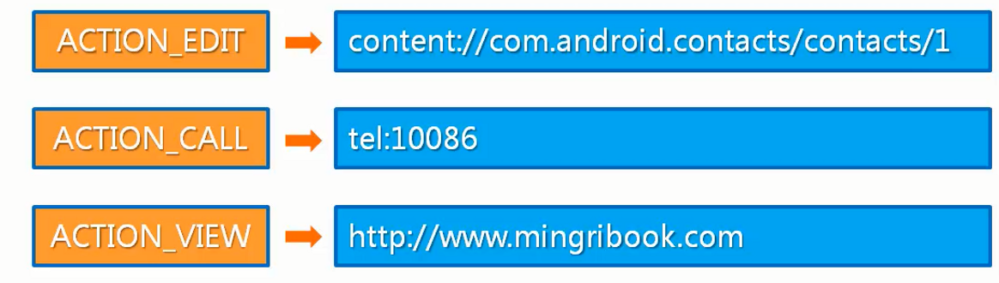
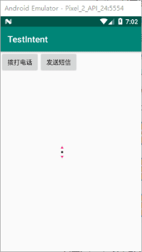
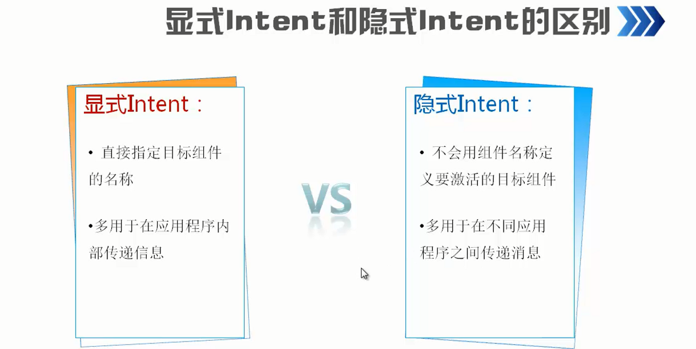
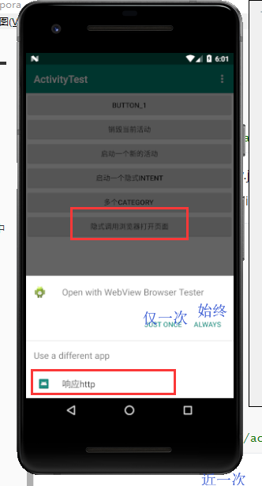
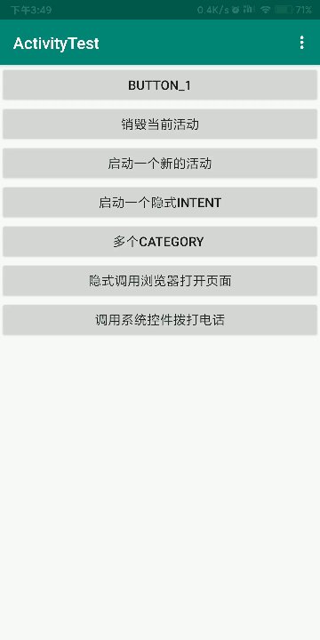

# Intent【意图】

## 介绍
Intent是Android程序中各组件之间进行交互的一种重要方式，它不仅可以指明当前组件想要执行的动作，还可以在不同组件之间传递数据。Intent一般可被用于启动活动、启动服务以及发送广播等。

## 显示Intent

所为显式Intent，在创建Intent对象时明确指定了要启动组件的名称。也就是明确知道要启动的组件名称。

### 在自己APP内跳转

从活动1启动活动2

- 在现有项目上创建一个新的活动（活动2)

  

- 这次我们勾选创建布局文件

  

- 自动生成的second_layout.xml过于复杂【不适合新手】我们把里面的代码替换为以下

  ```xml
  <LinearLayout xmlns:android="http://schemas.android.com/apk/res/android"
          android:orientation="vertical"
          android:layout_width="match_parent"
          android:layout_height="match_parent">
  
      <Button
              android:id="@+id/button_2"
              android:layout_width="match_parent"
              android:layout_height="wrap_content"
              android:text="Button 2"
              />
  </LinearLayout>
  ```

- 不要忘记，**任何一个活动都是需要在AndroidManifest.xml中注册的**，不过幸运的是，Android Studio已经帮我们自动完成了

  ```xml
  <?xml version="1.0" encoding="utf-8"?>
  <manifest xmlns:android="http://schemas.android.com/apk/res/android"
          package="top.miku.activitytest">
  
      <application
              android:allowBackup="true"
              android:icon="@mipmap/ic_launcher"
              android:label="@string/app_name"
              android:roundIcon="@mipmap/ic_launcher_round"
              android:supportsRtl="true"
              android:theme="@style/AppTheme">
          <!-- 这是注册的第二个活动 -->
          <activity android:name=".SecondActivity"></activity>
          <activity
                  android:name=".FirstActivity"
                  android:label="@string/app_name">
              <intent-filter>
                  <action android:name="android.intent.action.MAIN" />
  
                  <category android:name="android.intent.category.LAUNCHER" />
              </intent-filter>
          </activity>
      </application>
  
  </manifest>
  ```


- Activity类中提供了一个`startActivity()` 方法，这个方法是专门用于启动活动的，它接收一个Intent 参数。

```java
/*—————————————启动一个活动绑定活动中书写———————————————————————*/
// 从第一个活动中书写。
        Button button3 = (Button) findViewById(R.id.button_3);
        button3.setOnClickListener(new View.OnClickListener() {
            @Override
            public void onClick(View view) {
                //创建Intent对象
                Intent intent = new Intent(FirstActivity.this,SecondActivity.class);
                //启动这个活动
                startActivity(intent);
            }
        });
```

### 显示Intent跳转到第三方App

**componentName对象** 

- `public ComponentName(@NonNull String pkg, @NonNull String cls)`
  - 参数
    - String pkg 第三方app包名 如`org.chromium.webview_shell`
    - String cls 被启动组件名称也就是类完整路径含包名`org.chromium.webview_shell.WebViewBrowserActivity` 

如果要通过这种方式启动第三方组件，那么我们需要知道，其**包名**被启动组件名称**完整路径包含包名。**

```java
  Intent intent = new Intent();
	/*-------------第一种方法-------------------------*/
// ComponentName componentName = new ComponentName("org.chromium.webview_shell","org.chromium.webview_shell.WebViewBrowserActivity");
//   intent.setComponent(componentName); //设置组件名称

/*---------------第二种-----------------------*/
      // 直接设置组件名           intent.setClassName("org.chromium.webview_shell","org.chromium.webview_shell.WebViewBrowserActivity");
   startActivity(intent);

```


### 指定包名和不指定分析

在跳转第三方APP组件时要指定包名和组件名那么为啥在我们APP内跳转就不需要呢？

看上去我们在构造Intent时只传递了上下文和要跳转的组件类，但实际也是获取了包名等信息的。

```java
//             Intent  mIntent =  new Intent(this,SecondActivity.class); //直接构造
			/*-----------------实际写法---------------------*/
                Intent mIntent = new Intent();
                String packageName = this.getPackageName();	//获取包名
                String name = SecondActivity.class.getName(); //获取类的完整名称
                mIntent.setClassName(packageName,name);
			/*--------------------------------------*/
                startActivity(mIntent);
```


## 隐式Intent

相比于显式Intent，隐式Intent则含蓄了许多，它**并不明确指出**我们想要启动哪一个活动，而是指定了一系列更为抽象的**action** 和**category** 等信息，然后交由系统去分析这个Intent，并帮我们找出合适的活动去启动。什么叫作合适的活动呢？简单来说就是可以响应我们这个隐式Intent的活动



### Intent过滤器

> 一个组件可以有多个过滤器

过滤器是当使用隐藏Intent设置的一些action和data等这些属性就叫做过滤器。配置后组件只会响应符合条件的动作。

通常在AndroidManifest.xml 文件下每个组件下添加`<intent-filter>`标记，在这个标记内指定具体的action和data等属性。

如AndroidStudio生成的xml清单文件

```xml
<?xml version="1.0" encoding="utf-8"?>
<manifest xmlns:android="http://schemas.android.com/apk/res/android"
        package="top.miku.testintent">
    <uses-permission android:name="android.permission.CALL_PHONE"/>
    <uses-permission android:name="android.permission.SEND_SMS"/>

    <application
            android:allowBackup="true"
            android:icon="@mipmap/ic_launcher"
            android:label="@string/app_name"
            android:roundIcon="@mipmap/ic_launcher_round"
            android:supportsRtl="true"
            android:theme="@style/AppTheme">
        <activity android:name=".MainActivity">
            <!-- 给MainActivity设置过滤器 -->
            <intent-filter>
                //当前组件可以响应的action 动作。
                <!-- 通过android:name来指定具体的值 -->
                <action android:name="android.intent.action.MAIN" />
                <category android:name="android.intent.category.LAUNCHER" />
                category //更精确指明当前组件具体响应的信息。
            </intent-filter>
        </activity>
    </application>
```

#### action

指定动作信息

- `android:name` 指定动作名称，命名规范一般是<packageName>.动作名，如`com.xuelingmiao.LOGIN_INFO`

#### category

类别

- `android:name` 定义类别名称

  系统提供值

  | Category常量        | 对应的字符串                       | 说明                               |
  | ------------------- | ---------------------------------- | ---------------------------------- |
  | CATEGORY_DEFAULT    | android.intent.category.DEFAULT    | 默认的Category                     |
  | CATEGORY_TAB        | android.intent.category.TAB        | 指定Activity作为TabActivity的Tab页 |
  | CATEGORY_LAUNCHER   | android.intent.category.LAUNCHER   | Activity显示在顶级程序列表中       |
  | CATEGORY_INFO       | android.intent.category.INFO       | 用于提供包信息                     |
  | CATEGORY_HOME       | android.intent.category.HOME       | 设置该Activity随系统启动而运行     |
  | CATEGORY_PREFERENCE | android.intent.category.PREFERENCE | 设置Activity是参数面板             |


### 启动自己的Activity

- 在创建一个新的活动

  

- 这次我们勾选创建布局文件

  

- 自动生成的second_layout.xml过于复杂【不适合新手】我们把里面的代码替换为以下

  ```xml
  <LinearLayout xmlns:android="http://schemas.android.com/apk/res/android"
          android:orientation="vertical"
          android:layout_width="match_parent"
          android:layout_height="match_parent">
  
      <Button
              android:id="@+id/button_2"
              android:layout_width="match_parent"
              android:layout_height="wrap_content"
              android:text="Button 2"
              />
  </LinearLayout>
  ```

- 不要忘记，**任何一个活动都是需要在AndroidManifest.xml中注册的**，不过幸运的是，Android Studio已经帮我们自动完成了

  ```xml
  <?xml version="1.0" encoding="utf-8"?>
  <manifest xmlns:android="http://schemas.android.com/apk/res/android"
          package="top.miku.activitytest">
  
      <application
              android:allowBackup="true"
              android:icon="@mipmap/ic_launcher"
              android:label="@string/app_name"
              android:roundIcon="@mipmap/ic_launcher_round"
              android:supportsRtl="true"
              android:theme="@style/AppTheme">
          <!-- 这是注册的第二个活动 -->
          <activity android:name=".SecondActivity"></activity>
          <activity
                  android:name=".FirstActivity"
                  android:label="@string/app_name">
              <intent-filter>
                  <action android:name="android.intent.action.MAIN" />
  
                  <category android:name="android.intent.category.LAUNCHER" />
              </intent-filter>
          </activity>
      </application>
  
  </manifest>
  ```

为SecondActivity配置Intent过滤器；

```xml
 <activity android:name=".SecondActivity">
     <!-- 配置过滤器 -->
            <intent-filter>
                <!-- 定义行动 -->
                <action android:name="com.xuelingmiao.LOGIN_INFO"/>
                <!-- 定义类别 -->
                <category android:name="android.intent.category.DEFAULT"/>
            </intent-filter>
        </activity>
```

启动SecondActivity

```java
   Intent intent = new Intent();
                // 设置动作过滤
                intent.setAction("com.xuelingmiao.LOGIN_INFO");
                // 添加类别过滤
                intent.addCategory(Intent.CATEGORY_DEFAULT);
                startActivity(intent);
```


### 隐式Intent跳转到第三方App

设置符合要跳转第三方组件的Intent过滤器条件Action和Category具体设置内容要看第三方app提供的app清单文件中。Android5.1以上的系统要为Category设置包名

```java
/*  打开浏览器的某个界面
               <intent-filter>
                <action android:name="android.speech.action.VOICE_SEARCH_RESULTS" />
                <category android:name="android.intent.category.DEFAULT" />
            </intent-filter>
            package="com.android.browser"
*/
				Intent intent = new Intent;
                intent.setAction("android.speech.action.VOICE_SEARCH_RESULTS");
                intent.addCategory("android.intent.category.DEFAULT");
                intent.setPackage("com.android.browser"); //为了兼容这里都设置一下包名
                startActivity(intent);
```


Action和Data Action是指定将要执行的动作，Data是指定具体的数据的，通常这两个属性一起使用Action也和Category一起使用。

- Action 通常是使用Intent的常量来指定的。

  - `setAction()` 方法设置该属性。

  - 具体常用可以参考以下地址

    https://developer.android.google.cn/guide/components/intents-common?hl=zh_cn#java

- Data 是一个URI 不同的Action的URI是不同的。

  - `setData()` 方法设置该属性。
  - 每个Acton都有对应的URI 局里以下【联系人，拨打电话，显式内容】



- 实例调用电话页面和短信页面 **更多页面调用可以参考上面的Action常量文档**



```java
package top.miku.testintent;

      import androidx.appcompat.app.AppCompatActivity;

      import android.content.Intent;
      import android.net.Uri;
      import android.os.Bundle;
      import android.view.View;
      import android.widget.Button;

      public class MainActivity extends AppCompatActivity {
          private Button call,texting;
          @Override
          protected void onCreate(Bundle savedInstanceState) {
              super.onCreate(savedInstanceState);
              setContentView(R.layout.activity_main);

              Button call = findViewById(R.id.call);
              Button texting = findViewById(R.id.texting);

              call.setOnClickListener(onClickListener); //设置事件监听器
              texting.setOnClickListener(onClickListener);


          }

          //创建一个打击事件监听七

          View.OnClickListener onClickListener = new View.OnClickListener() {
              @Override
              public void onClick(View v) {
                  Intent intent = new Intent(); //要使用Intent所以创建一个
                  switch (v.getId()){
                      case R.id.call:
                          intent.setAction(Intent.ACTION_DIAL); //调用电话页面常量
                          intent.setData(Uri.parse("tel:1008611")); //设置电话号码
                          startActivity(intent); //启动活动
                          break;
                      case R.id.texting:
                          intent.setAction(Intent.ACTION_SENDTO); //调用发短信页面
                          intent.setData(Uri.parse("smsto:2333233")); //设置短信号码
                          intent.putExtra("sms_body","哈哈"); //设置默认发送内容
                          startActivity(intent); //启动活动
                          break;
                  }
              }
          };
      }
```

- Category 对执行的动作类别进行描述，通常和**action**属性一起使用。

  - `addCategory()` 来指定属性。通过Intent的常量来指定值

  - 常用

    - `CATEGORY_LAUNCHER` 把Activity作为app启动的默认活动页。
    - `CATEGORY_HOME` 返回系统桌面

  - 更多常量参考地址

    https://developer.android.google.cn/reference/android/content/Intent#standard-categories

  - 实例关闭并返回桌面


- - ```java
    Intent intent = new Intent();//实例化Intent对象
    intent.setAction(Intent.ACTION_MAIN); //设置为主活动
                        intent.addCategory(Intent.CATEGORY_HOME); //关闭程序并返回系统桌面
                        startActivity(intent); //启动活动
    ```

- Extras //添加附加信息，通常用作活动传值。

  - `putExtras(Bundle对象)` 保存数据
  - `getExtras()`获取保存的bundle对象。
  - 实例参考 [使用Bundle在活动之间传递数据](#使用Bundle在活动之间传递数据)

- Flags app程序如何去启动另一个Activity或当前活动属于那个**Task**或程序启动以后如何处理。

  - `setFlags()` 指定属性值。通过Intent的常量来设置。

  - `FLAG_ACTIVITY_NO_HISTORY` 让启动的活动不在历史栈中，当用户离开后自动销毁活动。

  - 更多常量参考

    https://developer.android.google.cn/reference/android/content/Intent#flags 表格中以Flags开头的

##### 显式Intent 类型

所为显式Intent，显式Intent就是创建Intent对象时**指定**目标要启动的目标组件名称。也就是明确知道要启动的组件名称。

`Intent(Context packageContext, Class<?> cls)` 。这个构造函数接收两个参数。

- 参数
  - 第一个参数Context 要求提供一个启动活动的上下文。
  - 第二个参数Class 则是指定想要启动的目标活动，通过这个构造函数就可以构建出Intent 的“意图”。

Activity类中提供了一个`startActivity()` 方法，这个方法是专门用于启动活动的，它接收一个Intent 参数。

```java
/*—————————————启动一个活动绑定活动中书写———————————————————————*/
        Button button3 = (Button) findViewById(R.id.button_3);
        button3.setOnClickListener(new View.OnClickListener() {
            @Override
            public void onClick(View view) {
                //创建Intent对象
                Intent intent = new Intent(FirstActivity.this,SecondActivity.class);
                //启动这个活动
                startActivity(intent);
            }
        });
```

##### 隐式Intent类型

相比于显式Intent，隐式Intent则含蓄了许多，它**并不明确指出**我们想要启动哪一个活动，而是指定了一系列更为抽象的**action** 和**category** 等信息，然后交由系统去分析这个Intent，并帮我们找出合适的活动去启动。什么叫作合适的活动呢？简单来说就是可以响应我们这个隐式Intent的活动

- 到AndroidManifest.xml给要响应的活动配置**action**和**category**

  ```xml
  <activity
                  android:name=".SecondActivity"
                  android:label="第二个活动">
     // 只有<action> 和<category> 中的内容同时能够匹配上Intent中指定的action 和category 时，这个活动才能响应该Intent。
              <intent-filter>
                  <!- top.miku.activitytest是main/java中的包 -->
                  //ACTION_START == 行动开始
                  //指定活动是可以响应的
                  <action android:name="top.miku.activitytest.ACTION_START"/>
                  //<category> 标签则包含了一些附加信息，更精确地指明了当前的活动能够响应的Intent中还可能带有的category 
                  <category android:name="android.intent.category.DEFAULT"/>
              </intent-filter>
  </activity
  ```

- FirstActivity中书写以下代码

  ```java
   /*——————————启动一个隐藏的Intent——————————*/
          Button button4 = (Button) findViewById(R.id.button_4);
          button4.setOnClickListener(new View.OnClickListener() {
              @Override
              public void onClick(View view) {
                  //隐藏模式
                  Intent intent = new Intent("top.miku.activitytest.ACTION_START");
                  startActivity(intent);
              }
          });
  /*
      我们使用了Intent的另一个构造函数，直接将action 的字符串传了进去，表明我们想要启动能够响应com.example.activitytest.ACTION_START 这个action 的活动。那前面不是说要<action> 和<category> 同时匹配上才能响应的吗？怎么没看到哪里有指定category 呢？这是因为android.intent.category.DEFAULT 是一种默认的category ，在调用startActivity() 方法的时候会自动将这个category 添加到Intent中。
  */
  ```

- 多个category匹配一个活动

  ```java
   /*——————————多个category——————————————————————*/
          //每个Intent中只能指定一个action ，但却能指定多个category
          Button button5 = (Button) findViewById(R.id.button_5);
          button5.setOnClickListener(new View.OnClickListener() {
              @Override
              public void onClick(View view) {
                  Intent intent = new Intent("top.miku.activitytest.ACTION_START");
                  //添加一个自定义值的category
                  intent.addCategory("top.miku.activitytest.MY_CATEGORY");
                  startActivity(intent);
              }
          });
  ```

- 到AndroidManifest.xml中添加这个新的category值

  ```xml
  <activity
                  android:name=".SecondActivity"
                  android:label="第二个活动">
              <intent-filter>
                  <action android:name="top.miku.activitytest.ACTION_START"/>
                  <category android:name="android.intent.category.DEFAULT"/>
                  <!-- 添加的自定义category -->
                  <category android:name="top.miku.activitytest.MY_CATEGORY"/>
              </intent-filter>
  </activity>
  ```

## 显式和隐式区别




##### 更多隐式Intent的用法

使用隐式Intent，我们不仅可以启动自己程序内的活动，还可以启动其他程序的活动，这使得Android多个应用程序之间的功能共享成为了可能。

```java
/*————————————隐式调用本地浏览器打开网页————————————*/
        Button button6 = (Button) findViewById(R.id.button_6);
        button6.setOnClickListener(new View.OnClickListener() {
            @Override
            public void onClick(View view) {
                //创建一个action，
                // Intent.ACTION_VIEW 这是一个Android系统内置的动作，其常量值为android.intent.action.VIEW
                Intent intent = new Intent(Intent.ACTION_VIEW);
                //通过Uri.parse() 方法，将一个网址字符串解析成一个Uri 对象
                //再调用Intent的setData() 方法将这个Uri 对象传递进去。
                intent.setData(Uri.parse("https://www.baidu.com"));
                startActivity(intent);
            }
        });
```

- `setData()`

setData()接收一个`Uri` 对象，主要用于指定当前Intent正在操作的数据，而这些数据通常都是以字符串的形式传入到`Uri.parse()` 方法中解析产生的。

与此对应，我们还可以在`<intent-filter>` 标签中再配置一个`<data>` 标签，用于更精确地指定当前活动能够响应什么类型的数据。`<data>` 标签中主要可以配置以下内容。

1. `android:scheme`用于指定数据的协议部分，如上例中的https部分。
2. `android:host` 用于指定数据的主机名部分，如上例中的[www.baidu.com部分。](http://www.baidu.com部分。)
3. `android:port`用于指定数据的端口部分，一般紧随在主机名之后。
4. `android:mimeType`用于指定可以处理的数据类型，允许使用通配符的方式进行指定。

只有`<data>` 标签中指定的内容和Intent中携带的Data完全一致时，当前活动才能够响应该Intent。不过一般在`<data>` 标签中都不会指定过多的内容，如上面浏览器示例中，其实只需要指定`android:scheme` 为http，就可以响应所有的http协议的Intent了

##### 响应打开网页

- 新建一个activity，ThirdActivity

- 把ThirdActivity中的布局xml替换为以下代码

  ```xml
  <LinearLayout xmlns:android="http://schemas.android.com/apk/res/android"
          android:orientation="vertical"
          android:layout_width="match_parent"
          android:layout_height="match_parent">
  
      <Button
              android:id="@+id/button_3"
              android:layout_width="match_parent"
              android:layout_height="wrap_content"
              android:text="Button 3"
              />
  
  </LinearLayout>
  ```

- ThirdActivity.java中的代码不做修改

- 最后在AndroidManifest.xml中修改ThirdActivity的注册信息

  ```xml
  activity
                  android:name=".ThirdActivity"
                  android:label="响应http">
              <intent-filter>
                  //当前活动是可以被响应的
                  <action android:name="android.intent.action.VIEW" />
                  //响应类型默认
                  <category android:name="android.intent.category.DEFAULT" />
                  //指定响应的协议
                  <data android:scheme="https" />
              </intent-filter>
          </activity>
  ```

- 之后再次点击打开网页我们的活动就会有响应了

  

##### 调用系统拨打电话

```java
/*————————————拨打电话————————————*/
        Button button7 = (Button) findViewById(R.id.button_7);
        button7.setOnClickListener(new View.OnClickListener() {
            @Override
            public void onClick(View view) {
                //创建一个action，
                // Intent.ACTION_DIAL这是一个Android系统内置的动作，其常量值为android.intent.action.DIAL
                Intent intent = new Intent(Intent.ACTION_DIAL);
                //通过Uri.parse() 方法，将一个网址字符串解析成一个Uri 对象
                //再调用Intent的setData() 方法将这个Uri 对象传递进去。
                intent.setData(Uri.parse("tel:10086"));//tel关键词可以拨打电话
                startActivity(intent);
            }
        });
```




## Intent类

**构造函数；**

- `Intent(Context packageContext, Class<?> cls)` 。这个构造函数接收两个参数。
  - 参数
    1. 第一个参数Context 要求提供一个启动活动的上下文。
    2. 第二个参数Class 则是指定想要启动的目标活动，通过这个构造函数就可以构建出Intent 的“意图”。

