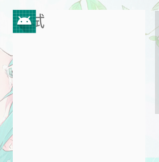
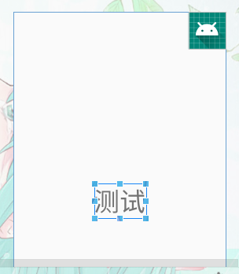

# FrameLayout帧布局

FrameLayout又称作帧布局，后定义的控件会覆盖之前的控件，所有的控件都会默认摆放在布局的左上角。

这种控件适用于层叠布局。

**属性**

| 属性                      | 作用                                                 | 值       |
| ------------------------- | ---------------------------------------------------- | -------- |
| android:foreground        | 设置前景图片【前景图始重在最上层其它内容无法覆盖的】 | @mipmap/ |
| android:foregroundGravity | 设置前景图片位置                                     | 方位词等 |

- 示例默认

  ```xml
  <?xml version="1.0" encoding="utf-8"?>
  <FrameLayout xmlns:android="http://schemas.android.com/apk/res/android"
          android:layout_width="match_parent"
          android:layout_height="match_parent">
      <TextView
              android:layout_width="wrap_content"
              android:layout_height="wrap_content"
              android:text="@string/test"
              android:textSize="50sp"/>
      <ImageView
              android:layout_width="wrap_content"
              android:layout_height="wrap_content"
              android:src="@mipmap/ic_launcher"/>
  </FrameLayout>
  ```

  

  可以看到，文字和图片都是位于布局的左上角。由于ImageView是在TextView之后添加的，因此图片压在了文字的上面。

- 可以使用`layout_gravit`修改对齐方式

  ```xml
  <?xml version="1.0" encoding="utf-8"?>
  <FrameLayout xmlns:android="http://schemas.android.com/apk/res/android"
          android:layout_width="match_parent"
          android:layout_height="match_parent">
      <TextView
              android:layout_width="wrap_content"
              android:layout_height="wrap_content"
              android:text="@string/test"
              android:textSize="50sp"
              android:layout_gravity="center"/>//修改对齐方式
      <ImageView
              android:layout_width="wrap_content"
              android:layout_height="wrap_content"
              android:src="@mipmap/ic_launcher"
              android:layout_gravity="right"/>//修改改对齐方式
  </FrameLayout>
  ```




