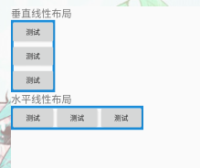
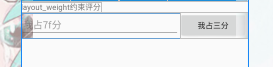

# LinearLayout线性布局

LinearLayout又称作线性布局，是一种非常常用的布局。正如它的名字所描述的一样，这个布局会将它所包含的控件在线性方向上依次排列。

```xml
<?xml version="1.0" encoding="utf-8"?>
<LinearLayout xmlns:android="http://schemas.android.com/apk/res/android"
        android:layout_width="match_parent"
        android:layout_height="match_parent"
        android:orientation="vertical">
    ……
</LinearLayout>
```

**属性**

| 属性                   | 作用                                                         | 值                                          |
| ---------------------- | ------------------------------------------------------------ | ------------------------------------------- |
| android:layout_gravity | 指定布局中的控件对齐方式                                     | top、right、bottom、left、center等 可以用‘\ |
| android:orientation    | 指定控件排放方向                                             | 默认vertical【垂直】horizontal【水平】      |
| android:layout_weight  | 允许我们使用比例的方式来指定控件的大小（权重，类似于CSS中的弹性盒子）注意是分配父控件的剩余空间。 | 数值                                        |

## 布局方向

`android:orientation`属性控制布局方向默认vertical【垂直】horizontal【水平】

- 垂直布局

  ```xml
  <LinearLayout
              android:layout_width="wrap_content"
              android:layout_height="wrap_content"
              android:orientation="vertical"//指定垂直方向
              android:background="@drawable/bg_border">
          <Button
                  android:layout_width="wrap_content"
                  android:layout_height="wrap_content"
                  android:text="@string/test"/>
          <Button
                  android:layout_width="wrap_content"
                  android:layout_height="wrap_content"
                  android:text="@string/test"/>
          <Button
                  android:layout_width="wrap_content"
                  android:layout_height="wrap_content"
                  android:text="@string/test"/>
      </LinearLayout>
  ```

- 水平布局

  ```xml
  <LinearLayout
              android:layout_width="wrap_content"
              android:layout_height="wrap_content"
              android:orientation="horizontal"//指定水平方向
              android:background="@drawable/bg_border">
          <Button
                  android:layout_width="wrap_content"
                  android:layout_height="wrap_content"
                  android:text="@string/test"/>
          <Button
                  android:layout_width="wrap_content"
                  android:layout_height="wrap_content"
                  android:text="@string/test"/>
          <Button
                  android:layout_width="wrap_content"
                  android:layout_height="wrap_content"
                  android:text="@string/test"/>
      </LinearLayout>
  ```




> **注意**
>
> 当LinearLayout的排列方向是horizontal时，只有垂直方向上的对齐方式才会生效，因为此时水平方向上的长度是不固定的，每添加一个控件，水平方向上的长度都会改变，因而无法指定该方向上的对齐方式。同样的道理，当LinearLayout的排列方向是vertical时，只有水平方向上的对齐方式才会生效。


#### 自动按比例评分【自适应】

`layout_weight`按比例分割

```xml
<LinearLayout
            android:layout_width="match_parent"
            android:layout_height="wrap_content"
            android:orientation="horizontal">
        <EditText
                android:layout_width="0dp"
                android:layout_height="wrap_content"
                android:hint="我占7f分"
                android:layout_weight="7"/>
        <Button
                android:layout_width="0dp"
                android:layout_height="wrap_content"
                android:text="我占三分"
                android:layout_weight="3"/>
    </LinearLayout>
```




```xml
<LinearLayout
            android:layout_width="match_parent"
            android:layout_height="wrap_content"
            android:orientation="horizontal">
        <EditText
                android:layout_width="0dp"
                android:layout_height="wrap_content"
                android:hint="我占7分"
                android:layout_weight="1"/>
        <Button
                android:layout_width="wrap_content"
                android:layout_height="wrap_content"
                android:text="我占三分"/>
    </LinearLayout>
<!--  
    这是只设置EditText的layout_weight属性，把Button的layout_width改为wrap_content
这表示Button的宽度仍然按照wrap_content 来计算，而EditText则会占满屏幕所有的剩余空间。
使用这种方式编写的界面，不仅在各种屏幕的适配方面会非常好，而且看起来也更加舒服。
-->
```

> **注意;**
>
> 要按比例评分的宽度或高度，要设置为0dp这是标准写法。


