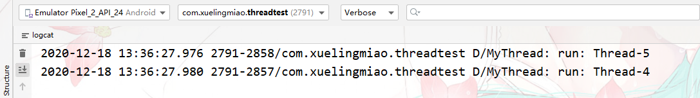
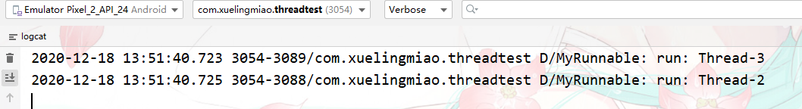
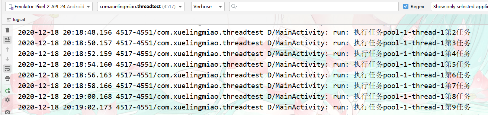
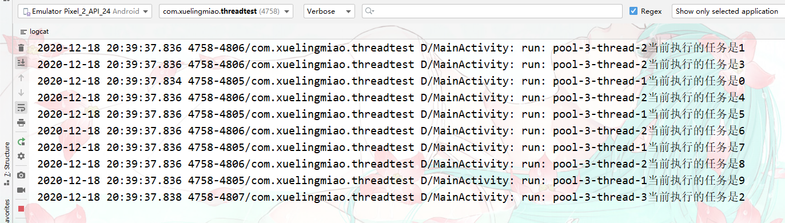
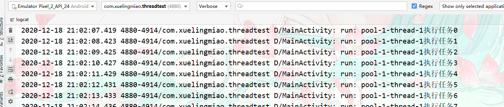
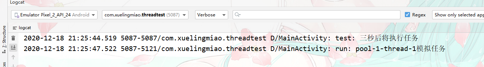
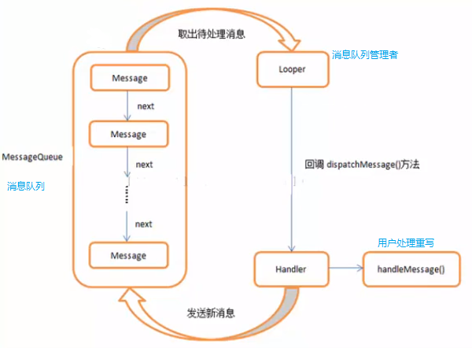
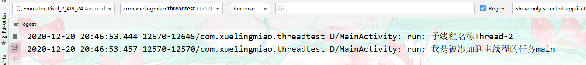
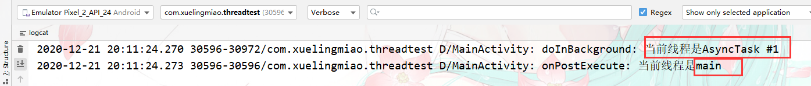
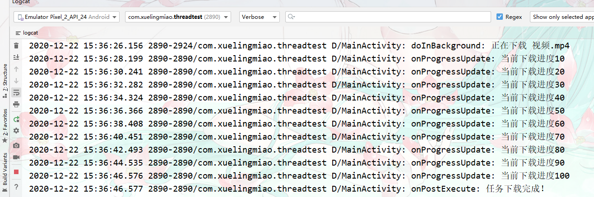

# 多线程和异步任务

## 回顾Java中的多线程实现

### 继承Thread类

- 继承Thread类

  ```java
  package com.xuelingmiao.threadtest.threads;
  
  import android.util.Log;
  
  public class MyThread extends Thread {
      private static final String TAG = "MyThread";
      //重写run方法
      @Override
      public void run() {
          super.run();
          //需要执行的任务
          Log.d(TAG, "run: "+Thread.currentThread().getName());
      }
  }
  ```

- 启动线程

  ```java
   public void TestMyThread(){
           //实例化继承了Thread的类
          Thread t1 = new MyThread();
          Thread t2 = new MyThread();
          t1.start();    //启动线程。
          t2.start();
      }
  ```

- 执行结果




### 实现Runnable接口

如果当前类，已经继承其它类，但是我们又需要多线程就可以使用实现Runnable方式来实现。

- 实现Runnable接口

  ```java
  package com.xuelingmiao.threadtest.threads;
  
  import android.util.Log;
  
  public class MyRunnable implements Runnable {
      private static final String TAG = "MyRunnable";
      //重写run方法
      @Override
      public void run() {
          //要执行的任务
          Log.d(TAG, "run: "+Thread.currentThread().getName());
      }
  }
  ```

- 启动线程

  ```java
   public void TestRunnable(){
           //实例实现了Runnable接口的类。
          MyRunnable runnable1 = new MyRunnable();
          MyRunnable runnable2 = new MyRunnable();
           // 实例Thread类，并传递任务
          Thread t1 = new Thread(runnable1);
          Thread t2 = new Thread(runnable2);
           //启动线程
          t1.start();
          t2.start();
      }
  ```

- 执行结果



### 线程同步

多个Thread执行同一个Runnable。如生活中购买火车票，不同的人去抢购同一地域的火车票。我们可以把这里的人看作为Thread（线程）火车票看作为Runnable.

在多个线程,操作同一个任务时我们需要**锁🔒对象**来保证线程不出现问题。

**案例；**

多个线程去出售同一批火车票。

- 编写售票任务。把需要同步操作的代码使用同步代码块包裹。

```java
package com.xuelingmiao.threadtest.threads.cases;

import android.util.Log;

public class SaleTicket implements Runnable {
    private static final String TAG = "SaleTicket";
    private int ticket = 20;    //总票数

    @Override
    public void run() {
        while (true) {
            //使用同步代码块，这里索对象使用this
            synchronized (this) {
                //有票
                if (ticket > 0) {
                    Log.d(TAG, "run: " + Thread.currentThread().getName() + "卖出了第" + (20 - ticket + 1) + "张");
                    ticket--; //每卖出一张总票数-1
                }
                //无票，结束循环。
                else {
                    break;
                }
            }
            // 休息一会在买票。
            try {
                Thread.sleep(500);
            } catch (InterruptedException e) {
                e.printStackTrace();
            }
        }


    }
}
```

- 交给不同线程去售卖。

  ```java
      public void testSaleTicket(){
          //实例化售票任务。
          SaleTicket saleTicket = new SaleTicket();
          //分别交给不同线程去售卖。
          Thread t1 = new Thread(saleTicket,"{代理A|");
          Thread t2 = new Thread(saleTicket,"{代理B|");
          Thread t3 = new Thread(saleTicket,"{代理C|");
          Thread t4 = new Thread(saleTicket,"{代理D|");
          //启动任务。
          t1.start();
          t2.start();
          t3.start();
          t4.start();
      }
  ```

- 执行结果

  


## 线程池

### 基本线程池【ThreadPoolExecutor】

创建线程池，主要是利用ThreadPoolExecutor这个类。设置好几个参数就可以创建一个基本的线程池，而之后的各种线程池都是在这种基本线程池的基础上延伸的。

**构造方法；**

- `ThreadPoolExecutor(int corePoolSize,int maximumPoolSize,long keepAliveTime,TimeUnit unit,BlockingQueue<Runnable> workQueue,ThreadFactory threadFactory)`创建基本线程池
  - 参数
    - `int corePoolSize` 核心线程数
    - `int maximumPoolSize `最大线程池大小
    - `long keepAliveTime `保持活动时间，是非核心线程空闲时要等待下一个任务到来的时间
    - `TimeUnit unit` 上面保持活动时间时间单位
    - `BlockingQueue<Runnable> workQueue `任务队列
    - `ThreadFactory threadFactory `线程工厂，可用于设置线程名字等等，一般无须设置该参数。


### 缓存线程池【CachedThreadPool】

是一个按需创建的线程池对象，根据当前任务数自动创建和重用线程。每个线程空闲等待的时间为60s

**创建；**

```java
 ExecutorService cachedThreadPool = Executors.newCachedThreadPool();
```

**使用；**

模拟一个线程任务。为了体现，在执行任务时是使用的同一个线程，这里我们让线程休息一下，来达到非并发添加线程。一个一个添加任务到线程池中。

- `execute(Runnable runnable)`执行任务。
  - 参数；
    - `Runnable runnable` 一个Runnable接口。

```java
public void testCache(){
        ExecutorService cachedThreadPool = Executors.newCachedThreadPool();
        for (int i = 0; i < 10; i++) {
            final int index = i;
            //模拟一个空闲时间
            try {
                Thread.sleep(2000);
            } catch (InterruptedException e) {
                e.printStackTrace();
            }
            //添加任务到线程池。
            cachedThreadPool.execute(new Runnable() {
                @Override
                public void run() {
                    Log.d(TAG, "run: 执行任务"+Thread.currentThread().getName()+"第"+index+"任务");
                }
            });
        }
    }
```

执行结果；可以看到当前的任务都是同一个线程来完成的。（pool-1-thread-1）




### 可重用固定线程池【FixedThreadPool】

一个可以控制并发（同时执行）的线程池。同时固定线程池长度。

**创建；**

Executors类中的创建方法：

- `Executors.newFixedThreadPool(int corePoolSize)` 创建可重用固定线程数
  - 参数
    - `int corePoolSize` 核心线程数及同时执行线程个数。
  - 返回值
    - ExecutorService

```java
ExecutorService fixedThreadPool = Executors.newFixedThreadPool(3);
```

**使用；**

```java
 public void testFixedThreadPool() {
        ExecutorService fixedThreadPool = Executors.newFixedThreadPool(3);
        for (int i = 0; i < 10; i++) {
            final int index = i;
            fixedThreadPool.execute(new Runnable() {
                @Override
                public void run() {
                    Log.d(TAG, "run: " + Thread.currentThread().getName() + "当前执行的任务是" + index);
                    //同时让每一个执行到这里的线程休眠一下。
                    try {
                        Thread.sleep(2000);
                    } catch (InterruptedException e) {
                        e.printStackTrace();
                    }
                }
            });
        }
```

执行结果；可以看到这里的最高并发数量只有到3.运行上面的代码会出现一次有三个任务同时执行的效果，之后这三个任务会同时休眠一会。



### 单线程【SingleThreadExecutor】

只会用一个工作线程来执行任务，保证所有的任务按指定的优先级顺序来执行。

**创建；**

```java
 ExecutorService singleThreadExecutor = Executors.newSingleThreadExecutor();
```

**使用；**

```java
 public void testSingleThreadExecutor(){
        ExecutorService singleThreadExecutor = Executors.newSingleThreadExecutor();
        for (int i = 0; i < 10; i++) {
            final int index = i;
            singleThreadExecutor.execute(new Runnable() {
                @Override
                public void run() {
                    Log.d(TAG, "run: "+Thread.currentThread().getName()+"执行任务"+index);
                    try {
                        Thread.sleep(1000);
                    } catch (InterruptedException e) {
                        e.printStackTrace();
                    }
                }
            });
        }
    }
```

执行结果； 可以看到始终只有一个Thread（pool-1-thread-1）在执行。任务




### 定时延时执行【ScheduledThreadPool】

支持指定长度的，线程池同时支持定时执行任务和周期（按指定的时间间距执行任务）执行任务。

**创建；**

```java
ScheduledExecutorService singleThreadScheduledExecutor = Executors.newSingleThreadScheduledExecutor();
```

**使用；**

延迟执行惹任务。

- `schedule(Runnable var1, long var2, TimeUnit var4)` 延迟执行任务。
  - 参数；
    - `Runnable var1` 要执行的任务。
    - `long var2 `延迟时间。
    - `TimeUnit var4 `延迟的时间单位。
- `scheduleAtFixedRate(Runnable var1, long var2, long var4, TimeUnit var6)` 延迟周期任务。
  - 参数；
    - Runnable var1 要执行的任务。
    - long var2 延迟首次执行的时间。
    - long var4 连续执行的周期时间。
    - TimeUnit var6 延迟和周期的时间单位。
- `shutdown()` 结束周期定时。

```java
public void testSingleThreadScheduledExecutor(){
       Log.d(TAG, "test: 三秒后将执行任务");
       ScheduledExecutorService singleThreadScheduledExecutor = Executors.newSingleThreadScheduledExecutor();
    //延迟执行任务。
       singleThreadScheduledExecutor.schedule(new Runnable() {
           @Override
           public void run() {
               Log.d(TAG, "run: "+Thread.currentThread().getName()+"模拟任务");
           }
       },3, TimeUnit.SECONDS);

    //周期执行任务。
    singleThreadScheduledExecutor.scheduleAtFixedRate(new Runnable() {
           @Override
           public void run() {
               Log.d(TAG, "run: 模拟任务"+Thread.currentThread().getName());
           }
       },2,3,TimeUnit.SECONDS);


   }
```

执行结果；




### 线程池部分方法

- `shutDown()` 关闭线程池，不影响已经提交的任务
- `shutDownNow()` 关闭线程池，并尝试去终止正在执行的线程
- `allowCoreThreadTimeOut(boolean value)` 允许核心线程闲置超时时被回收
- `submit()` 一般情况下我们使用execute来提交任务，但是有时候可能也会用到submit，使用submit的好处是submit有返回值。
- `execute(runnable)` 执行任务
- `beforeExecute()` - 任务执行前执行的方法
- `afterExecute()` -任务执行结束后执行的方法
- `terminated()` -线程池关闭后执行的方法

## 线程通信

在Android中sdk为我们提供两种方式做线程通信Handler和AsyncTask。

### Handler异步消息处理

应用线程通信来解决，子线程更新主线程UI问题，AndroidSDK内置的，线程通信类。

#### Handler

在Android中负责**发送和处理消息**，通过Handler可以实现其它线程与主线程通信。

**方法；**

- `sendEmptyMessage(int what)` 发送一个空消息。
  - 参数
    - `int what` 定义一个消息代码，以便Handeler收到消息可以识别此消息的含义（也就是根据不同的消息码做做相应的处理）。 每个Handler都有自己的消息代码命名空间，因此您不必担心自己与其他处理程序的冲突。
  - 返回值
    - 如果消息已成功放入消息队列，则返回true。
    - 失败时返回false，通常是因为正在处理消息队列的循环程序正在退出。
- `sendEmptyMessageDelayed(int what, long delayMillis)`  延迟发送一个空消息
  - 参数
    - `int what` 消息标识码
    - `long delayMillis` 延迟时间毫秒
  - 返回
    - 如果消息已成功放入消息队列，则返回true。
    - 失败时返回false，通常是因为正在处理消息队列的循环程序正在退出。
- `sendMessage(Message msg)` 发送一个包含Message【消息对象】对象的消息。
  - 参数
    - `Message msg` 消息对象
  - 返回
    - 如果消息已成功放入消息队列，则返回true。
    - 失败时返回false，通常是因为正在处理消息队列的循环程序正在退出。
- `sendMessageDelayed(Message msg, long delayMillis)` 延迟发送含有Message对象的消息。
  - 参数
    - `Message msg `消息对象
    - `long delayMillis` 延迟毫秒数
  - 返回
    - 如果消息已成功放入消息队列，则返回true。
    - 失败时返回false，通常是因为正在处理消息队列的循环程序正在退出。

----

- `post(Runnable r)` 将一个任务添加到消息处理者（比如这里住线程）的队列中等待执行。这样就可以更新主线程的UI了。
  - 参数
    - `Runnable r` 任务对象
  - 返回
    - 如果已将Runnable成功放入消息队列，则返回true。
    - 失败时返回false，通常是因为正在处理消息队列的循环程序正在退出。
- `postDelayed(Runnable r, long delayMillis)` 延迟添加任务到消息队列中等待执行。
  - 参数
    - `Runnable r` 任务对象
    - `long delayMillis` 延迟毫秒数。
  - 返回
    - 如果已将Runnable成功放入消息队列，则返回true。
    - 失败时返回false，通常是因为正在处理消息队列的循环程序正在退出。

##### Handler的辅助类

###### Looper 【消息队列管理】

负责管理线程消息队列和不停的从MessageQueue消息队列中取出消息。

###### Message【消息】

是线程通信之间消息的载体，当发生消息时把消息封装为Message进行传递。

**属性；**

- `what` 设置消息标识码。
- `obj` 要发送给接收者的任意对象。

###### MessageQueue【消息队列】

是消息队列，先进先出（队列结构），它的作用是保存有待线程处理的满息。

##### 关系

它们四者之间的关系是，

- 在其他线程中调用`Handler.sendMsg0`方法传递`Message`对象，
- 将需要主线程处理的事件添加到主线程的`MessageQueue`中，
- 主线程通过使用它的Looper【消息队列管理】，从消息队列中取出`Handler`发过来的这个消息时，会回调`Handler`的`handlerMessage0`方法。



#### 发送和处理消息

##### 空消息处理Demo

- 消息处理

  ```java
      private Handler mHandler = new Handler(){
          //接受到消息后的回调。
          @Override
          public void handleMessage(@NonNull Message msg) {
              //根据不同的消息码进行相应的处理
              switch (msg.what){
                  case 0x1:
                      btnTestThread.setText("通过Handler发送消息主线程处理");
                      break;
                  case 0x2:
                      break;
                  case 0x3:
                      break;
                  default:
                      break;
              }
          }
      };
  ```

- 消息发送

  ```java
          btnTestThread.setOnClickListener(new View.OnClickListener() {
              @Override
              public void onClick(View view) {
                      new Thread(new Runnable() {
                          @Override
                          public void run() {
                              try {
                                  //模拟一个网络请求
                                  Thread.sleep(2000);
                              } catch (InterruptedException e) {
                                  e.printStackTrace();
                              }
                              //网络请求更新UI
                      //    btnTestThread.setText("子线程更新UI"); //直接这样写会报错，子线程是无法更新主线程的UI的。
                              // 通过Handle发送消息让主线程去更新UI。
                              //发送一个空消息。
                              mHandler.sendEmptyMessage(0x1);
                          }
                      }).start();
  
              }
          });
  ```

##### 有消息处理Demo

- 处理消息

  ```java
     private Handler mHandler = new Handler(){
          //接受到消息后的回调。
          @Override
          public void handleMessage(@NonNull Message msg) {
              //处理对应消息码的消息。
              switch (msg.what){
                  case 0x1:
                      //取出Message对象所包含的数据。
                      String title = (String) msg.obj;
                      btnTestThread.setText(title);
                      break;
                  case 0x2:
                      break;
                  case 0x3:
                      break;
                  default:
                      break;
              }
          }
  ```

- 发送消息

  ```java
          btnTestThread.setOnClickListener(new View.OnClickListener() {
              @Override
              public void onClick(View view) {
                      new Thread(new Runnable() {
                          @Override
                          public void run() {
                              try {
                                  //模拟一个网络请求
                                  Thread.sleep(2000);
                              } catch (InterruptedException e) {
                                  e.printStackTrace();
                              }
                              //网络请求更新UI
                              String title = "从网络上获取的内容";
                              //把数据封装到Message对象中。
                              Message mMessage = new Message();
                              mMessage.what = 0x1;    //设置消息码
                              mMessage.obj = title;     //要传递的数据
                              mHandler.sendMessage(mMessage); //发送消息。
                          }
                      }).start();
              }
          });
  ```

##### 任务发送Demo

将惹任务发送到住线程队列中去等待执行。**这里添加到的消息队列是住线程中，既然到了主线程那么我们就可以更新UI等操作。**

```java
//任务发送方法。 
public void testPoll() {
        mHandler.post(new Runnable() {
            @Override
            public void run() {
                Log.d(TAG, "run: 我是被添加到主线程的任务" + Thread.currentThread().getName());
            }
        });
    }

//调用任务发送方法
 btnTestThread.setOnClickListener(new View.OnClickListener() {
          @Override
          public void onClick(View v) {
                new Thread(new Runnable() {
                    @Override
                    public void run() {
                        Log.d(TAG, "run: 子线程名称"+Thread.currentThread().getName());
                        testPoll();        //发送任务到主线程。
                    }
                }).start();
          }
      });
```

执行结果；



#### 实际应用

##### 刷新进度条（定时器）

原理；在处理消息时我们也同时发送消息，达到重复执行的目的从而实现定时器效果。

- 界面UI布局

  ```xml
  <!-- 进度条控件 -->  
  <ProgressBar
             android:id="@+id/proBar"
             android:visibility="gone"
             style="?android:attr/progressBarStyleHorizontal"
             android:layout_width="match_parent"
             android:layout_height="30dp"
             android:max="100"
             android:min="0"
             />
  ```

- java后台代码。

```java
//处理消息。

    private int progress = 0; //记录总进度。
    private Handler mHandler = new Handler(){
        //接受到消息后的回调。
        @Override
        public void handleMessage(@NonNull Message msg) {
            switch (msg.what){

                //定时器消息处理    
                case 0x2:
                    //如果总进度不小于100那么就再使用Hadler发送消息。类似于递归。
                    if (progress < 100){
                        progress += 10; //进度每次加10
                        proBar.setProgress(progress); //设置进度
                        mHandler.sendEmptyMessageDelayed(0x2,2000); //发送消息。
                    }
                    break;
                case 0x3:
                    break;
                default:
                    break;
            }
        }
    };
        //按钮被点击后启动定时器。
        btnTestThread.setOnClickListener(new View.OnClickListener() {
            @Override
            public void onClick(View view) {
                    new Thread(new Runnable() {
                        @Override
                        public void run() {


                testTimer();//调用启动定时器方法。

            }
        });


//启动定时器方法
public void testTimer(){
        proBar.setVisibility(View.VISIBLE);    //
        mHandler.sendEmptyMessageDelayed(0x2,2000);
    }
```


### AsyncTask异步任务

AsyncTask类是一个用来代替Handler操作的繁琐。

- 方便实现异步通信 不需使用 “任务线程（如继承`Thread`类） + `Handler`”的复杂组合
- 节省资源 采用线程池的缓存线程 + 复用线程，避免了频繁创建 & 销毁线程所带来的系统资源开销

#### AsyncTask

> 它是一个抽象类

**类参数；**

- `class AsyncTask<Params, Progress, Result>` 继承此类时要传递的**泛型参数**。分别对应这任务的开始中间和结束。

  - `Params` 开始异步任务执行时传入的参数类型，对应AsyncTask类中的`excute()`方法中传递的参数。不需要可以填写Void
  - `Progress` 异步任务执行过程中，返回下载进度值的类型
  - `Result` 异步任务执行完成后，返回的结果类型，与`doInBackground()`的返回值类型保持一致

  > **注意；**
  >
  > 1. 使用时并不是所有类型都被使用
  > 2. 若无被使用，可用java.lang.Void类型代替
  > 3. 若有不同业务，需额外再写1个AsyncTask的子类

**方法；**

- `execute()` 开始执行任务

------

- `publishProgress(Progress... values)` 发送当前执行进度，可以从`doInBackground()`方法内调用
  - 参数
    - `Progress... values` 用于更新UI的进度值．

**回调方法；**

- `void onPreExecute()` 执行异步前回调 此方法是在主线程中工作
- `doInBackground()` 在子线程执行异步任务回调
- `onProgressUpdate()` 在主线程 显示线程任务执行的进度，进度值是有`publishProgress(Progress... values)`方法传递。也就是只有`publishProgress()`方法被调用此回调才执行。
- `onPostExecute()` 异步任务执行完毕主线程接受数据更新UI回调。
- `onCancelled()` 异步任务设为取消状态时回调。

**方法依次执行顺序；**

- 【基础使用】

  `onPreExecute()` => `doInBackground()` => `onPostExecute()`

- 【带显示进度】

  `onPreExecute()` => `doInBackground()` => `publishProgress()` => `onPostExecute()` => `onProgressUpdate()`

- 【执行任务中途终止】

  `onPreExecute()` => `doInBackground()` => `onCancelled()`

#### 基本使用步骤

1. 因为AsyncTask类是一个抽象类我们要一个子类继承它并实现其中的核心方法`doInBackground`。

   ```java
    class MyAsyncTask extends AsyncTask<Void,Void,String>{
   
          /*
           接受指定的参数并在后台子线程上运行，也就是你要后台完成的耗时任务。
           */
           @Override
           protected String doInBackground(Void... voids) {
   
               return null;
           }
       }
   ```

2. 在`doInBackground`方法内编写要在子线程上完成的耗时任务。

   ```java
      @Override
           protected String doInBackground(Void... voids) {
               //模拟一个网络请求
               try {
                   Thread.sleep(2000);
               } catch (InterruptedException e) {
                   e.printStackTrace();
               }
               //得到内容后返回给主线程。
               String netStr = "这是从网络上获取的数据";
               return netStr;
           }
   ```

1. 重写`onPostExecute()`回调从**主线程**接受来自`doInBackground()`方法返回的数据做处理也就是更新UI。

   ```java
    /*
            接受doInBackground方法返回的数据并处理，这里已经切换会主线程了。
            */
           @Override
           protected void onPostExecute(String s) {
               Log.d(TAG, "onPostExecute: 当前线程是"+Thread.currentThread().getName());
               asyncTask.setText(s);
   
           }
   ```

2. 到调用出使用此类即可。

   ```java
     asyncTask.setOnClickListener(new View.OnClickListener() {
             @Override
             public void onClick(View v) {
                 // 实例化类后直接调用其执行方法即可。
                new MyAsyncTask().execute();
   
             }
         });
   ```

3. 从执行结果中我们可以，看出在执行异步任务时是在子线程中完成的当任务执行完成后更新UI时已经切换会主线程了。



#### 带进度步骤

- UI布局

  ```xml
  <!-- 下载按钮 -->
  <Button
             android:id="@+id/btn_download"
             android:layout_width="match_parent"
             android:layout_height="wrap_content"
             android:text="下载"/>
  
  <!-- 下载进度条 -->
     <ProgressBar
             android:id="@+id/proBar"
             android:visibility="gone"
             style="?android:attr/progressBarStyleHorizontal"
             android:layout_width="match_parent"
             android:layout_height="30dp"
             android:max="100"
             android:min="0"
             />
  ```

- 继承AsyncTask类并实现其中的抽象方法
  1. `onPreExecute()`在任务开始之前显示进度条组件
  2. `doInBackground()` 任务运行中使用`publishProgress()`发布任务执行进度。
  3. `onProgressUpdate()` 在主线程显示任务执行进度。
  4. onPostExecute() 显示任务执行结果。

```java
class DownAsyncTask extends AsyncTask<String, Integer, String> {
        //任务执行之前调用
        @Override
        protected void onPreExecute() {
            //操作主线程显示进度。
            proBar.setVisibility(View.VISIBLE);

        }

        private int progress = 0;   //标记下载进度
        @Override
        protected String doInBackground(String... strings) {
            Log.d(TAG, "doInBackground: 正在下载 " + strings[0]);

            while (true){
                try {
                    Thread.sleep(2000);
                    //发布当前执行进度，从而触发onProgressUpdate()方法执行。
                    publishProgress(progress+=10);
                    if (progress >= 100){
                        break;
                    }

                } catch (InterruptedException e) {
                    e.printStackTrace();
                }
            }

            return "下载完成！";
        }

        //下载进度更新只有 publishProgress()方法被调用时才执行。
        @Override
        protected void onProgressUpdate(Integer... values) {
            Log.d(TAG, "onProgressUpdate: 当前下载进度"+values[0]);
            //从主线程更新下载进度
            proBar.setProgress(values[0]);
        }

        //下载完成
        @Override
        protected void onPostExecute(String s) {
            Log.d(TAG, "onPostExecute: 任务"+s);
            Toast.makeText(MainActivity.this, s, Toast.LENGTH_SHORT).show();
        }
    }
```

- 执行下载任务，并传递任务。

  ```java
    btnDownload = findViewById(R.id.btn_download);
          btnDownload.setOnClickListener(new View.OnClickListener() {
              @Override
              public void onClick(View v) {
                  new DownAsyncTask().execute("视频.mp4");
              }
          });
  ```

执行结果；



### AsyncTask和Handler对比

#### AsyncTask方式

**优点；**

简单，快捷，过程可控

**缺点；**

在使用多个异步操作和并需要进行Ui变更时，就变得复杂起来。

#### Handler方式

**优点；**

结构清晰，功能定义明确。对于多个后台任务时，简单，清晰

**缺点；**

在单个后台异步处理时，显得代码过多，结构过于复杂（相对性）


