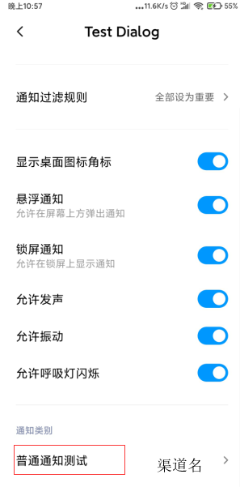

# Notification【通知】


> **注意；**
>
> 1. 呼吸灯在息屏的时候会亮起，所以在测试的时候尽量延迟发送Notification
> 2. 充电的时候呼吸灯会被充电指示灯占用
> 3. 查看过后的通知不会显示呼吸灯
> 4. 呼吸灯的颜色只有在第一次安装的时候生效，更改呼吸灯颜色需要卸载应用，然后重新安装应用才能更改成功
> 5. Android 8 以后的呼吸灯设置更多的是在`NotificationChannel`中
> 6. 更改代码后调试时为达到预期效果可以清除一下app所有数据。


## 普通通知栏

> 跳转到指定activity 下面不同平台的适配也同样适用于其它类型的通知。

路径；app应用信息——通知管理，可以分别对每个通知渠道管理



**适配Android8.0+** 

> **注意；**
>
> 必须创建`NotificationChanne`l并设置通道

```java
 //获取通知管理器
NotificationManager notificationManager = (NotificationManager) getSystemService(NOTIFICATION_SERVICE);
//实例化通知渠道
String id = "channel"; //通知渠道id
String name = "普通通知测试"; //通知渠道名
//参数
//参数1 通知渠道id 参数2 通知渠道名 参数3渠道等级  【创建一次NotificationChannel对象即可多次创建无意义】
NotificationChannel mChannel = new NotificationChannel(id, name, NotificationManager.IMPORTANCE_HIGH);

//mChannel.setSound(null,null);   //设置通知声音【不设置会使用系统默认通知声音，如果都设置为null有可能无声音】

mChannel.enableVibration(true); //设置通知震动
mChannel.setVibrationPattern(new long[]{100,200,300,400});  //设置震动模式
mChannel.enableLights(true);    //如果设备支持设置呼吸灯是否闪烁
mChannel.setLightColor(0xFFF);  //如果设备支持设置呼吸灯颜色
mChannel.setLockscreenVisibility(0);  //设置锁屏可见

//创建设置渠道
notificationManager.createNotificationChannel(mChannel);

//创建通知对象
Notification.Builder notification = new Notification.Builder(MainActivity.this);
notification.setChannelId(id);  //设置渠道id
notification.setSmallIcon(R.drawable.ic_launcher_foreground);   //设置小图标
notification.setWhen(System.currentTimeMillis());   //设置通知发送时间【显式当前通知发生的时间】
notification.setContentTitle("通知通知通知"); //通知标题
notification.setContentText("通知内容内容内容");    //通知内容。
notification.setAutoCancel(true);   //设置打开通知后通知自动消失


/*通知打开指定Activity*/
//启动另一个活动的Intent
Intent intent = new Intent(MainActivity.this,MainActivity.class);
//创建一个待定的Intent对象
//参数1 上下文对象 参数2 请求码 参数3 要待定启动的Intent对象 参数4 一个标志
PendingIntent pendingIntent = PendingIntent.getActivity(MainActivity.this,0,intent,0);
notification.setContentIntent(pendingIntent);   //设置点击后要启动的PendingIntent对象。

//发送通知
//参数1 通知唯一id 参数2 通知对象，通过通知对象的buid方法生成通知对象。
notificationManager.notify(1111, notification.build());
```

**Android4.4+**

```java
//获取通过管理器
final NotificationManager notificationManager = (NotificationManager) getSystemService(NOTIFICATION_SERVICE);
//创建通知对象
final Notification.Builder notification = new Notification.Builder(MainActivity.this);
//notification.setChannelId(id);  //设置渠道id
notification.setSmallIcon(R.drawable.ic_launcher_foreground);   //设置小图标
notification.setWhen(System.currentTimeMillis());   //设置通知发送时间【显式当前通知发生的时间】
notification.setContentTitle("通知通知通知"); //通知标题
notification.setContentText("通知内容内容内容");    //通知内容。
notification.setAutoCancel(true);   //设置打开通知后通知自动消失
notification.setPriority(Notification.PRIORITY_HIGH);   //设置通知优先级
notification.setDefaults(Notification.DEFAULT_SOUND|Notification.DEFAULT_VIBRATE); //设置震动和通知声音
//notification.setVisibility(Notification.VISIBILITY_PRIVATE);    //设置锁屏可见【Android5.0+】

/*通知打开指定Activity*/
//启动另一个活动的Intent
Intent intent = new Intent(MainActivity.this,MainActivity.class);
//创建一个待定的Intent对象
//参数1 上下文对象 参数2 请求码 参数3 要待定启动的Intent对象 参数4 一个标志
PendingIntent pendingIntent = PendingIntent.getActivity(MainActivity.this,0,intent,0);
notification.setContentIntent(pendingIntent);   //设置点击后要启动的PendingIntent对象。
notificationManager.notify(1111, notification.build());    //发送通知
```