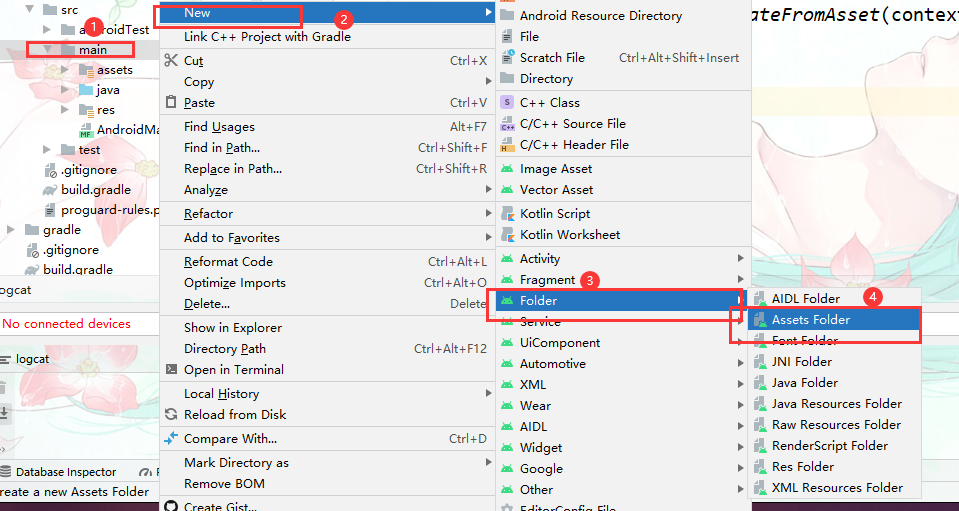

# 字体图标使用

## 创建字体图标View

1. 准备字体图标文件`.ttf`

2. 创建一个IconView类继承AppCompatTextView类。

3. 实现三个构造方法。

4. 创建初始化方法`private void init` 并设置字体图标。

5. 从三个构造方法中分别调用init(Context)方法

   ```java
   package com.xuelingmiao.testapp.fonticon;
   
   import android.content.Context;
   import android.graphics.Typeface;
   import android.util.AttributeSet;
   
   import androidx.annotation.NonNull;
   import androidx.annotation.Nullable;
   import androidx.appcompat.widget.AppCompatTextView;
   
   public class IconView  extends AppCompatTextView {
   
       public IconView(@NonNull Context context) {
           super(context);
           init(context);
       }
   
       public IconView(@NonNull Context context, @Nullable AttributeSet attrs) {
           super(context, attrs);
           init(context);
       }
   
       public IconView(@NonNull Context context, @Nullable AttributeSet attrs, int defStyleAttr) {
           super(context, attrs, defStyleAttr);
           init(context);
       }
   
       //创建初始化方法
       private void init (Context context){
           //设置字体图标路径
           this.setTypeface(Typeface.createFromAsset(context.getAssets(),"icon/iconfont.ttf"));
       }
   }
   ```

1. 在``src\main`目录下新建`assets\fonts`和fonts目录把字体文件拷贝到此处。

   - 新建`assets`目录，建议切换到项目结构试图操作。

     

   - 在建立一个fonts目录。

     

     


## 使用

- 在XML中使用

  ```xml
   <com.xuelingmiao.testapp.fonticon.IconView
          android:layout_width="wrap_content"
          android:layout_height="wrap_content"
          android:text="&#xe64b;"
          android:textColor="#333333"
          android:textSize="50sp"
          />
  ```

- Java代码中使用

  在java代码中要使用Unicode编码字符（及字体图标）

  格式；

  ```
  `\ue[字符对应的Unicode编码]`
  ```

  如； ``&#xe899`对应Unicode编码是 `\ue899`

  ```java
  package com.xuelingmiao.testapp.fonticon;
  
  import androidx.appcompat.app.AppCompatActivity;
  
  import android.graphics.Color;
  import android.os.Bundle;
  import android.text.Layout;
  import android.widget.LinearLayout;
  
  import com.xuelingmiao.testapp.R;
  
  public class FontIcon extends AppCompatActivity {
  
      @Override
      protected void onCreate(Bundle savedInstanceState) {
          super.onCreate(savedInstanceState);
          setContentView(R.layout.activity_font_icon);
          //创建icon控件
          IconView icon = new IconView(FontIcon.this);
          icon.setText("\ue615"); //指定图标
          icon.setTextSize(50);
          icon.setTextColor(Color.parseColor("#FF0000"));
          LinearLayout rootLayout = findViewById(R.id.root_layout);   //获取根元素
          rootLayout.addView(icon); //添加到布局上。
  
      }
  }
  ```