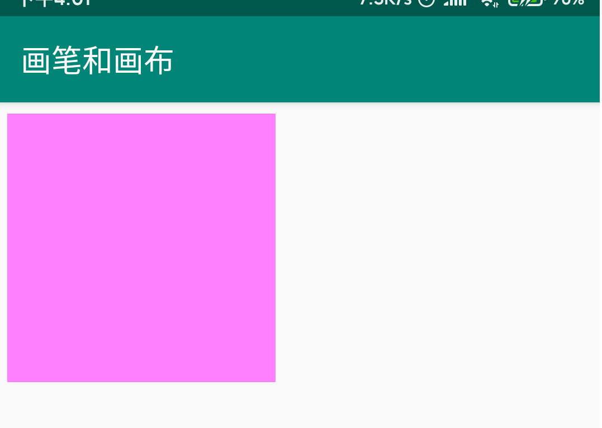
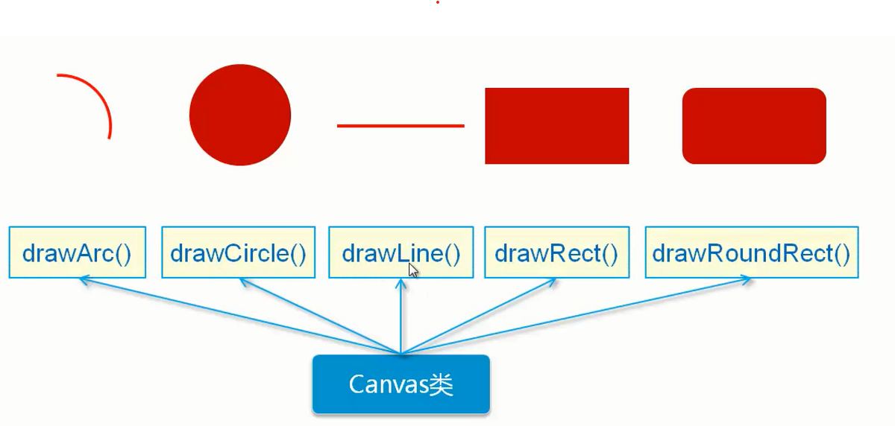
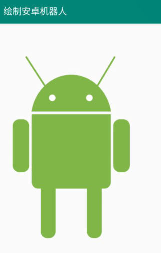
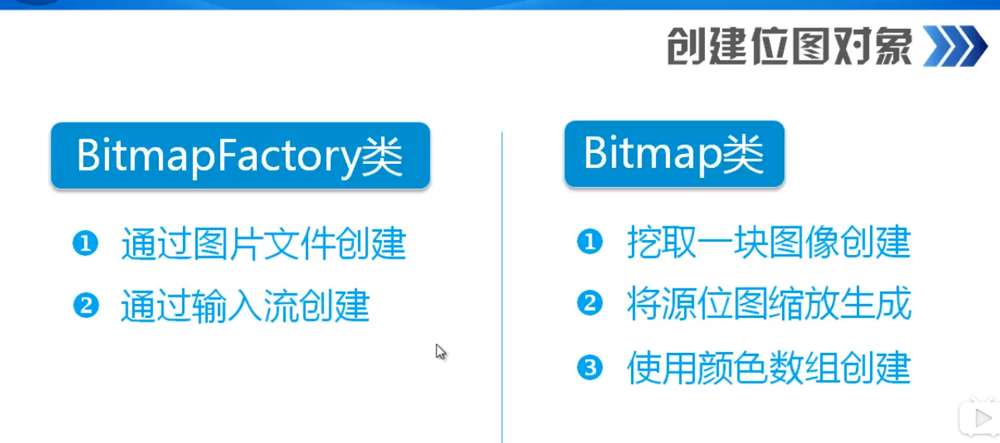
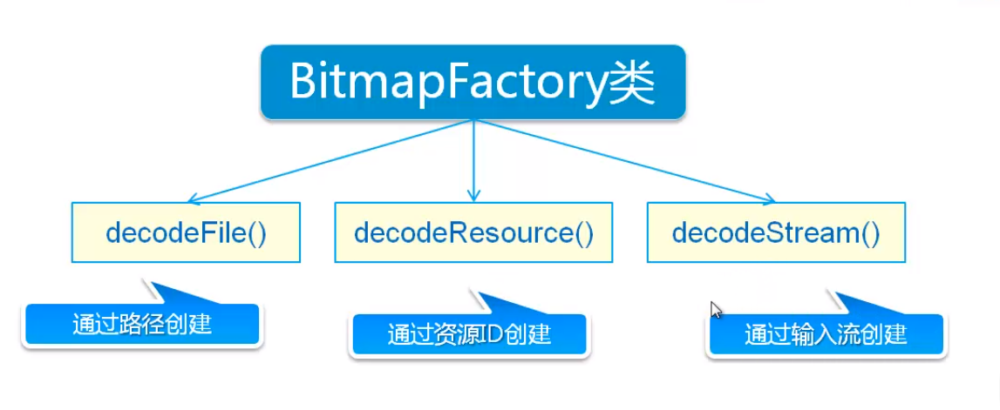
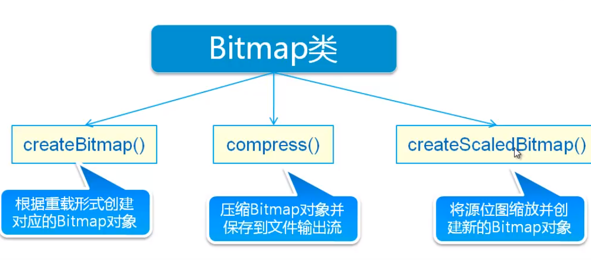
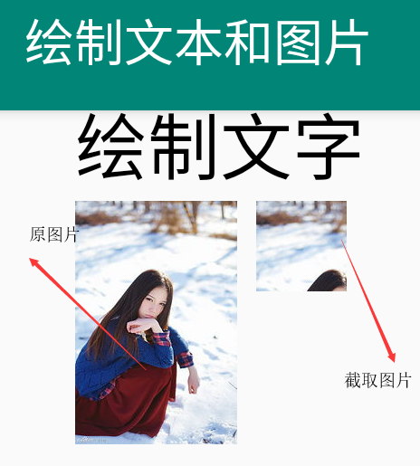
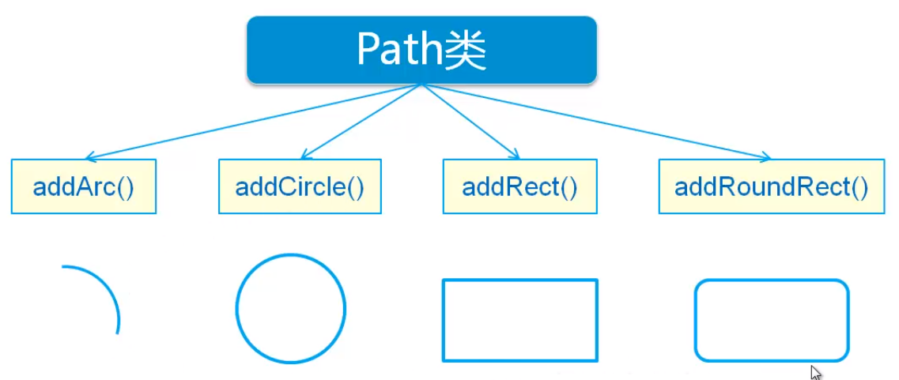
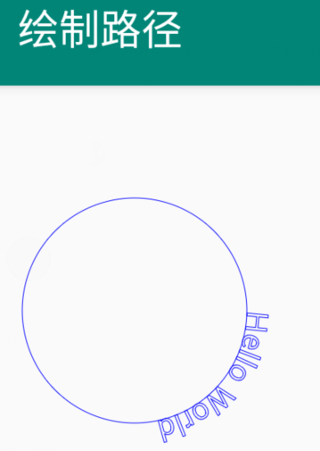

# Canvas【画布】

## 基本绘画【通用步骤】




1. 创建一个自定义的view类继承`android.view.View;`类
2. 自定义view类要有一个带`context`参数的构造
3. 重写`onDraw(Canvas canvas)` 方法绘制内容。
4. 创建自定义View的实例并添加到已有的Activity上。

- 自定义的view

  ```java
  package top.miku.painting;
  
  import android.content.Context;
  import android.graphics.Canvas;
  import android.graphics.Paint;
  import android.view.View;
  
  public class MyView extends View {
      public MyView(Context context) {
          super(context);
      }
  
      //重写绘图方法
      @Override
      protected void onDraw(Canvas canvas) {
          super.onDraw(canvas);
          Paint paint = new Paint();  //创建画笔对象
          paint.setColor(0xFFFF80FF);   //设置画笔颜色【默认画笔是完全透明的所以要加透明度参数】
          paint.setStyle(Paint.Style.FILL);   //设置填充样式【填充，描边等】
          //绘制矩形 默认单位是px【像素】
          //前两个参数 绘制矩形左上角的X，Y坐标 后两个参数绘制矩形右下角的xy坐标 最后参数画笔
          canvas.drawRect(20,20,500,500,paint);
  
      }
  }
  ```

- 添加到Activity上

  ```java
          FrameLayout frameLayout = findViewById(R.id.frameLayout);    //获取组件
          frameLayout.addView(new MyView(this));    //添加自定义View
  ```


## 绘制几何图形



> **提示；**
>
> 要使用自定义的View绘画，自定义View参考上面的步骤


### 绘制弧线

```java
        RectF rectF = new RectF(10,10,500,550); //外轮廓矩形【绘制弧线使用】
        rectF.offset(200, 300);   //调整位置，xy坐标
        //参数1 外轮廓矩形区域【控制弧大小】
        // 参数2 起始角度
        //参数3 圆弧结束角度
        // 参数4 是否包含圆心【包含圆心表示绘制扇形】
        //参数5 画笔
        canvas.drawArc(rectF,-10,-160,false,paint);
```


### 绘制圆形

```java
        //前两个参数圆心xy坐标 半径和画笔
        canvas.drawCircle(340,450,20,paint);    
```


### 绘制线

```java
        //前两个参数 线的起始xy坐标 后两个参数是设置线结束点的xy坐标，最后是笔
        canvas.drawLine(180,200,310,400,paint);
```

### 绘制矩形

```java
        //左上角xy坐标，右下角xy坐标，画笔
        canvas.drawRect(215,550,695,800,paint);
```

### 绘制圆角矩形

```java
        RectF rectF1 = new RectF(215, 550, 695, 1000); //定义矩形轮廓，绘制圆角矩形使用
        //参数1 矩形轮廓 然后 xy圆角读，最后画笔对象
        canvas.drawRoundRect(rectF1,40,40,paint);   //绘制圆角矩形
```


### 案例绘制一个安卓机器人



```java
package top.miku.painting;

import android.content.Context;
import android.graphics.Canvas;
import android.graphics.Color;
import android.graphics.Paint;
import android.graphics.Rect;
import android.graphics.RectF;
import android.view.View;

public class MyView2 extends View {
    public MyView2(Context context) {
        super(context);
    }

    @Override
    protected void onDraw(Canvas canvas) {
        super.onDraw(canvas);

        Paint paint = new Paint();
        paint.setColor(0xFF80B547);
        paint.setStyle(Paint.Style.FILL);
        paint.setAntiAlias(true);   //设置坑锯齿

        //绘制机器人头【绘制弧】
        RectF rectF = new RectF(10,10,500,550); //外轮廓矩形【绘制弧线使用】
        rectF.offset(200, 300);   //调整位置，xy坐标
        //参数1 外轮廓矩形区域【控制弧大小】
        // 参数2 起始角度
        //参数3 圆弧结束角度
        // 参数4 是否包含圆心【包含圆心表示绘制扇形】
        //参数5 画笔
        canvas.drawArc(rectF,-10,-160,false,paint);

        //绘制眼睛【绘制圆形】
        paint.setColor(0xFFFFFFFF); //修改画笔颜色为白色
        //前两个参数圆心xy坐标 半径和画笔
        canvas.drawCircle(340,450,20,paint);    //左眼
        canvas.drawCircle(565,450,20,paint);    //右眼

        //绘制天线【绘制线】
        paint.setStrokeWidth(10);    //设置线宽
        paint.setColor(0xFF80B547); //配置颜色
        //前两个参数 线的起始xy坐标 后两个参数是设置线结束点的xy坐标，最后是笔
        canvas.drawLine(180,200,310,400,paint);
        canvas.drawLine(720,200,600,400,paint);

        //绘制身体【绘制矩形】
        //左上角xy坐标，右下角xy坐标，画笔
        canvas.drawRect(215,550,695,800,paint);

        //身体【绘制圆角矩形】
        RectF rectF1 = new RectF(215, 550, 695, 1000); //定义矩形轮廓，绘制圆角矩形使用
        //参数1 矩形轮廓 然后 xy圆角读，最后画笔对象
        canvas.drawRoundRect(rectF1,40,40,paint);   //绘制圆角矩形

        //绘制手臂
        RectF rectF2 = new RectF(100,580,200,900);
        canvas.drawRoundRect(rectF2,40,40,paint);   //右手

        rectF2.offset(610,0);   //设置根据当前坐标【创建RectF对象时定义的坐标】，xy的偏移。
        canvas.drawRoundRect(rectF2,40,40,paint);

        //绘制腿
        //矩形坐标理解，分别指定四个点击的位置，左和右按画布的左边为0点开始设置值。上和下就是以画布的上边为0点
        // 就如同HTML中margin属性。
        RectF rectF3 = new RectF(270,900,360,1300);
        canvas.drawRoundRect(rectF3,40,40,paint);

        rectF3.offset(280,0);
        canvas.drawRoundRect(rectF3,40,40,paint);

    }
}
```


## 绘制文本

```java
 paint.setAntiAlias(true);    //开启抗锯齿
 paint.setTextAlign(Paint.Align.LEFT); //设置文字对齐方式
 paint.setTextSize(80);  //设置文字大小，默认单位是sp
//参数1 要绘制的文本内容 之后是绘制xy坐标 最后画笔对象
 canvas.drawText("绘制文字",100,70,paint);
```

## 绘制图片







```java
//绘制图片
//通过BitmapFactory decodeFile()方法加载外部文件绘制

//存放图片路径，
//Environment.getExternalStorageDirectory()获取内置存储卡根路径 再拼接我们需要的图片
String path = Environment.getExternalStorageDirectory() + "/test.png
Bitmap bitmap = BitmapFactory.decodeFile(path); //读取外部文件创建bitmap对象
//绘制图片
//参数1 bitmap对象 绘制xy坐标，最后画笔对象
canvas.drawBitmap(bitmap,100,100,paint);
//通过Bitmap类 截取bitmap对象并生成新的bitmap对象。
//参数1 原bitmap对象，采取xy坐标，截取宽和高。
Bitmap bitmap1 = Bitmap.createBitmap(bitmap,0,0,100,100);
canvas.drawBitmap(bitmap1,300,100,paint);    //绘制截取后的图片
```



## 绘制路径




```java
Path path = new Path(); //创建路径对象
//创建圆形路径
//参数 x，y坐标，半径，顺时针绘制或逆时针 CW=顺时针 CCW=逆时针
path.addCircle(200,300,150,Path.Direction.CW);
//绘制路径
//参数1 路径对象 参数2 画笔对象
canvas.drawPath(path,paint);
paint.setTextSize(40);
//绘制绕路径的文字
/*
* 参数1 要显式的文本
* 参数2 路径对象
* 参数3 水平偏移
* 参数4 垂直偏移
* 参数5 画笔对象
*
* */
canvas.drawTextOnPath("Hello World",path,0,0,paint);
```

