# 为应用签名


## 了解密钥、证书和密钥库

### 密钥

用于为用户设备上安装的 APK 签名的密钥称为**应用签名密钥**。作为 Android 安全更新模型的一部分，应用签名密钥在应用的整个生命周期内保持不变。应用签名密钥属于私钥，因此必须保密。不过，您可以与他人共享使用应用签名密钥生成的证书。

### 证书

**公钥证书**（`.der` 或 `.pem` 文件，也称为数字证书或身份证书）包含公钥/私钥对中的公钥，以及可以标识持有对应私钥的所有者的一些其他元数据（例如名称和位置）。通过密钥就可以生成证书。

在为您的应用签名时，签名工具会将该证书附加到应用。该证书会将 APK 或 App Bundle 与您和您对应的私钥相关联。这有助于 Android 确保您应用日后的所有更新都真实可靠，并且来自原始作者。

**证书指纹**是证书独一无二的简短表示形式，通常 API 提供商会要求同时提供证书指纹和软件包名称，以注册使用其服务的应用。您可以在 Play 管理中心的“应用签名”页面上找到上传证书和应用签名证书的 MD5、SHA-1 和 SHA-256 指纹。您还可以从同一页面下载原始证书 (`.der`) 来计算其他指纹。

### 密钥库

Java 密钥库（.jks 或 .keystore）：一个二进制文件，用作证书和私钥的存储区。**Play Encrypt Private Key (PEPK) 工具**：使用此工具可从 Java 密钥库中导出私钥。


## 生成密钥库

1. 在菜单栏中，依次点击 **Build > Generate Signed Bundle/APK**。

2. 在 **Generate Signed Bundle or APK** 对话框中，选择 **Android App Bundle** 或 **APK**，然后点击 **Next**。

3. 在 **Key store path** 字段下，点击 **Create new**。

   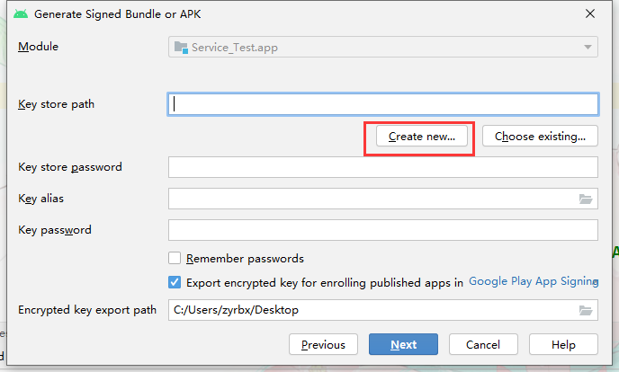

4. 在 **New Key Store** 窗口中，为您的密钥库和密钥提供以下信息。

   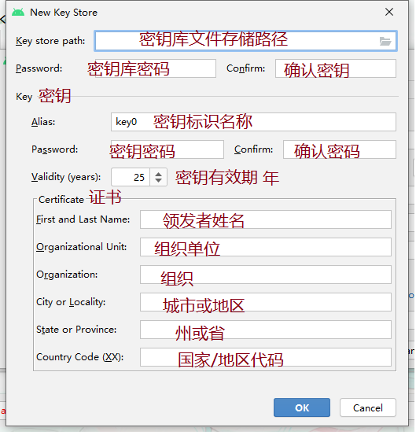

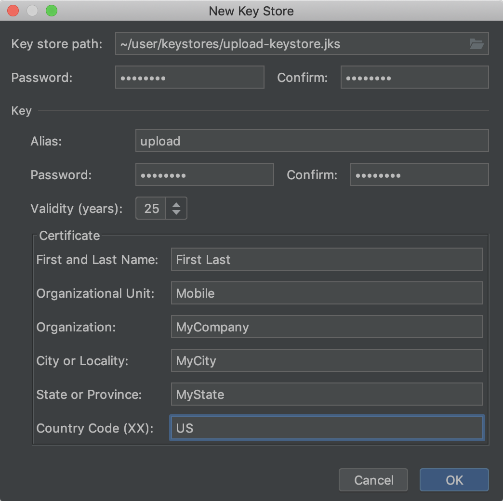

5. 填写完表单后，请点击 **OK**。有可能会出现以下错误。

   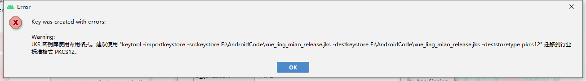

### 命令行生成

解决 JKS 密钥库使用专用格式。建议使用 "keytool -importkeystore -srckeystore E:\xxxxxx- pkcs12" 迁移到行业标准格式PKCS12

#### keytool指令

```bash
# 命令:
 -certreq            生成证书请求
 -changealias        更改条目的别名
 -delete             删除条目
 -exportcert         导出证书
 -genkeypair         生成密钥对 -genkey #简写
 -genseckey          生成密钥
 -gencert            根据证书请求生成证书
 -importcert         导入证书或证书链
 -importpass         导入口令
 -importkeystore     从其他密钥库导入一个或所有条目
 -keypasswd          更改条目的密钥口令
 -list               列出密钥库中的条目
 -printcert          打印证书内容
 -printcertreq       打印证书请求的内容
 -printcrl           打印 CRL 文件的内容
 -storepasswd        更改密钥库的存储口令
```

- `-genkey` 生成密钥对

  ```bash
  # 选项:
   -alias <alias>                  要处理的条目的别名
   -keyalg <keyalg>                密钥算法名称
   -keysize <keysize>              密钥位大小
   -sigalg <sigalg>                签名算法名称
   -destalias <destalias>          目标别名
   -dname <dname>                  唯一判别名
   -startdate <startdate>          证书有效期开始日期/时间
   -ext <value>                    X.509 扩展
   -validity <valDays>             有效天数
   -keypass <arg>                  密钥口令
   -keystore <keystore>            密钥库名称
   -storepass <arg>                密钥库口令
   -storetype <storetype>          密钥库类型
   -providername <providername>    提供方名称
   -providerclass <providerclass>  提供方类名
   -providerarg <arg>              提供方参数
   -providerpath <pathlist>        提供方类路径
   -v                              详细输出
   -protected                      通过受保护的机制的口令
  ```

- `-importkeystore`  从其他密钥库导入一个或所有条目

  ```bash
  # 选项:
   -srckeystore <srckeystore>            源密钥库名称
   -destkeystore <destkeystore>          目标密钥库名称
   -srcstoretype <srcstoretype>          源密钥库类型
   -deststoretype <deststoretype>        目标密钥库类型
   -srcstorepass <arg>                   源密钥库口令
   -deststorepass <arg>                  目标密钥库口令
   -srcprotected                         受保护的源密钥库口令
   -srcprovidername <srcprovidername>    源密钥库提供方名称
   -destprovidername <destprovidername>  目标密钥库提供方名称
   -srcalias <srcalias>                  源别名
   -destalias <destalias>                目标别名
   -srckeypass <arg>                     源密钥口令
   -destkeypass <arg>                    目标密钥口令
   -noprompt                             不提示
   -providerclass <providerclass>        提供方类名
   -providerarg <arg>                    提供方参数
   -providerpath <pathlist>              提供方类路径
   -v                                    详细输出
  ```

  

**演示；**

1. 输入以下命令

   ```bash
   # 格式
   keytool -genkey -alias 密钥别名 -keypass 密钥密码 -keyalg 密钥算法名称 -keysize 密钥位大小 -validity 有效天数 -keystore 密钥库名称（包含路径.keystore） -storepass 密钥库密码
   
   # 示例
   keytool -genkey -alias demo -keypass 123123 -keyalg RSA -keysize 1024 -validity 366 -keystore ./deom.keystore -storepass 321321
   ```

   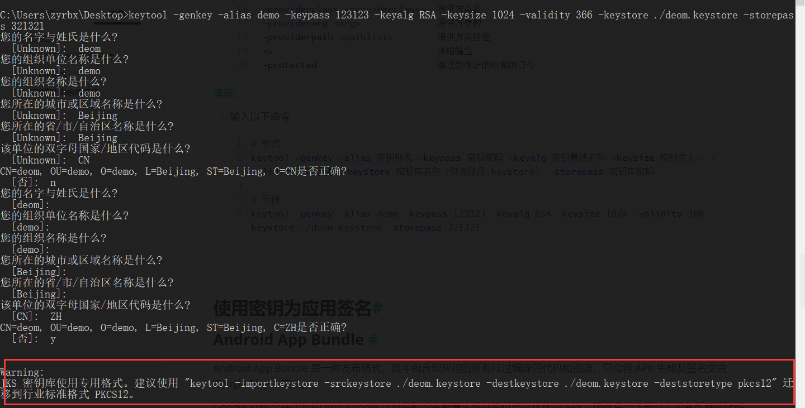

 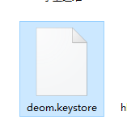

2. 解决上部报错问题 ,迁移密钥

   ```bash
   # 格式；
   keytool -importkeystore -srckeystore 源密钥库名称 -destkeystore 目标密钥库名称 -deststorepass  目标密钥库密码 -deststoretype 目标密钥库类型
   
   # 示例
   keytool -importkeystore -srckeystore ./deom.keystore -destkeystore ./deom.keystore -deststorepass 123123 -deststoretype pkcs12
   ```

   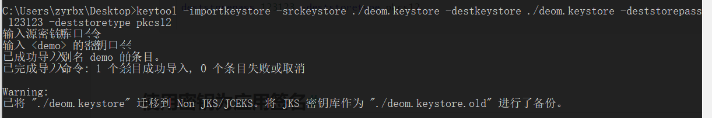

   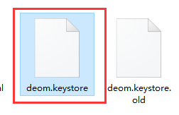可以看到之前密钥库已经被天机`.old`作为备份，要使用就用没有`old`的密钥库文件。


## 使用密钥为应用签名

### Android App Bundle 

Android App Bundle 是一种发布格式，其中包含您应用的所有经过编译的代码和资源，它会将 APK 生成及签名交由 Google Play 来完成。

Google Play 会使用您的 App Bundle 针对每种设备配置生成并提供经过优化的 APK，因此只会下载特定设备所需的代码和资源来运行您的应用。您不必再构建、签署和管理多个 APK 来优化对不同设备的支持，而用户也可以获得更小且更优化的下载文件包。

### APK

1. 如果您目前没有打开 **Generate Signed Bundle or APK** 对话框，请依次点击 **Build > Generate Signed Bundle/APK**。

2. 在 **Generate Signed Bundle or APK** 对话框中，选择  **APK**，然后点击 **Next**。

   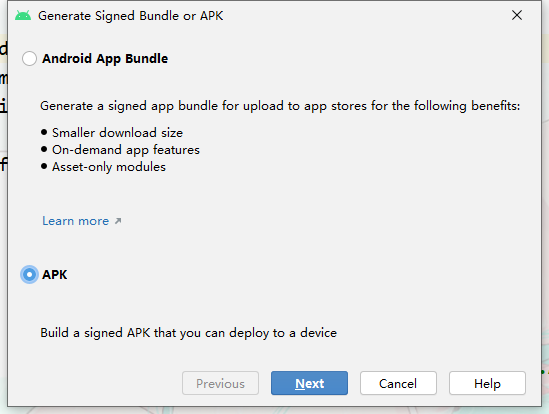

3. 从下拉菜单中选择一个模块。

4. 指定密钥库的路径、密钥的别名，然后输入二者的密码。如果您尚未准备好上传密钥库和密钥，请先[生成上传密钥和密钥库](#生成密钥库)，然后返回完成此步骤。

   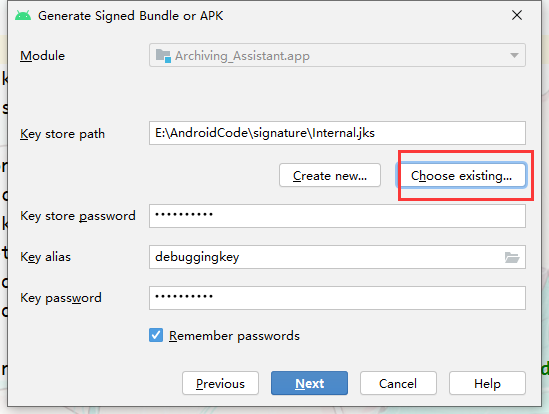

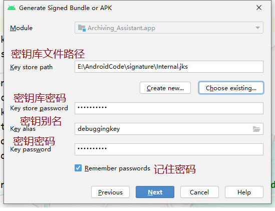

5. 点击 **Next**。

6. 为签名的应用选择一个目标文件夹，选择构建类型，然后选择产品变种（如果适用）。

   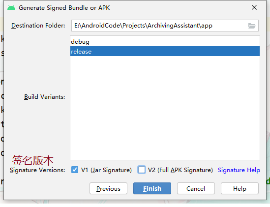