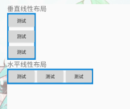
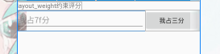
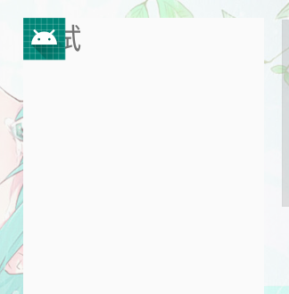
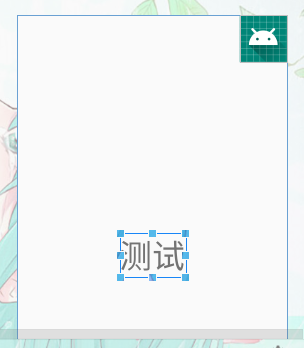

# 布局

## 常见布局

布局是一种可用于放置很多控件的容器，它可以按照一定的规律调整内部控件的位置，从而编写出精美的界面。当然，布局的内部除了放置控件外，也可以放置布局，通过多层布局的嵌套，我们就能够完成一些比较复杂的界面实现。这些容器往往是**ViewGroup**类的实例子类

### LinearLayout线性布局

LinearLayout又称作线性布局，是一种非常常用的布局。正如它的名字所描述的一样，这个布局会将它所包含的控件在线性方向上依次排列。

```xml
<?xml version="1.0" encoding="utf-8"?>
<LinearLayout xmlns:android="http://schemas.android.com/apk/res/android"
        android:layout_width="match_parent"
        android:layout_height="match_parent"
        android:orientation="vertical">
    ……
</LinearLayout>
```

**属性**

| 属性                   | 作用                                                         | 值                                          |
| ---------------------- | ------------------------------------------------------------ | ------------------------------------------- |
| android:layout_gravity | 指定布局中的控件对齐方式                                     | top、right、bottom、left、center等 可以用‘\ |
| android:orientation    | 指定控件排放方向                                             | 默认vertical【垂直】horizontal【水平】      |
| android:layout_weight  | 允许我们使用比例的方式来指定控件的大小（权重，类似于CSS中的弹性盒子）注意是分配父控件的剩余空间。 | 数值                                        |


#### 布局方向

`android:orientation`属性控制布局方向默认vertical【垂直】horizontal【水平】

- 垂直布局

  ```xml
  <LinearLayout
              android:layout_width="wrap_content"
              android:layout_height="wrap_content"
              android:orientation="vertical"//指定垂直方向
              android:background="@drawable/bg_border">
          <Button
                  android:layout_width="wrap_content"
                  android:layout_height="wrap_content"
                  android:text="@string/test"/>
          <Button
                  android:layout_width="wrap_content"
                  android:layout_height="wrap_content"
                  android:text="@string/test"/>
          <Button
                  android:layout_width="wrap_content"
                  android:layout_height="wrap_content"
                  android:text="@string/test"/>
      </LinearLayout>
  ```

  

- 水平布局

  ```xml
  <LinearLayout
              android:layout_width="wrap_content"
              android:layout_height="wrap_content"
              android:orientation="horizontal"//指定水平方向
              android:background="@drawable/bg_border">
          <Button
                  android:layout_width="wrap_content"
                  android:layout_height="wrap_content"
                  android:text="@string/test"/>
          <Button
                  android:layout_width="wrap_content"
                  android:layout_height="wrap_content"
                  android:text="@string/test"/>
          <Button
                  android:layout_width="wrap_content"
                  android:layout_height="wrap_content"
                  android:text="@string/test"/>
      </LinearLayout>
  ```

  

**注意**

当LinearLayout的排列方向是horizontal时，只有垂直方向上的对齐方式才会生效，因为此时水平方向上的长度是不固定的，每添加一个控件，水平方向上的长度都会改变，因而无法指定该方向上的对齐方式。同样的道理，当LinearLayout的排列方向是vertical时，只有水平方向上的对齐方式才会生效。

#### 自动按比例评分【自适应】

`layout_weight`按比例分割

```xml
<LinearLayout
            android:layout_width="match_parent"
            android:layout_height="wrap_content"
            android:orientation="horizontal">
        <EditText
                android:layout_width="0dp"
                android:layout_height="wrap_content"
                android:hint="我占7f分"
                android:layout_weight="7"/>
        <Button
                android:layout_width="0dp"
                android:layout_height="wrap_content"
                android:text="我占三分"
                android:layout_weight="3"/>
    </LinearLayout>
```



```XML
<LinearLayout
            android:layout_width="match_parent"
            android:layout_height="wrap_content"
            android:orientation="horizontal">
        <EditText
                android:layout_width="0dp"
                android:layout_height="wrap_content"
                android:hint="我占7分"
                android:layout_weight="1"/>
        <Button
                android:layout_width="wrap_content"
                android:layout_height="wrap_content"
                android:text="我占三分"/>
    </LinearLayout>
<!--  
	这是只设置EditText的layout_weight属性，把Button的layout_width改为wrap_content
这表示Button的宽度仍然按照wrap_content 来计算，而EditText则会占满屏幕所有的剩余空间。
使用这种方式编写的界面，不仅在各种屏幕的适配方面会非常好，而且看起来也更加舒服。
-->
```

**注意**

要按比例评分的宽度或高度，要设置为0dp这是标准写法。

### RelativeLayout相对布局

RelativeLayout又称作相对布局，也是一种非常常用的布局。和LinearLayout的排列规则不同，RelativeLayout显得更加随意一些，它可以通过相对定位的方式让控件出现在布局的任何位置。

**属性**

| 属性                             | 作用                                                         | 值         |
| -------------------------------- | ------------------------------------------------------------ | ---------- |
| android:layout_alignParent方位词 | 让控件对齐到父控件指定方向，如android:layout_alignParentTop  | true/false |
| android:centerInParent           | 在父控件中心对齐                                             | true/false |
| android:layout_above             | 以指定id控件的上方                                           | @+id/id名  |
| android: layout_below            | 以指定id控件的下方                                           | @+id/id名  |
| android:layout_toLeftOf          | 以指定id控件的左侧                                           | @+id/id名  |
| android:layout_toRightOf         | 以指定id控件的右侧                                           | @+id/id名  |
| android:layout_align方位词       | 表示让一个控件的左边缘和另一个控件的左边缘对齐如android:layout_alignLeft | @+id/id名  |
| android:layout_gravity           | 设置子控件从布局管理器中的摆放位置                           | 方位词     |
|                                  |                                                              |            |

#### 相对于父控件对齐

主要使用以下属性`android:layout_alignParent`和`android:centerInParent`

```xml
<?xml version="1.0" encoding="utf-8"?>
<RelativeLayout xmlns:android="http://schemas.android.com/apk/res/android"
        android:layout_width="match_parent"
        android:layout_height="match_parent">
    <Button
            android:layout_width="wrap_content"
            android:layout_height="wrap_content"
            android:text="@string/test"
            android:layout_alignParentLeft="true"/>//对齐到父控件左边
    <Button
            android:layout_width="wrap_content"
            android:layout_height="wrap_content"
            android:text="@string/test"
            android:layout_alignParentRight="true"/>//对齐到父控件右边
</RelativeLayout>
```

#### 相对于控件定位

`android:layout_above`、`android: layout_below`等

```xml
<?xml version="1.0" encoding="utf-8"?>
<RelativeLayout xmlns:android="http://schemas.android.com/apk/res/android"
        android:layout_width="match_parent"
        android:layout_height="match_parent">
    <Button
            android:layout_width="wrap_content"
            android:layout_height="wrap_content"
            android:text="@string/test"
            android:layout_alignParentLeft="true"/>
    <Button
            android:layout_width="wrap_content"
            android:layout_height="wrap_content"
            android:text="@string/test"
            android:layout_alignParentRight="true"/>
    <Button
            android:id="@+id/center"
            android:layout_width="wrap_content"
            android:layout_height="wrap_content"
            android:text="@string/test"
            android:layout_centerInParent="true"/>
    <Button
            android:layout_width="wrap_content"
            android:layout_height="wrap_content"
            android:text="@string/test"
            android:layout_above="@+id/center"/>//在center控件上方
    <Button
            android:layout_width="wrap_content"
            android:layout_height="wrap_content"
            android:text="@string/test"
            android:layout_below="@+id/center"//在center控件下方
            android:layout_alignLeft="@+id/center"/>//在center左边缘对齐

</RelativeLayout>
```

### FrameLayout帧布局

FrameLayout又称作帧布局，后定义的控件会覆盖之前的控件，所有的控件都会默认摆放在布局的左上角。

这种控件适用于层叠布局。

**属性**

| 属性                      | 作用                                                 | 值       |
| ------------------------- | ---------------------------------------------------- | -------- |
| android:foreground        | 设置前景图片【前景图始重在最上层其它内容无法覆盖的】 | @mipmap/ |
| android:foregroundGravity | 设置前景图片位置                                     | 方位词等 |


- 示例默认

  ```xml
  <?xml version="1.0" encoding="utf-8"?>
  <FrameLayout xmlns:android="http://schemas.android.com/apk/res/android"
          android:layout_width="match_parent"
          android:layout_height="match_parent">
      <TextView
              android:layout_width="wrap_content"
              android:layout_height="wrap_content"
              android:text="@string/test"
              android:textSize="50sp"/>
      <ImageView
              android:layout_width="wrap_content"
              android:layout_height="wrap_content"
              android:src="@mipmap/ic_launcher"/>
  </FrameLayout>
  
  ```

  

  可以看到，文字和图片都是位于布局的左上角。由于ImageView是在TextView之后添加的，因此图片压在了文字的上面。

- 可以使用`layout_gravit`修改对齐方式

  ```xml
  <?xml version="1.0" encoding="utf-8"?>
  <FrameLayout xmlns:android="http://schemas.android.com/apk/res/android"
          android:layout_width="match_parent"
          android:layout_height="match_parent">
      <TextView
              android:layout_width="wrap_content"
              android:layout_height="wrap_content"
              android:text="@string/test"
              android:textSize="50sp"
              android:layout_gravity="center"/>//修改对齐方式
      <ImageView
              android:layout_width="wrap_content"
              android:layout_height="wrap_content"
              android:src="@mipmap/ic_launcher"
              android:layout_gravity="right"/>//修改改对齐方式
  </FrameLayout>
  
  ```

  

### percentlayout百分比布局

由于LinearLayout本身已经支持按比例指定控件的大小了，百分比布局只为FrameLayout和RelativeLayout进行了功能扩展，提供了PercentFrameLayout和PercentRelativeLayout这两个全新的布局。

#### 让早期Android也支持百分比布局

- 2018年之前适用

1. 打开app/build.gradle文件，在`dependencies`闭包中添加如下内容

   ```xml
   dependencies {
       compile 'com.android.support:appcompat-v7:24.2.1'
       compile 'com.android.support:percent:24.2.1'
   }
   ```

2. 让gradle同步一下

- 2018年之后。

  > 如果项目默认是Androidx可以不用执行步骤1

  1. [迁移项目步骤](#项目迁移到androidx "按住CTRL点击跳转")

2. 把`compile 'com.android.support:percent:24.2.1'`修改为以下

```
  implementation 'androidx.percentlayout:percentlayout:1.0.0'
```

**示例**

- PercentFrameLayout

> ~~PercentFrameLayout~~逐渐被淘汰

```xml
<?xml version="1.0" encoding="utf-8"?>
<androidx.percentlayout.widget.PercentFrameLayout
        xmlns:android="http://schemas.android.com/apk/res/android"
        xmlns:app="http://schemas.android.com/apk/res-auto"//定义一个app命名控件
        android:layout_width="match_parent"
        android:layout_height="match_parent">
    <Button
            app:layout_widthPercent="50%"
            app:layout_heightPercent="50%"
            app:layout_marginTopPercent="25%"
            app:layout_marginLeftPercent="25%"
            android:text="@string/test"/>
</androidx.percentlayout.widget.PercentFrameLayout>


```

属性

| 属性                 | 作用                               | 值     |
| -------------------- | ---------------------------------- | ------ |
| layout_widthPercent  | 布局宽度                           | 百分比 |
| layout_heightPercent | 布局高度                           | 百分比 |
| layout_marginPercent | 布局外边距【包含其它的margin属性】 | 百分比 |
| layout_aspectRatio   | 宽高比                             |        |

- PercentRelativeLayout

  > ~~PercentRelativeLayout~~逐渐被淘汰

  [了解更多点击这里](https://developer.android.google.cn/reference/kotlin/androidx/percentlayout/widget/PercentRelativeLayout)

### GridLayout【网格布局】

控件按行列方式摆放。就像是一个表格一样。

**属性**

| 属性                        | 作用                                                     | 值                                 |
| --------------------------- | -------------------------------------------------------- | ---------------------------------- |
| android:orientation         | 设置为指定行和列显式的控件的默认方向                     | horizontal【水平】vertical【垂直】 |
| android:rowCount            | 设置最大行数                                             | int                                |
| android:columnCount         | 设置最大列数                                             | int                                |
| android:layout_column       | 指定子组件位于网格第几列                                 | int                                |
| android:layout_columnSpan   | 指定子组件跨第几列配合android:layout_gravity属性使用     | int                                |
| android:layout_columnWeight | 设置子组件水平权重【分配父控件剩余空间】                 | int                                |
| android:layout_row          | 指定子组件位于网格第几行                                 | int                                |
| android:layout_rowSpan      | 指定子组件跨第几行【配合android:layout_gravity属性使用】 | int                                |
| android:layout_RowWeight    | 设置子组件垂直权重【分配父控件剩余空】                   | int                                |
| android:layout_gravity      | 设置子组件什么方式占据网格的空间【fill常用】             | fill填充等                         |

